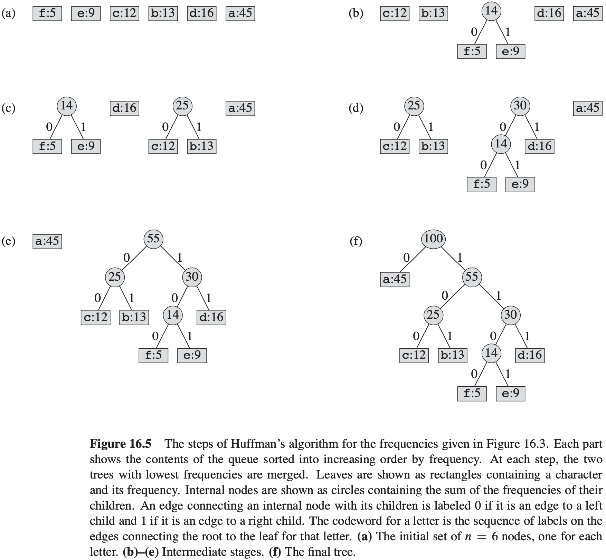
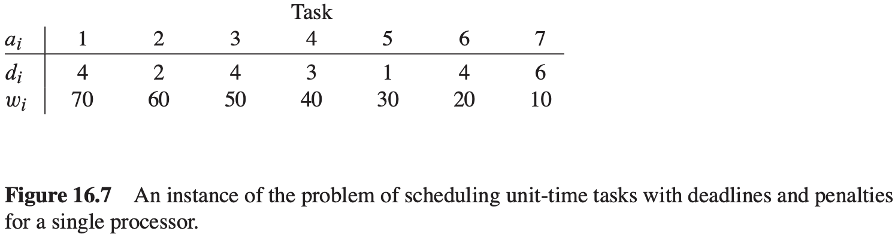

# 第16章 贪心算法

## 16.1 活动选择问题

**活动选择问题** 假定有一个$n$个活动（activity）的集合$S = \{a_1, a_2, ..., a_n\}$，这些活动使用同一个资源，而这个资源在某个时刻只能供一个活动使用。每个活动$a_i$都有一个开始时间$s_i$和一个结束时间$f_i$，其中$0 \leqslant s_i < f_i < \infty$。如果被选中，任务$a_i$发生在半开时间区间$[s_i, f_i)$期间。如果两个活动$a_i$和$a_j$满足$[s_i, f_i)$和$[s_j, f_j)$不重叠，则称它们是兼容的。也就是说，若$s_i \geqslant f_j$或$s_j \geqslant f_i$，则$a_i$和$a_j$是兼容的。在活动选择问题中，我们希望选出一个最大兼容活动集。

**活动选择问题的最优子结构**

用$c[i, j]$表示集合$S_{ij}$的最优解的大小，则可得递归式：
$$
c[i, j] = 
\begin{cases}
0, &若S_{ij} = \emptyset \\
max_{a_k \in S_{ij}} \{c[i, k] + c[k, j] + 1\}, &若S_{ij} \neq \emptyset
\end{cases}
$$
**贪心选择**

**定理 16.1** 考虑任意非空子问题$S_k$，令$a_m$是$S_k$中结束时间最早的活动，则$a_m$在$S_k$的某个最大兼容活动子集中。

**递归贪心算法**
$$
\begin{align}
& RECURSIVE-ACTIVITY-SELECTOR(s, f, k, n) \\
& m = k + 1 \\
& while\ m \leqslant n\ and\ s[m] < f[k] \\
& \qquad m = m + 1 \\
& if\ m \leqslant n \\
& \qquad return\ \{a_m\} \cup RECURSIVE-ACTIVITY-SELECTOR(s, f, m, n) \\
& else\ return\ \emptyset
\end{align}
$$

**迭代贪心算法**
$$
\begin{align}
& GREEDY-ACTIVITY-SELECTOR(s, f) \\
& n = s.length \\
& A = {a_1} \\
& k = 1 \\
& for\ m = 2\ to\ n \\
& \qquad if\ s[m] \geqslant f[k] \\
& \qquad \qquad A = A \cup \{a_m\} \\
& \qquad \qquad k = m \\
& return\ A
\end{align}
$$

## 16.2 贪心算法原理

贪心算法通过做出一系列选择来求出问题的最优解。在每个决策点，它做出在当时看来最佳的选择。

**贪心选择性质**

**贪心选择性质（greedy-choice property）**：我们可以通过做出局部最优（贪心）选择来构造全局最优解。

**最优子结构**

如果一个问题的最优解包含其子问题的最优解，则称此问题具有**最优子结构**性质。

**贪心对动态规划**

## 16.3 赫夫曼编码

**变长编码（variable-length code）**可以达到比定长编码好得多的压缩率，其思想是赋予高频字符短码字，赋予低频字符长码字。

**前缀码**

对于字母表$C$中的每个字符$c$，令属性$c.freq$表示$c$在文件中出现的频率，令$d_T(c)$表示$c$的叶节点在树中的深度（$d_T(c)$也是字符$c$的码字的长度）。则编码文件需要$B(T) = \sum_{c \in C} c \cdot freq \cdot d_T(c)$个二进制位。

**构造赫夫曼编码**

$$
\begin{align}
& HUFFMAN(C) \\
& n = |C| \\
& Q = C \\
& for\ i = 1\ to\ n - 1 \\
& \qquad allocate\ a\ new\ node\ z \\
& \qquad z.left = x = EXTRACT-MIN(Q) \\
& \qquad z.right = y = EXTRACT-MIN(Q) \\
& \qquad z.freq = x.freq + y.freq \\
& \qquad INSERT(Q, z) \\
& return\ EXTRACT-MIN(Q)
\end{align}
$$

**赫夫曼算法的正确性**

**引理 16.2** 令$C$为一个字母表，其中每个字符$c \in C$都有一个频率$c.freq$。令$x$和$y$是$C$中频率最低的两个字符。那么存在$C$的一个最优前缀码，$x$和$y$的码字长度相同，且只有最后一个二进制位不同。

**引理 16.3** 令$C$为一个给定的字母表，其中每个字符$c \in C$都定义了一个频率$c.freq$。令$x$和$y$是$C$中频率最低的两个字符。令$C'$为$C$去掉字符$x$和$y$，加入一个新字符$z$后得到的字母表，即$C' = C - \{x, y\} \cup \{z\}$。类似$C$，也为$C'$定义$freq$，不同之处只是$z.freq = x.freq + y.freq$。令$T'$为字母表$C'$的任意一个最优前缀码对应的编码树。于是我们可以将$T'$中叶结点$z$替换为一个以$x$和$y$为孩子的内部结点，得到树$T$，而$T$表示字母表$C$的一个最优前缀码。

**定理 16.4** 过程HUFFMAN会生成一个最优前缀码。

## 16.4 拟阵和贪心算法

**拟阵（matroid）**：就是一个满足如下条件的序偶$M = (S, I)$：

1. $S$是一个有限集。
2. $I$是$S$的子集的一个非空族，这些子集称为$S$的独立子集，使得如果$B \in I$且$A \subseteq B$，则$A \in I$。如果$I$满足此性质，则称之为遗传的。注意，空集$\emptyset$必然是$I$的成员。
3. 若$A \in I, B \in I$且$|A| < |B|$，那么存在某个元素$x \in B - A$，使得$A \cup \{x\} \in I$，则称$M$满足交换性质。

**图拟阵（graphic matroid）** $M_{G} = (S_G, I_G)$，它定义在一个给定的无向图$G = (V, E)$之上：

- $S_{G}$定义为$E$，即$G$的边集。
- 如果$A$是$E$的子集，则$A \in I_{G}$当且仅当$A$是无圈的。也就是说，一组边$A$是独立的当且仅当子图$G_{A} = (V, A)$形成一个森林。

**定理 16.5** 如果$G = (V, E)$是一个无向图，则$M_G = (S_G, I_G)$是一个拟阵。

**定理 16.6** 拟阵中所有最大独立子集都具有相同大小。

**加权拟阵上的贪心算法**
$$
\begin{align}
& GREEDY(M, w) \\
& A = \emptyset \\
& sort\ M.S\ into\ monotonically\ decreasing\ order\ by\ weight\ w \\
& for\ each x \in M.S, taken\ in\ monotonically\ decreasing\ order\ by\ weight\ w(x) \\
& \qquad if\ A \cup \{x\} \in M.I \\
& \qquad A = A \cup \{x\} \\
& return\ A
\end{align}
$$
**引理 16.7**（拟阵具有贪心选择性质）假定$M = (S, I)$是一个加权拟阵，加权函数为$w$，且$S$已按权重单调递减顺序排序。令$x$是$S$中第一个满足$\{x\}$独立的元素（如果存在）。如果存在这样的$x$，那么存在$S$的一个最优子集$A$包含$x$。

**引理 16.8** 令$M = (S, I)$是一个拟阵。如果$x$是$S$中一个元素，而且是$S$的某个独立子集$A$的一个扩展，则$x$也是$\emptyset$的一个扩展。

**推论 16.9** 令$M = (S, I)$是一个拟阵。如果$x$是$S$中一个元素，且它不是$\emptyset$的一个扩展，那么它也不是$S$的任何独立子集$A$的扩展。

**引理 16.10**（拟阵具有最优子结构性质）令$M = (S, I)$是一个加权拟阵，$x$是$S$中第一个被$GREEDY$算法选出的元素，则接下来寻找一个包含$x$的最大权重独立子集的问题归结为寻找加权拟阵$M' = (S', I')$的一个最大权重独立子集的问题，其中：
$$
\begin{equation}\begin{split} 
S' &= \{y \in S: \{x, y\} \in I \} \\ 
I' &= \{B \subseteq S - \{x\}:B \cup \{x\} \in I \}\\ 
\end{split}\end{equation}
$$
$M'$的权重函数就是$M$的权重函数，但只局限于$S'$中元素。

**定理 16.11** （拟阵上贪心算法的正确性）若$M = (S, I)$是一个加权拟阵，权重函数是$w$，那么$GREEDY(M, w)$返回一个最优子集。

## 16.5 用拟阵求解任务调度问题

**引理 16.12** 对任意任务集合$A，下面性质是等价的：

1. $A$是独立的。
2. 对$t = 0, 1, 2, ..., n$，有$N_t (A) \leqslant t$。
3. 如果$A$中任务按截止时间单调递增的顺序调度，那么不会有任务延迟。

**定理 16.13** 如果$S$是一个给定了截止时间的单位时间任务集合，$I$是所有独立任务集合的集合，则对应的系统$(S, I)$是一个拟阵。

