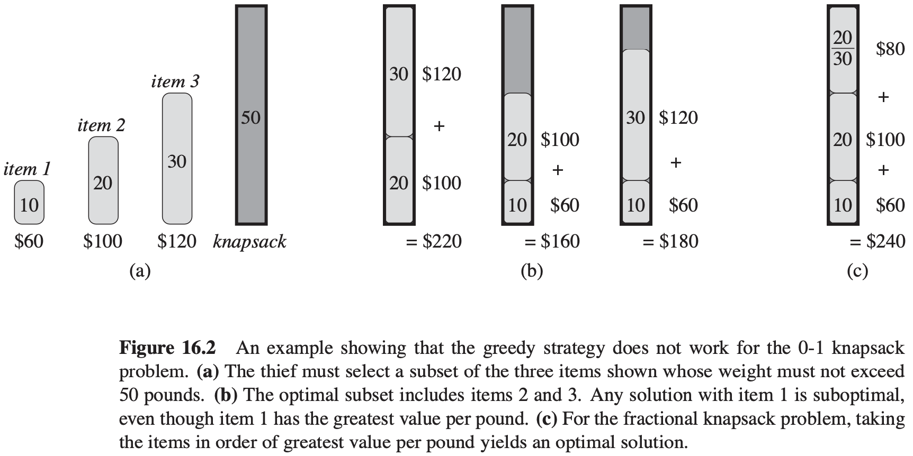

# 第16章 贪心算法

## 16.1 活动选择问题

**活动选择问题** 假定有一个$n$个活动（activity）的集合$S = \{a_1, a_2, ..., a_n\}$，这些活动使用同一个资源，而这个资源在某个时刻只能供一个活动使用。每个活动$a_i$都有一个开始时间$s_i$和一个结束时间$f_i$，其中$0 \leqslant s_i < f_i < \infty$。如果被选中，任务$a_i$发生在半开时间区间$[s_i, f_i)$期间。如果两个活动$a_i$和$a_j$满足$[s_i, f_i)$和$[s_j, f_j)$不重叠，则称它们是兼容的。也就是说，若$s_i \geqslant f_j$或$s_j \geqslant f_i$，则$a_i$和$a_j$是兼容的。在活动选择问题中，我们希望选出一个最大兼容活动集。

**活动选择问题的最优子结构**

用$c[i, j]$表示集合$S_{ij}$的最优解的大小，则可得递归式：
$$
c[i, j] = 
\begin{cases}
0, &若S_{ij} = \emptyset \\
max_{a_k \in S_{ij}} \{c[i, k] + c[k, j] + 1\}, &若S_{ij} \neq \emptyset
\end{cases}
$$
**贪心选择**

**定理 16.1** 考虑任意非空子问题$S_k$，令$a_m$是$S_k$中结束时间最早的活动，则$a_m$在$S_k$的某个最大兼容活动子集中。

**递归贪心算法**
$$
\begin{align}
& RECURSIVE-ACTIVITY-SELECTOR(s, f, k, n) \\
& m = k + 1 \\
& while\ m \leqslant n\ and\ s[m] < f[k] \\
& \qquad m = m + 1 \\
& if\ m \leqslant n \\
& \qquad return\ \{a_m\} \cup RECURSIVE-ACTIVITY-SELECTOR(s, f, m, n) \\
& else\ return\ \emptyset
\end{align}
$$

**迭代贪心算法**
$$
\begin{align}
& GREEDY-ACTIVITY-SELECTOR(s, f) \\
& n = s.length \\
& A = {a_1} \\
& k = 1 \\
& for\ m = 2\ to\ n \\
& \qquad if\ s[m] \geqslant f[k] \\
& \qquad \qquad A = A \cup \{a_m\} \\
& \qquad \qquad k = m \\
& return\ A
\end{align}
$$

## 16.2 贪心算法原理

贪心算法通过做出一系列选择来求出问题的最优解。在每个决策点，它做出在当时看来最佳的选择。

**贪心选择性质**

**贪心选择性质（greedy-choice property）**：我们可以通过做出局部最优（贪心）选择来构造全局最优解。

**最优子结构**

如果一个问题的最优解包含其子问题的最优解，则称此问题具有**最优子结构**性质。

**贪心对动态规划**

## 16.3 赫夫曼编码

**变长编码（variable-length code）**可以达到比定长编码好得多的压缩率，其思想是赋予高频字符短码字，赋予低频字符长码字。

**前缀码**

对于字母表$C$中的每个字符$c$，令属性$c.freq$表示$c$在文件中出现的频率，令$d_T(c)$表示$c$的叶节点在树中的深度（$d_T(c)$也是字符$c$的码字的长度）。则编码文件需要$B(T) = \sum_{c \in C} c \cdot freq \cdot d_T(c)$个二进制位。

**构造赫夫曼编码**

TODO