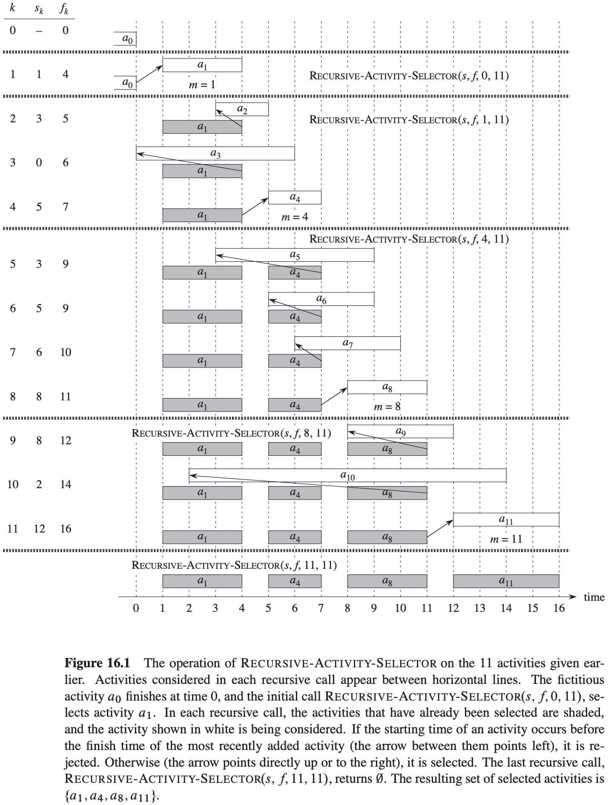
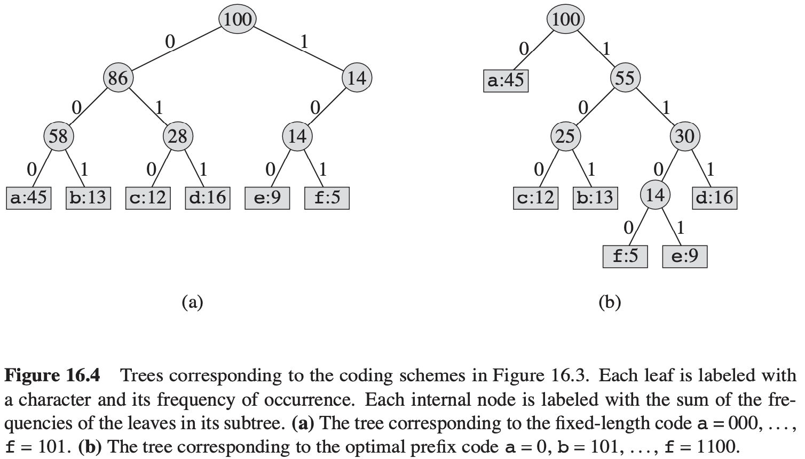
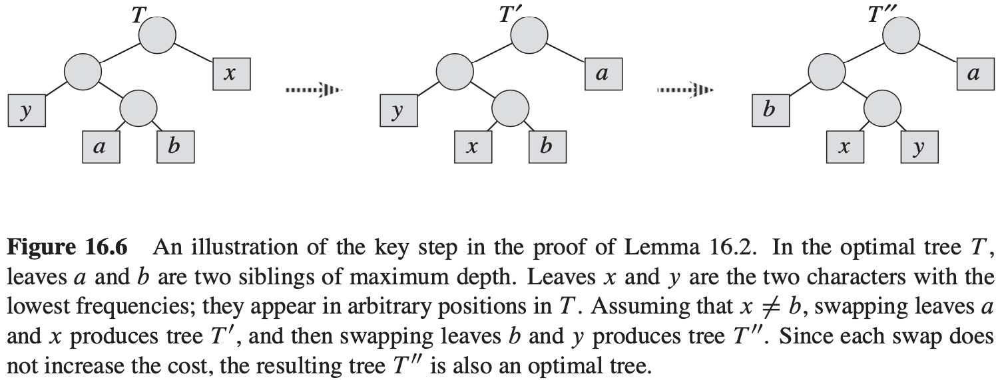

[中文版](chapter16_zh.md) | English

# 16 Greedy Algorithms

[TOC]

## An activity-selection problem

Suppose we have a set $S = \{a_1, a_2, ..., a_n\}$ of $n$ proposed **activities** that wish to use a resource, such as a lecture hall, which can serve only one activity at a time. Each activity $a_i$ has a **start time** $s_i$ and a **finish time** $f_i$, where $0 \leq s_i < f_i < \infty$. If selected, activity $a_i$ takes place during the half-open time interval $[s_i, f_i)$. Activities $a_i$ and $a_j$ are compatible if $s_i \geq f_j$ or $s_j \geq f_i$. In the **activity-selection problem**, we wish to select a maximum-size subset of mutually compatible activities. we assume that the activities are sorted in monotonically increasing order of finish time:
$$
f_1 \leq f_2 \leq f_3 \leq ... \leq f_{n - 1} \leq f_n
$$
**The optimal substructure of the activity=selection problem**

If we denote the size of an optimal solution for the set $S_{ij}$ by $c[i, j]$, then we would have the recurrence $c[i, j] = c[i, k] + c[k, j] + 1$. Of course, if we did not know that an optimal solution for the set $S_{ij}$ includes activity $a_k$, we would have to examine all activities in $S_{ij}$ to find which one to choose, so that:
$$
c[i, j] = 
\begin{cases}
0, &若S_{ij} = \emptyset \\
max_{a_k \in S_{ij}} \{c[i, k] + c[k, j] + 1\}, &若S_{ij} \neq \emptyset
\end{cases}
$$
**Theorem 16.1** Consider any nonempty subproblem $S_k$, and let $a_m$ be an activity in $S_k$ with the earliest finish time. Then $a_m$ is included in some maximum-size subset of mutually compatible activities of $S_k$.

**A recursive greedy algorithm**
$$
\begin{align}
& RECURSIVE-ACTIVITY-SELECTOR(s, f, k, n) \\
& m = k + 1 \\
& while\ m \leqslant n\ and\ s[m] < f[k] \\
& \qquad m = m + 1 \\
& if\ m \leqslant n \\
& \qquad return\ \{a_m\} \cup RECURSIVE-ACTIVITY-SELECTOR(s, f, m, n) \\
& else\ return\ \emptyset
\end{align}
$$

**An iterative greedy algorithm**
$$
\begin{align}
& GREEDY-ACTIVITY-SELECTOR(s, f) \\
& n = s.length \\
& A = {a_1} \\
& k = 1 \\
& for\ m = 2\ to\ n \\
& \qquad if\ s[m] \geqslant f[k] \\
& \qquad \qquad A = A \cup \{a_m\} \\
& \qquad \qquad k = m \\
& return\ A
\end{align}
$$

## Elements of the greedy strategy

A greedy algorithm obtains an optimal solution to a problem by making a sequence of choices. At each decision point, the algorithm makes choice that seems best at the moment.

**Greedy-choice property**

The first key ingredient is the **greedy-choice property**: we can assemble a globally optimal solution by making locally optimal (greedy) choices.

**Optimal substructure**

A problem exhibits **optimal substructure** if an optimal solution to the problem contains within it optimal solutions to subproblems.

**Greedy versus dynamic programming**

## Huffman codes

A **variable-length code** can do considerably better than a fixed-length code, by giving frequent characters short codewords and infrequent characters long codewords.

**Prefix codes**

For each character $c$ in the alphabet $C$, let the attribute $c.freq$ denote the frequency of $c$ in the file and let $d_T(c)$ denote the depth of c's leaf in the tree. Note that $d_T(c)$ is also the length of the codeword for character $c$. The number of bits required to encode a file is thus $B(T) = \sum_{c \in C} c \cdot freq \cdot d_T(c)$, which we define as the **cost** of the tree $T$.

**Constructing a Huffman code**
$$
\begin{align}
& HUFFMAN(C) \\
& n = |C| \\
& Q = C \\
& for\ i = 1\ to\ n - 1 \\
& \qquad allocate\ a\ new\ node\ z \\
& \qquad z.left = x = EXTRACT-MIN(Q) \\
& \qquad z.right = y = EXTRACT-MIN(Q) \\
& \qquad z.freq = x.freq + y.freq \\
& \qquad INSERT(Q, z) \\
& return\ EXTRACT-MIN(Q)
\end{align}
$$

**Correctness of Huffman's algorithm**

**Lemma 16.2** Let $C$ be an alphabet in which each character $c \in C$ has frequency $c.freq$. Let $x$ and $y$ be two characters in $C$ having the lowest frequencies. Then there exists an optimal prefix code for $C$ in which the codewords for $x$ and $y$ have the same length and differ only in the last bit.

**Lemma 16.3** Let $C$ be a given alphabet with frequency $c.freq$ defined for each character $c \in C$. Let $x$ and $y$ be two characters in $C$ with minimum frequency. Let $C'$ be the alphabet $C$ with the characters $x$ and $y$ removed and a new character $z$ added, so that $C' = C - \{x, y\} \cup \{z\}$. Define $f$ for $C'$ as for $C$, except that $z.freq = x.freq + y.freq$. Let $T'$ be any tree representing an optimal prefix code for the alphabet $C'$. Then the tree $T$, obtained from $T'$ by replacing the leaf node for $z$ with an internal node having $x$ and $y$ as children, represents an optimal prefix code for the alphabet $C$.

**Theorem 16.4** Procedure HUFFMAN produces an optimal prefix code.

## Matroids and greedy methods

A **matroid** is an ordered pair $M = (S, I)$ satisfying the following conditions.

1. $S$ is a finite set.
2. $I$ is a nonempty family of subsets of $S$, called the **independent** subsets of $S$, such that if $B \in I$ and $A \subseteq B$, then $A \in I$. We say that $I$ is **hereditary** if it satisfies this property. Note that the empty set $\theta$ is necessarily a member of $I$.
3. If $A \in I, B \in I$, and $|A| < |B|$, then there exists some element $x \in B - A$ such that $A \cup \{x\} \in I$. We say that $M$ satisfies the **exchange property**.

Consider the **graphic matroid** $M_G = (S_G, I_G)$ defined in terms of a given undirected graph $G = (V, E)$ as follows:

- The set $S_G$ is defined to be $E$, the set of edges of $G$.
- If $A$ is a subset of $E$, then $A \in I_G$ if and only if $A$ is acyclic. That is, a set of edges $A$ is independent if and only if the subgraph $G_A = (V, A)$ forms a forest.

**Theorem 16.5** If $G = (V, E)$ is an undirected graph, then $M_G = (S_G, I_G)$ is a matroid.

**Theorem 16.6** All maximal independent subsets in a matroid have the same size.

**Greedy algorithms on a weighted matroid**
$$
\begin{align}
& GREEDY(M, w) \\
& A = \emptyset \\
& sort\ M.S\ into\ monotonically\ decreasing\ order\ by\ weight\ w \\
& for\ each x \in M.S, taken\ in\ monotonically\ decreasing\ order\ by\ weight\ w(x) \\
& \qquad if\ A \cup \{x\} \in M.I \\
& \qquad A = A \cup \{x\} \\
& return\ A
\end{align}
$$
**Lemma 16.7 (Matroids exhibit the greedy-choice property)** Suppose that $M = (S, I)$ is a weighted matroid with weight function $w$ and that $S$ is sorted into monotonically decreasing order by weight. Let $x$ be the first element of $S$ such that $\{x\}$ is independent, if any such $x$ exists. If $x$ exists, then there exists an optimal subset $A$ of $S$ that contains $x$.

**Lemma 16.8** Let $M = (S, I)$ be any matroid. If $x$ is an element of $S$ that is an extension of some independent subset $A$ of $S$, then $x$ is also an extension of $\phi$.

**Corollary 16.9** Let $M = (S, I)$ be any matroid. If $x$ is an element of $S$ such that $x$ is not an extension of $\phi$, then $x$ is not an extension of any independent subset $A$ of $S$.

**Lemma 16.10 (Matroids exhibit the optimal-substructure property)** Let $x$ be the first element of $S$ chosen by GREEDY for the weighted matroid $M = (S, I)$. The remaining problem of finding a maximum-weight independent subset containing $x$ reduces to finding a maximum-weight independent subset of the weighted matroid $M' = (S', I')$, where:
$$
\begin{equation}\begin{split} 
S' &= \{y \in S: \{x, y\} \in I \} \\ 
I' &= \{B \subseteq S - \{x\}:B \cup \{x\} \in I \}\\ 
\end{split}\end{equation}
$$
, and the weight function for $M'$ is the weight function for $M$, restricted to $S'$. (We call $M'$ the contraction of $M$ by the element $x$).

**Theorem 16.11 (Correctness of the greedy algorithm on matroids)** If $M = (S, I)$ is a weighted matroid with weight function $w$, then $GREEDY(M, w)$ returns an optimal subset.

## A task-scheduling problem as a matroid

**Lemma 16.12** For any set of tasks $A$, the following statements are equivalent:

1. The set $A$ is independent.
2. For $t = 0, 1, 2, ..., n$, we have $N_t(A) \leq t$.
3. If the tasks in $A$ are scheduled in order of monotonically increasing deadlines, then no task is late.

**Theorem 16.13** If $S$ is a set of unit-time tasks with deadlines, and $I$ is the set of all independent sets of tasks, then the corresponding system $(S, I)$ is a matroid.

