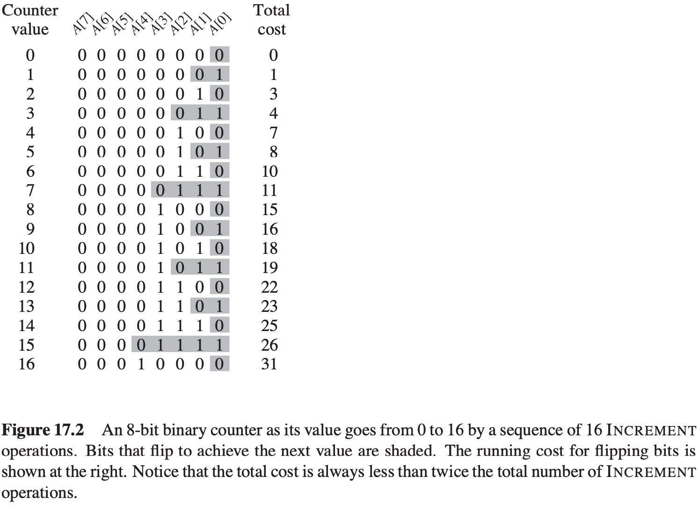

[中文版](chapter17_zh.md) | English

# 17 Amortized Analysis

[TOC]

In an **amortized analysis**, we average the time required to perform a sequence of data-structure operations over all the operations performed.

## Aggregate analysis

**Stack operations**

- $PUSH(S, x)$ pushes object $x$ onto stack $S$.
- $POP(S)$ pops the top of stack $S$ and returns the popped object. Calling POP on an empty stack generates an error.

$$
\begin{align}
& MULTIPOP(S, k) \\
& while\ not\ STACK-EMPTY(S)\ and\ k > 0 \\
& \qquad POP(S) \\
& \qquad k = k - 1 \\
\end{align}
$$

**Incrementing a binary counter**
$$
\begin{align}
& INCREMENT(A) \\
& i = 0 \\
& while\ i < A.length\ and\ A[i] == 1 \\
& \qquad A[i] = 0 \\
& \qquad i = i + 1 \\
& if\ i < A.length \\
& \qquad A[i] = 1
\end{align}
$$

## The accounting method

**Incrementing a binary counter**

For $n\ INCREMENT$ operations, the total amortized cost is $O(n)$, which bounds the total actual cost.

## The potential method

The potential method works as follows. We will perform $n$ operations, starting with an initial data structure $D_0$. For each $i = 1, 2, ..., n$, we let $c_i$ be the actual cost of the $i$th operation and $D_i$ be the data structure that results after applying the $i$th operation to a data structure $D_{i - 1}$. A **potential function** $\Phi$ maps each data structure $D_i$ to a real number $\Phi(D_i)$, which is the **potential** associated with data structure $D_i$. The **amortized cost** $\hat{c_i}$ of the $i$th operation with respect to the potential function $\Phi$ is defined by: $\hat c_i = c_i + \Phi(D_i) - \Phi(D_{i - 1})$

, The amortized cost of each operation is therefore its actual cost plus the change in potential due to the operation. By the above equation, the total amortized cost of the $n$ operations are:
$$
\begin{equation}\begin{split}
\sum_{i = 1}^{n} \hat c_i &= \sum_{i = 1}^{n}(c_i + \Phi(D_i) - \Phi(D_{i - 1})) \\
&= \sum_{i = 1}^{n}c_i + \Phi(D_n) - \Phi(D_0)
\end{split}\end{equation}
$$
**Stack operations**

The amortized cost of the $MULTIPOP$ operation is:
$$
\begin{equation}\begin{split}
\hat{c_i} &= c_i + \Phi(D_i) - \Phi(D_{i - 1}) \\
&= k' - k' \\
&= 0
\end{split}\end{equation}
$$

## Dynamic tables

### Table expansion

$$
\begin{align}
& TABLE-INSERT(T, x) \\
& \qquad allocate\ T.table\ with\ 1\ slot \\
& \qquad T.size = 1 \\
& if\ T.num == T.size \\
& \qquad allocate\ new-table\ with 2 * T.size\ slots \\
& \qquad insert\ all\ items\ in\ T.table\ into\ new-table \\
& \qquad free\ T.table \\
& \qquad T.table = new-table \\
& \qquad T.size = 2 * T.size \\
& insert\ x\ into\ T.table \\
& T.num = T.num + 1
\end{align}
$$

The total cost of $n$ $TABLE-INSERT$ operations is therefore:
$$
\begin{equation}\begin{split}
\sum_{i = 1}^{n} c_i &\leqslant n + \sum_{j = 0}^{\lfloor lg\ n \rfloor} 2^j \\
&< n + 2n \\
&= 3n
\end{split}\end{equation}
$$

### Table expansion and contraction

