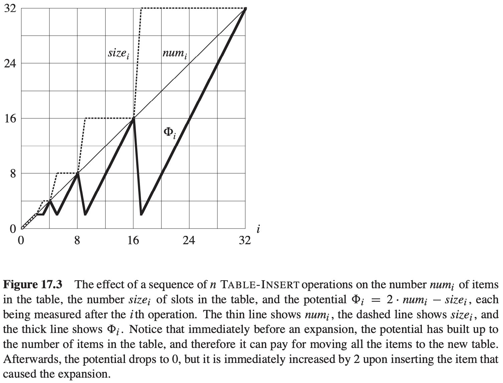

# 第17章 摊还分析

**摊还分析（amortized analysis）**：求数据结构的一个操作序列中所执行的所有操作的平均时间，来评价操作的代价。

## 17.1聚合分析

**栈操作**

- $PUSH(S, x)$：将对象$x$压入栈$S$中。
- $POP(S)$：将栈$S$的栈顶对象弹出，并返回该对象（对空栈调用$POP$会产生一个错误）。

$$
\begin{align}
& MULTIPOP(S, k) \\
& while\ not\ STACK-EMPTY(S)\ and\ k > 0 \\
& \qquad POP(S) \\
& \qquad k = k - 1 \\
\end{align}
$$

|                  | 代价   |
| ---------------- | ------ |
| 平均运行时间     | $O(1)$ |
| 最坏情况运行时间 | $O(n)$ |

**二进制计数器递增**
$$
\begin{align}
& INCREMENT(A) \\
& i = 0 \\
& while\ i < A.length\ and\ A[i] == 1 \\
& \qquad A[i] = 0 \\
& \qquad i = i + 1 \\
& if\ i < A.length \\
& \qquad A[i] = 1
\end{align}
$$

## 17.2 核算法

**栈操作**

**二进制计数器递增**

对于$n$个$INCREMENT$操作，总摊还代价为$O(n)$，为总实际代价的上界。

## 17.3 势能法

势能法工作方式：对一个初始数据结构$D_0$执行$n$个操作。对每个$i = 1, 2, ..., n$，令$c_i$为第$i$个操作的实际代价，令$D_i$为在数据结构$D_{i - 1}$上执行第$i$个操作得到的结果数据结构。**势函数$\Phi$**将每个数据结构$D_i$映射到一个实数$\Phi (D_i)$，此值即为关联到数据结构$D_i$的**势**。

第$i$个操作的**摊还代价**为：$\hat c_i = c_i + \Phi(D_i) - \Phi(D_{i - 1})$，$n$个操作的总摊还代价为：$\sum_{i = 1}^{n} \hat c_i = \sum_{i = 1}^{n}(c_i + \Phi(D_i) - \Phi(D_{i - 1})) = \sum_{i = 1}^{n}c_i + \Phi(D_n) - \Phi(D_0)$。

**栈操作**

MULTIPOP的摊还代价为：$\hat{c_i} = c_i + \Phi(D_i) - \Phi(D_{i - 1}) = k' - k' = 0$

**二进制计数器递增**

## 17.4 动态表

### 17.4.1 表扩张

$$
\begin{align}
& TABLE-INSERT(T, x) \\
& \qquad allocate\ T.table\ with\ 1\ slot \\
& \qquad T.size = 1 \\
& if\ T.num == T.size \\
& \qquad allocate\ new-table\ with 2 * T.size\ slots \\
& \qquad insert\ all\ items\ in\ T.table\ into\ new-table \\
& \qquad free\ T.table \\
& \qquad T.table = new-table \\
& \qquad T.size = 2 * T.size \\
& insert\ x\ into\ T.table \\
& T.num = T.num + 1
\end{align}
$$

$n$个$TABLE-INSERT$操作的总代价为：$\sum_{i = 1}^{n} c_i \leqslant n + \sum_{j = 0}^{\lfloor lg\ n \rfloor} 2^j < n + 2n = 3n$。

## 17.4.2 表扩张和收缩

