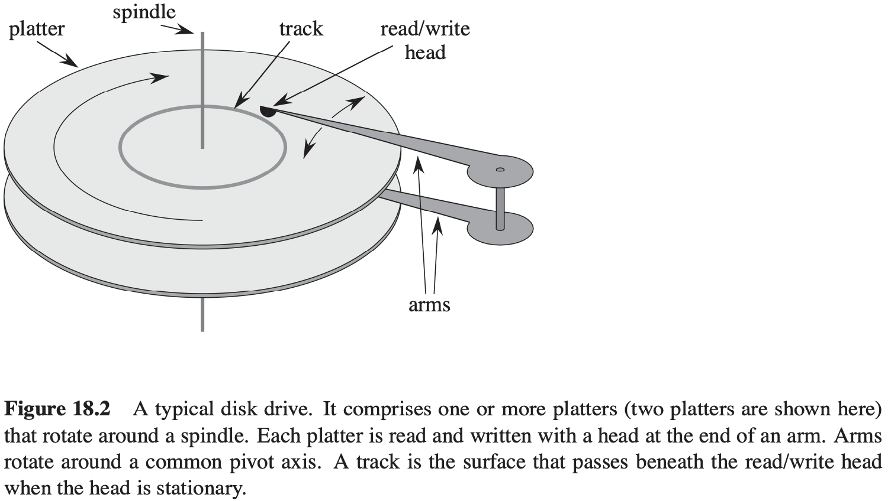
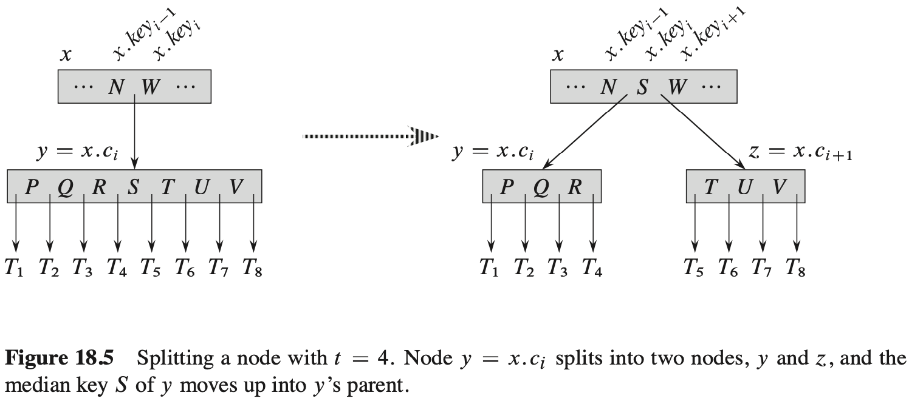

[中文版](chapter18_zh.md) | English

# B-Trees

[TOC]

**Data structures on secondary storage**

## Definition of B-trees

A **B-tree** $T$ is a rooted tree (whose root is $T.root$) having the followng properties:

1.  Every node $x$ has the following attributes:

   - $x.n$, the number of keys currently stored in node $x$.
   - the $x.n$ keys themselves, $x.key_1, x_.key_2, ..., x.key_{x.n}$, stored in nondecreasing order, so that $x.key_1 \leq x.key_2 \leq ... \leq x.key_{x.n}$,
   - $x.leaf$ a boolean value that is TRUE if $x$ is a leaf and FALSE if $x$ is an internal node.

2. Each internal node $x$ also contains $x.n + 1$ pointers $x.c_1, x.c_2, ..., x.c_{x.n+1}$ to its children. Leaf nodes have no children, and so their $c_i$ attributes are undefined.

3. The keys $x.key_i$ separate the ranges of keys stored in each subtree: if $k_i$ is any stored in the subtree with root $x.c_i$, then:
   $$
   k_1 \leq x.key_1 \leq k_2 \leq x.key_2 \leq ... \leq x.key_{x.n} \leq k_{x.n+1}
   $$

4. All leaves have the same depth, which is the tree's height $h$.

5. Nodes have lower and upper bounds on the number of keys they can contain. We express these bounds in terms of a fixed integer $t \geq 2$ called the **minimum degree** of the B-tree:

   - Every node other than the root must have at least $t - 1$ keys. Every internal node other than the root thus has at least $t$ children. If the tree is nonempty, the root must have at least one key.
   - Every node may contain at most $2t - 1$ keys. Therefore, an internal node may have at most $2t$ children. We say that a node is **full** if it contains exactly $2t - 1$ keys.

**The height of a B-tree**

**Theorem 18.1** If $n \geq 1$, then for any $n$-key B-tree $T$ of height $h$ and minimum degree $t \geq 2$, $h \leq log_t\frac{n + 1}{2}$.

## Basic operations on B-trees

**Searching a B-tree**
$$
\begin{align}
& B-TREE-SEARCH(x, k) \\
& i = 1 \\
& while\ i \leqslant x.n\ and\ k > x.key_i \\
& \qquad i = i + 1 \\
& if\ i \leqslant x.n\ and\ k == x.key \\
& \qquad return(x, i) \\
& elseif\ x.leaf \\
& \qquad return\ NIL \\
& else\ DISK-READ(x.c_i, k)
\end{align}
$$
**Creating an empty B-tree**
$$
\begin{align}
& B-TREE-CREATE(T) \\
& x = ALLOCATE-NODE() \\
& x.leaf = TRUE \\
& x.n = 0 \\
& DISK-WRITE(x) \\
& T.root = x
\end{align}
$$
**Splitting a node in a B-tree**

$$
\begin{align}
& B-TREE-SPLIT-CHILD(x, i) \\
& z = ALLOCATE-NODE() \\
& y = x.c_i \\
& z.leaf = y.leaf \\
& z.n = t - 1 \\
& for\ j = 1\ to\ t - 1 \\
& \qquad z.key_j = y.key_{j + t} \\
& if\ not\ y.leaf \\
& \qquad for\ j = 1\ to\ t \\
& \qquad \qquad z.c_j = y.c_{j + t} \\
& y.n = t - 1 \\
& for\ j = x.n + 1\ downto\ i + 1 \\
& \qquad x.c_{j + 1} = x.c_j \\
& x.c_{i + 1} = z \\
& for\ j = x.n\ downto\ i \\
& \qquad x.key_{j + 1} = x.key_j \\
& x.key_i = y.key_t \\
& x.n = x.n + 1 \\
& DISK-WRITE(y) \\
& DISK-WRITE(z) \\
& DISK-WRITE(x) 
\end{align}
$$
**Inserting a key into a B-tree in a single pass down the tree**
$$
\begin{align}
& B-TREE-INSERT(T, k) \\
& r = T.root \\
& if\ r.n == 2t - 1 \\
& \qquad s = ALLOCATE-NODE() \\
& \qquad T.root = s \\
& \qquad s.leaf = FALSE \\
& \qquad s.n = 0 \\
& \qquad s.c_1 = r \\
& \qquad B-TREE-SPLIT-CHILD(s, k) \\
& \qquad B-TREE-INSERT-NONFULL(s, k) \\
& else\ B-TREE-INSERT-NONFULL(r, k)
\end{align}
$$

$$
\begin{align}
& B-TREE-INSERT-NONFULL(x, k) \\
& i = x.n \\
& if\ x.leaf \\
& \qquad while\ i \geqslant 1\ and\ k < x.key_i \\
& \qquad \qquad x.key_{i + 1} = x.key_i \\
& \qquad \qquad i = i - 1 \\
& \qquad x.key_{i + 1} = k \\
& \qquad x.n = x.n + 1 \\
& \qquad DISK-WRITE(x) \\
& else\ while\ i \geqslant i\ and\ k < x.key_i \\
& \qquad i = i - 1 \\
& \qquad i = i + 1 \\
& \qquad DISK-READ(x.c_i) \\
& \qquad if\ x.c_i.n == 2t - 1 \\
& \qquad \qquad B-TREE-SPLIT-CHILD(x, i) \\
& \qquad \qquad if\ k > x.key_i \\
& \qquad \qquad \qquad i = i + 1 \\
& \qquad B-TREE-INSERT-NONFULL(x.c_i, k) 
\end{align}
$$

## Deleting a key from a B-tree

