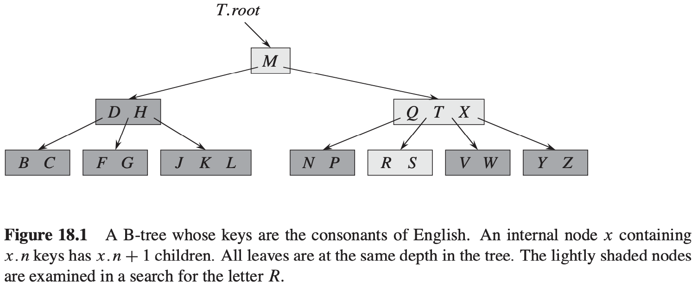
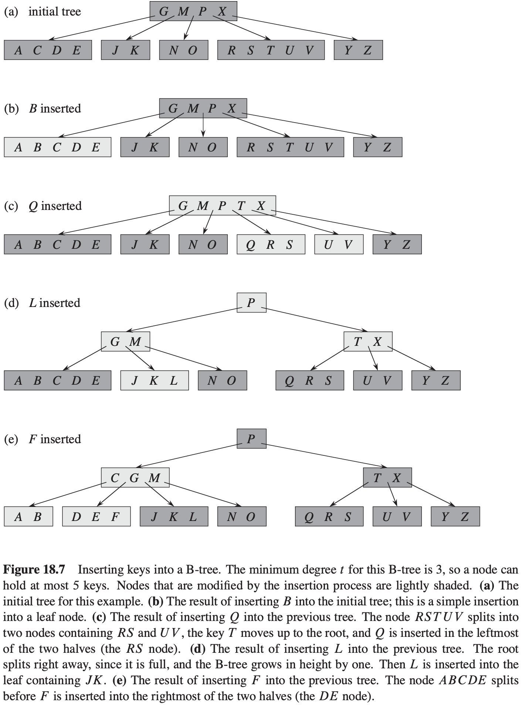

# 第18章 B树

**辅存上的数据结构**

## 18.1 B树的定义

一棵$B$树$T$是具有以下性质的有根树（根为$T.root$）：

1. 每个结点$x$有下面属性：
   - $x.n$，当前存储在结点$x$中的关键字个数。
   - $x.n$个关键字本身$x.key_1, x.key_2, ..., x.key_{x.n}$，以非降序存放，使得$x.key_1 \leqslant x.key_2 \leqslant ... \leqslant x.key_{x.n}$。
   - $x.leaf$，一个布尔值，如果$x$是叶结点，则为$TRUE$；如果$x$为内部结点，则为$FALSE$。
2. 每个内部结点$x$还包括$x.n+1$个指向孩子的指针$x.c_1, x.c_2, ..., x.c_{x.n+1}$。叶结点没有孩子，所以他们的$c_i$属性没有定义。
3. 关键字$x.key_i$对存储在各子树中的关键字范围加以分割：如果$k_i$为任意一个存储在以$x.c_i$为根的子树中的关键字，那么：$k_1 \leqslant x.key_1 \leqslant k_2 \leqslant x.key_2 \leqslant ... \leqslant x.key_{x.n} \leqslant k_{x.n+1}$。
4. 每个叶结点具有相同的深度，即树的高度$h$。
5. 每个结点所包含的关键字个数有上界和下界。用一个被称为**B树的最小度数（minmum degree）**的固定整数$t \geqslant 2$来表示这些界：
   - 除了根结点以外的每个结点必须至少有$t - 1$各关键字。因此，除了根结点以外的每个内部结点至少有$t$个孩子。如果树非空，根结点至少有一个关键字。
   - 每个结点至多可包含$2t - 1$个关键字。因此，一个内部结点至多可有$2t$个孩子。当一个结点恰好有$2t - 1$个关键字时，称该结点是**满的（full）**。

**B树的高度**

**定理 18.1** 如果$n \geqslant 1$，那么对任意一棵包含$n$个关键字，高度为$h$，最小度数$t \geqslant 2$的B树$T$，有：$h \leqslant log_t \frac{n + 1}{2}$。

## 18.2 B树上的基本操作

**搜索B树**
$$
\begin{align}
& B-TREE-SEARCH(x, k) \\
& i = 1 \\
& while\ i \leqslant x.n\ and\ k > x.key_i \\
& \qquad i = i + 1 \\
& if\ i \leqslant x.n\ and\ k == x.key \\
& \qquad return(x, i) \\
& elseif\ x.leaf \\
& \qquad return\ NIL \\
& else\ DISK-READ(x.c_i, k)
\end{align}
$$
**创建一棵空的B树**
$$
\begin{align}
& B-TREE-CREATE(T) \\
& x = ALLOCATE-NODE() \\
& x.leaf = TRUE \\
& x.n = 0 \\
& DISK-WRITE(x) \\
& T.root = x
\end{align}
$$
**向B树中插入一个关键字**

**分裂B树中的结点**

$$
\begin{align}
& B-TREE-SPLIT-CHILD(x, i) \\
& z = ALLOCATE-NODE() \\
& y = x.c_i \\
& z.leaf = y.leaf \\
& z.n = t - 1 \\
& for\ j = 1\ to\ t - 1 \\
& \qquad z.key_j = y.key_{j + t} \\
& if\ not\ y.leaf \\
& \qquad for\ j = 1\ to\ t \\
& \qquad \qquad z.c_j = y.c_{j + t} \\
& y.n = t - 1 \\
& for\ j = x.n + 1\ downto\ i + 1 \\
& \qquad x.c_{j + 1} = x.c_j \\
& x.c_{i + 1} = z \\
& for\ j = x.n\ downto\ i \\
& \qquad x.key_{j + 1} = x.key_j \\
& x.key_i = y.key_t \\
& x.n = x.n + 1 \\
& DISK-WRITE(y) \\
& DISK-WRITE(z) \\
& DISK-WRITE(x) 
\end{align}
$$
**以沿树单程下行方式向B树插入关键字**
$$
\begin{align}
& B-TREE-INSERT(T, k) \\
& r = T.root \\
& if\ r.n == 2t - 1 \\
& \qquad s = ALLOCATE-NODE() \\
& \qquad T.root = s \\
& \qquad s.leaf = FALSE \\
& \qquad s.n = 0 \\
& \qquad s.c_1 = r \\
& \qquad B-TREE-SPLIT-CHILD(s, k) \\
& \qquad B-TREE-INSERT-NONFULL(s, k) \\
& else\ B-TREE-INSERT-NONFULL(r, k)
\end{align}
$$

$$
\begin{align}
& B-TREE-INSERT-NONFULL(x, k) \\
& i = x.n \\
& if\ x.leaf \\
& \qquad while\ i \geqslant 1\ and\ k < x.key_i \\
& \qquad \qquad x.key_{i + 1} = x.key_i \\
& \qquad \qquad i = i - 1 \\
& \qquad x.key_{i + 1} = k \\
& \qquad x.n = x.n + 1 \\
& \qquad DISK-WRITE(x) \\
& else\ while\ i \geqslant i\ and\ k < x.key_i \\
& \qquad i = i - 1 \\
& \qquad i = i + 1 \\
& \qquad DISK-READ(x.c_i) \\
& \qquad if\ x.c_i.n == 2t - 1 \\
& \qquad \qquad B-TREE-SPLIT-CHILD(x, i) \\
& \qquad \qquad if\ k > x.key_i \\
& \qquad \qquad \qquad i = i + 1 \\
& \qquad B-TREE-INSERT-NONFULL(x.c_i, k) 
\end{align}
$$

## 18.3 从B树中删除关键字

