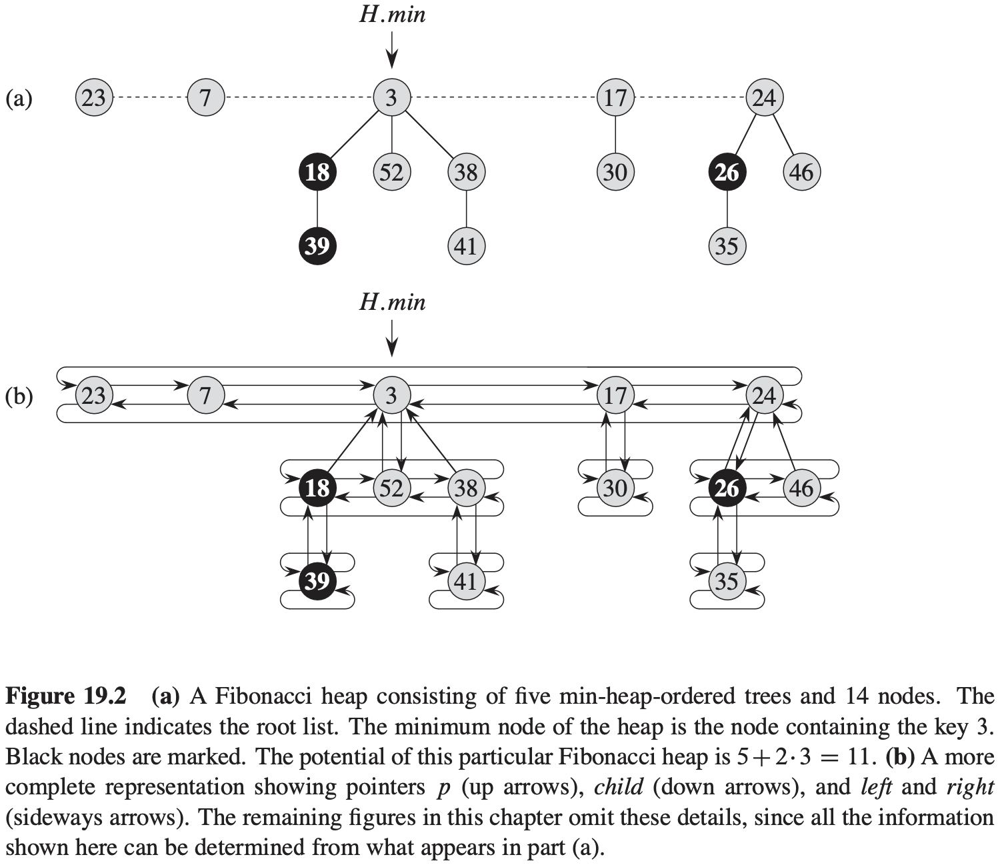

[中文版](chapter19_zh.md) | English

# Fibonacci Heaps

[TOC]

A **mergeable heap** is any data structure that supports the following five operations, in which each element has a $key$:

- $MAKE-HEAP()$ creates and returns a new heap containing no elements.
- $INSERT(H, x)$ inserts element $x$, whose $key$ has already been filled in, into heap $H$.
- $MINIMUM(H)$ returns a pointer to the element in heap $H$ whose key is minimum.
- $EXTRACT-MIN(H)$ deletes the element from heap $H$ whose key is minimum, returning a pointer to the element.
- $UNION(H_1, H_2)$ creates and returns a new heap that contains all the elements of heap $H_1$ and $H_2$. Heaps $H_1$ and $H_2$ are "destroyed" by this operations.

In addition to the mergeable-heap operations above, Fibonacci heaps also support the following two operations:

- $DECREASE-KEY(H, x, k)$ assigns to element $x$ within heap $H$ the new key value $k$, which we assume to be no greater than its current key value.
- $DELETE(H, x)$ deletes element $x$ from heap $H$.

## Structure of Fibonacci heaps

A **Fibonacci heap** is a collection of rooted trees that are **min-heap ordered**. That is, each tree obeys the **min-heap property**: they key of a node is greater than or equal to the key of its parent.

**Potential function**

For a given Fibonacci heap $H$, we indicate by $t(H)$ the number of trees in the root list of $H$ and by $m(H)$ the number of marked nodes in $H$. We then define the potential $\Phi(H)$ of Fibonacci heap $H$ by:
$$
\Phi(H) = t(H) + 2m(H)
$$

## Mergeable-heap operations

**Creating a new Fibonacci heap**

**Inserting a node**

**Finding the minimum node**

**Uniting two Fibonacci heaps**
$$
\begin{align}
& FIB-HEAP-UNION(H_1, H_2) \\
& H = MAKE-FIB-HEAP() \\
& H.min = H_1.min \\
& concatenate\ the\ root\ list\ of\ H_2\ with\ the\ root\ list\ of\ H \\
& if(H_1.min == NIL) or (H_2.min \neq NIL\ and\ H_2.min.key < H_1.min.key) \\
& \qquad H.min = H_2.min \\
& H.n = H_1.n + H_2.n \\
& return\ H
\end{align}
$$
**Extracting the minimum node**
$$
\begin{align}
& FIB-HEAP-EXTRACT-MIN(H) \\
& z = H.min \\
& if\ z \neq NIL \\
& \qquad for\ each\ child\ x\ of\ z \\
& \qquad \qquad add\ x\ to\ the\ root\ list\ of\ H \\
& \qquad \qquad x.p = NIL \\
& \qquad remove\ z\ from\ the\ root\ list\ of\ H \\
& \qquad if\ z == z.right \\
& \qquad \qquad H.min = NIL \\
& \qquad else\ H.min = z.right \\
& \qquad \qquad CONSOLIDATE(H) \\
& \qquad H.n = H.n - 1 \\
& return\ z
\end{align}
$$

$$
\begin{align}
& CONSOLIDATE(H) \\
& let\ A[0..D(H.n)]\ be\ a\ new\ array \\
& for\ i = 0\ to\ D(H.n) \\
& \qquad A[i] = NIL \\
& for\ each\ node\ w\ in\ the\ root\ list\ of\ H \\
& \qquad x = w \\
& \qquad d = x.degree \\
& \qquad while\ A[d] \neq NIL \\
& \qquad \qquad y = A[d] \\
& \qquad \qquad if\ x.key > y.key \\
& \qquad \qquad \qquad exchange\ x\ with\ y \\
& \qquad \qquad FIB-HEAP-LINK(H, y, x) \\
& \qquad \qquad A[d] = NIL \\
& \qquad \qquad d = d + 1 \\
& \qquad A[d] = x \\
& H.min = NIL \\
& for\ i = 0\ to\ D(H.n) \\
& \qquad if\ A[i] \neq NIL \\
& \qquad \qquad if\ H.min == NIL \\
& \qquad \qquad \qquad create\ a\ root\ list\ for\ H\ containing\ just\ A[i] \\
& \qquad \qquad \qquad H.min = A[i] \\
& \qquad \qquad else\ insert\ A[i]\ into\ H's\ root\ list \\
& \qquad \qquad \qquad if\ A[i].key < H.min.key \\
& \qquad \qquad \qquad \qquad H.min = A[i]
\end{align}
$$

$$
\begin{align}
& FIB-HEAP-LINK(H, y, x) \\
& remove\ y\ from\ the\ root\ list\ of\ H \\
& make\ y\ a\ child\ of\ x, incrementing\ x.degree \\
& y.mark = FALSE 
\end{align}
$$

## Decreasing a key an deleting a node

**Decreasing a key**
$$
\begin{align}
& FIB-HEAP-DECREASE-KEY(H, x, k) \\
& if\ k > x.key \\
& \qquad error\ "new\ key\ is\ greater\ than\ current\ key" \\
& x.key = k \\
& y = x.p \\
& if\ y \neq NIL\ and\ x.key < y.key \\
& \qquad CUT(H, x, y) \\
& \qquad CASCADING-CUT(H, y) \\
& if\ x.key < H.min.key \\
& \qquad H.min = x
\end{align}
$$

$$
\begin{align}
& CUT(H, x, y) \\
& remove\ x\ from\ the\ child\ list\ of\ y, decrementing\ y.degree \\
& add\ x\ to\ the\ root\ list\ of\ H \\
& x.p = NIL \\
& x.mark = FALSE \\
\end{align}
$$

$$
\begin{align}
& CASCADING-CUT(H, y) \\
& z = y.p \\
& if\ z \neq NIL \\
& \qquad if\ y.mark == FALSE \\
& \qquad \qquad y.mark = TRUE \\
& \qquad else\ CUT(H, y, z) \\
& \qquad \qquad CASCADING-CUT(H, z)
\end{align}
$$

## Bounding the maximum degree

**Lemma 19.1** Let $x$ be any node in a Fibonacci heap, and suppose that $x.degree = k$. Let $y_1, y_2, ..., y_k$ denote the children of $x$ in the order in which they were linked to $x$, from the earliest to the latest. Then, $y_1.degree \geq 0$ and $y_i.degree \geq i - 2$ for $i = 2, 3, ..., k$.

**Lemma 19.2** For all integers $k \geq 0$, $F_{k + 2} = 1 + \sum_{i = 0}^{k}F_i$.

**Lemma 19.3** For all integers $k \geq 0$, the $(k + 2)$nd Fibonacci number satisfies $F_{k + 2} \geq \phi^k$.

**Lemma 19.4** Let $x$ be any node in a Fibonacci heap, and let $k = x.degree$. Then $size(x) \geq F_{k + 2} \geq \phi^k$, where $\phi = (1 + \sqrt{5}) / 2$.

**Corollary 19.5** The maximum degree $D(n)$ of any node in an $n$-node Fibonacci heap is $O(lg\ n)$.

