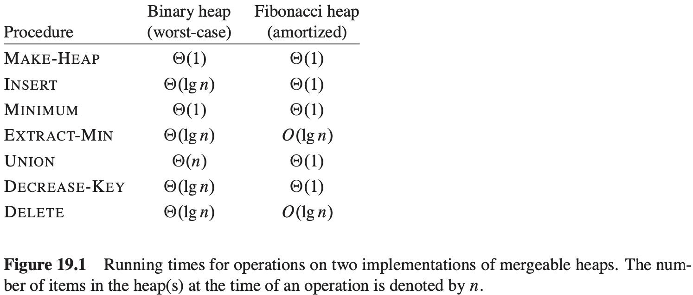
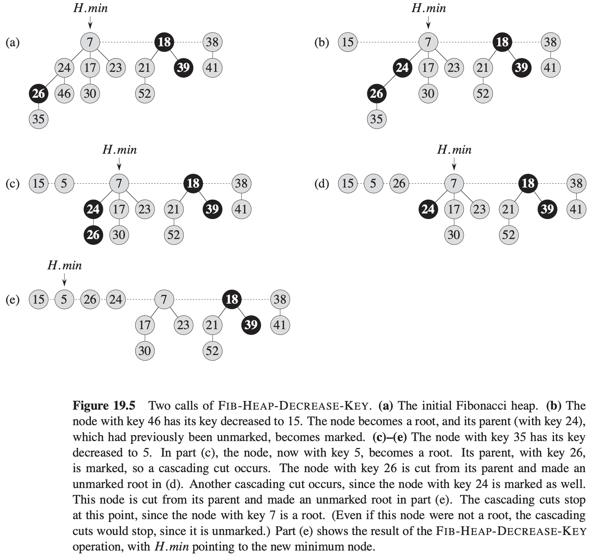

# 第19章 斐波那契堆

斐波那契堆用途：

1. 支持一系列操作，这些操作构成了可合并堆。

   **可合并堆（mergeable heap）**是支持以下5种操作的一种数据结构，其中每个元素都有一个关键字：

   - $MAKE-HEAP()$：创建和返回一个新的不含任何元素的堆。
   - $INSERT(H, x)$：将一个已填入关键字的元素$x$插入堆$H$中。
   - $MINIMUM(H)$：返回一个指向堆$H$中具有最小关键字元素的指针。
   - $EXTRACT-MIN(H)$：从堆$H$中删除最小关键字的元素，并返回一个指向该元素的指针。
   - $UNION(H_1, H_2)$：创建并返回一个包含堆$H_1$和堆$H_2$中所有元素的新堆。堆$H_1$和堆$H_2$由这一操作“销毁”。

2. 斐波那契堆的一些操作可以在常数摊还时间内完成，这使得这种数据结构非常适合于需要频繁调用这些操作的应用。

## 19.1 斐波那契堆结构

一个**斐波那契堆**是一系列具有**最小堆序（min-heap ordered）**的有根树的集合。每棵树均遵循**最小堆性质（min-heap property）**：每个结点的关键字大于或等于它的父结点的关键字。

**势函数**

对于一个给定的斐波那契堆$H$，用$t(H)$来表示$H$中根链表中树的数目，用$m(H)$来表示$H$中已标记的结点数目。定义斐波那契堆$H$的势函数$\Phi(H)$如下：$\Phi(H) = t(H) + 2m(H)$。

**最大度数**

## 19.2 可合并堆操作

**创建一个新的斐波那契堆**

**插入一个结点**

**寻找最小结点**

**两个斐波那契堆的合并**
$$
\begin{align}
& FIB-HEAP-UNION(H_1, H_2) \\
& H = MAKE-FIB-HEAP() \\
& H.min = H_1.min \\
& concatenate\ the\ root\ list\ of\ H_2\ with\ the\ root\ list\ of\ H \\
& if(H_1.min == NIL) or (H_2.min \neq NIL\ and\ H_2.min.key < H_1.min.key) \\
& \qquad H.min = H_2.min \\
& H.n = H_1.n + H_2.n \\
& return\ H
\end{align}
$$
**抽取最小结点**
$$
\begin{align}
& FIB-HEAP-EXTRACT-MIN(H) \\
& z = H.min \\
& if\ z \neq NIL \\
& \qquad for\ each\ child\ x\ of\ z \\
& \qquad \qquad add\ x\ to\ the\ root\ list\ of\ H \\
& \qquad \qquad x.p = NIL \\
& \qquad remove\ z\ from\ the\ root\ list\ of\ H \\
& \qquad if\ z == z.right \\
& \qquad \qquad H.min = NIL \\
& \qquad else\ H.min = z.right \\
& \qquad \qquad CONSOLIDATE(H) \\
& \qquad H.n = H.n - 1 \\
& return\ z
\end{align}
$$

$$
\begin{align}
& CONSOLIDATE(H) \\
& let\ A[0..D(H.n)]\ be\ a\ new\ array \\
& for\ i = 0\ to\ D(H.n) \\
& \qquad A[i] = NIL \\
& for\ each\ node\ w\ in\ the\ root\ list\ of\ H \\
& \qquad x = w \\
& \qquad d = x.degree \\
& \qquad while\ A[d] \neq NIL \\
& \qquad \qquad y = A[d] \\
& \qquad \qquad if\ x.key > y.key \\
& \qquad \qquad \qquad exchange\ x\ with\ y \\
& \qquad \qquad FIB-HEAP-LINK(H, y, x) \\
& \qquad \qquad A[d] = NIL \\
& \qquad \qquad d = d + 1 \\
& \qquad A[d] = x \\
& H.min = NIL \\
& for\ i = 0\ to\ D(H.n) \\
& \qquad if\ A[i] \neq NIL \\
& \qquad \qquad if\ H.min == NIL \\
& \qquad \qquad \qquad create\ a\ root\ list\ for\ H\ containing\ just\ A[i] \\
& \qquad \qquad \qquad H.min = A[i] \\
& \qquad \qquad else\ insert\ A[i]\ into\ H's\ root\ list \\
& \qquad \qquad \qquad if\ A[i].key < H.min.key \\
& \qquad \qquad \qquad \qquad H.min = A[i]
\end{align}
$$

$$
\begin{align}
& FIB-HEAP-LINK(H, y, x) \\
& remove\ y\ from\ the\ root\ list\ of\ H \\
& make\ y\ a\ child\ of\ x, incrementing\ x.degree \\
& y.mark = FALSE 
\end{align}
$$

## 19.3 关键字减值和删除一个结点

**关键字减值**
$$
\begin{align}
& FIB-HEAP-DECREASE-KEY(H, x, k) \\
& if\ k > x.key \\
& \qquad error\ "new\ key\ is\ greater\ than\ current\ key" \\
& x.key = k \\
& y = x.p \\
& if\ y \neq NIL\ and\ x.key < y.key \\
& \qquad CUT(H, x, y) \\
& \qquad CASCADING-CUT(H, y) \\
& if\ x.key < H.min.key \\
& \qquad H.min = x
\end{align}
$$

$$
\begin{align}
& CUT(H, x, y) \\
& remove\ x\ from\ the\ child\ list\ of\ y, decrementing\ y.degree \\
& add\ x\ to\ the\ root\ list\ of\ H \\
& x.p = NIL \\
& x.mark = FALSE \\
\end{align}
$$

$$
\begin{align}
& CASCADING-CUT(H, y) \\
& z = y.p \\
& if\ z \neq NIL \\
& \qquad if\ y.mark == FALSE \\
& \qquad \qquad y.mark = TRUE \\
& \qquad else\ CUT(H, y, z) \\
& \qquad \qquad CASCADING-CUT(H, z)
\end{align}
$$

## 19.4 最大度数的界

**引理 19.1** 设$x$是斐波那契堆中的任意结点，并假定$x.degree=k$。设$y_1, y_2, ..., y_k$表示$x$的孩子，并以它们链入$x$的先后顺序排列，则$y_1 \cdot degree \geqslant 0$，且对于$i = 2, 3, ..., k$，有$y_i.degree \geqslant i - 2$。

**引理 19.2** 对于所有的整数$k \geqslant 0$，$F_{k + 2} = 1 + \sum_{i = 0}^{k} F_i$。

**引理 19.3** 对于所有的整数$k \geqslant 0$，斐波那契数的第$k + 2$个数满足$F_{k + 2} \geqslant \phi ^ k$。

**引理 19.4** 设$x$是斐波那契堆中的任意结点，并设$k = x.degree$，则有$size(x) \geqslant F_{k + 2} \geqslant \Phi^k$，其中$\phi = (1 + \sqrt{5}) / 2$。

**推论 19.5** 一个$n$个节点的斐波那契堆中任意结点的最大度数$D(n)$为$O(lgn)$。

