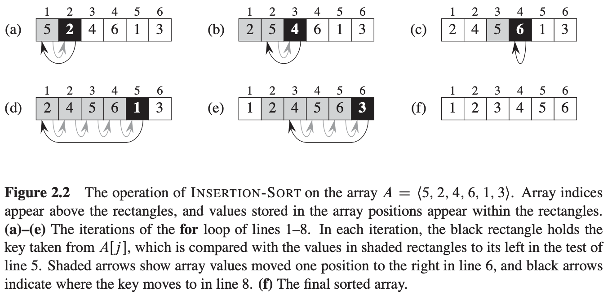
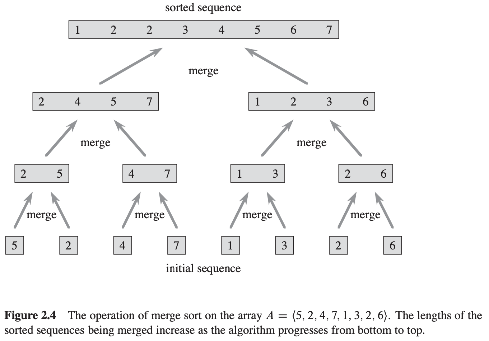

[中文版](chapter2_zh.md) | English

# 2 Getting Started


## 2.1 Insertion sort

Input: S sequence of $n$ numbers $(a_1, a_2, ..., a_n)$.

Output: A permutation (reordering) $(a_1', a_2', ..., a_n')$ of the input sequence such that $a_1' \leq a_2' \leq ... \leq a_n'$.

```c++
INSERTION-SORT(A)
for j = 2 to A.length
    key = A[j]
    // Insert A[j] into the sorted sequence A[1..j-1].
    i = j - 1
    while i > 0 and A[i] > key
        A[i + 1] = A[i]
        i = i - 1
    A[i + 1] = key
```



We use loop invariants to help us understand why an algorithm is correct. We must show three things about a loop invariant:

- Initialization: It is true prior to the first iteration of the loop.
- Maintenance: If it is true before an iteration of the loop, it remains true before the next iteration.
- Termination: When the loop terminates, the invariant gives us a useful property that helps show that the algorithm is correct.


## 2.2 Analyzing algorithms

`Analyzing` an algorithm has come to mean predicting the resources that the algorithm requires.

The `running time` of an algorithm on a particular input is the number of primitive operations or "steps" executed.

**INSERTION-SORT presenting**

To compute $T(n)$, the running time of INSERTION-SORT on an input of $n$ values, we sum the products of the cost and times columns, obtaining:

$T(n) = c_1n + c_2(n - 1) + c_4(n - 1) + C_5\sum_{j=2}^{n}t_j + c_6\sum_{j=2}^{n}(t_j - 1) + c_7\sum_{j=2}^{n}(t_j - 1) + C_8(n - 1)$

- The best case: occurs if the array is already sorted. For each $j=2, 3, ..., n$, we then find that $A[i] \leqslant key$ in line 5 when $i$ has it's initial value of $j - 1$. Thus $t_j = 1$ for $j = 2, 3, ..., n$, and the best-case running time is:
  $$
  \begin{equation}\begin{split} 
  T(n) &= c_1n + c_2(n-1) + c_4(n-1) + c_5(n-1) + c_8(n-1) \\
  &= (c_1 + c_2 + C_4 + c_5 + c_8)n - (c_2 + c_4 + c_5 + c_8)
  \end{split}\end{equation}
  $$
  we can express this running time as $an+b$ for constants $a$ and $b$ that depend on the statement costs $c_i$; it is thus a `linear function` of $n$.

- The worst case: the array is in reverse sorted order. We must compare each element $A[j]$ with each element in the entire sorted subarry $A[1..j-1]$, and so $t_j = j$ for $j=2, 3, ..., n$. Noting that: $\sum_{j=2}^{n}j = \frac{n(n+1)}{2} - 1$ and $\sum_{j=2}^{n}(j-1) = \frac{n(n-1)}{2}$, we find that in the worst case, the running time of INSERTION-SORT is:
  $$
  \begin{equation}\begin{split} 
  T(n) &= c_1n + c_2(n - 1) + c_4(n - 1) + c_5(\frac{n(n+1)}{2} - 1) + c_6(\frac{n(n-1)}{2}) + c_7(\frac{n(n-1)}{2}) + c_8(n-1) \\
  &= (\frac{c_5}{2} + \frac{c_6}{2} + \frac{c_7}{2})n^2 + (c_1 + c_2 + c_4 + \frac{c_5}{2} - \frac{c_6}{2} - \frac{c_7}{2} + c_8)n - (c_2 + c_4 + c_5 + c_8)
  \end{split}\end{equation}
  $$
  We can express this worst-case running time as $an^2 + bn + c$ for constants $a, b$ and $c$ that again depend on the statement costs $c_i$; it is thus a `quadratic function` of $n$.

For the remainder of this book, though, we shall usually concentrate on finding only the `worst-case running time`, that is, the longest running time for any input of size $n$. We give three reasons for this orientation:

- The worst-case running time of an algorithm gives us an upper bound on the running time for any input. Knowing it provides a guarantee that the algorithm will never take any longer.
- For some algorithms, the worst case occurs fairly often.
- The "average case" is often roughly as bad as the worst case.


## 2.3 Designing algorithms

### 2.3.1 The divide-and-conquer approach

`divide-and-conquer` approach: they break the problem into several subproblems that are similar to the original problem but smaller in size, solve the subproblems recursively, and then combine these solutions to create a solution to the original problem.

The divide-and-conquer paradigm involves three steps at each level of the recursion:

1. **Divide** the problem into a number of subproblems that are smaller instances of teh same problem
2. **Conquer** the subproblems by solving them recursively. If the subproblem sizes are small enough, however, just solve teh subproblems in a straightforward manner.
3. **Combine** the solutions to the subproblems into the solution for the original problem.

For example:



*Figure 2.4 The operation of merge sort on the array $A = (5, 2, 4, 7, 1, 3, 2, 6)$. The lenghts of the sorted sequences being merged increase as teh algorithm progresses from bottom to top.*

### 2.3.2 Analyzing divide-and-conquer algorithms

We let $T(n)$ be the running time on a problem of size $n$. If the problem size is small enough, say $n \leq c$ for some constant $c$, the straightforward solution takes constant time, which we write as $\theta(1)$. Suppose that our division of the problem yields $a$ subproblems, each of which is $1/b$ the size of teh original. (For merge sort, both $a$ and $b$ are 2, but we shall see many divide-and-conquer algorithms in which $a \neq b$.) It takes time $T(n/b)$ to solve one subproblem of size $n/b$, and so it takes time $aT(n/b)$ to solve $a$ of them. If we take $D(n)$ time to divide the problem into subproblems and $C(n)$ time to combine the solutions to the subproblems into the solution to the original problem, we get the recurrence:
$$
T(n) =
\begin{cases}
\theta(1) & \text{if n} \leqslant c \\
aT(n/b) + D(n) + C(n) & \text{otherwise}
\end{cases}
$$
Resulting recursion tree, For Example:


