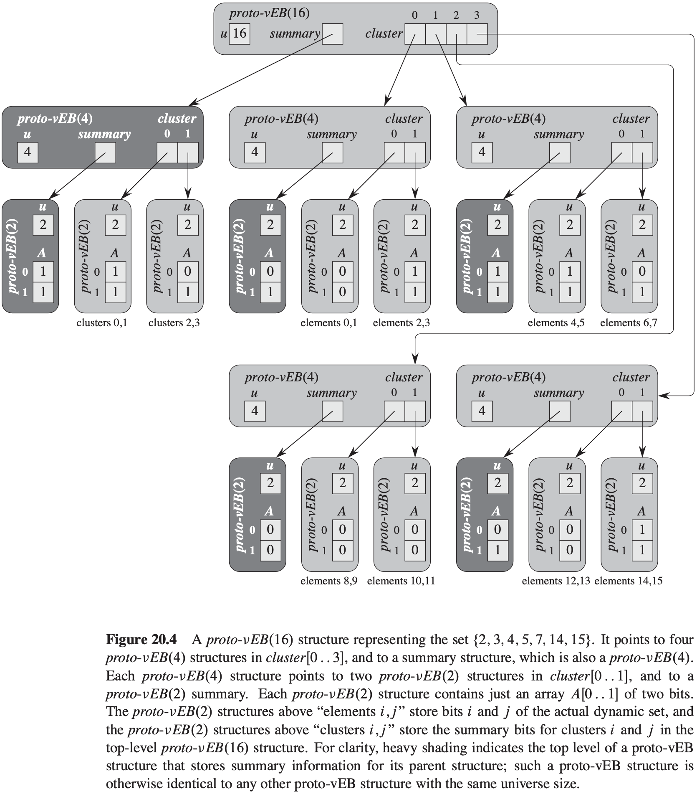
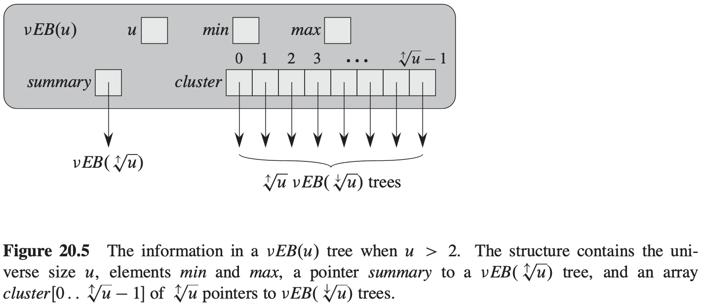

[中文版](chapter20_zh.md) | English

# 20 van Emde Boas Trees

[TOC]

## Preliminary approaches

**Direct addressing**

**Superimposing a binary tree structure**

**Superimposing a tree of constant height**

## A recursive structure

### Proto van Emde Boas structures

For the universe $\{0, 1, 2, ..., u - 1\}$, we define a **proto van Emde Boas structure**, or **proto-vEB structure**, which we denote as $proto-vEB(u)$, recursively as follows. Each $proto-vEB(u)$ structure contains an attribute $u$ giving its universe size. In addition, it contains the following:

- If $u = 2$, then it is the base size, and it contains an array $A[0..1]$ of two bits.
- Otherwise, $u = 2^{2^k}$ for some integer $k \geq 1$, so that $u \geq 4$. In addition to the universe size $u$, the data structure $proto-vEB(u)$ contains the following attributes:
  - a pointer named `summary` to a $proto-vEB(\sqrt{u})$ structure and
  - an array $cluster[0..\sqrt{u} - 1]$ of $\sqrt{u}$ pointers, each to a $proto-vEB(\sqrt{u})$ structure.

### Operations on a proto van Emde Boas structure

**Determining whether a value is in the set**
$$
\begin{align}
& PROTO-vEB-MEMBER(V, x) \\
& if\ V.u == 2 \\
& \qquad return\ V.A[x] \\
& else\ return\ PROTO-vEB-MEMBER(V.cluster[high(x)], low(x))
\end{align}
$$
**Finding the minimum element**
$$
\begin{align}
& PROTO-vEB-MINIMUM(V) \\
& if\ V.u == 2 \\
& \qquad if\ V.A[0] == 1 \\
& \qquad \qquad return\ 0 \\
& \qquad elseif\ V.A[1] == 1 \\
& \qquad \qquad return\ 1 \\
& \qquad else\ return\ NIL \\
& else\ min-cluster = PROTO-vEB-MINIMUM(V.summary) \\
& \qquad if\ min-cluster == NIL \\
& \qquad \qquad return\ NIL \\
& \qquad else\ offset = PROTO-vEB-MINIMUM(V.cluster[min-cluster]) \\
& \qquad \qquad return\ index(min-cluster, offset)
\end{align}
$$
**Finding the successor**
$$
\begin{align}
& PROTO-vEB-SUCCESSOR(V, x) \\
& if\ V.u == 2 \\
& \qquad if\ x == 0\ and\ V.A[1] == 1 \\
& \qquad \qquad return\ 1 \\
& \qquad else\ return\ NIL \\
& else\ offset = PROTO-vEB-SUCCESSOR(V.cluster[high(x)], low(x)) \\
& \qquad if\ offset \neq NIL \\
& \qquad \qquad return\ index(high(x), offset) \\
& \qquad else\ succ-cluster = PROTO-vEB-SUCCESSOR(V.summary, high(x)) \\
& \qquad \qquad if\ succ-cluster == NIL \\
& \qquad \qquad \qquad return\ NIL \\
& \qquad \qquad else\ offset = PROTO-vEB-MINIMUM(V.cluster[succ-cluster]) \\
& \qquad \qquad \qquad return\ index(succ-cluster, offset)
\end{align}
$$
**Inserting an element**
$$
\begin{align}
& PROTO-vEB-INSERT(V, x) \\
& if\ V.u == 2 \\
& \qquad V.A[x] = 1 \\
& else\ PROTO-vEB-INSERT(V.cluster[high(x)], low(x)) \\
& \qquad PROTO-vEB-INSERT(V.summary, high(x))
\end{align}
$$
**Deleting an element**

## The van Emde Boas tree

### van Emde Boas trees

A vEB tree contains two attributes not found in a proto-vEB structure:

- $min$ stores the minimum element in the vEB tree, and
- $max$ stores the maximum element in the vEB tree.

### Operations on a van Emde Boas tree

**Finding the minimum and maximum elements**
$$
\begin{align}
& vEB-TREE-MINIMUM(V) \\
& return\ V.min
\end{align}
$$

$$
\begin{align}
& vEB-TREE-MAXIMUM(V) \\
& return\ V.max
\end{align}
$$

**Determining whether a value is in the set**
$$
\begin{align}
& vEB-TREE-MEMBER(V, x) \\
& if\ x == V.min\ or\ x == V.max \\
& \qquad return\ TRUE \\
& elseif\ V.u == 2 \\
& \qquad return\ FALSE \\
& else\ return\ vEB-TREE-MEMBER(V.cluster[high(x)], low(x))
\end{align}
$$
**Finding the successor and predecessor**
$$
\begin{align}
& vEB-TREE-SUCCESSOR(V, x) \\
& if\ V.u == 2 \\
& \qquad if\ x == 0\ and\ V.max == 1 \\
& \qquad \qquad return\ 1 \\
& \qquad else\ return\ NIL \\
& elseif\ V.min \neq NIL\ and\ x < V.min \\
& \qquad return\ V.min \\
& else\ max-low = vEB-TREE-MAXIMUM(V.cluster[high(x)]) \\
& \qquad if\ max-low \neq NIL\ and\ low(x) < max-low \\
& \qquad \qquad offset = vEB-TREE-SUCCESSOR(V.cluster[high(x)], low(x)) \\
& \qquad \qquad return\ index(high(x), offset) \\
& \qquad else\ succ-cluster = vEB-TREE-SUCCESSOR(V.cluster[high(x)], low(x)) \\
& \qquad \qquad if\ succ-cluster == NIL \\
& \qquad \qquad \qquad return\ NIL \\
& \qquad \qquad else\ offset = vEB-TREE-MINIMUM(V.cluster[succ-cluster]) \\
& \qquad \qquad \qquad return\ index(succ-cluster, offset)
\end{align}
$$

$$
\begin{align}
& vEB-TREE-PREDECESSOR(V, x) \\
& if\ V.u == 2 \\
& \qquad if\ x == 1\ and\ V.min == 0 \\
& \qquad \qquad return\ 0 \\
& \qquad else\ return\ NIL \\
& elseif\ V.max \neq NIL\ and\ x > V.max \\
& \qquad return\ V.max \\
& else\ min-low = vEB-TREE-MINIMUM(V.cluster[high(x)]) \\
& \qquad if\ min-low \neq NIL\ and\ low(x) > min-low \\
& \qquad \qquad offset = vEB-TREE-PREDECESSOR(V.cluster[high(x)], low(x)) \\
& \qquad return\ index(high(x) offset) \\
& else\ pred-cluster = vEB-TREE-PREDECESSOR(V.summary, high(x)) \\
& \qquad if\ pred-cluster == NIL \\
& \qquad \qquad if\ V.min \neq NIL\ and\ x > V.min \\
& \qquad \qquad \qquad return\ V.min \\
& \qquad \qquad else\ return\ NIL \\
& \qquad else\ offset = vEB-TREE-MAXIMUM(V.cluster[pred-cluster]) \\
& \qquad \qquad return\ index(pred-cluster, offset) 
\end{align}
$$

**Inserting an element**
$$
\begin{align}
& vEB-EMPTY-TREE-INSERT(V, x) \\
& V.min = x \\
& V.max = x
\end{align}
$$

$$
\begin{align}
& vEB-TREE-INSERT(V, x) \\
& if\ V.min == NIL \\
& \qquad vEB-EMPTY-TREE-INSERT(V, x) \\
& else\ if\ x < V.min \\
& \qquad exchange\ x\ with\ V.min \\
& \qquad if\ V.u > 2 \\
& \qquad \qquad if\ vEB-TREE-MINIMUM(V.cluster[high(x)]) == NIL \\
& \qquad \qquad \qquad vEB-TREE-INSERT(V.summary, high(x)) \\
& \qquad \qquad \qquad vEB-EMPTY-TREE-INSERT(V.cluster[high(x)], low(x)) \\
& \qquad \qquad else\ vEB-TREE-INSERT(V.cluster[high(x)], low(x)) \\
& \qquad if\ x > V.max \\
& \qquad \qquad V.max = x
\end{align}
$$

**Deleting an element**

TODO
