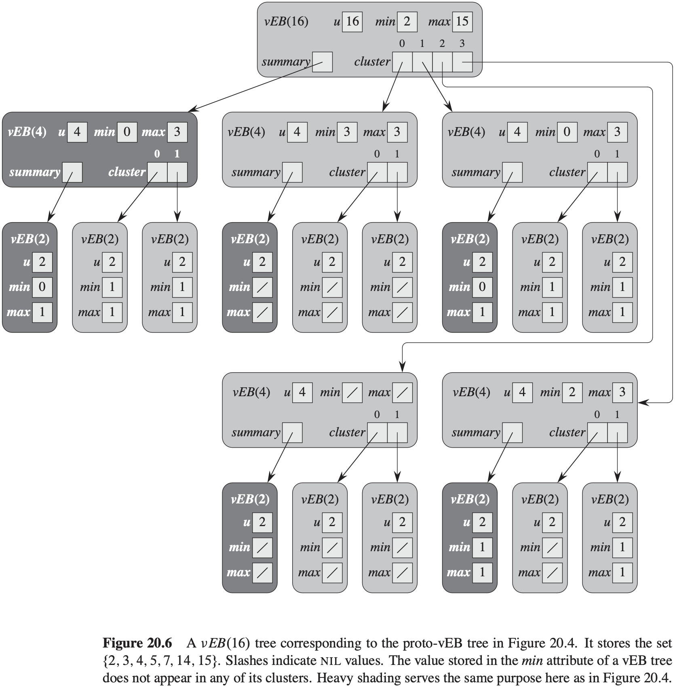

# 第20章 van Emde Boas树

## 20.1 基本方法

**直接寻址**

**叠加的二叉树结构**

**叠加的一棵高度恒定的树**

## 20.2 递归结构

### 20.2.1 原型van Emde Boas结构

对于全域$\{0, 1, 2, ..., u - 1\}$，定义**原型van Emde Boas结构**(proto van Emde Boas structure)或**proto-vEB结构**(proto-vEB structure)，记作$proto-vEB(u)$，可以如下递归定义。每个$proto-vEB(u)$结构都包含一个给定全域大小的属性$u$。另外，它包含以下特征：

- 如果$u = 2$，那么它是基础大小，只包含一个两个位的数组$A[0..1]$。
- 否则，对某个整数$k \geqslant 1, u = 2^{2^k}$，于是有$u \geqslant 4$。除了全域大小$u$之外，$proto-vEB(u)$还有以下属性：
  1. 一个名为summary的指针，指向一个$proto-vEB(\sqrt u)$结构。
  2. 一个数组$cluster[1 .. \sqrt{u} - 1]$，存储$\sqrt{u}$个指针，每个指针都指向一个$proto-vEB(\sqrt{u})$结构。

### 20.2.2 原型van Emde Boas结构上的操作

**判断一个值是否在集合中**
$$
\begin{align}
& PROTO-vEB-MEMBER(V, x) \\
& if\ V.u == 2 \\
& \qquad return\ V.A[x] \\
& else\ return\ PROTO-vEB-MEMBER(V.cluster[high(x)], low(x))
\end{align}
$$
**查找最小元素**
$$
\begin{align}
& PROTO-vEB-MINIMUM(V) \\
& if\ V.u == 2 \\
& \qquad if\ V.A[0] == 1 \\
& \qquad \qquad return\ 0 \\
& \qquad elseif\ V.A[1] == 1 \\
& \qquad \qquad return\ 1 \\
& \qquad else\ return\ NIL \\
& else\ min-cluster = PROTO-vEB-MINIMUM(V.summary) \\
& \qquad if\ min-cluster == NIL \\
& \qquad \qquad return\ NIL \\
& \qquad else\ offset = PROTO-vEB-MINIMUM(V.cluster[min-cluster]) \\
& \qquad \qquad return\ index(min-cluster, offset)
\end{align}
$$
$PROTO-vEB-MINIMUM$的运行时间为$\theta(lg\ u)$。

**查找后继**
$$
\begin{align}
& PROTO-vEB-SUCCESSOR(V, x) \\
& if\ V.u == 2 \\
& \qquad if\ x == 0\ and\ V.A[1] == 1 \\
& \qquad \qquad return\ 1 \\
& \qquad else\ return\ NIL \\
& else\ offset = PROTO-vEB-SUCCESSOR(V.cluster[high(x)], low(x)) \\
& \qquad if\ offset \neq NIL \\
& \qquad \qquad return\ index(high(x), offset) \\
& \qquad else\ succ-cluster = PROTO-vEB-SUCCESSOR(V.summary, high(x)) \\
& \qquad \qquad if\ succ-cluster == NIL \\
& \qquad \qquad \qquad return\ NIL \\
& \qquad \qquad else\ offset = PROTO-vEB-MINIMUM(V.cluster[succ-cluster]) \\
& \qquad \qquad \qquad return\ index(succ-cluster, offset)
\end{align}
$$
**插入元素**
$$
\begin{align}
& PROTO-vEB-INSERT(V, x) \\
& if\ V.u == 2 \\
& \qquad V.A[x] = 1 \\
& else\ PROTO-vEB-INSERT(V.cluster[high(x)], low(x)) \\
& \qquad PROTO-vEB-INSERT(V.summary, high(x))
\end{align}
$$
**删除元素**

## 20.3 van Emde Boas树及其操作

### 20.3.1 van Emde Boas树

不应使用一棵van Emde Boas树用于**仅仅执行少量操作的情况**，因为建立数据结构的时间要超过单个操作节省的时间。

### 20.3.2 van Emde Boas树的操作

**查找最小元素和最大元素**
$$
\begin{align}
& vEB-TREE-MINIMUM(V) \\
& return\ V.min
\end{align}
$$

$$
\begin{align}
& vEB-TREE-MAXIMUM(V) \\
& return\ V.max
\end{align}
$$

**判断一个值是否在集合中**
$$
\begin{align}
& vEB-TREE-MEMBER(V, x) \\
& if\ x == V.min\ or\ x == V.max \\
& \qquad return\ TRUE \\
& elseif\ V.u == 2 \\
& \qquad return\ FALSE \\
& else\ return\ vEB-TREE-MEMBER(V.cluster[high(x)], low(x))
\end{align}
$$
**查找后继和前驱**
$$
\begin{align}
& vEB-TREE-SUCCESSOR(V, x) \\
& if\ V.u == 2 \\
& \qquad if\ x == 0\ and\ V.max == 1 \\
& \qquad \qquad return\ 1 \\
& \qquad else\ return\ NIL \\
& elseif\ V.min \neq NIL\ and\ x < V.min \\
& \qquad return\ V.min \\
& else\ max-low = vEB-TREE-MAXIMUM(V.cluster[high(x)]) \\
& \qquad if\ max-low \neq NIL\ and\ low(x) < max-low \\
& \qquad \qquad offset = vEB-TREE-SUCCESSOR(V.cluster[high(x)], low(x)) \\
& \qquad \qquad return\ index(high(x), offset) \\
& \qquad else\ succ-cluster = vEB-TREE-SUCCESSOR(V.cluster[high(x)], low(x)) \\
& \qquad \qquad if\ succ-cluster == NIL \\
& \qquad \qquad \qquad return\ NIL \\
& \qquad \qquad else\ offset = vEB-TREE-MINIMUM(V.cluster[succ-cluster]) \\
& \qquad \qquad \qquad return\ index(succ-cluster, offset)
\end{align}
$$

$$
\begin{align}
& vEB-TREE-PREDECESSOR(V, x) \\
& if\ V.u == 2 \\
& \qquad if\ x == 1\ and\ V.min == 0 \\
& \qquad \qquad return\ 0 \\
& \qquad else\ return\ NIL \\
& elseif\ V.max \neq NIL\ and\ x > V.max \\
& \qquad return\ V.max \\
& else\ min-low = vEB-TREE-MINIMUM(V.cluster[high(x)]) \\
& \qquad if\ min-low \neq NIL\ and\ low(x) > min-low \\
& \qquad \qquad offset = vEB-TREE-PREDECESSOR(V.cluster[high(x)], low(x)) \\
& \qquad return\ index(high(x) offset) \\
& else\ pred-cluster = vEB-TREE-PREDECESSOR(V.summary, high(x)) \\
& \qquad if\ pred-cluster == NIL \\
& \qquad \qquad if\ V.min \neq NIL\ and\ x > V.min \\
& \qquad \qquad \qquad return\ V.min \\
& \qquad \qquad else\ return\ NIL \\
& \qquad else\ offset = vEB-TREE-MAXIMUM(V.cluster[pred-cluster]) \\
& \qquad \qquad return\ index(pred-cluster, offset) 
\end{align}
$$

**插入一个元素**
$$
\begin{align}
& vEB-EMPTY-TREE-INSERT(V, x) \\
& V.min = x \\
& V.max = x
\end{align}
$$

$$
\begin{align}
& vEB-TREE-INSERT(V, x) \\
& if\ V.min == NIL \\
& \qquad vEB-EMPTY-TREE-INSERT(V, x) \\
& else\ if\ x < V.min \\
& \qquad exchange\ x\ with\ V.min \\
& \qquad if\ V.u > 2 \\
& \qquad \qquad if\ vEB-TREE-MINIMUM(V.cluster[high(x)]) == NIL \\
& \qquad \qquad \qquad vEB-TREE-INSERT(V.summary, high(x)) \\
& \qquad \qquad \qquad vEB-EMPTY-TREE-INSERT(V.cluster[high(x)], low(x)) \\
& \qquad \qquad else\ vEB-TREE-INSERT(V.cluster[high(x)], low(x)) \\
& \qquad if\ x > V.max \\
& \qquad \qquad V.max = x
\end{align}
$$

