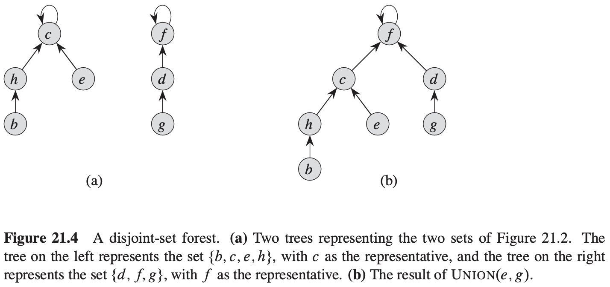

[中文版](chapter21_zh.md) | English

# 21 Data Structures for Disjoint Sets

[TOC]

## Disjoint-set operations

A **disjoint-set data structure** maintains a collection $\delta = \{S_1, S_2, ..., S_k\}$ of disjoint dynamic sets.

**An application of disjoint-set data structures**

$$
\begin{align}
& CONNECTED-COMPONENTS(G) \\
& for\ each\ vertex\ v \in G.V \\
& \qquad MAKE-SET(v) \\
& for\ each\ edge(u, v) \in G.E \\
& \qquad if\ FIND-SET(u) \neq FIND-SET(v) \\
& \qquad \qquad UNION(u, v) \\
\end{align}
$$

$$
\begin{align}
& SAME-COMPONENT(u, v) \\
& if\ FIND-SET(u) == FIND-SET(v) \\
& \qquad return\ TRUE \\
& else\ return\ FALSE
\end{align}
$$

## Linked-list representation of disjoint sets

**A simple implementation of union**

The amortized time of an operation is $\theta(n)$。

**A weighted-union heuristic**

**Theorem 21.1** Using the linked-list representation of disjoint sets and the weighted-union heuristic, a sequence of $m$ $MAKE-SET$, and $FIND-SET$ operations, $n$ of which are $MAKE-SET$ operations, takes $O(m + nlg\ n)$ time.

## Disjoint-set forests

In a **disjoint-set forest**, each member points only to its parent. The root of each tree contains the representative and is its own parent.

**Heuristics to improve the running time**

two heuristics:

- union by rank
- path compression

Example:
$$
\begin{align}
&MAKE-SET(x) \\
& x.p = x \\
& x.rank = 0 \\
\end{align}
$$

$$
\begin{align}
&UNION(x, y) \\
&LINK(FIND-SET(x), FIND-SET(y))
\end{align}
$$

$$
\begin{align}
&LINK(x, y) \\
&if\ x.rank > y.rank \\
& \qquad y.p = x \\
& else\ x.p = y \\
& \qquad if\ x.rank == y.rank \\
& \qquad \qquad y.rank = y.rank + 1 
\end{align}
$$

$$
\begin{align}
& FIND-SET(x) \\
& if\ x \neq x.p \\
& \qquad x.p = FIND-SET(x.p) \\
& return\ x.p 
\end{align}
$$

**Effect of the heuristics on the running time**

The path-compression heuristic alone gives a worst-case running time of $\theta(n + f \cdot (1 + log_{2+f/n}n))$.

When we use both union by rank and path compression, the worst-case running time is $O(m\alpha(n))$.

## Analysis of union by rank with path compression

For integers $k \geq 0$ and $j \geq 1$, we define the function $A_k(j)$ as:
$$
A_k(j) = 
\begin{cases}
j + 1, &if\ k = 0\\
A_{k - 1}^{(j + 1)}, &if\ k \geq 1
\end{cases}
$$
**Lemma 21.2** For any integer $j \geq 1$, we have $A_1(j) = 2j + 1$.

**Lemma 21.3** For any integer $j \geq 1$, we have $A_2(j) = 2^{j + 1}(j + 1) - 1$.

**Lemma 21.4** For all nodes $x$, we have $x.rank \leq x.p.rank$, with strict inequality if $x \neq x.p$. The value of $x.rank$ is initially 0 and increases through time until $x \neq x.p$; from then on, $x.rank$ does not change. The value of $x.p.rank$ monotonically increases over time.

**Corollary 21.5** As we follow the simple path from any node toward a root, the node ranks strictly increase.

**Lemma 21.6** Every node has rank at most $n - 1$.

**Lemma 21.7** Suppose we convert a sequence $S'$ of $m'$ $MAKE-SET$, $UNION$, and $FIND-SET$ operations into a sequence $S$ of $m$ $MAKE-SET$, $LINK$, and $FIND-SET$ operations by turning each $UNION$ into two $FIND-SET$ operations followed by a $LINK$. Then, if sequence $S$ runs in $O(m\ \alpha(n))$ time, sequence $S'$ runs in $O(m'\alpha(n))$ time.

**Lemma 21.8** For every node $x$, and for all operation counts $q$, we have $0 \leq \phi_{q}(x) \leq \alpha(n) \cdot x.rank$.

**Corollary 21.9** If node $x$ is not a root and $x.rank > 0$, then $\phi_q(x) < \alpha(n) \cdot x.rank$.

**Lemma 21.10** Let $x$ be a node that is not a root, and suppose that the $q$th operation is either a $LINK$ or $FIND-SET$. Then after the $q$th operation, $\phi_q(x) \leq \phi_{q - 1}(x)$. Moreover, if $x.rank \geq 1$ and either $level(x)$ or $iter(x)$ changes due to the $q$th operation, then $\phi_q(x) \leq \phi_{q - 1}(x) - 1$. That is, $x$'s potential cannot increase, and if it has positive rank and either $level(x)$ or $iter(x)$ changes, then $x$'s potential drops by at least 1.

**Lemma 21.11** The amortized cost of each $MAKE-SET$ operation is $O(1)$.

**Lemma 21.12** The amortized cost of each $LINK$ operation is $O(\alpha(n))$.

**Lemma 21.13** The amortized cost of each $FIND-SET$ operation is $O(\alpha(n))$.

**Theorem 21.14** A sequence of $m$ $MAKE-SET$, $UNION$, and $FIND-SET$ operations, $n$ of which are $MAKE-SET$ operations, can be performed on a disjoint-set forest with union by rank and path compression in worst-case time $O(m \alpha(n))$.

