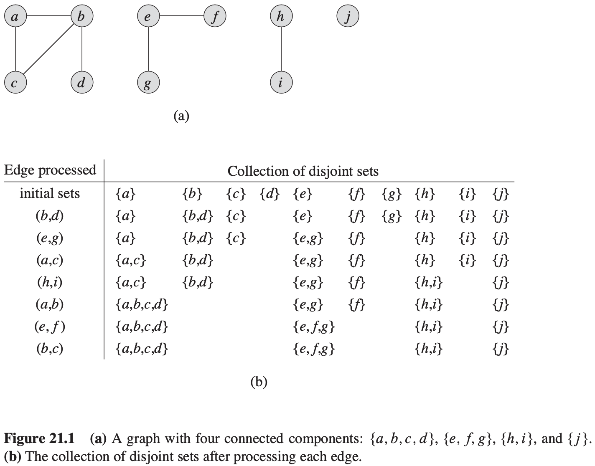
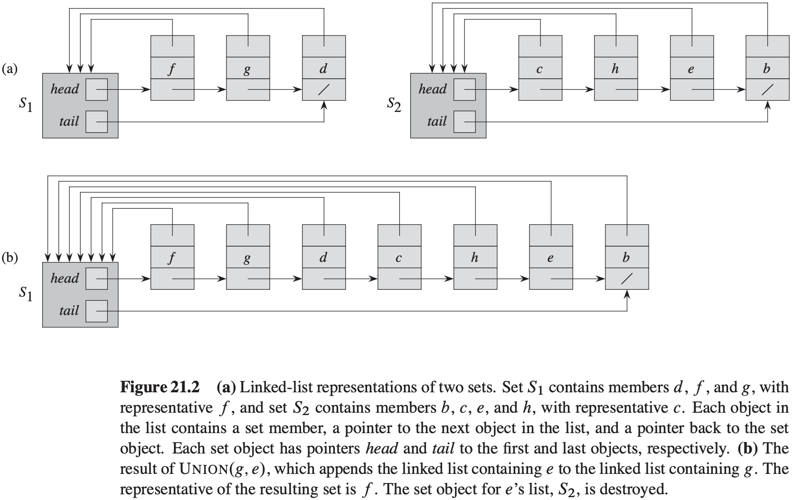
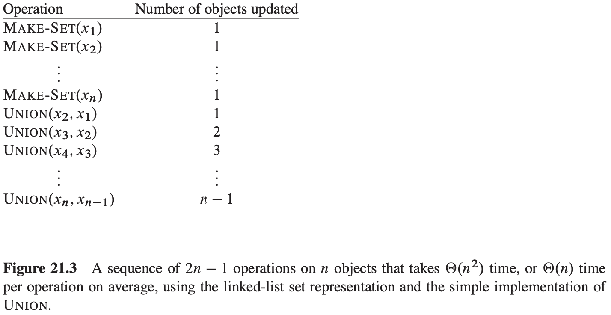

# 第21章 用于不相交集合的数据结构

## 21.1 不相交集合的操作

**不相交集合数据结构（disjoint-set data structure）**维护了一个不相交动态集的集合$S = \{S_1, S_2, ..., S_k\}$。

**不相交集合数据结构的一个应用**

$$
\begin{align}
& CONNECTED-COMPONENTS(G) \\
& for\ each\ vertex\ v \in G.V \\
& \qquad MAKE-SET(v) \\
& for\ each\ edge(u, v) \in G.E \\
& \qquad if\ FIND-SET(u) \neq FIND-SET(v) \\
& \qquad \qquad UNION(u, v) \\
\end{align}
$$

$$
\begin{align}
& SAME-COMPONENT(u, v) \\
& if\ FIND-SET(u) == FIND-SET(v) \\
& \qquad return\ TRUE \\
& else\ return\ FALSE
\end{align}
$$

## 21.2 不相交集合的链表表示

**合并的一个简单实现**

一个操作的摊还时间为$\theta(n)$。

**一种加权合并的启发式策略**

**定理 21.1** 使用不相交集合的链表表示和加权合并启发式策略，一个具有$m$个$MAKE-SET$, $UNION$和$FIND-SET$操作的序列（其中有$n$个是$MAKE-SET$操作）需要的时间为$O(m + nlgn)$。

## 21.3 不相交集合森林

**不相交集合森林（disjoint-set forest）**：每个成员仅指向它的父结点，每棵树的根包含集合的代表，并且是其自己的父节点。

**改进运行时间的启发式策略**

启发式策略：

- 按秩合并（union by rank）
- 路径压缩（path compression）

**实现不相交集合森林的伪代码**
$$
\begin{align}
&MAKE-SET(x) \\
& x.p = x \\
& x.rank = 0 \\
\end{align}
$$

$$
\begin{align}
&UNION(x, y) \\
&LINK(FIND-SET(x), FIND-SET(y))
\end{align}
$$

$$
\begin{align}
&LINK(x, y) \\
&if\ x.rank > y.rank \\
& \qquad y.p = x \\
& else\ x.p = y \\
& \qquad if\ x.rank == y.rank \\
& \qquad \qquad y.rank = y.rank + 1 
\end{align}
$$

$$
\begin{align}
& FIND-SET(x) \\
& if\ x \neq x.p \\
& \qquad x.p = FIND-SET(x.p) \\
& return\ x.p 
\end{align}
$$

**启发式策略对运行时间的影响**

单独使用路径压缩启发式策略给出的最坏情况运行时间为$\theta(n + f \cdot (1 + log_{2+f/n}n))$。

同时使用按秩合并于路径压缩时，最坏情况的运行时间为$O(m\alpha(n))$。

## 21.4 带路径压缩的按秩合并的分析

对于整数$k \geqslant 0$与$j \geqslant 1$，定义函数$A_k (j)$为：
$$
A_k(j) = 
\begin{cases}
j + 1, &如果k = 0\\
A_{k - 1}^{(j + 1)}, &如果k \geqslant 1
\end{cases}
$$
**引理 21.2** 对于任意整数$j \geqslant 1$，有$A_1(j) = 2j + 1$。

**引理 21.3** 对于任意整数$j \geqslant 1$，有$A_2(j) = 2^{j + 1}(j + 1) - 1$。

**引理 21.4** 对于所有的结点$x$，有$x.rank \leqslant x.p.rank$，如果$x \neq x.p$，则此式是严格不等式。$x.rank$的初始值为$0$，并且随着时间而增加，直到$x \neq x.p$；从此以后，$x.rank$的值就不再发生变化。$x.p.rank$的值随时间单调递增。

**推论 21.5** 从任何一个结点指向根的简单路径上，节点的秩是严格递增的。

**引理 21.6** 每个节点的秩最大为$n - 1$。

**引理 21.7** 假设通过将每个$UNION$转换成两个$FIND-SET$操作，后再接一个$LINK$操作，我们可以把$m'$个$MAKE-SET, UNION和FIND-SET$操作的序列$S'$转换成$m$个$MAKE-SET, LINK和FIND-SET$操作的序列$S$。那么，如果操作序列$S$的运行时间为$O(m\alpha(n))$，则序列$S'$的运行时间为$O(m'\alpha(n))$。

**引理 21.8** 对于每个结点$x$和所有操作的计数$q$，我们有$0 \leqslant \phi_{q}(x) \leqslant \alpha(n) \cdot x.rank$。

**推论 21.9** 如果结点$x$不是一个根结点，并且$x.rank > 0$，则$\phi_q(x) < \alpha(n) \cdot x.rank$。

**引理 21.10** 设$x$是一个非根结点，并且假设第$q$个操作是$LINK$或$FIND-SET$。那么再第$q$次操作之后，$\phi_q(x) \leqslant \phi_{q - 1}(x)$。此外，如果$x.rank \geqslant 1$，并且$level(x)$或$iter(x)$是由于第$q$次操作而发生了改变，则$x$的势至少下降$1$。

**引理 21.11** 每个$MAKE-SET$操作的摊还代价为$O(1)$。

**引理 21.12** 每个$LINK$操作的摊还代价为$O(\alpha(n))$。

**引理 21.13** 每个$FIND-SET$操作的摊还代价为$O(\alpha(n))$。

**定理 21.14** 一组$m$个$MAKE-SET, UNION和FIND-SET$操作的序列，其中$n$个是$MAKE-SET$操作，它能在一个不相交集合森林上使用按秩合并于路径压缩在最坏情况时间$O(m \alpha(n))$内处理完。

