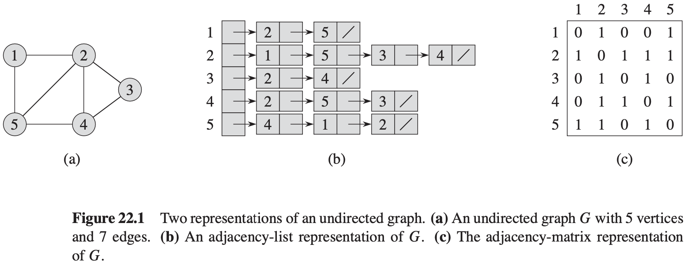
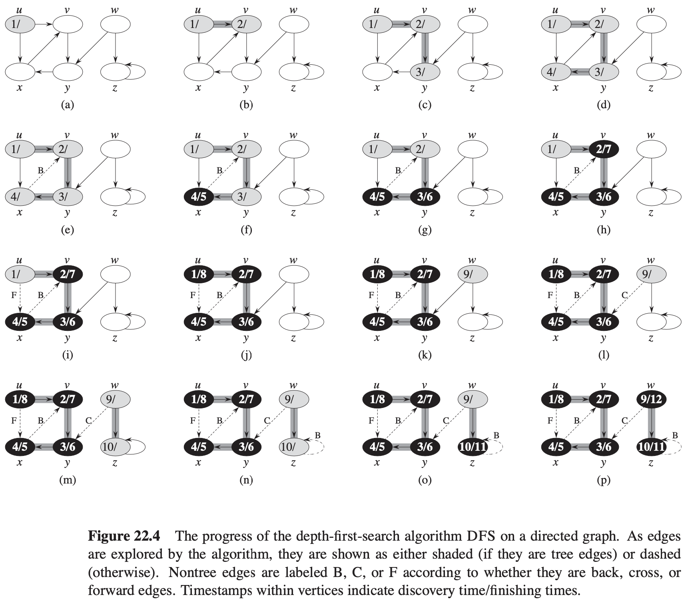
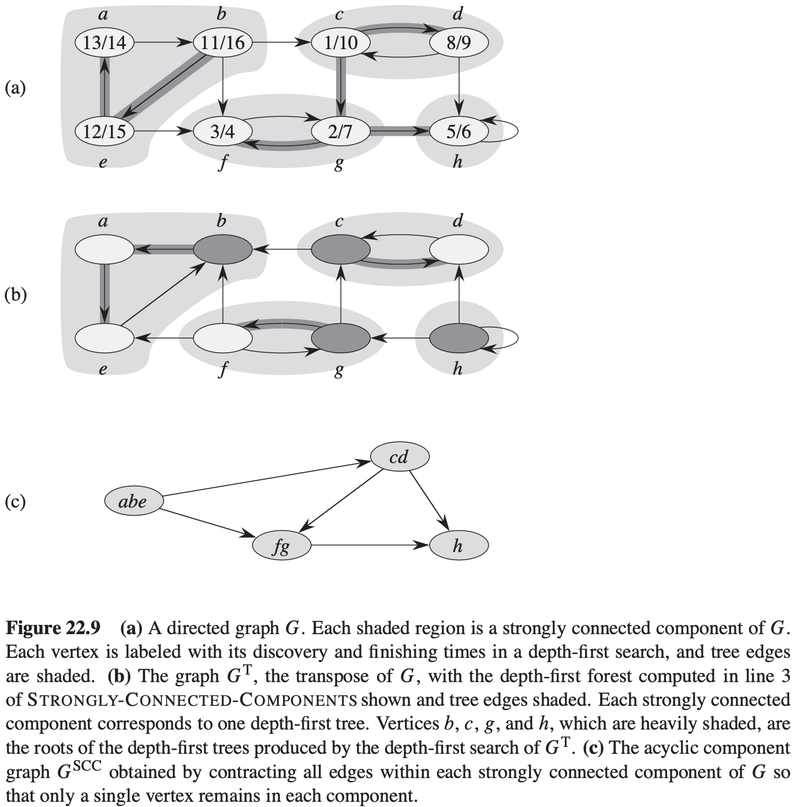

[中文版](chapter22_zh.md) | English

# 22 Elementary Graph Algorithms

[TOC]

## Representations of graphs

We can choose between two standard ways to represent a graph $G= (V, E)$:

1. Because the adjacency-list representation provides a compact way to represent **sparse** graphs--those for which $|E|$ is much less than $|V|^{2}$--it is usually the method of choice.
2. When the graph is **dense**--$|E|$ is close to $|V|^{2}$--or when we need to be able to tell quickly if there is an edge connecting two given vertices.

## Bradth-first search

Example. BFS(G, s):
$$
\begin{align}
& BFS(G, s) \\
& for\ each\ vertex\ u \in G.V - \{s\} \\
& \qquad u.color = WHITE \\
& \qquad u.d = \infty \\
& \qquad u.\pi = NIL \\
& s.color = GRAY \\
& s.d = 0 \\
& s.\pi = NIL \\
& Q = \phi \\
& ENQUEUE(Q, s) \\
& while\ Q \neq \phi \\
& u = DEQUEUE(Q) \\
& for\ each\ u \in G.Adj[u] \\
& \qquad if\ u.color == WHITE \\
& \qquad \qquad u.color = GRAY \\
& \qquad \qquad u.d = u.d + 1 \\
& \qquad \qquad u.\pi = u \\
& \qquad \qquad ENQUEUE(Q, u) \\
& u.color = BLACK
\end{align}
$$

**Analysis**

The breadth-first search runs in time linear in the size of the adjacency-list representation of $G$.

**Shortest paths**

**Lemma 22.1** Let $G = (V, E)$ be a directed or undirected graph, and let $s \in V$ be an arbitrary vertex. Then, for any edge $(u, v) \in E$, $\delta(s, v) \leq \delta(s, u) + 1 $

**Lemma 22.2** Let $G=(V, E)$ be a directed or undirected graph, and suppose that BFS is run on $G$ from a given source vertex $s \in V$. Then upon termination, for each vertex $v \in V$, the value $v.d$ computed by BFS satisfies $u.d \geq \delta(s, u)$.

**Lemma 22.3** Suppose that during the execution of BFS on a graph $G = (V, E)$, the queue $Q$ contains the vertices $<v_1, v_2, ..., v_r>$, where $v_1$ is the head of $Q$ and $v_r$ is the tail. Then, $v_r.d \leq v_1.d + 1$ and $v_i.d \leq v_{i + 1}.d$ for $i = 1, 2, ..., r - 1$.

**Corollary 22.4** Suppose that vertices $v_i$ and $v_j$ are enqueued during the execution of BFS, and that $v_i$ is enqueued before $v_j$. Then $v_i.d \leq v_j.d$ at the time that $v_j$ is enqueued.

**Theorem 22.5 (Correctness of breadth-first search)** Let $G = (V, E)$ be a directed or undirected graph, and suppose that BFS is run on $G$ from a given source vertex $s \in V$. Then, during its execution, BFS discovers every vertex $v \in V$ that is reachable from the source $s$, and upon termination, $v.d = \delta(s, v)$ for all $v \in V$. Moreover, for any vertex $v \neq s$ that is reachable from $s$, one of the shortest paths from $s$ to $v$ is a shortest path from $s$ to $v.\pi$ followed by the edge$(v.\pi, v)$.

**Breadth-first trees**

**Lemma 22.6** When applied to a directed or undirected graph $G = (V, E)$, procedure BFS constructs $\pi$ so that the predecessor subgraph $G_{\pi} = (V_{\pi}, E_{\pi})$ is a breadth-first tree.

## Depth-first search

Example:
$$
\begin{align}
& PRINT-PATH(G, s, v) \\
& if\ v == s \\
& \qquad print\ s \\
& elseif\ v.\pi == NIL \\
& \qquad print\ "no\ path\ from"\ s\ "exists" \\
& else\ PRINT-PATH(G, s, v.\pi) \\
& \qquad print\ v 
\end{align}
$$

$$
\begin{align}
& EFS(G) \\
& for\ each\ vertex\ u\ \in G.V \\
& \qquad u.color = WHITE \\
& \qquad u.\pi = NIL \\
& time = 0 \\
& for\ each\ vertex\ u \in G.V \\
& \qquad if\ u.color == WHITE \\
& \qquad \qquad DFS-VISIT(G, u)
\end{align}
$$

$$
\begin{align}
& DFS-VISIT(G, u) \\
& time = time + 1 \\
& u.d = time \\
& u.color = GRAY \\
& for\ each\ v \in G:Adj[u] \\
& \qquad if\ v.color == WHITE \\
& \qquad \qquad v.\pi = u \\
& \qquad \qquad DFS-VISIT(G, v) \\
& u.color = BLACK \\
& time = time + 1 \\
& u.f = time
\end{align}
$$

**Properties of depth-first search**

**Theorem 22.7 (Parenthesis theorem)** In any depth-first search of a (directed or undirected) graph $G = (V, E)$, for any two vertices $u$ and $v$, exactly one of the following three conditions holds:

- the intervals $[u.d, u.f]$ and $[v.d, v.f]$ are entirely disjoint, and neither $u$ nor $v$ is a descendant of the other in the depth-first forest,
- the interval $[u.d, u.f]$ is contained entirely within the interval $[v.d, v.f]$, and $u$ is a descendant of $v$ in a depth-first tree, or
- the interval $[v.d, v.f]$ is contained entirely within the interval $[u.d, u.f]$, and $v$ is a descendant of $u$ in a depth-first tree.

**Corollary 22.8 (Nesting of descendants' intervals)** Vertex $v$ is a proper descendant of vertex $u$ in the depth-first forest for a (directed or undirected) graph $G$ if and only if $u.d < v.d < v.f < u.f$.

**Theorem 22.9 (White-path theorem)** In a depth-first forest of a (directed or undirected) graph $G = (V, E)$, vertex $v$ is a descendant of vertex $u$ if and only if at the time $u.d$ that the search discovers $u$, there is a path from $u$ to $v$ consisting entirely of white vertices.

**Classification of edges**

We can define four edge types in terms of the depth-first forest $G_{\pi}$ produced by a depth-first search on $G$:

1. **Tree edges** are edges in the depth-first forest $G_{\pi}$. Edge$(u, v)$ is a tree edge if $v$ was first discovered by exploring edge$(u, v)$.
2. **Back edges** are those edges$(u, v)$ connecting a vertex $u$ to an ancestor $v$ in a depth-first tree. We consider self-loops, which may occur in directed graphs, to be back edges.
3. **Forward edges** are those nontree edges$(u, v)$ connecting a vertex $u$ to a descendant $v$ in a depth-first tree.
4. **Cross edges** are all other edges. They can go between vertices in the same depth-first tree, as long as one vertex is not an ancestor of the other, or they can go between vertices in different depth-first trees.

**Theorem 22.10** In a depth-first search of an undirected graph $G$, every edge of $G$ is either a tree edge or a back edge.

## Topological sort

**Lemma 22.11** A directed graph $G$ is acyclic if and only if a depth-first search of $G$ yields no back edges.

**Theorem 22.12** TOPOLOGICAL-SORT produces a topological sort of the directed acyclic graph provided as its input.

## Strongly connected components

**Lemma 22.13** Let $C$ and $C'$ be distinct strongly connected components in directed graph $G = (V, E)$, let $u, v \in C$, let $u', v' \in C'$, and suppose that $G$ contains a path $u → u'$. Then $G$ cannot also contain a path $v' → v$.

**Lemma 22.14** Let $C$ and $C'$ be distinct strongly connected components in directed graph $G = (V, E)$. Suppose that there is an edge$(u, v) \in E$, where $u \in C$ and $v \in C'$. Then $f(C) > f(C')$.

**Corollary 22.15** Let $C$ and $C'$ be distinct strongly connected components in directed graph $G = (V, E)$. Suppose that there is an edge$(u, v) \in E^T$, where $u \in C$ and $v \in C'$. Then $f(C) < f(C')$.

**Theorem 22.16** The STRONGLY-CONNECTED-COMPONENTS procedure correctly computes the strongly connected components of the directed graph $G$ provided as its input.

