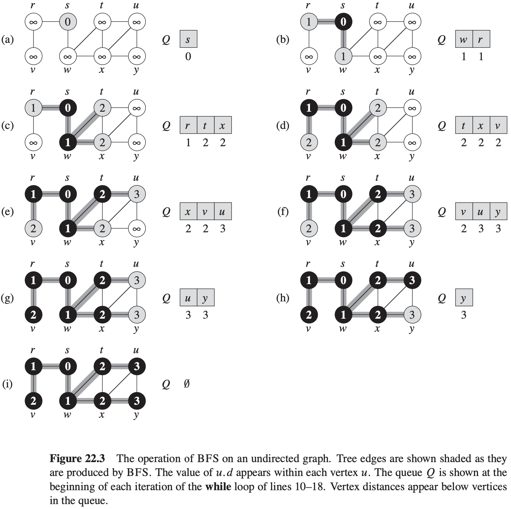
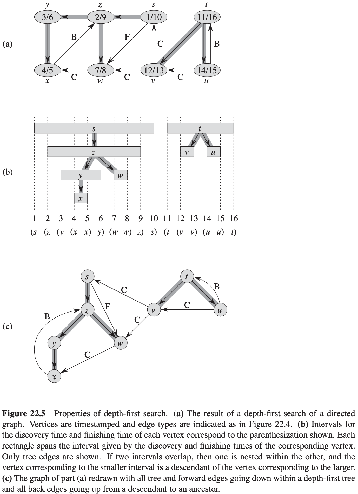

# 第22章 基本的图算法

## 22.1 图的表示

对于图$G= (V, E)$，有两种标准表示方法：

1. 将图作为邻接链表的组合（主要用于表示**稀疏图（边的条数$|E|$远远小于$|V|^2$）**）；
2. 将图作为邻接矩阵来看待（主要用于表示**稠密图（$|E|$接近$|V|^2$）**）。

## 22.2 广度优先搜索

$$
\begin{align}
& BFS(G, s) \\
& for\ each\ vertex\ u \in G.V - \{s\} \\
& \qquad u.color = WHITE \\
& \qquad u.d = \infty \\
& \qquad u.\pi = NIL \\
& s.color = GRAY \\
& s.d = 0 \\
& s.\pi = NIL \\
& Q = \phi \\
& ENQUEUE(Q, s) \\
& while\ Q \neq \phi \\
& u = DEQUEUE(Q) \\
& for\ each\ u \in G.Adj[u] \\
& \qquad if\ u.color == WHITE \\
& \qquad \qquad u.color = GRAY \\
& \qquad \qquad u.d = u.d + 1 \\
& \qquad \qquad u.\pi = u \\
& \qquad \qquad ENQUEUE(Q, u) \\
& u.color = BLACK
\end{align}
$$

**分析**

广度优先搜索的运行时间是图$G$的邻接链表大小的一个线性函数。

**最短路径**

**引理 22.1** 给定$G = (V, E)$，$G$为一个有向图或无向图，设$s \in V$为任意结点，则对于任意边$(u, v) \in E, \delta(s, v) \leqslant \delta(s, u) + 1 $

**引理 22.2** 设$G=(V, E)$为一个有向图或无向图，假定BFS以给定结点$s \in V$作为源结点在图$G$上运行。那么在BFS终结时，对于每个结点$v \in V$，BFS所计算出的$u.d$满足$u.d \geqslant \delta(s, u)$。

**引理 22.3** 假定BFS在图$G = (V, E)$上运行的过程中，队列$Q$包含的结点为$<v_1, v_2, ..., v_r>$，这里$v_1$是队列$Q$的头，$v_r$是队列$Q$的尾。那么$u_r \cdot d \leqslant v_1 \cdot d + 1$，并且对于$i = 1, 2, ..., r - 1$，$v_i \cdot d \leqslant u_{i + 1} \cdot d$。

**推论 22.4** 假定在执行BFS时，结点$v_i$和结点$v_j$都加入到队列$Q$里，并且$v_i$在$v_j$前面入队，则在$v_j$入队时，我们有$v_i \cdot d \leqslant v_j \cdot d$。

**定理 22.5（广度优先搜索的正确性）** 设$G = (V, E)$为一个有向图或无向图，又假设BFS以$s$为源结点在图$G$上运行。那么在算法执行过程中，BFS将发现从源结点$s$可以到达的所有结点$v \in V$，并在算法终止时，对于所有的$v \in V, v \cdot d = \delta(s, v)$。而且，对于任意可以从$s$到达的结点$v \neq s$，从源结点$s$到结点$v$的其中一条最短路径为从结点$s$到结点$v.\pi$的最短路径再加上边$(v.\pi, v)$。

**引理 22.6** 当运行在一个有向或无向图$G = (V, E)$上时，BFS过程所建造出来的$\pi$属性使得前驱子图$G_{\pi} = (V_{\pi}, E_{\pi})$成为一颗广度优先树。
$$
\begin{align}
& PRINT-PATH(G, s, v) \\
& if\ v == s \\
& \qquad print\ s \\
& elseif\ v.\pi == NIL \\
& \qquad print\ "no\ path\ from"\ s\ "exists" \\
& else\ PRINT-PATH(G, s, v.\pi) \\
& \qquad print\ v 
\end{align}
$$

## 22.3 深度优先搜索

$$
\begin{align}
& EFS(G) \\
& for\ each\ vertex\ u\ \in G.V \\
& \qquad u.color = WHITE \\
& \qquad u.\pi = NIL \\
& time = 0 \\
& for\ each\ vertex\ u \in G.V \\
& \qquad if\ u.color == WHITE \\
& \qquad \qquad DFS-VISIT(G, u)
\end{align}
$$

$$
\begin{align}
& DFS-VISIT(G, u) \\
& time = time + 1 \\
& u.d = time \\
& u.color = GRAY \\
& for\ each\ v \in G:Adj[u] \\
& \qquad if\ v.color == WHITE \\
& \qquad \qquad v.\pi = u \\
& \qquad \qquad DFS-VISIT(G, v) \\
& u.color = BLACK \\
& time = time + 1 \\
& u.f = time
\end{align}
$$

**深度优先搜索的性质**

**定理 22.7（括号化定理）** 在对有向或无向图$G = (V, E)$进行的任意深度优先搜索中，对于任意两个结点$u$和$v$来说，下面三种情况只有一种成立：

- 区间$[u.d, u.f]$和区间$[v.d, v.f]$完全分离，在深度优先森林中，结点$u$不是结点$v$的后代，结点$v$也不是结点$u$的后代。
- 区间$[u.d, u.f]$完全包含在区间$[v.d, v.f]$内，在深度优先树中，结点$u$是结点$v$的后代。
- 区间$[v.d, v.f]$完全包含在区间$[u.d, u.f]$内，在深度优先树中，结点$v$是结点$u$的后代。

**推论 22.8（后代区间的嵌套）** 在有向或无向图$G$的深度优先森林中，结点$v$是结点$u$的真后代当且仅当$u.d < v.d < v.f < u.f$成立。

**定理 22.9（白色路径定理）** 在有向或无向图$G = (V, E)$的深度优先森林中，结点$v$是结点$u$的后代当且仅当在发现结点$u$的时间$u.d$，存在一条从结点$u$到结点$v$的全部由白色结点所构成的路径。

**边的分类**

对于在图$G$上运行深度优先搜索算法所生成的深度优先森林$G_{\pi}$，我们可以定义4种边的类型：

1. 树边：为深度优先森林$G_{\pi}$中的边。如果结点$v$是因算法对边$(u, v)$的探索而首先被发现，则$(u, v)$是一条树边。
2. 后向边：后向边$(u, v)$是将结点$u$连接到其在深度优先树中（一个）祖先结点$v$的边。由于有向图中可以有自循环，自循环也被认为是后向边。
3. 前向边：是将结点$u$连接到其在深度优先树中一个后代结点$v$的边$(u, v)$。
4. 横向边：指其他所有的边。这些边可以连接到同一棵深度优先树中的结点，只要其中一个结点不是另外一个结点的祖先，也可以连接不同深度优先树中的两个结点。

**定理 22.10** 在对无向图$G$进行深度优先搜索时，每条边要么是树边，要么是后向边。

## 22.4 拓扑排序

**引理 22.11** 一个有向图$G = (V, E)$是无环的当且仅当对其进行的深度优先搜索不产生后向边。

**定理 22.12** 拓扑排序算法TOPOLOGICAL-SORT生成的是有向无环图的拓扑排序。

## 22.5 强连通分量

**引理 22.13** 设$C$和$C'$为有向图$G = (V, E)$的两个不同的强连通分量，设结点$u, v \in C$，结点$u', v' \in C'$，假定图$G$包含一条从结点$u$到结点$u'$的路径$u → u'$。那么图$G$不可能包含一条从结点$v'$到结点$v$的路径$v' -> v$。

**引理 22.14** 设$C$和$C'$为有向图$G = (V, E)$的两个不同的强连通分量。加入存在一条边$(u, v) \in E$，这里$u \in C，v \in C'$，则$f(C) > f(C')$。

**推论 22.15** 设$C$和$C'$为有向图$G = (V, E)$的两个不同的强连通分量，假如存在一条边$(u, v) \in E^T$，这里$u \in C, v \in C'$，则$f(C) < f(C')$。

**定理 22.16** 算法STRONGLY-CONNECTED-COMPONENTS能够正确计算出有向图$G$的强连通分量。

