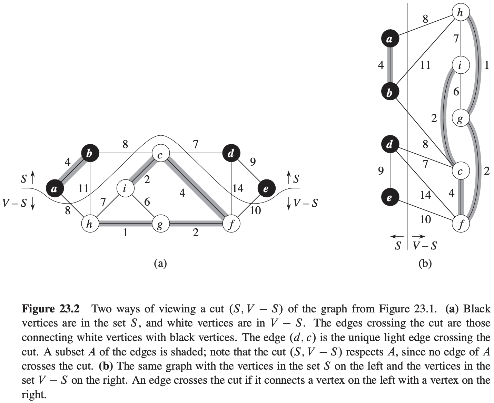
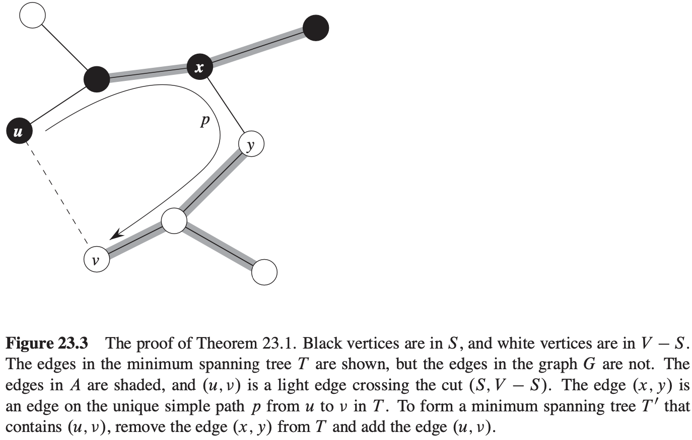
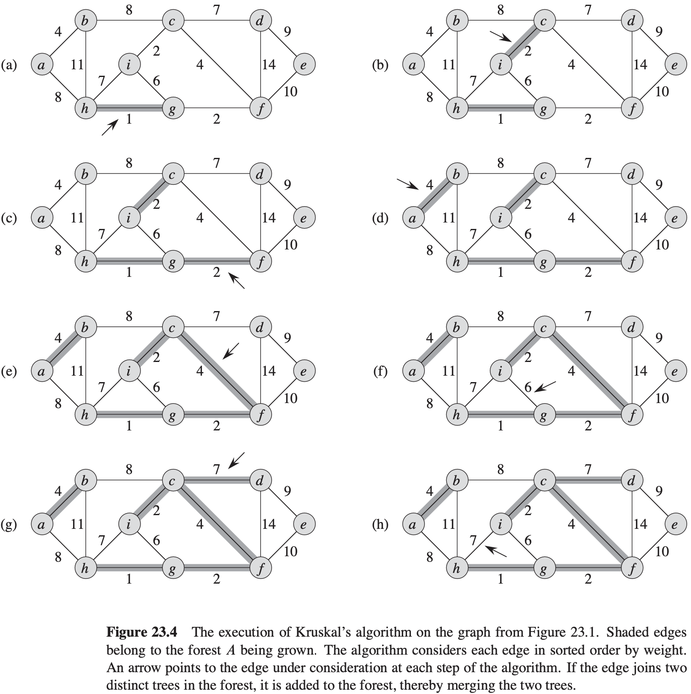
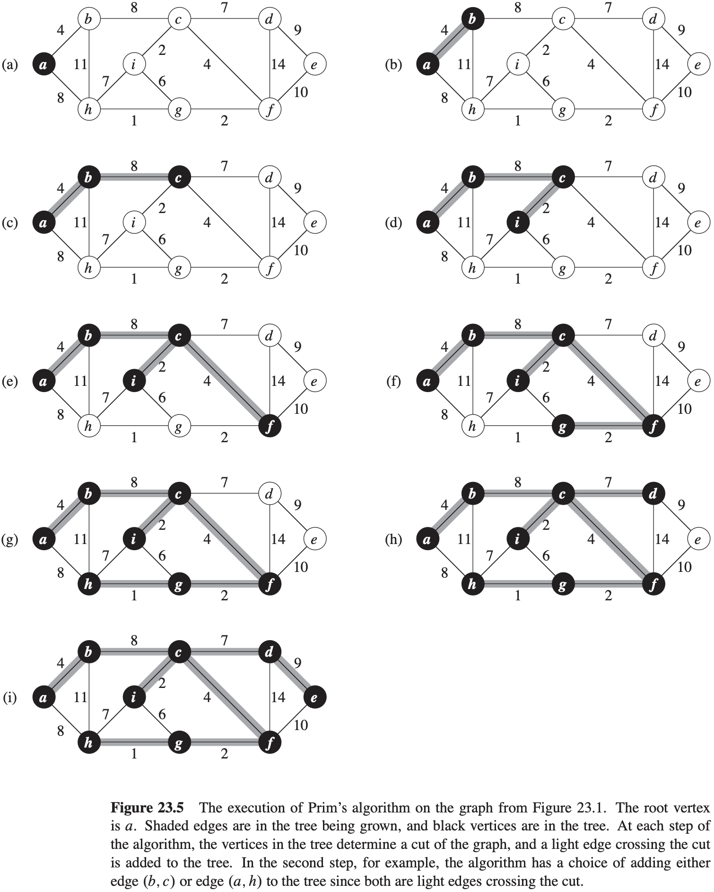

[中文版](chapter23_zh.md) | English

# 23 Minimum Spanning Trees

[TOC]

## Growing a minimum spanning tree

$$
\begin{align}
& GENERIC-MST(G, w) \\
& A = \emptyset \\
& while\ A\ does\ not\ form\ a\ spanning\ tree \\
& \qquad find\ an\ edge(u, v)\ that\ is\ safe\ for\ A \\
& \qquad A = A \cup \{(u, v)\} \\
& return\ A
\end{align}
$$

A **cut** $(S, V - S)$ of an undirected graph $G = (V, E)$ is a partition of $V$.

We say that an edge $(u, v) \in E$ **crosses** the cut $(S, V - S)$ if one of its endpoints is in $S$ and the other is in $V - S$.

We say that a cut **respects** a set $A$ of edges if no edge in $A$ crosses the cut. An edge is a **light edge** crossing a cut if its weight is the minimum of any edge crossing the cut.

**Theorem 23.1** Let $G = (V, E)$ be a connected, undirected graph with a real-valued weight function $w$ defined on $E$. Let $A$ be a subset of $E$ that is included in some minimum spanning tree for $G$, let $(S, V - S)$ be any cut of $G$ that respects $A$, and let $(u, v)$ be a light edge crossing $(S, V - S)$. Then, edge $(u, v)$ is safe for $A$.

**Corollary 23.2** Let $G = (V, E)$ be a connected, undirected graph with a real-valued weight function $w$ defined on $E$. Let $A$ be a subset of $E$ that is included in some minimum spanning tree for $G$, and let $C = (V_C, E_C)$ be a connected component (tree) in the forest $G_A = (V, A)$. If $(u, v)$ is a light edge connecting $C$ to some other component in $G_A$, then $(u, v)$ is safe for $A$.

## The algorithms of Kruskal and Prim

**Kruskal's algorithm**
$$
\begin{align}
& MST-KRUSKAL(G, w) \\
& A = \emptyset \\
& for\ each\ vertex\ v \in G.V \\
& \qquad MAKE-SET(v) \\
& sort\ the\ edges\ of\ G.E\ into\ nondecreasing\ order\ by\ weight\ w \\
& for\ each\ edge(u, v) \in G.E,\ taken\ in\ nondecreasing\ order\ by\ weight \\
& \qquad if\ FIND-SET(v) \neq FIND-SET(v) \\
& \qquad \qquad A = A \cup \{(u, v)\} \\
& \qquad \qquad UNION(u, v) \\
& return\ A
\end{align}
$$

**Prim's algorithm**

$$
\begin{align}
& MST-PRIM(G, w, r) \\
& for\ each\ u \in G.V \\
& \qquad u:key = \infty \\
& \qquad u:\pi = NIL \\
& r:key = 0 \\
& Q = G.V \\
& while\ Q \neq \emptyset \\
& \qquad u = EXTRACT-MIN(Q) \\
& \qquad for\ each\ v \in G.Adj[u] \\
& \qquad if\ v \in Q\ and\ w(u, v) < v.key \\
& \qquad \qquad v.\pi = u \\
& \qquad \qquad v.key = w(u, v)
\end{align}
$$
