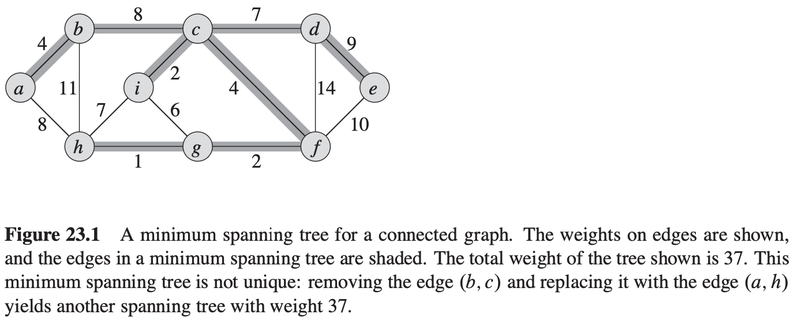
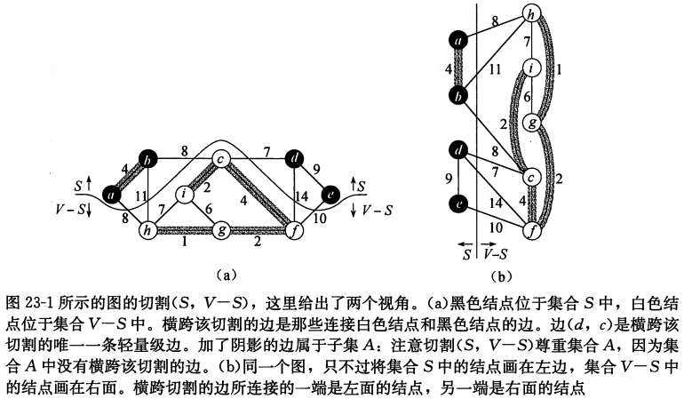
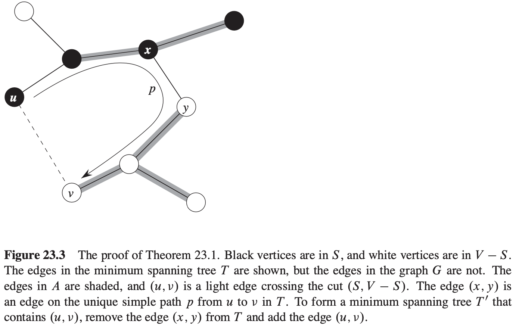
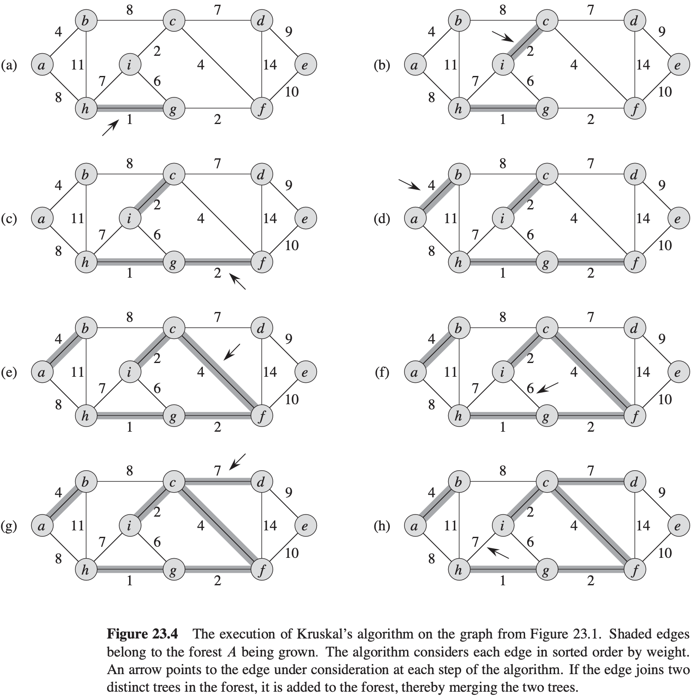
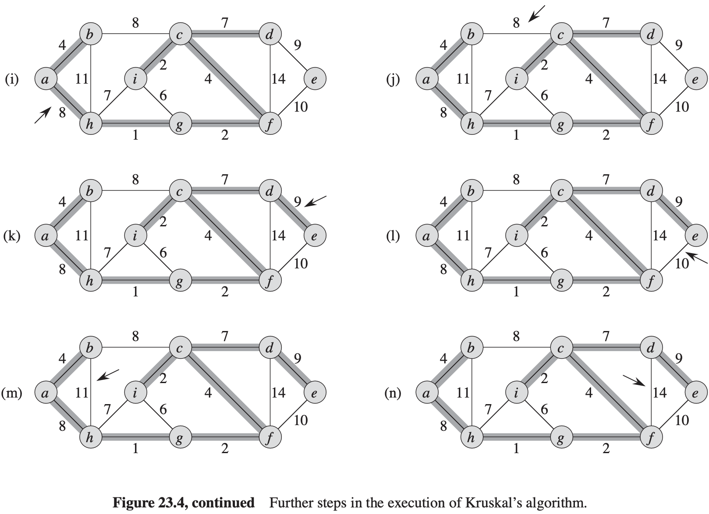
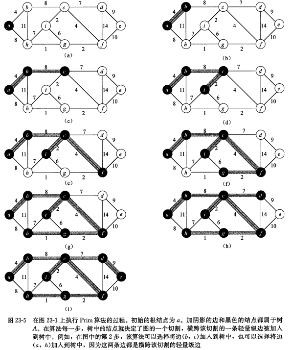

# 第23章 最小生成树

## 23.1 最小生成树的形成

$$
\begin{align}
& GENERIC-MST(G, w) \\
& A = \emptyset \\
& while\ A\ does\ not\ form\ a\ spanning\ tree \\
& \qquad find\ an\ edge(u, v)\ that\ is\ safe\ for\ A \\
& \qquad A = A \cup \{(u, v)\} \\
& return\ A
\end{align}
$$

无向图$G = (V, E)$的一个**切割**$(S, V - S)$是集合$V$的一个划分。

如果一条边$(u, v) \in E$的一个端点位于集合$S$，另一个端点位于集合$V - s$，则称该条边**横跨**切割$(S, V - S)$。

如果集合$A$中不存在横跨该切割的边，则称该切割**尊重**集合$A$。在横跨一个切割的所有边中，权重最小的边称为**轻量级边**。

**定理 23.1** 设$G = (V, E)$是一个在边$E$上定义了实数值权重函数$w$的连通无向图。设集合$A$为$E$的一个子集，且$A$包括在图$G$的某棵最小生成树中，设$(S, V - S)$是图$G$中尊重集合$A$的任意一个切割，又设$(u, v)$是横跨切割$(S, V - S)$的一条轻量级边。那么边$(u, v)$对于集合$A$是安全的。

**推论 23.2** 设$G = (V, E)$是一个连通无向图，并有定义在边集合$E$上的实数权重函数$w$。设集合$A$为$E$的一个子集，且该子集包括在$G$的某棵最小生成树里，并设$C = (V_{C}, E_{C})$为森林$G_{A} = (V, A)$中的一个连通分量（树）。如果边$(u, v)$是连接$C$和$G_{A}$中某个其它连通分量的一条轻量级边，则边$(u, v)$对于集合$A$是安全的。

## 23.2 Kruskal算法和Prim算法

**Kruskal算法**
$$
\begin{align}
& MST-KRUSKAL(G, w) \\
& A = \emptyset \\
& for\ each\ vertex\ v \in G.V \\
& \qquad MAKE-SET(v) \\
& sort\ the\ edges\ of\ G.E\ into\ nondecreasing\ order\ by\ weight\ w \\
& for\ each\ edge(u, v) \in G.E,\ taken\ in\ nondecreasing\ order\ by\ weight \\
& \qquad if\ FIND-SET(v) \neq FIND-SET(v) \\
& \qquad \qquad A = A \cup \{(u, v)\} \\
& \qquad \qquad UNION(u, v) \\
& return\ A
\end{align}
$$

**Prim算法**

$$
\begin{align}
& MST-PRIM(G, w, r) \\
& for\ each\ u \in G.V \\
& \qquad u:key = \infty \\
& \qquad u:\pi = NIL \\
& r:key = 0 \\
& Q = G.V \\
& while\ Q \neq \emptyset \\
& \qquad u = EXTRACT-MIN(Q) \\
& \qquad for\ each\ v \in G.Adj[u] \\
& \qquad if\ v \in Q\ and\ w(u, v) < v.key \\
& \qquad \qquad v.\pi = u \\
& \qquad \qquad v.key = w(u, v)
\end{align}
$$
