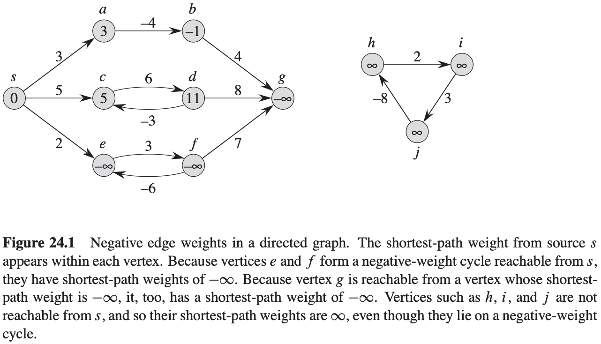
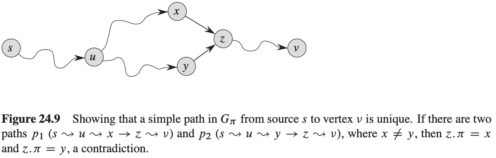

[中文版](chapter24_zh.md) | English

# 24 Single-Source Shortest Paths

[TOC]

In a **shortest-paths problem**, we are given a weighted, directed graph $G = (V, E)$, with weight function $w: E \rightarrow R$ mapping edges to real-valued weighted. The **weight** $w(p)$ of path $p = <v_0, v_1, ..., v_k>$ is the sum of the weights of its constituent edges:
$$
w(p) = \sum_{i = 1}^{k} w(v_{i - 1}, v_i)
$$
, We define the **shortest-path weight** $\delta(u, v)$ from $u$ to $v$ by:
$$
\delta(u, v) = 
\begin{cases}
min\{w(p):u \overset{p}{\rightarrow} v\} &\text{if there is a path from u to v,}\\
\infty &\text{otherwise}
\end{cases}
$$
, A **shortest path** from vertex $u$ to vertex $v$ is then defined as any path $p$ with weight $w(p) = \delta(u, v)$.

**Variants**

The algorithm for the single-source problem can solve many other problems, including the following variants:

- **Single-destination shortest-paths problem**: Find a shortest path to a given **destination** vertex $t$ from each vertex $v$. By reversing the direction of each edge in the graph, we can reduce this problem to a single-soruce problem.
- **Single-pair shortest-path problem**: Find a shortest path from $u$ to $v$ for given vertices $u$ and $v$. If we solve the single-source problem with source vertex $u$, we solve this problem also. Moreover, all known algorithms for this problem have teh same worst-case asymptotic running time as the best single-source algorithms.
- **All-pairs shortest-paths problem**: Find a shortest apth from $u$ to $v$ for every pair of vertices $u$ and $v$. Although we can solve this problem by running a single-source algorithm once from each vertex, we usually can solve it faster. Additionally, its structure is interesting in its own right.

**Optimal substructure of a shortest path**

**Lemma 24.1 (Subpaths of shortest paths are shortest paths)** Given a weighted, directed graph $G = (V, E)$ with weight function $E \rightarrow R$, let $p = <v_0, v_1, ..., v_k>$ be a shortest path from vertex $v_0$ to vertex $v_k$ and, for any $i$ and $j$ such that $0 \leq i \leq j \leq k$, let $p_{ij} = <v_i, v_{i + 1}, ..., v_j>$ be the subpath of $p$ from vertex $v_i$ to vertex $v_j$. Then, $p_{ij}$ is a shortest path from $v_i$ to $v_j$.

**Relaxation**
$$
\begin{align}
& INITIALIZE-SINGLE-SOUORCE(G, s) \\
& for\ each\ vertex\ v \in G.V \\
& \qquad v.d = \infty \\
& \qquad v.\pi = NIL \\
& s.d = 0
\end{align}
$$

$$
\begin{align}
& RELAX(u, v, w) \\
& if\ v.d > u.d + w(u, v) \\
& \qquad v.d = u.d + w(u, v) \\
& \qquad v.\pi = u
\end{align}
$$

**Triangle inequality** For any edge $(u, v) \in E$, we have $\delta(s, v) \leq \delta(s, u) + w(u, v)$.

**Upper-bound property** We always have $v.d \geq \delta(s, v)$ for all vertices $v \in V$, and once $v.d$ achieves the value $\delta(s, v)$, it never changes.

**No-path property** If there is no path from $s$ to $v$, then we always have $v.d = \delta(s, v) = \infty$.

**Convergence property** If $s \rightarrow u \rightarrow v$ is a shortest path in $G$ for some $u, v \in V$, and if $u.d = \delta(s, u)$ at any time prior to relaxing edge$(u, v)$, then $v.d = \delta(s, v)$ at all times afterward.

**Path-relaxation property** If $p = <v_0, v_1, ..., v_k>$ is a shortest path from $s = v_0$ to $v_k$, and we relax the edges of $p$ in the order $(v_0, v_1), (v_1, v_2), ..., (v_{k - 1}, v_k)$, then $v_k \cdot d = \delta(s, v_k)$.

**Predecessor-subgraph property** Once $v.d = \delta(s, v)$ for all $v \in V$, the predecessor subgraph is a shortest-paths tree rooted at $s$.

## The Bellman-Ford algorithm

Example:
$$
\begin{align}
& BELLMAN-FORD(G, w, s) \\
& INITIALIZE-SINGLE-SOURCE(G, s) \\
& for\ i = 1\ to\ |G.V| - 1 \\
& \qquad for\ each\ edge(u, v) \in G.E \\
& \qquad \qquad RELAX(u, v, w) \\
& for\ each\ edge(u, v) \in G.E \\
& \qquad if\ v.d > u.d + w(u.v) \\
& \qquad \qquad return\ FALSE \\
& return\ TRUE
\end{align}
$$

**Lemma 24.2** Let $G = (V, E)$ be a weighted, directed graph with source $s$ and weight function $w: E \rightarrow R$, and assume that $G$ contains no negative-weight cycles that are reachable from $s$. Then, after the $|V| - 1$ iterations of the **for** loop of lines 2-4 of $BELLMAN-FORD$, we have $v.d = \delta(s, v)$ for all vertices $v$ that are reachable from $s$.

**Corollary 24.3** Let $G= (V, E)$ be a weighted, directed graph with source vertex $s$ and weight function $w: E \rightarrow R$, and assume that $G$ contains no negative-weight cycles that are reachable from $s$. Then, for each vertex $v \in V$, there is a path from $s$ to $v$ if and only if $BELLMAN-FORD$ terminates with $v.d < \infty$ when it is run on $G$.

**THeorem 24.4(Correctness of the Bellman-Ford algorithm)** Let $BELLMAN-FORD$ be run on a weighted, directed graph $G = (V, E)$ with source $s$ and weight function $w: E \rightarrow R$. If $G$ contains no negative-weight cycles that are reachable from $s$, then the algorithm returns $TRUE$, we have $v.d = \delta(s, v)$ for all vertices $v \in V$, and the predecessor subgraph $G_{\pi}$ is a shortest-paths tree rooted at $s$. If $G$ does contain a negative-weight cycle reachable from $s$, then the algorithm returns $FALSE$.

## Single-source shortest paths in directed acyclic graphs

$$
\begin{align}
& DAG-SHORTEST-PATHS(G, w, s) \\
& topologically\ sort\ the\ vertices\ of\ G \\
& INITIALIZE-SINGLE-SOURCE(G, s) \\
& for\ each\ vertex\ u, taken\ in\ topologically\ sorted\ order \\
& \qquad for\ each\ vertex\ v \in G.Adj[u] \\
& \qquad \qquad RELAX(u, v, w)
\end{align}
$$

**Theorem 24.5** If a weighted, directed graph $G = (V, E)$ has source vertex $s$ and no cycles, then at the termination of the $DAG-SHORTEST-PATHS$ procedure, $v.d = \delta(s, v)$ for all vertices $v \in V$, and the predecessor subgraph $G_{\pi}$ is a shortest-paths tree.

## Dijkstra's algorithm

$$
\begin{align}
& DIJKSTRA(G, w, s) \\
& INITIALIZE-SINGLE-SOURCE(G, s) \\
& S = \emptyset \\
& Q = G.V \\
& while\ Q \neq \emptyset \\
& \qquad u = EXTRACT-MIN(Q) \\
& \qquad S = S \cup \{u\} \\
& \qquad for\ each\ vertex\ v \in G.Adj[u] \\
& \qquad \qquad RELAX(u, v, w)
\end{align}
$$

**Theorem 24.6 (Correctness of Dijkstra's algorithm)** Dijkstra's algorithm, run on a weighted, directed graph $G = (V, E)$ with non-negative weight function $w$ and source $s$, terminates with $u.d = \delta(s, u)$ for all vertices $u \in V$.

**Corollary 24.7** If we run Dijkstra's algorithm on a weighted, directed graph $G = (V, E)$ with nonnegative weight function $w$ and source $s$, then at termination, the predecessor subgraph $G_{\pi}$ is a shortest-paths tree rooted at $s$.

## Difference constraints and shortest paths

**Lemma 24.8** Let $x = (x_1, x_2, ..., x_n)$ be a solution to a system $Ax \leq b$ of difference constraints, and let $d$ be any constant. Then $x + d = (x_1 + d, x_2 + d, ..., x_n + d)$ is a solution to $Ax \leq b$ as well.

**Theorem 24.9** Given a system $Ax \leq b$ of difference constraints, let $G = (V, E)$ be the corresponding constraint graph. If $G$ contains no negative-weight cycles, then:
$$
x = (\delta(v_0, v_1), \delta(v_0, v_2), \delta(v_0, v_3), ..., \delta(v_0, v_n))
$$
, is a feasible solution for the system. If $G$ contains a negative-weight cycle, then there is no feasible solution for the system.

## Proofs of shortest-paths properties

**Lemma 24.10 (Triangle inequality)** Let $G = (V, E)$ be a weighted, directed graph with weight function $w: E \rightarrow R$ and source vertex $s$. Then, for all edges $(u, v) \in E$, we have $\delta(s, v) \leq \delta(s, u) + w(u, v)$.

**Lemma 24.11 (Upper-bound property)** Let $G = (V, E)$ be a weighted, directed graph with weight function: $w: E \rightarrow R$. Let $s \in V$ be the source vertex, and let the graph be initialized by $INITIALIZE-SINGLE-SOURCE(G, s)$. Then, $v.d \geq \delta(s, v)$ for all $v \in V$, and this invariant is maintained over any sequence of relaxation steps on the edges of $G$. Moreover, once $v.d$ achieves its lower bound $\delta(s, v)$, it never changes.

**Corollary 24.12 (No-path property)** Suppose that in a weighted, directed graph $G = (V, E)$ with weight function $w: E \rightarrow R$, no path connects a source vertex $s \in V$ to a given vertex $v \in V$. Then, after the graph is initialized by $INITIALIZE-SINGLE-SORUCE(G, s)$, we have $v.d = \delta(s, v) = \infty$, and this equality is maintained as an invariant over any sequence of relaxation steps on the edges of $G$.

**Lemma 24.13** Let $G = (V, E)$ be a weighted, directed graph with weight function $w: E \rightarrow R$, and let $(u, v) \in E$. Then, immediately after relaxing edge $(u, v)$ by executing $RELAX(u, v, w)$, we have $v.d \leq u.d + w(u, v)$.

**Lemma 24.14 (Convergence  property)** Let $G = (V, E)$ be a weighted, directed graph with weight function $w: E \rightarrow R$, let $s \in V$ be a source vertex, and let $s \rightarrow u \rightarrow v$ be a shortest path in $G$ for some vertices $u, v \in V$. Suppose that $G$ is initialized by $INITIALIZE-SINGLE-SOURCE(G, s)$ and then a sequence of relaxation steps that includes the call $RELAX(u, v, w)$ is executed on the edges of $G$. If $u.d = \delta(s, u)$ at any time prior to the call, then $v.d = \delta(s, v)$ at all times after the call.

**Lemma 24.15 (Path-relaxation property)** Let $G = (V, E)$ be a weighted, directed graph with weight function $w: E \rightarrow R$, and let $s \in V$ be a source vertex. Consider any shortest path $p = <v_0, v_1, ..., v_k>$ from $s = v_0$ to $v_k$. If $G$ is initialized by $INITIALIZE-SINGLE-SOURCE(G, s)$ and then a sequence of relaxation steps occurs that include, in order, relaxing the edges $(v_0, v_1), (v_1, v_2), ..., (v_{k - 1}, v_k)$, then $v_k \cdot d = \delta(s, v_k)$ after these relaxations and at all times afterward. This property holds no matter what other edge relaxations occur, including relaxations that are intermixed with relaxations of the edges of $p$.

**Lemma 24.16** Let $G = (V, E)$ be a weighted, directed graph with function $w: E \rightarrow R$, let $s \in V$ be a source vertex, and assume that $G$ contains no negative-weight cycles that are reachable from $s$. Then, after the graph is initialized by $INITIALIZE-SINGLE-SOURCE(G, s)$, the predecessor subgraph $G_{\pi}$ forms a rooted tree with root $s$, and any sequence of relaxation steps on edges of $G$ maintains this property as an invariant.

**Lemma 24.17 (Predecessor-subgraph property)** Let $G = (V, E)$ be a weighted, directed graph with weight function $w: E \rightarrow R$, let $s \in V$ be a source vertex, and assume that $G$ contains no negative-weight cycles that are reachable from $s$. Let us call $INITIALIZE-SINGLE-SOURCE(G, s)$ and then execute any sequence of relaxation steps on edges of $G$ that produces $v.d = \delta(s, v)$ for all $v \in V$. Then, the predecessor subgraph $G_{\pi}$ is a shortest-paths tree rooted at $s$.
