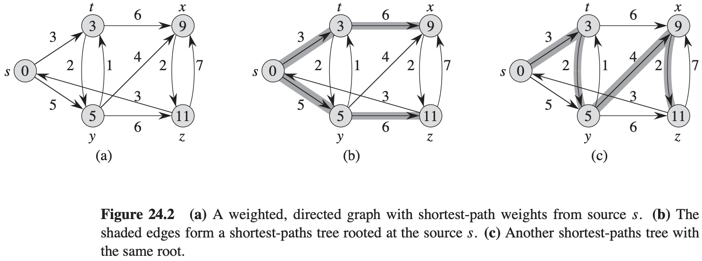
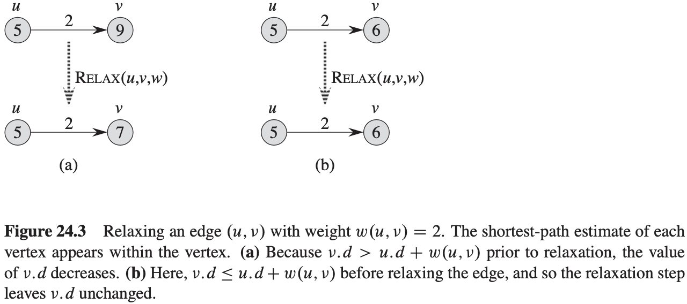
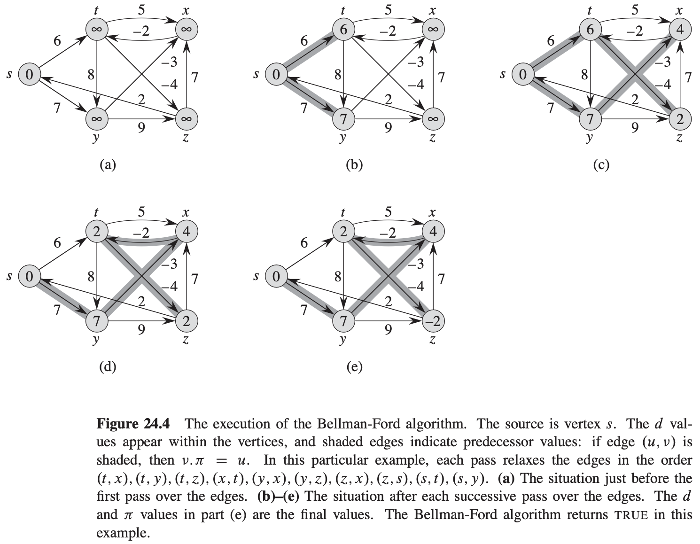
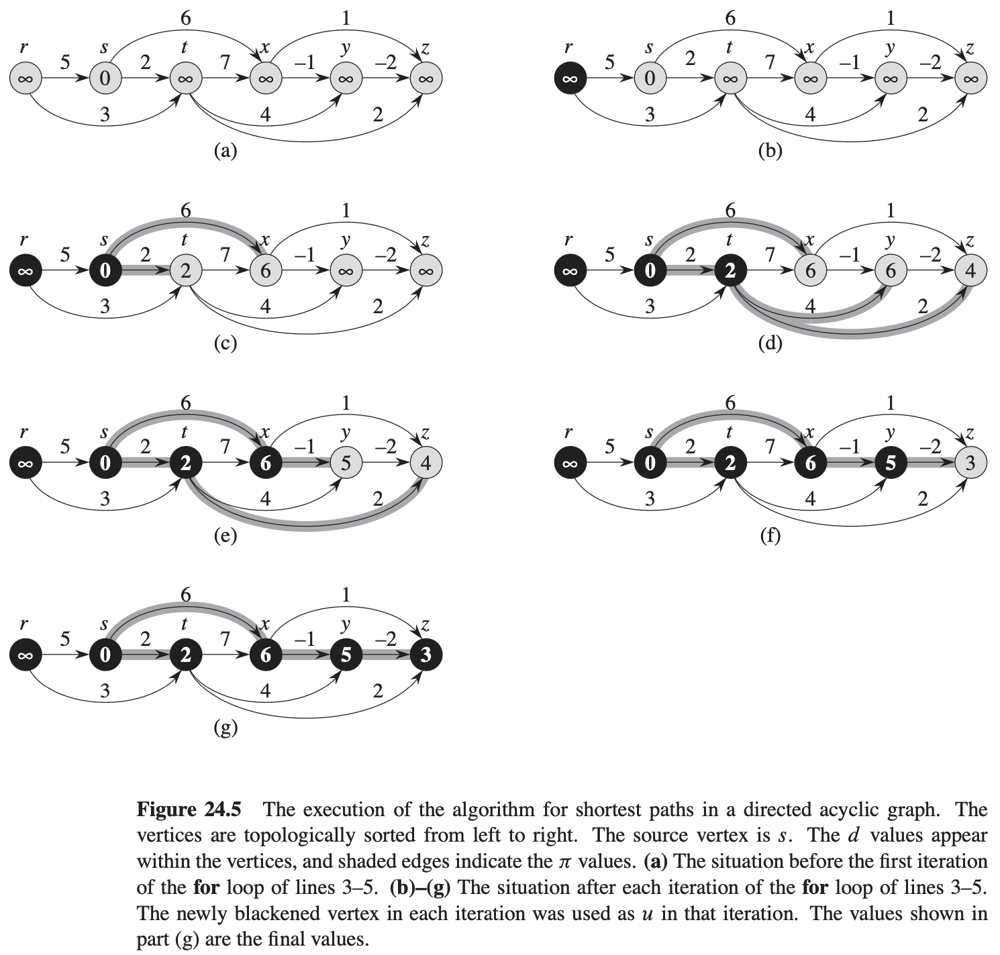
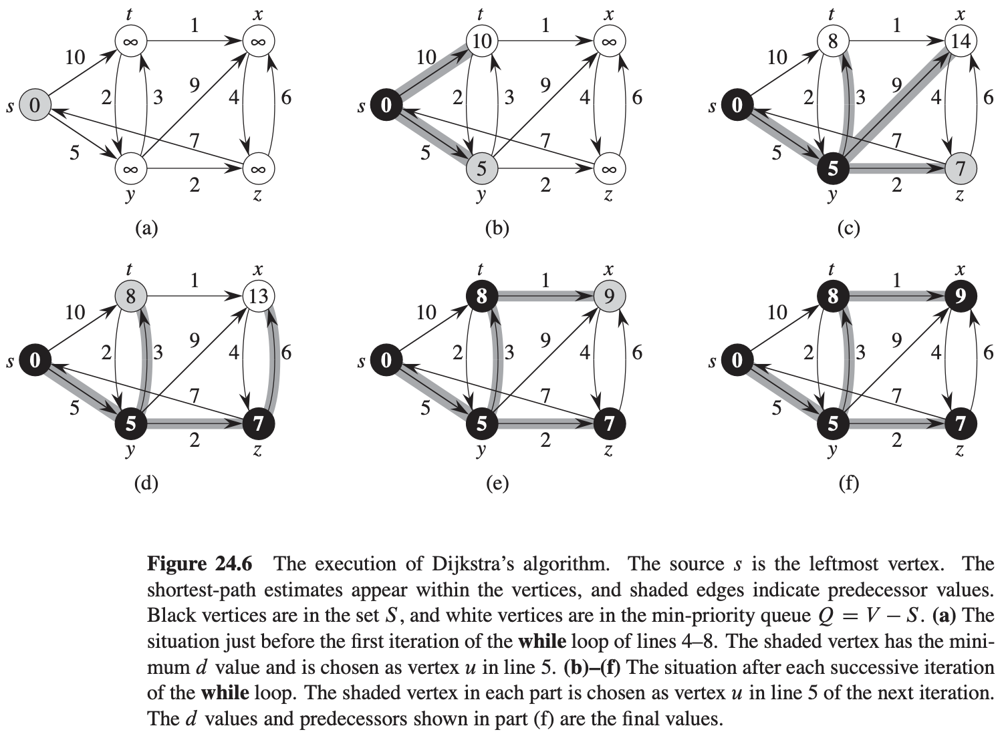
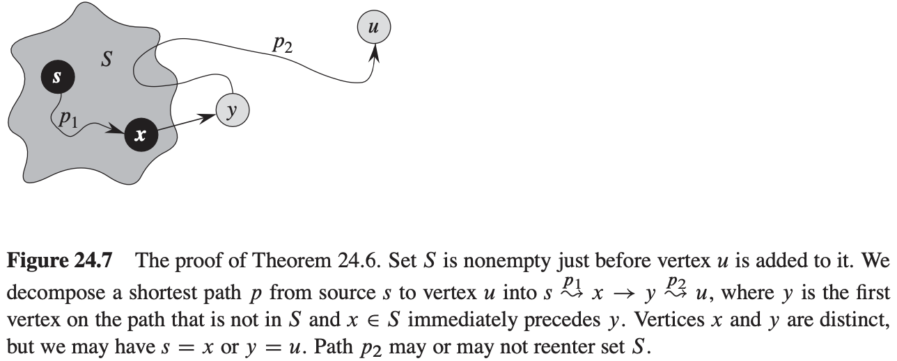

# 第24章 单源最短路径

**最短路径问题**：给定一个带权重的有向图$G = (V, E)$和权重函数$w: E \rightarrow R$，该权重函数将每条边映射到实数值的权重上。图中一条路径$p = <v_0, v_1, ..., v_k>$的权重$w(p)$是构成该路径的所有边的权重之和：
$$
w(p) = \sum_{i = 1}^{k} w(v_{i - 1}, v_i)
$$
定义从结点$u$到结点$v$的**最短路径权重**$\delta(u, v)$如下：
$$
\delta(u, v) = 
\begin{cases}
min\{w(p):u-p->v\} &如果存在一条从结点u到结点v的路径\\
\infty &其它
\end{cases}
$$
从结点$u$到接待你$v$的**最短路径**则定义为任何一条权重为$w(p) = \delta(u, v)$的从$u$到$v$的路径$p$。

**单源最短路径问题**：给定一个图$G = (V, E)$，我们希望找到从给定源结点$s \in V$到每个结点$v \in V$的最短路径。

**单目的地最短路径问题**：找到从每个结点$v$到给定目的地结点$t$的最短路径。

**单结点对最短路径问题**：找到从给定结点$u$到给定结点$v$的最短路径。

**所有结点对最短路径问题**：对于每对结点$u$和$v$，找到从结点$u$到结点$v$的最短路径。

**引理 24.1（最短路径的子路径也是最短路径）** 给定带权重的有向图$G = (V, E)$和权重函数$w: E \rightarrow R$。设$p = <v_0, v_1, ..., v_k>$为从结点$v_0$到结点$v_k$的一条最短路径，并且对于任意的$i$和$j, 0 \leqslant i \leqslant j \leqslant k$，设$p_{ij} = <v_i, v_{i + 1}, ..., v_j>$为路径$p$中从结点$v_i$到结点$v_j$的子路径。那么$p_{ij}$是从结点$v_i$到结点$v_j$的一条最短路径。

**松弛操作**
$$
\begin{align}
& INITIALIZE-SINGLE-SOUORCE(G, s) \\
& for\ each\ vertex\ v \in G.V \\
& \qquad v.d = \infty \\
& \qquad v.\pi = NIL \\
& s.d = 0
\end{align}
$$

$$
\begin{align}
& RELAX(u, v, w) \\
& if\ v.d > u.d + w(u, v) \\
& \qquad v.d = u.d + w(u, v) \\
& \qquad v.\pi = u
\end{align}
$$

**三角不等式性质** 对于任何边$(u, v) \in E$，我们有$\delta(s, v) \leqslant \delta(s, u) + w(u, v)$。

**上界性质** 对于所有的结点$v \in V$，我们总是有$v.d \geqslant \delta(s, v)$。一旦$v.d$的取值达到$\delta(s, v)$，其值将不再发生变化。

**非路径性质** 如果从结点$s$到结点$v$之间不存在路径，则总是有$v.d = \delta(s, v) = \infty$。

**收敛性质** 对于某些结点$u, v \in V$，如果$s -> u -> v$是图$G$中的一条最短路径，并且在对边$(u, v)$进行松弛前的任意时间有$u.d = \delta(s, u)$，则在之后的所有时间有$v.d = \delta(s, v)$。

**路径松弛性质** 如果$p = <v_0, v_1, ..., v_k>$是从源结点$s = v_0$到结点$v_k$的一条最短路径，并且我们对$p$中的边所进行松弛的次序为$(v_0, v_1), (v_1, v_2), ..., (v_{k - 1}, v_k)$，则$v_k \cdot d = \delta(s, v_k)$。

**前驱子图性质** 对于所有的结点$v \in V$，一旦$v.d = \delta(s, v)$，则前驱子图是一棵根节点为$s$的最短路径树。

## 23.1 Bellman-Ford算法

$$
\begin{align}
& BELLMAN-FORD(G, w, s) \\
& INITIALIZE-SINGLE-SOURCE(G, s) \\
& for\ i = 1\ to\ |G.V| - 1 \\
& \qquad for\ each\ edge(u, v) \in G.E \\
& \qquad \qquad RELAX(u, v, w) \\
& for\ each\ edge(u, v) \in G.E \\
& \qquad if\ v.d > u.d + w(u.v) \\
& \qquad \qquad return\ FALSE \\
& return\ TRUE
\end{align}
$$

**引理 24.2** 设$G = (V, E)$为一个带权重的源结点为$s$的有向图，其权重函数为$w: E \rightarrow R$。假定图$G$不包含从源结点$s$可以到达的权重的负值的环路。那么在算法BELLMAN-FORD的第$2 ～ 4$行的for循环执行了$|V| - 1$次之后，对于所有从源结点$s$可以到达的结点$v$，我们有$v.d = \delta(s, v)$。

**推论 24.3** 设$G= (V, E)$是一带权重的源结点为$s$的有向图，其权重函数为$w: E \rightarrow R$。假定图$G$不包含从源结点$s$可以到达的权重为负值的环路，则对于所有结点$v \in V$，存在一条从源结点$s$到结点$v$的路径当且仅当$BELLMAN-FORD$算法终止时有$v.d < \infty$。

**定理 24.4（Bellman-Ford算法的正确性）** 设BELLMAN-FORD算法运行在一带权重的源结点为$s$的有向图$G = (V, E)$上，该图的权重函数为$w: E \rightarrow R$。如果图$G$不包含从源结点$s$可以达到的权重为负值的环路，则算法将返回TRUE值，且对于所有结点$v \in V$，前驱子图$G_{\pi}$是一棵根节点为$s$的最短路径树。如果图$G$包含一条从源结点$s$可以到达的权重为负值的环路，则算法将返回FALSE值。

## 24.2 有向无环图中的单源最短路径问题

$$
\begin{align}
& DAG-SHORTEST-PATHS(G, w, s) \\
& topologically\ sort\ the\ vertices\ of\ G \\
& INITIALIZE-SINGLE-SOURCE(G, s) \\
& for\ each\ vertex\ u, taken\ in\ topologically\ sorted\ order \\
& \qquad for\ each\ vertex\ v \in G.Adj[u] \\
& \qquad \qquad RELAX(u, v, w)
\end{align}
$$

**定理 24.5** 如果带权重无环路的有向图$G = (V, E)$有一个源结点$s$，则在算法$DAG-SHORTEST-PATHS$终止时，对于所有的结点$v \in V$，我们有$v.d = \delta(s, v)$，且前驱子图$G_{\pi}$是一棵最短路径树。

## 24.3 Dijkstra算法

$$
\begin{align}
& DIJKSTRA(G, w, s) \\
& INITIALIZE-SINGLE-SOURCE(G, s) \\
& S = \emptyset \\
& Q = G.V \\
& while\ Q \neq \emptyset \\
& \qquad u = EXTRACT-MIN(Q) \\
& \qquad S = S \cup \{u\} \\
& \qquad for\ each\ vertex\ v \in G.Adj[u] \\
& \qquad \qquad RELAX(u, v, w)
\end{align}
$$

**定理 24.6**（Dijkstra算法的正确性）Dijkstra算法运行在带权重的有向图$G = (V, E)$时，如果所有权重为非负值，则在算法终止时，对于所有结点$u \in V$，我们有$u.d = \delta(s, u)$。

**推论 24.7** 如果在带权重的有向图$G = (V, E)$上运行Dijkstra算法，其中的权重皆为非负值，源结点为$s$，则在算法终止时，前驱子图$G_{\pi}$是一棵根节点为$s$的最短路径树。

## 24.4 差分约束和最短路径

**引理 24.8** 设向量$x = (x_1, x_2, ..., x_n)$为差分约束系统$A_x \leqslant b$的一个解，设$d$为任意常数，则$x + d = (x_1 + d, x_2 + d, ..., x_n + d)$也是该差分约束系统的一个解。

**定理 24.9** 给定差分约束系统$A_x \leqslant b$，设$G = (V, E)$是该差分约束系统所对应的约束图。如果图$G$不包含权重为负值的环路，则$x = (\delta(v_0, v_1), \delta(v_0, v_2), \delta(v_0, v_3), ..., \delta(v_0, v_n))$是该系统的一个可行解。如果图$G$包含权重为负值的环路，则该系统没有可行解。

## 24.5 最短路径性质的证明

**引理 24.10（三角不等式）** 设$G = (V, E)$为一个带权重的有向图，其权重函数由$w: E \rightarrow R$给出，其源结点为$s$。那么对于所有的边$(u v) \in E$，我们有$\delta(s, v) \leqslant \delta(s, u) + w(u, v)$。

**引理 24.11（上界性质）** 设$G = (V, E)$为一个带权重的有向图，其权重函数由$w: E \rightarrow R$给出，其源结点为$s$，该图由算法$INITIALIZE-SINGLE-SOURCE(G, s)$执行初始化。那么对于所有的结点$v \in V，  v.d \geqslant \delta(s, v)$，并且该不变式在对图$G$的边进行任何次序的松弛过程中保持成立。而且，一旦$v.d$取得其下界$\delta(s, v)$后，将不再发生变化。

**推论 24.12（非路径性质）** 给定一个带权重的有向图$G = (V, E)$，权重函数为$w: E \rightarrow R$，假定从源结点$s \in V$到给定结点$v \in V$之间不存在路径，则在该图由$INITIALIZE-SINGLE-SOURCE(G， s)$算法进行初始化后，我们有$v.d = \delta(s, v) = \infty$，并且该等式作为不变式一致维持到图$G$的所有松弛操作结束。

**引理 24.13** 设$G = (V, E)$为一个带权重的有向图，权重函数为$w: E \rightarrow R$，并且边$(u, v) \in E$。那么在对边$(u, v)$进行松弛操作$RELAX(u, v, w)$后，有$v.d \leqslant u.d + w(u, v)$。

**引理 24.14（收敛性质）** 设$G = (V, E)$为一个带权重的有向图，权重函数为$w: E \rightarrow R$。设$s \in V$为某个源结点，$s -> u -> v$为图$G$中的一条最短路径，这里$u, v \in V$。假定图$G$由$INITIALIZE-SINGLE-SOURCE(G, s)$算法进行初始化，并在这之后进行了一系列边的松弛操作，其中包括对边$(u, v)$的松弛操作$RELAX(u, v, w)$。如果在对边$(u, v)$进行松弛操作之前的任意时刻有$u.d = \delta(s, u)$，则在该松弛操作之后的所有时刻有$v.d = \delta(s, v)$。

**引理 24.15（路径松弛性质）** 设$G = (V, E)$为一个带权重的有向图，权重函数为$w: E \rightarrow R$，设$s \in V$为某个源结点，考虑从源结点$s$到结点$v_k$的任意一条最短路径$p = <v_0, v_1, ..., v_k>$。如果图$G$由$INITIALIZE-SINGLE-SOURCE(G, s)$算法进行初始化，并在这之后进行了一系列的边松弛操作，其中包括对边$(v_0, v_1), (v_1, v_2), ..., (v_{k - 1}, v_k)$按照所列次序而进行的松弛操作，则在所有这些松弛操作之后，我们有$v_k \cdot d = \delta(s, v_k)$，并且在此之后该等式一直保持成立。该性质的成立与其他边的松弛操作及次序无关。

**引理 24.16** 设$G = (V, E)$为一个带权重的有向图，权重函数为$w: E \rightarrow R$。设$s \in V$为某个源结点，假定图$G$不包含从源结点$s$可以到达的权重为负值的环路，则在图$G$由$INITIALIZE-SINGLE-SOURCE(G, s)$算法进行初始化之后，前驱子图$G_{\pi}$形成根结点为源结点$s$的有根树，并且任何对图$G$的边进行的任意松弛操作都将维持该性质不变。

**引理 24.17（前驱子图性质）** 设$G = (V, E)$为一个带权重的有向图，权重函数为$w: E \rightarrow R$，设$s \in V$为源结点，假定图$G$不包含从源结点$s$可以到达的权重为负值的环路。假设调用$INITIALIZE-SINGLE-SOURCE(G, s)$算法对图$G$进行初始化，然后对图$G$的边进行任意次序的松弛操作。该松弛操作序列将针对所有的结点$v \in V$生成$v.d = \delta(s, v)$，则前驱子图$G_{\pi}$形成一棵根结点为$s$的最短路径树。
