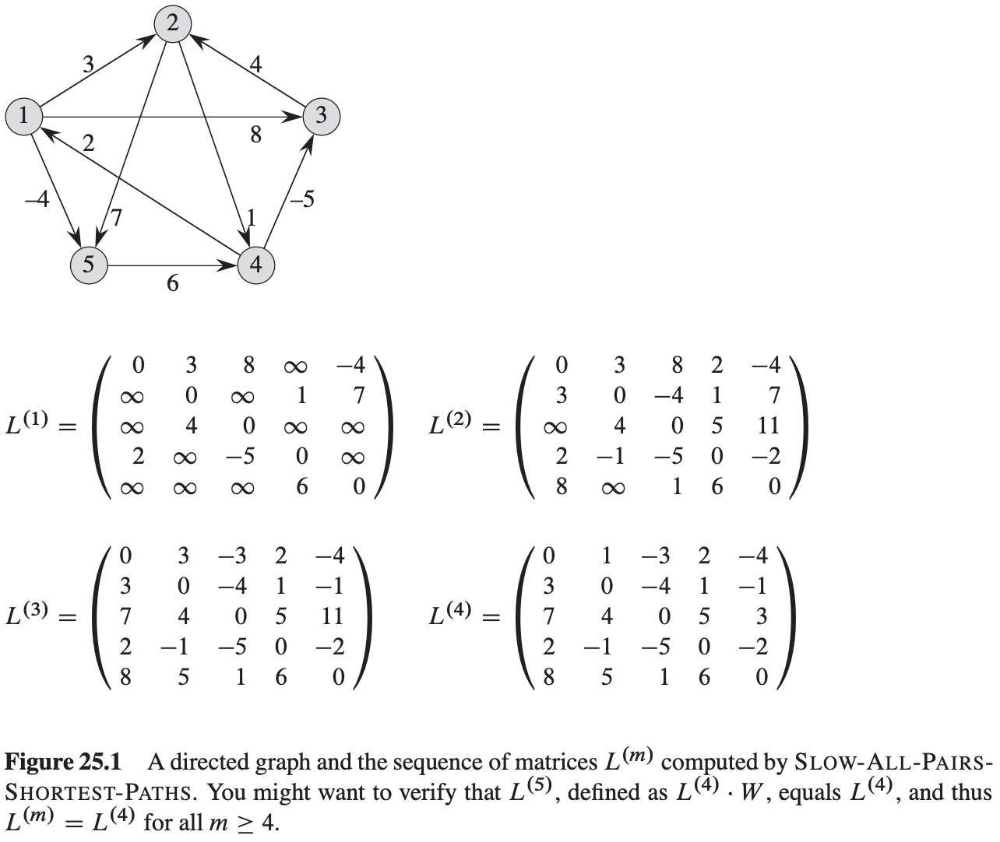
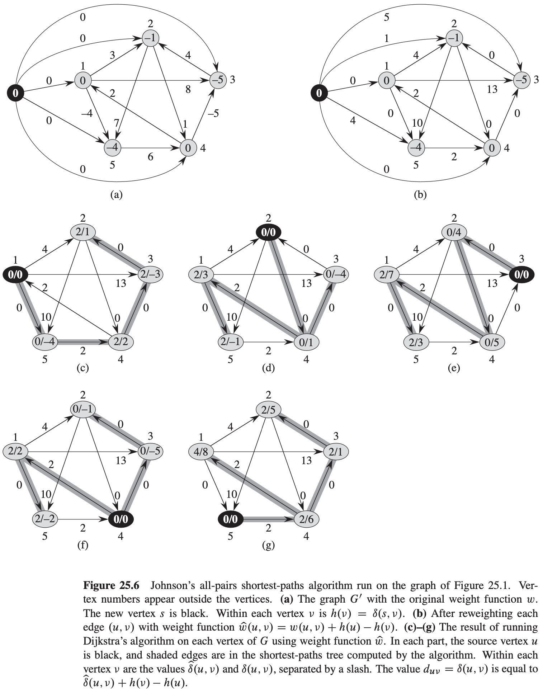

# 第25章 所有结点对的最短路径问题

## 25.1 最短路径和矩阵乘法

$$
\begin{align}
& EXTEND-SHORTEST-PATHS(L, W) \\
& n = L.rows \\
& let\ L' = (l_{ij}')\ be\ a\ new\ n \times n\ matrix \\
& for\ i = 1\ to\ n \\
& \qquad for\ j = 1\ to\ n \\
& \qquad \qquad for\ j = 1\ to\ n \\
& \qquad \qquad \qquad l_{ij}' = \infty \\
& \qquad \qquad \qquad for\ k = 1\ to\ n \\
& \qquad \qquad \qquad \qquad l_{ij}' = min(l_{ij}', l_{k} + w_{kj}) \\
& return\ L'
\end{align}
$$

$$
\begin{align}
& SQUARE-MATRIX-MULTIPLY(A, B) \\
& n = A.rows \\
& let\ C\ be\ a\ new\ n \times n\ matrix \\
& for\ i = 1\ to\ n \\
& \qquad for\ j = 1\ to\ n \\
& \qquad \qquad c_{ij} = 0 \\
& \qquad \qquad for\ k = 1\ to\ n \\
& \qquad \qquad \qquad c_{ij} = c_{ij} + a_{k} \cdot b_{kj} \\
& return\ C
\end{align}
$$

$$
\begin{align}
& SLOW-ALL-PAIRS-SHORTEST-PATHS(W) \\
& n = W.rows \\
& L^{(1)} = W \\
& for\ m = 2\ to\ n - 1 \\
& \qquad let\ L^{(m)}\ be\ a\ new\ n \times n\ matrix \\
& \qquad L^{(m)} = EXTEND-SHORTEST-PATHS(L^{(m - 1)}, W) \\
& return\ L^{(n - 1)}
\end{align}
$$

$$
\begin{align}
& FASTER-ALL-PAIRS-SHORTEST-PATHS(W) \\
& n = W \cdot rows \\
& L^{(1)} = W \\
& m = 1 \\
& while\ m < n - 1 \\
& \qquad let\ L^{(2m)}\ be\ a\ new\ n \times n\ matrix \\
& \qquad L^{(2m)} = EXTEND-SHORTEST-PATHS(L^{(m)}, L^{(m)}) \\
& \qquad m = 2m \\
& return\ L^{(m)}
\end{align}
$$

## 25.2 Floyd-Warshall算法

$$
\begin{align}
& FLOYD-WARSHALL(W) \\
& n = W.rows \\
& D^{(0)} = W \\
& for\ k = 1\ to\ n \\
& \qquad let\ D^{(k)} = (d_{ij}^{(k)})\ be\ a\ new\ n \times n\ matrix \\
& \qquad for\ i = 1\ to\ n \\
& \qquad \qquad for\ j = 1\ to\ n \\
& \qquad \qquad \qquad d_{ij}^{(k)} = min(d_{ij}^{(k - 1)}, d_{ik}^{(k - 1)} + d_{kj}^{(k - 1)}) \\
& return\ D^{(n)}
\end{align}
$$

$$
\begin{align}
& TRANSITIVE-CLOSURE(G) \\
& n = |G.V| \\
& let\ T^{(0)} = (t_{ij}^{(0)})\ be\ a\ new\ n \times n\ matrix \\
& for\ i = 1\ to\ n \\
& \qquad for\ j = 1\ to\ n \\
& \qquad \qquad if\ i == j\ or\ (i.j) \in G.E \\
& \qquad \qquad \qquad t_{ij}^{(0)} = 1 \\
& \qquad \qquad else\ t_{ij}^{(0)} = 0 \\
& for\ k = 1\ to\ n \\
& \qquad let\ T^{(k)} = (t_{ij}^{(k)})\ be\ a\ new\ n \times n\ matrix \\
& \qquad \qquad for\ i = 1\ to\ n \\
& \qquad \qquad \qquad for\ j = 1\ to\ n \\
& \qquad \qquad \qquad \qquad t_{ij}^{(k)} = t_{ij}^{(k - 1)} \bigvee (t_{ik}^{(k - 1)} \bigwedge t_{kj}^{(k - 1)} \\
& return\ T^{(n)}
\end{align}
$$

## 25.3 用于稀疏图的johnson算法

Johnson算法可以在$O(V^2lgV + VE)$的时间内找到所有节点对之间的最短路径。

**引理 25.1**（重新赋予权重并不改变最短路径） 给定带权重的有向图$G = (V, E)$，其权重函数为$w: E \rightarrow R$，设$h: V \rightarrow R$为任意函数，该函数将结点映射到实数上。对于每条边$(u, v) \in E$，定义
$$
\hat{w}(u, v) = w(u, v) + h(u) - h(v)
$$
设$p = <v_0, v_1, ..., v_k>$为从结点$v_0$到结点$v_k$的任意一条路径，那么$p$是在使用权重函数$w$时，从结点$v_0$到结点$v_k$的一条最短路径，当且仅当$p$是在使用权重函数$\hat{w}$时从结点$v_0$到结点$v_k$的一条最短路径，即$w(p) = \delta(v_0, v_k)$当且仅当$\hat{w}(p) = \hat{\delta}(v_0, v_k)$。而且，图$G$在使用权重函数$w$时不包含权重为负值得环路，当且仅当$p$在使用权重函数$\hat{w}$也不包括权重为负值的环路。

$$
\begin{align}
& JOHNSON(G, w) \\
& compute\ G', where\ G'.V \cup \{s\}, G'.E = G.E \cup \{(s, v): v \in G.V\}, and\ w(s, v) = 0\ for\ all\ v \in G.V \\
& if\ BELLMAN-FORD(G', w, s) == FALSE \\
& \qquad print\ "the\ input\ graph\ contains\ a\ negative-weight\ cycle" \\
& else for\ each\ vertex\ v \in G'.V \\
& \qquad set\ h(v)\ to\ the\ value\ of\ \delta(s, v)\ computed\ by\ the\ Bellman-Ford\ algorithm \\
& \qquad for\ each\ edge(u, v) \in G'.E \\
& \qquad \hat{w}(u, v) = w(u, v) + h(u) - h(v) \\
& \qquad let\ D = (d_{uv}) be\ a\ new\ n \times n\ matrix \\
& \qquad for\ each\ vertex\ u \in G.V \\
& \qquad \qquad run\ DIJKSTRA(G, \hat{w}, u)\ to\ compute\ \hat{\delta}(u, v)\ for\ all\ v \in G.V \\
& \qquad \qquad for\ each\ vertex\ v \in G.V \\
& \qquad \qquad \qquad d_{uv} = \hat{\delta}(u, v) + h(v) - h(u) \\
& return\ D
\end{align}
$$
