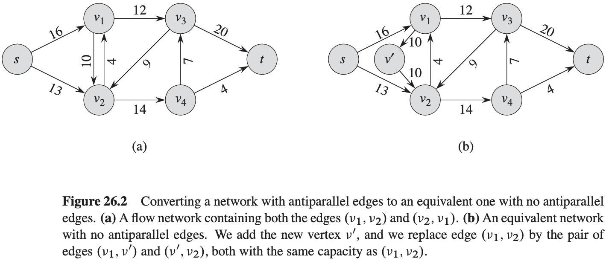
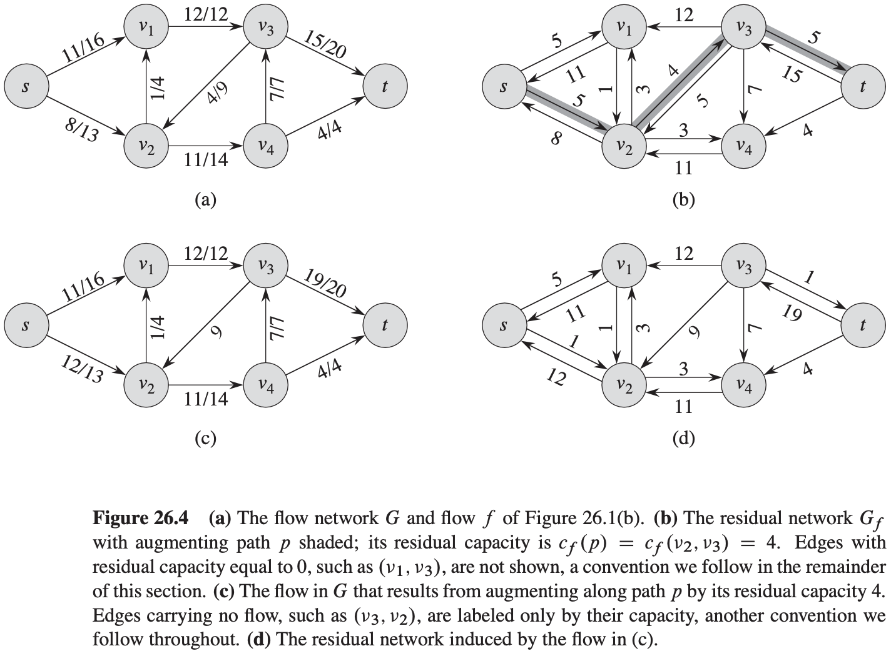

[中文版](chapter26_zh.md) | English

# 26 Maximum Flow

[TOC]

## Flow networks

Let $G = (V, E)$ be a flow network with a capacity function $c$. Let $s$ be the source of the network, and let $t$ be the sink. A `flow` in $G$ is a real-valued function $f: V \times V \rightarrow R$ that satisfies the following two properties:

- **Capacity constraint**: For all $u, v \in V$, we require $0 \leq f(u, v) \leq c(u, v)$.
- **Flow conservation**: For all $u \in V - \{s, t\}$, we require $\sum_{v \in V}f(v, u) = \sum_{v \in V} f(u, v)$.

We call the nonnegative quantity $f(u, v)$ the flow from vertex $u$ to vertex $v$. The **value** $|f|$ of a flow $f$ is defined as: $|f| = \sum_{v \in V} f(s, v) - \sum_{v \in V} f(v, s)$, that is, the total flow out of the source minus the flow into the source.

## The Ford-Fulkerson method

$$
\begin{align}
& FOR-FULKERSON-METHOD(G, s, t) \\
& initialize\ flow\ f\ to\ 0 \\
& while\ there\ exists\ an\ augmenting\ path\ p\ in\ the\ residual\ network\ G_f \\
& \qquad augment\ flow\ f\ along\ p \\
& return\ f
\end{align}
$$

Suppose that we have a flow network $G = (V, E)$ with source $s$ and sink $t$. Let $f$ be a flow in $G$, and consider a pair of vertices $u, v \in V$. We define the **residual capacity** $c_f(u, v)$by:
$$
c_f(u, v) = 
\begin{cases}
c(u, v) - f(u, v) &if(u, v) \in E\\
f(u, v) &if(v, u) \in E \\
0 &otherwise
\end{cases}
$$
, Because of our assumption that $(u, v) \in E$ implies $(v, u) \notin E$, exactly one case in above equation applies to each ordered pair of vertices.

Given a flow network $G = (V, E)$ and a flow $f$, the **residual network** of $G$ induced by $f$ is $G_f = (V, E_f)$, where:
$$
E_f = \{(u, v) \in V \times V: c_f(u, v) > 0\}
$$

**Lemma 26.1** Let $G = (V, E)$ be a flow network with source $s$ and sink $t$, and let $f$ be a flow in $G$. Let $G_f$ be the residual network of $G$ induced by $f$, and let $f'$ be a flow in $G_f$. Then the function $f \uparrow f'$ defined in equation (26.4) is a flow in $G$ with value $|f \uparrow f'| = |f| + |f'|$.

**Lemma 26.2** Let $G = (V, E)$ be a flow network, let $f$ be a flow in $G$, and let $p$ be an augmenting path in $G_f$. Define a function $f_p : V \times V \rightarrow R$ by:
$$
f_p(u, v) = 
\begin{cases}
c_f(p) &if (u, v) \text{ is on p} \\
0 &otherwise. 
\end{cases}
$$
, Then, $f_p$ is a flow-in $G_f$ with value $|f_p| = c_f(p) > 0$.

**Corollary 26.3** Let $G = (V, E)$ be a flow network, let $f$ be a flow in $G$, and let let $p$ be an augmenting path in $G_f$. Let $f_p$ be defined as in equation (26.8), and suppose that we augment $f$ by $f_p$. Then the function $f \uparrow f_p$ is a flow in $G$ with value $|f \uparrow f_p| = |f| + |f_p| > |f|$.

**Lemma 26.4** Let $f$ be a flow in a flow network $G$ with source $s$ and sink $t$, and let $(S, T)$ be any cut of $G$. Then the net flow across $(S, T)$ is $f(S, T) = |f|$.

**Corollary 26.5** The value of any flow $f$ in a flow network  $G$ is bounded from above by the capacity of any cut of $G$.

**Theorem 26.6 (Max-flow min-cut theorem)** If $f$ is a flow in a flow network $G = (V, E)$ with soruce $s$ and sink $t$, then the following conditions are equivalent:

1. $f$ is a maximum flow in $G$.
2. The residual network $G_f$ contains no augmenting paths.
3. $|f| = c(S, T)$ for some cut $(S, T)$ of $G$.

**The basic Ford-Fulkerson algorithm**
$$
\begin{align}
& FORD-FULKERSON(G, s, t) \\
& for\ each\ edge(u, v)\ \in G.E \\
& \qquad (u, v).f = 0 \\
& while\ there\ exists\ a\ path\ p\ from\ s\ to\ t\ in\ the\ residual\ network\ G_f \\
& \qquad c_f(p) = min\{c_f(u, v):(u, v)\ is\ in\ p\} \\
& \qquad for\ each\ edge(u, v)\ in\ p \\
& \qquad \qquad if(u, v) \in E \\
& \qquad \qquad \qquad (u, v).f = (u, v).f + c_f(p) \\
& \qquad \qquad else(v, u).f = (v, u).f - c_f(p)
\end{align}
$$

**Lemma 26.7** If the Edmonds-Karp algorithm is run on a flow network $G = (V, E)$ with source $s$ and sink $t$, then for all vertices $v \in V - \{s, t\}$, the shortest-path distance $\delta_{f}(s, v)$ in the residual network $G_f$ increases monotonically with each flow augmentation.

**Theorem 26.8** If the Edmonds-Karp algorithm is run on a flow network $G = (V, E)$ with source $s$ and sink $t$, then the total number of flow augmentations performed by the algorithm is $O(VE)$.

## Maximum bipartite matching

**Lemma 26.9** Let $G = (V, E)$ be a bipartite graph with vertex partition $V = L \cup R$, and let $G' = (V', E')$ be its corresponding flow network. If $M$ is a matching in $G$, then there is an integer-valued flow $f$ in $G'$ with value $|f| = |M|$. Conversely, if $f$ is an integer-valued flow in $G'$, then there is a matching $M$ in $G$ with cardinality $|M| = |f|$.

**Theorem 26.10 (Integrality theorem)** If the capacity function $c$ takes on only integral values, then the maximum flow $f$ produced by the Ford-Fulkerson method has the property that $|f|$ is an integer. Moreover, for all vertices $u$ and $v$, the value of $f(u, v)$ is an integer.

**Corollary 26.11** The cardinality of a maximum matching $M$ in a bipartite graph $G$ equals the value of a maximum flow $f$ in its corresponding flow network $G'$.

## Push-relabel algorithms

**Lemma 26.12** Let $G = (V, E)$ be a flow network, let $f$ be a preflow in $G$, and let $h$ be a height function on $V$. For any two vertices $u, v \in V$, if $h(u) > h(v) + 1$, then $(u, v)$ is not an edge in the residual network.

**The push operation**
$$
\begin{align}
& PUSH(u, v) \\
& //\ Applies\ when:\ u\ is\ overflowing, c_f(u, v) > 0, and\ u.h = v.h + 1. \\
& //\ Action:\ Push\ \bigtriangleup_{f}(u, v) = min(u.e, c_f(u, v))\ units\ of\ flow\ from\ u\ to\ v. \\
& if(u, v) \in E \\
& \qquad (u, v).f = (u, v).f + \bigtriangleup_{f}(u, v) \\
& else(v, u).f = (v, u).f - \bigtriangleup_{f}(u, v) \\
& u.e = u.e - \bigtriangleup_{f}(u, v) \\
& v.e = v.e + \bigtriangleup_{f}(u, v)
\end{align}
$$
**Lemma 26.13** After a nonsaturating push from $u$ to $v$, the vertex $u$ is no longer overflowing.
$$
\begin{align}
& RELABEL(u) \\
& //\ Applies\ when:u\ is\ overflowing\ and\ for\ all\ v \in V\ such\ that(u, v) \in E_f,\ we\ have\ u.h \leqslant v.h \\
& //\ Action:Increase\ the\ height\ of\ u. \\
& u.h = 1 + min\{v.h:(u, v)\in E_f\}
\end{align}
$$

$$
\begin{align}
& INITIALIZE-PREFLOW(G, s) \\
& for\ each\ vertex\ v \in G.V \\
& \qquad v.h = 0 \\
& \qquad v.e = 0 \\
& for\ each\ edge(u, v) \in G.E \\
& \qquad (u, v).f = 0 \\
& s.h = |G.V| \\
& for\ each\ vertex\ v \in s.Adj \\
& \qquad (s, v).f = c(s, v) \\
& \qquad v.e = c(s, v) \\
& \qquad s.e = s.e - c(s, v)
\end{align}
$$

$$
\begin{align}
& GENERIC-PUSH-RELABEL(G) \\
& INITIALIZE-PREFLOW(G, s) \\
& while\ there\ exists\ an\ applicable\ push\ or\ relabel\ operation \\
& \qquad select\ an\ applicable\ push\ or\ relabel\ operation\ and\ perform\ it
\end{align}
$$

**Lemma 26.14 (An overflowing vertex can be either pushed or relabeled)** Let $G = (V, E)$ be a flow network with source $s$ and sink $t$, let $f$ be a preflow, and let $h$ be any height function for $f$. If $u$ is any overflowing vertex, then either a push or relabel operation applies to it.

**Lemma 26.15 (Vertex heights never decrease)** During the execution of the $GENERIC-PUSH-RELABEL$ procedure on a flow network $G = (V, E)$, for each vertex $u \in V$, the height $u.h$ never decreases. Moreover, whenever a relabel operation is applied to a vertex $u$, its height $u.h$ increases by at least 1.

**Lemma 26.16** Let $G = (V, E)$ be a flow network with source $s$ and sink $t$. Then the execution of $GENERIC-PUSH-RELABEL$ on $G$ maintains the attribute $h$ as a height function.

**Lemma 26.17** Let $G = (V, E)$ be a flow network with source $s$ and sink $t$, let $f$ be a preflow in $G$, and let $h$ be a height function on $V$. Then there is no path from the source $s$ to the sink $t$ in the residual network $G_f$.

**Theorem 26.18 (Correctness of the generic push-relabel algorithm)** If the algorithm $GENERIC-PUSH-RELABEL$ terminates when run on a flow network $G = (V, E)$ with source $s$ and sink $t$, then the preflow $f$ it computes is a maximum flow for $G$.

**Lemma 26.19** Let $G = (V, E)$ be a flow network with source $s$ and sink $t$, and let $f$ be a preflow in $G$. Then, for any overflowing vertex $x$, there is a simple path from $x$ to $s$ in the residual network $G_f$.

**Lemma 26.20** Let $G = (V, E)$ be a flow network with source $s$ and sink $t$. At any time during the execution of $GENERIC-PUSH-RELABEL$ on $G$, we have $u.h \leq 2|V| - 1$ for all vertices $u \in V$.

**Corollary 26.21 (Bound on relabel operations)** Let $G = (V, E)$ be a flow network with source $s$ and sink $t$. Then, during the execution of $GENERIC-PUSH-RELABEL$ on $G$, the number of relabel operations is at most $2|V| - 1$ per vertex and at most $(2|V| - 1)(|V| - 2) < 2|V|^2$ overall.

**Lemma 26.22 (Bound on saturating pushes)** During the execution of $GENERIC-PUSH-RELABEL$ on any flow network $G = (V, E)$, the number of saturating pushes is less than $2|V||E|$.

**Lemma 26.23 (Bound on nonsaturating pushes)** During the execution of $GENERIC-PUSH-RELABEL$ on any flow network $G = (V, E)$, the number of nonsaturating pushes is less than $4|V|^2(|V| + |E|)$.

**Theorem 26.24** During the execution of $GENERIC-PUSH-RELABEL$ on any flow network $G = (V, E)$, the number of basic operations is $O(V^2 E)$.

**Corollary 26.25** There is an implementation of the generic push-relabel algorithm that runs in $O(V^2 E)$ time on any flow network $G = (V, E)$.

## The relabel-to-front algorithm

**Admissible edges and networks**

If $G = (V, E)$ is a flow network with source $s$ and sink $t$, $f$ is a preflow in $G$, and $h$ is a height function, then we say that $(u, v)$ is an **admissible edge** if $c_f(u, v) > 0$ and $h(u) = h(v) + 1$. Otherwise, $(u, v)$ is **inadmissible**. The **admissible network** is $G_{f,h} = (V, E_{f,h})$, where $E_{f,h}$ is the set of admissible edges.

**Lemma 26.26 (The admissible network is acyclic)** If $G = (V, E)$ is a flow network, $f$ is a preflow in $G$, and $h$ is a height function on $G$, then the admissible network $G_{f,h} = (V, E_{f,h})$ is acyclic.

**Lemma 26.27** Let $G = (V, E)$ be a flow network, let $f$ be a preflow in $G$, and suppose that the attribute $h$ is a height function. If a vertex $u$ is overflowing and $(u, v)$ is an admissible edge, then $PUSH(u, v)$ applies. The operation does not create any new admissible edges, but it may cause $(u, v)$ to become inadmissible.

**Lemma 26.28** Let $G = (V, E)$ be a flow network, let $f$ be a preflow in $G$, and suppose that the attribute $h$ is a height function. If a vertex $u$ is overflowing and there are no admissible edges leaving $u$, then $RELABEL(u)$ applies. After the relabel operation, there is at least one admissible edge leaving $u$, but there are no admissible edges entering $u$.

**Discharging an overflowing vertex**
$$
\begin{align}
& DISCHARGE(u) \\
& while\ u.e > 0 \\
& \qquad v = u.current \\
& \qquad if\ v == NIL \\
& \qquad \qquad RELABEL(u) \\
& \qquad \qquad u.current = u.N.head \\
& \qquad elseif\ c_f(u, v) > 0\ and\ u.h == v.h + 1 \\
& \qquad \qquad PUSH(u, v) \\
& \qquad else\ u.current = v.next - neighbor
\end{align}
$$

**Lemma 26.29** If $DISCHARGE$ calls $PUSH(u, v)$ in line 7, then a push operation applies to $(u, v)$. If $DISCHARGE$ calls $RELABEL(u)$ in line 4, then a relabel operation applies to $u$.

**The relabel-to-front algorithm**
$$
\begin{align}
& RELABEL-TO-FRONT(G, s, t) \\
& INITIALIZE-PREFLOW(G, s) \\
& L = G.V - \{s, t\},in\ any\ order \\
& for\ each\ vertex\ u \in G.V - \{s, t\} \\
& \qquad u.current = u.N.head \\
& u = L.head \\
& while\ u \neq NIL \\
& \qquad old - height = u.h \\
& \qquad DISCHARGE(u) \\
& \qquad if\ u.h > old - height \\
& \qquad \qquad move\ u\ to\ the\ front\ of\ list\ L \\
& \qquad \qquad u = u.next 
\end{align}
$$

**Theorem 26.30** The running time of $RELABEL-TO-FRONT$ on any flow network $G = (V, E)$ is $O(V^3)$.

The running time of $RELABEL-TO-FRONT$ is therefore $O(V^3 + VE)$, which is $O(V^3)$.
