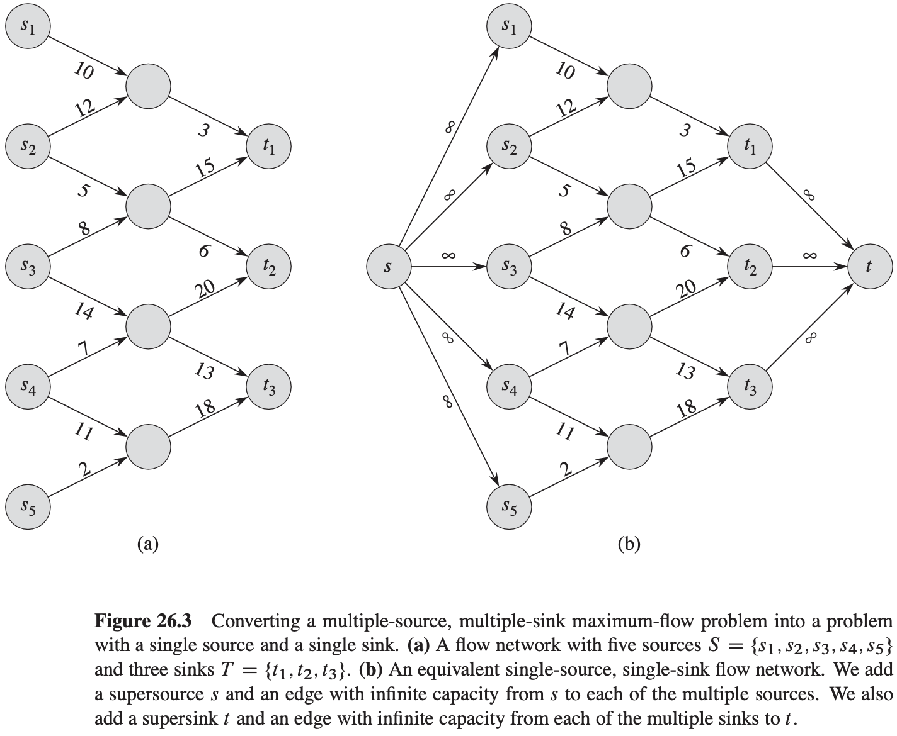

# 第26章 最大流

## 26.1 流网络

设$G = (V, E)$为一个流网络，其容量函数为$c$。设$s$为网络的源结点，$t$为汇点。$G$中的流是一个实值函数$f: V \times V \rightarrow R$，满足下面的两条性质：

- **容量限制**：对于所有的结点$u, v \in V$，要求$0 \leqslant f(u, v) \leqslant c(u, v)$。
- **流量守恒**：对于所有的结点$u \in V - \{s, t\}$，要求$\sum_{v \in V}f(v, u) = \sum_{v \in V} f(u, v)$。

一个流$f$的值$|f|$定义如下：$|f| = \sum_{v \in V} f(s, v) - \sum_{v \in V} f(v, s)$。

## 26.2 Ford-Fulkerson方法

$$
\begin{align}
& FOR-FULKERSON-METHOD(G, s, t) \\
& initialize\ flow\ f\ to\ 0 \\
& while\ there\ exists\ an\ augmenting\ path\ p\ in\ the\ residual\ network\ G_f \\
& \qquad augment\ flow\ f\ along\ p \\
& return\ f
\end{align}
$$

假定有一个流网络$G = (V, E)$，其源节点为$s$，汇点为$t$。设$f$为图$G$中的一个流，考虑结点对$u, v \in V$，定义残存容量$c_f (u, v)$如下：
$$
c_f(u, v) = 
\begin{cases}
c(u, v) - f(u, v) &若(u, v) \in E\\
f(u, v) &若(v, u) \in E \\
0 &其它
\end{cases}
$$
给定一个流网络$G = (V, E)$和一个流$f$，则由$f$所诱导的图$G$的残存网络为$G_f = (V, E_f)$，其中$E_f = \{(u, v) \in V \times V: c_f(u, v) > 0\}$。

**引理 26.1** 设$G = (V, E)$为一个流网络，源结点为$s$，汇点为$t$，设$f$为$G$中的一个流。设$G_f$为由流$f$所诱导的$G$的残存网络，设$f'$为$G_f$中的一个流。那么公式：
$$
(f \uparrow f')(u, v) =
\begin{cases}
f(u, v) + f'(u, v) - f'(v, u) &若(u, v) \in E\\
0 &其它 \\
\end{cases}
$$
所定义的函数$f \uparrow f'$是$G$的一个流，其值为$|f \uparrow f'| = |f| + |f'|$。

**引理 26.2** 设$G = (V, E)$为一个流网络，设$f$为图$G$中的一个流，设$p$为残存网络$G_f$中的一条增广路径。定义一个函数$f_p : V \times V \rightarrow R$如下：
$$
f_p(u, v) = 
\begin{cases}
c_f(p) &若(u, v)在p上 \\
0 &其他 
\end{cases}
$$
则$f_p$是残存网络$G_f$中的一个流，其值为$|f_p| = c_f(p) > 0$。

**推论 26.3** 设$G = (V, E)$为一个流网络，设$f$为$G$中的一个流，设$p$为残存网络$G_f$中的一条增广路径。设$f_p$由公式：
$$
f_p(u, v) = 
\begin{cases}
c_f(p) &若(u, v)在p上 \\
0 &其他 
\end{cases}
$$
所定义，假定将$f$增加$f_p$的量，则函数$f \uparrow f_p$是图$G$中的一个流，其值为$|f \uparrow f_p| = |f| + |f_p| > |f|$。

**引理 26.4** 设$f$为流网络$G$的一个流，该流网络的源节点为$s$，汇点为$t$，设$(S, T)$为流网络$G$的任意切割，则横跨切割$(S, T)$的净流量为$f(S, T) = |f|$。

**推论 26.5** 流网络$G$中任意流$f$的值不能超过$G$的任意切割的容量。

**定理 26.6**（最大流最小切割定理）设$f$为流网络$G = (V, E)$中的一个流，该流网络的源结点为$s$，汇点为$t$，则下面的条件是等价的：

1. $f$是$G$的一个最大流。
2. 残存网络$G_f$不包括任何增广路径。
3. $|f| = c(S, T)$，其中$(S, T)$是流网络$G$的某个切割。

**基本的Ford-Fulkerson算法**
$$
\begin{align}
& FORD-FULKERSON(G, s, t) \\
& for\ each\ edge(u, v)\ \in G.E \\
& \qquad (u, v).f = 0 \\
& while\ there\ exists\ a\ path\ p\ from\ s\ to\ t\ in\ the\ residual\ network\ G_f \\
& \qquad c_f(p) = min\{c_f(u, v):(u, v)\ is\ in\ p\} \\
& \qquad for\ each\ edge(u, v)\ in\ p \\
& \qquad \qquad if(u, v) \in E \\
& \qquad \qquad \qquad (u, v).f = (u, v).f + c_f(p) \\
& \qquad \qquad else(v, u).f = (v, u).f - c_f(p)
\end{align}
$$

**引理 26.7** 如果Edmonds-Karp算法运行在流网络$G = (V, E)$上，该网络的源结点为$s$汇点为$t$，则对于所有的结点$v \in V - \{s, t\}$，残存网络$G_f$中的最短路径距离$\delta_{f}(s, v)$随着每次流量的递增而单调递增。

**定理 26.8** 如果Edmonds-Karp算法运行在源结点为$s$汇点为$t$的流网络$G = (V, E)$上，则该算法所执行的流量递增操作的总次数为$O(VE)$。

## 26.3 最大二分匹配

**引理 26.9** 设$G = (V, E)$为一个二分图，其结点划分为$V = L \cup R$，设$G' = (V', E')$是图$G$所对应的流网络。如果$M$是$G$中的一个匹配，则流网络$G'$中存在一个整数值的流$f$，使得$|f| = |M|$。相反，如果$f$是$G'$中的一个整数值的流，则$G$中存在一个匹配$M$，使得$|M| = |f|$。

**定理 26.10**（完整性定理）如果容量函数$c$只能取整数值，则$Ford-Fulkerson$方法所生成的最大流$f$满足$|f|$是整数值的性质。而且，对于所有的结点$u$和$v$，$f(u, v)$的值都是整数。

**推论 26.11** 二分图$G$中的一个最大匹配$M$的基数等于其对应的流网络$G'$中某一最大流$f$的值。

## 26.4 推送-重贴标签算法

**引理 26.12** 设$G = (V, E)$为一个流网络，设$f$为$G$的预流，设$h$为$V$上的高度函数。对于任意两个结点$u, v \in V$，如果$h(u) > h(v) + 1$，则$(u, v)$不是残存网络中的一条边。

**推送操作**
$$
\begin{align}
& PUSH(u, v) \\
& //\ Applies\ when:\ u\ is\ overflowing, c_f(u, v) > 0, and\ u.h = v.h + 1. \\
& //\ Action:\ Push\ \bigtriangleup_{f}(u, v) = min(u.e, c_f(u, v))\ units\ of\ flow\ from\ u\ to\ v. \\
& if(u, v) \in E \\
& \qquad (u, v).f = (u, v).f + \bigtriangleup_{f}(u, v) \\
& else(v, u).f = (v, u).f - \bigtriangleup_{f}(u, v) \\
& u.e = u.e - \bigtriangleup_{f}(u, v) \\
& v.e = v.e + \bigtriangleup_{f}(u, v)
\end{align}
$$
**引理 26.13** 在从结点$u$到结点$v$的一个非饱和推送操作后，结点$u$将不再溢出。
$$
\begin{align}
& RELABEL(u) \\
& //\ Applies\ when:u\ is\ overflowing\ and\ for\ all\ v \in V\ such\ that(u, v) \in E_f,\ we\ have\ u.h \leqslant v.h \\
& //\ Action:Increase\ the\ height\ of\ u. \\
& u.h = 1 + min\{v.h:(u, v)\in E_f\}
\end{align}
$$

$$
\begin{align}
& INITIALIZE-PREFLOW(G, s) \\
& for\ each\ vertex\ v \in G.V \\
& \qquad v.h = 0 \\
& \qquad v.e = 0 \\
& for\ each\ edge(u, v) \in G.E \\
& \qquad (u, v).f = 0 \\
& s.h = |G.V| \\
& for\ each\ vertex\ v \in s.Adj \\
& \qquad (s, v).f = c(s, v) \\
& \qquad v.e = c(s, v) \\
& \qquad s.e = s.e - c(s, v)
\end{align}
$$

$$
\begin{align}
& GENERIC-PUSH-RELABEL(G) \\
& INITIALIZE-PREFLOW(G, s) \\
& while\ there\ exists\ an\ applicable\ push\ or\ relabel\ operation \\
& \qquad select\ an\ applicable\ push\ or\ relabel\ operation\ and\ perform\ it
\end{align}
$$

**引理 26.14**（可以对溢出结点执行推送或重贴标签操作）设$G = (V, E)$是一个源结点为$s$汇点为$t$的流网络，设$f$为一个预流，$h$为$f$的任意高度函数。如果$u$是一个溢出结点，则要么可以对结点$u$执行推送操作，要么可以对其执行重贴标签操作。

**引理 26.15**（结点高度从来不会降低）在一个流网络$G = (V, E)$上执行$GENERIC-PUSH-RELABEL$算法的过程中，对于每个结点$u \in V$，其高度$v.h$从来不会减少。而且，每当一个重贴标签操作应用到结点$u$上时，其高度$u.h$至少增加1个单位。

**引理 26.16** 设$G = (V, E)$是一个源结点为$s$汇点为$t$的流网络，则$GENERIC-PUSH-RESLABEL$算法在$G$上执行的过程中，将维持属性$h$作为一个高度函数。

**引理 26.17** 设$G = (V, E)$是一个源结点为$s$汇点为$t$的流网络，设$f$为$G$中的一个预流，$h$为$V$上的一个高度函数。那么在残存网络$G_f$中不存在一条从源结点$s$到汇点$t$的路径。

**定理 26.18**（通用的推送-重贴标签算法的正确性）设$G = (V, E)$是一个源节点为$s$汇点为$t$的流网络，如果算法$GENERIC-PUSH-RELABEL$在图G上运行时能够终止，则该算法所计算出的预流$f$是图G的一个最大流。

**引理 26.19** 设$G = (V, E)$是源结点为$s$汇点为$t$的一个流网络，设$f$是$G$