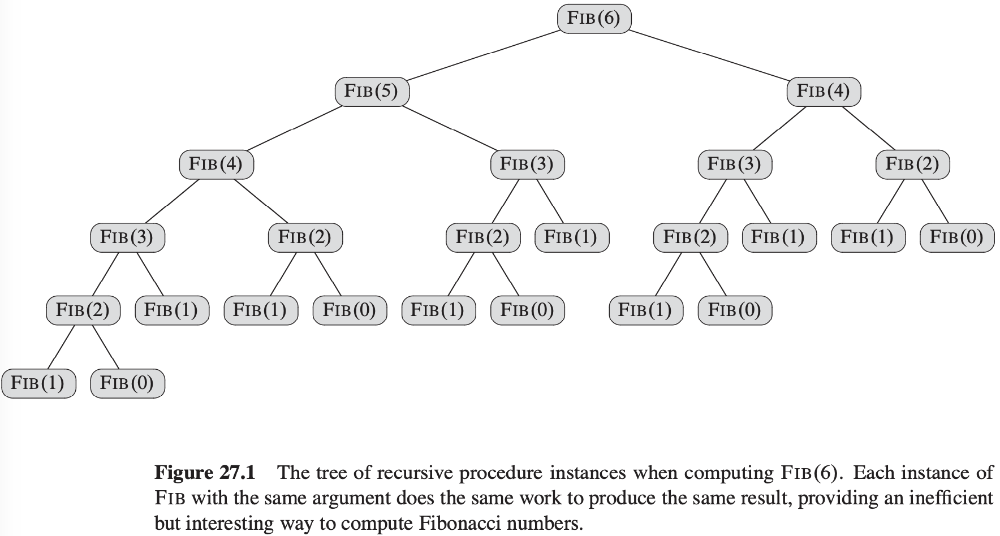
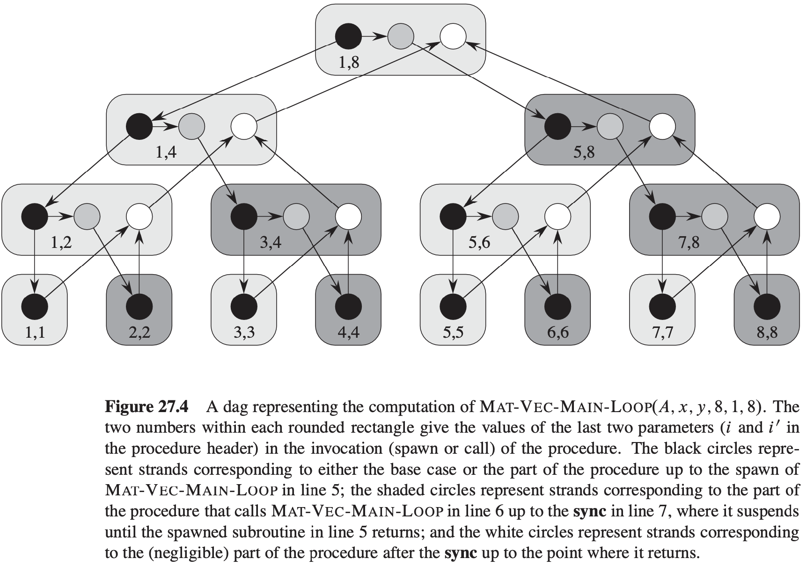
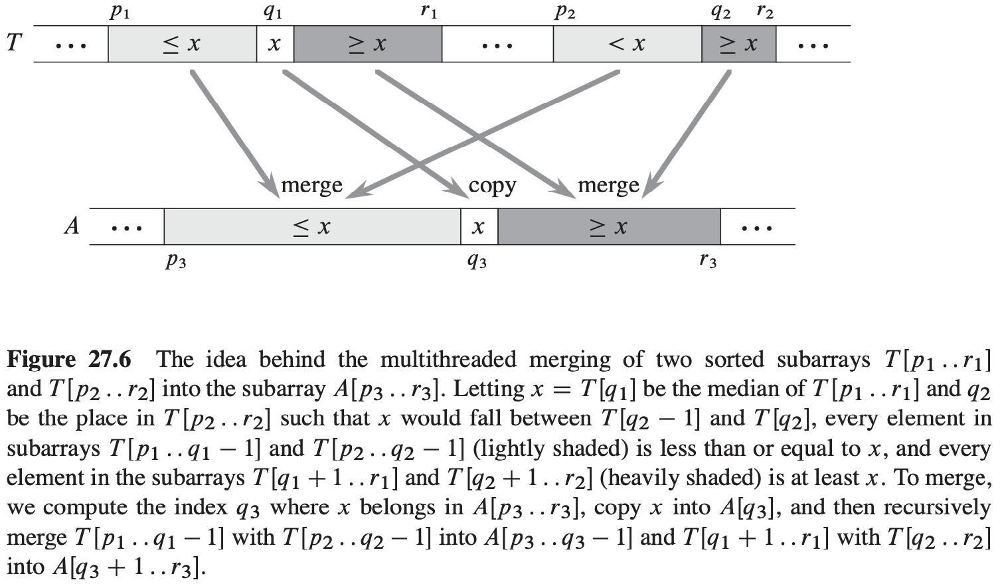

[中文版](chapter27_zh.md) | English

# 27 Multithreaded Algorithms

[TOC]

Our model for dynamic multithreading offers several important advantages:

- It is a simple extension of our serial programming model.
- It provides a theoretically clean way to quantify parallelism based on the notions of "work" and "span".
- Many multithreaded algorithms involving nested parallelism follow naturally from the divide-and-conquer paradigm.
- The model is faithful to how parallel-computing practice is evolving.

## The basics of dynamic multithreading

$$
\begin{align}
& P-FIB(n) \\
& if\ n \leqslant 1 \\
& \qquad return\ n \\
& else\ x = spawn\ P-FIB(n - 1) \\
& \qquad y = P-FIB(n - 2) \\
& \qquad sync \\
& \qquad return\ x + y
\end{align}
$$
**A model for multithreaded execution**

**Performance measures**

The work and span provide lower bounds on the running time $T_P$ of a multithreaded computation on $P$ processors:

- In one step, an ideal parallel computer with $P$ processors can do at most $P$ units of work, and thus in $T_P$ time, it can perform at most $PT_P$ work. Since the total work to do is $T_1$, we have $PT_P \geq T_1$. Dividing by $P$ yields the **work law**:
  $$
  T_P \geq T_1 / P
  $$

- A $P$-processor ideal parallel computer cannot run any faster than a machine with an unlimited number of processors. Looked at another way, a machine with an unlimited number of processors can emulate a $P$-processor machine by using just $P$ of its processors. Thus, the **span law** follows:
  $$
  T_P \geq T_{\infty}
  $$

**Scheduling**

**Theorem 27.1** On an ideal parallel computer with $P$ processors, a greedy scheduler executes a multithreaded computation with work $T_1$ and span $T_{\infty}$ in time: $T_p \leq T_1 / P + T_{\infty}$.

**Corollary 27.2** The running time $T_P$ of any multithreaded computation scheduled by a greedy scheduler on an ideal parallel computer with $P$ processors is within a factor of 2 of optimal.

**Corollary 27.3** Let $T_P$ be the running time of a multithreaded computation produced by a greedy scheduler on an ideal parallel computer with $P$ processors, and let $T_1$ and $T_{\infty}$ be the work and span of the computation, respectively. Then, if $P \ll (T_1 / T_{\infty})$, we have $T_p \approx T_1 / P$, or equivalently, a speedup of approximately $P$.

**Analyzing multithreaded algorithms**

**Parallel loops**
$$
\begin{align}
& MAT-VEC(A, x) \\
& n = A.rows \\
& let\ y\ be\ a\ new\ vector\ of\ length\ n \\
& parallel\ for\ i = 1\ to\ n \\
& \qquad y_i = 0 \\
& parallel\ for\ i = 1\ to\ n \\
& \qquad for\ j = 1\ to\ n \\
& \qquad \qquad y_i = y_i + a_{ij}x_j \\
& return\ y
\end{align}
$$

Since the depth of recursive calling is logarithmic in the number of iterations, for a parallel loop with $n$ iterations in which the $i$th iteration has span $iter_{\infty}(i)$, the span is: $T_{\infty}(n) = \theta(lgn) + max_{1 \leq i \leq n} iter_{\infty}(i)$.

**Race conditions**

$$
\begin{align}
& MAT-VEC-WRONG(A, x) \\
& n = A.rows \\
& let\ y\ be\ a\ new\ vector\ of\ length\ n \\
& parallel\ for\ i = 1\ to\ n \\
& \qquad y_i = 0 \\
& parallel\ for\ i = 1\ to\ n \\
& \qquad parallel\ for\ j = 1\ to\ n \\
& \qquad \qquad y_i = y_i + a_{ij}x_j \\
& return\ y
\end{align}
$$

## Multithreaded matrix multiplication

**Multithreaded matrix multiplication**
$$
\begin{align}
& P-SQUARE-MATRIX-MULTIPLY(A, B) \\
& n = A.rows \\
& let\ C\ be\ a\ new\ n \times n\ matrix \\
& parallel\ for\ i = 1\ to\ n \\
& \qquad parallel\ for\ j = 1\ to\ n \\
& \qquad \qquad c_{ij} = 0 \\
& \qquad \qquad for\ k = 1\ to\ n \\
& \qquad \qquad \qquad c_{ij} = c_{ij} + a_{ik} \cdot b_{kj} \\
& return\ C
\end{align}
$$
**A divide-and-conquer multithreaded algorithm for matrix multiplication**
$$
\begin{align}
& P-MATRIX-MULTIPLY-RECURSIVE(C, A, B) \\
& n = A.rows \\
& if\ n == 1 \\
& \qquad c_{11} = a_{11}b_{11} \\
& else\ let\ T\ be\ a\ new\ n \times n\ matrix \\
& \qquad partition\ A, B, C,\ and\ T\ into\ n/2 \times n/2\ submatrices\ A_{11}, A_{12}, A_{21}, A_{22}; B_{11}, B_{12}, B_{21}, B_{22}; C_{11}, C_{12}, C_{21}, C_{22};\ and\ T_{11}, T_{12}, T_{21}, T_{22}; respectively \\
& \qquad spawn P-MATRIX-MULTIPLY-RECURSIVE(C_{11}, A_{11}, B_{11}) \\
& \qquad spawn P-MATRIX-MULTIPLY-RECURSIVE(C_{12}, A_{11}, B_{12}) \\
& \qquad spawn P-MATRIX-MULTIPLY-RECURSIVE(C_{21}, A_{21}, B_{11}) \\
& \qquad spawn P-MATRIX-MULTIPLY-RECURSIVE(C_{22}, A_{21}, B_{12}) \\
& \qquad spawn P-MATRIX-MULTIPLY-RECURSIVE(C_{11}, A_{12}, B_{21}) \\
& \qquad spawn P-MATRIX-MULTIPLY-RECURSIVE(C_{12}, A_{12}, B_{22}) \\
& \qquad spawn P-MATRIX-MULTIPLY-RECURSIVE(C_{21}, A_{22}, B_{21}) \\
& P-MATRIX-MULTIPLY-RECURSIVE(T_{22}, A_{22}, B_{22}) \\
& sync \\
& parallel\ for\ i = 1\ to\ n \\
& \qquad parallel\ for\ j = 1\ to\ n \\
& \qquad \qquad c_{ij} = c_{ij} + t_{ij}
\end{align}
$$

## Multithreaded merge sort

$$
\begin{align}
& MERGE-SORT'(A, p, r) \\
& if\ p < r \\
& \qquad q = \lfloor (p + r) / 2 \rfloor \\
& \qquad spawn\ MERGE-SORT'(A, p, q) \\
& \qquad MERGE-SORT'(A, q + 1, r) \\
& \qquad sync \\
& \qquad MERGE(A, p, q, r)
\end{align}
$$

**Multithreaded merge sort**
$$
\begin{align}
& P-MERGE-SORT(A, p, r, B, s) \\
& n = r - p + 1 \\
& if\ n == 1 \\
& \qquad B[s] = A[p] \\
& else\ let\ T[1..n]\ be\ a\ new\ array \\
& \qquad q = \lfloor (p + r)/2 \rfloor
& \qquad q' = q - p + 1 \\
& \qquad spawn\ P-MERGE-SORT(A, p, q, T, 1) \\
& \qquad P-MERGE-SORT(A, q + 1, r, T, q' + 1) \\
& \qquad sync \\
& \qquad P-MERGE(T, 1, q', q' + 1, n, B, s)
\end{align}
$$
