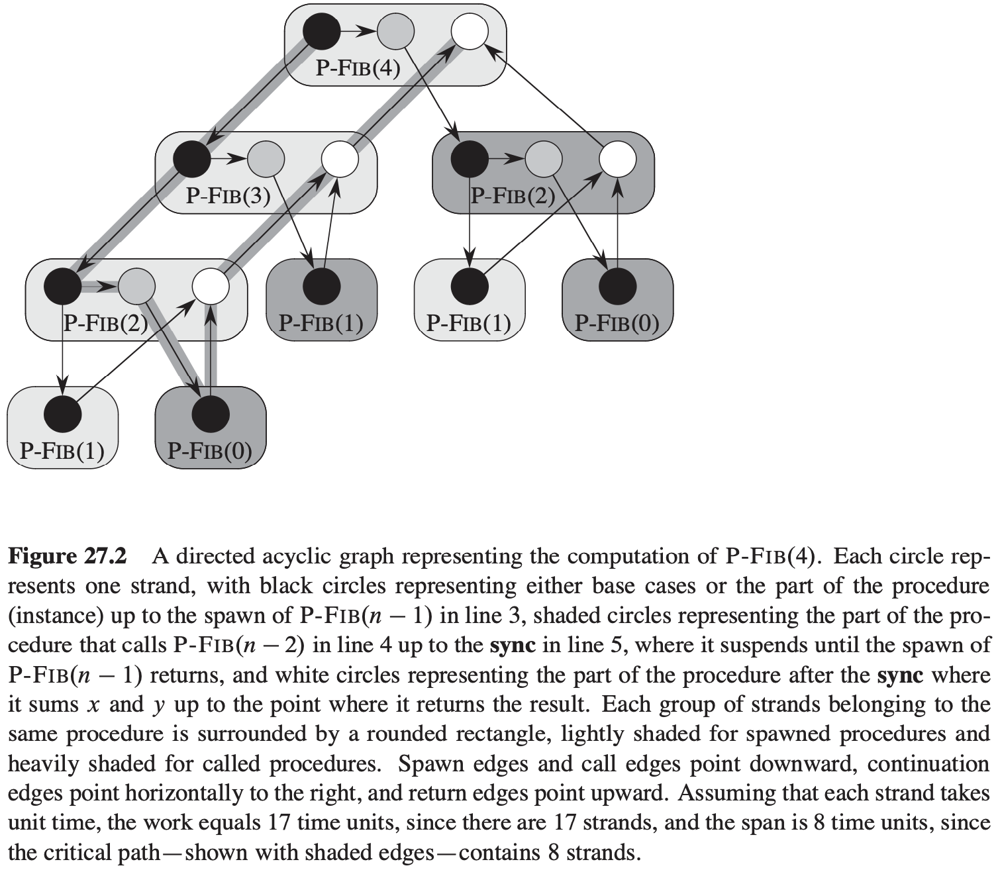
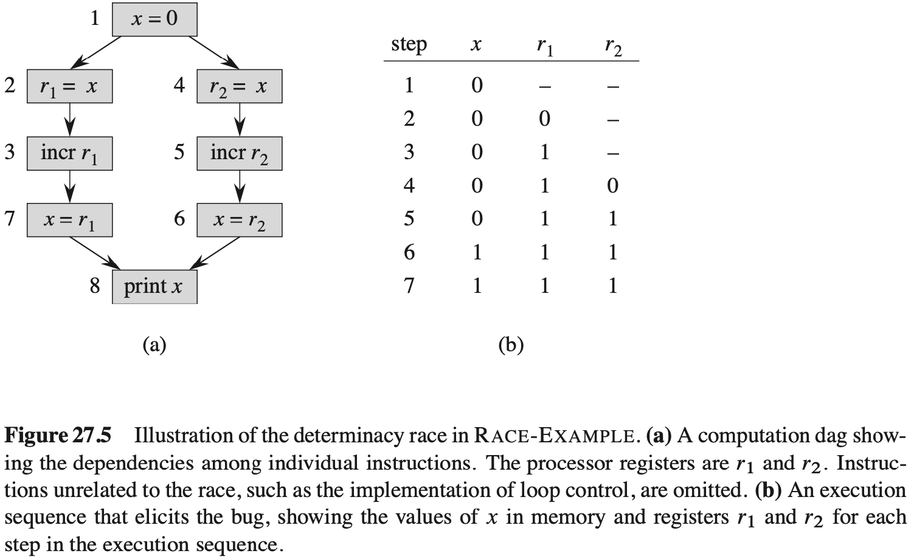

# 第27章 多线程算法

动态多线程模型具有如下重要优点：

- 它是串行编程模型的一个简单扩展。
- 它从理论上提供了一种基于“工作量”和"持续时间"概念的简洁方式来量化并行性。
- 许多涉及嵌套并行的多线程算法都比较自然地服从分治模式。
- 该模型符合并行计算发展的实际情况。

## 27.1 动态多线程基础

$$
\begin{align}
& P-FIB(n) \\
& if\ n \leqslant 1 \\
& \qquad return\ n \\
& else\ x = spawn\ P-FIB(n - 1) \\
& \qquad y = P-FIB(n - 2) \\
& \qquad sync \\
& \qquad return\ x + y
\end{align}
$$
**多线程执行的模型**

**性能度量**

度量多线程算法理论效率的衡量标准：

- 工作量（work）
- 持续时间（span）

work和span为$P$个处理器的一个多线程计算提供了下界：

- 对于一个计算步，一台有$P$个处理器的理想并行计算机最多能做$P$个单位工作量，所以在$T_p$时间内最多能做$PT_p$的工作量。因为要做的总工作量是$T_1$，于是有$PT_p \geqslant T_1$。两边都除以$P$后，就得到**工作量定律（work law）**：$T_p \geqslant T_1 / P$。
- 一台有$P$个处理器的理想并行计算机不可能快于一台有无限个处理器的机器。从另一种方式看，一台有无限个处理器的机器可以只使用其中的$P$个处理器来模拟一台有$P$个处理器的计算机。因此，得到下面的**持续时间定律（span law）**：$T_p \geqslant T_{\infty}$。

**调度**

**定理 27.1** 在有$P$个处理器的理想计算机上，贪心调度器执行一个工作量为$T_1$和持续时间为$T_{\infty}$的多线程计算的运行时间为：$T_p \leqslant T_1 / P + T_{\infty}$。

**推论 27.2** 对于一台有$P$个处理器的理想并行计算机，使用贪心调度器调度的任何多线程计算的运行时间$T_p$都在最优时间的2倍以内。

**推论 27.3** 设$T_p$是一个贪心调度器在$P$个处理器的理想并行计算机上调度多线程计算所产生的运行时间，$T_1$和$T_{\infty}$分别是计算的工作量和持续时间。如果$P \ll (T_1 / T_{\infty})$，则有$T_p \approx T_1 / P$，或等价地，一个接近$P$的加速比。

**多线程算法的分析**

**并行循环**
$$
\begin{align}
& MAT-VEC(A, x) \\
& n = A.rows \\
& let\ y\ be\ a\ new\ vector\ of\ length\ n \\
& parallel\ for\ i = 1\ to\ n \\
& \qquad y_i = 0 \\
& parallel\ for\ i = 1\ to\ n \\
& \qquad for\ j = 1\ to\ n \\
& \qquad \qquad y_i = y_i + a_{ij}x_j \\
& return\ y
\end{align}
$$

对于一个有$n$次迭代且第$i$次迭代的持续时间是$iter_{\infty}(i)$的并行循环，整个持续时间是：$T_{\infty}(n) = \theta(lgn) + max_{1 \leqslant i \leqslant n} iter_{\infty}(i)$。

**竞争条件**

$$
\begin{align}
& MAT-VEC-WRONG(A, x) \\
& n = A.rows \\
& let\ y\ be\ a\ new\ vector\ of\ length\ n \\
& parallel\ for\ i = 1\ to\ n \\
& \qquad y_i = 0 \\
& parallel\ for\ i = 1\ to\ n \\
& \qquad parallel\ for\ j = 1\ to\ n \\
& \qquad \qquad y_i = y_i + a_{ij}x_j \\
& return\ y
\end{align}
$$

## 27.2 多线程矩阵乘法

**矩阵乘法的多线程算法**
$$
\begin{align}
& P-SQUARE-MATRIX-MULTIPLY(A, B) \\
& n = A.rows \\
& let\ C\ be\ a\ new\ n \times n\ matrix \\
& parallel\ for\ i = 1\ to\ n \\
& \qquad parallel\ for\ j = 1\ to\ n \\
& \qquad \qquad c_{ij} = 0 \\
& \qquad \qquad for\ k = 1\ to\ n \\
& \qquad \qquad \qquad c_{ij} = c_{ij} + a_{ik} \cdot b_{kj} \\
& return\ C
\end{align}
$$
**矩阵乘法的分治多线程算法**
$$
\begin{align}
& P-MATRIX-MULTIPLY-RECURSIVE(C, A, B) \\
& n = A.rows \\
& if\ n == 1 \\
& \qquad c_{11} = a_{11}b_{11} \\
& else\ let\ T\ be\ a\ new\ n \times n\ matrix \\
& \qquad partition\ A, B, C,\ and\ T\ into\ n/2 \times n/2\ submatrices\ A_{11}, A_{12}, A_{21}, A_{22}; B_{11}, B_{12}, B_{21}, B_{22}; C_{11}, C_{12}, C_{21}, C_{22};\ and\ T_{11}, T_{12}, T_{21}, T_{22}; respectively \\
& \qquad spawn P-MATRIX-MULTIPLY-RECURSIVE(C_{11}, A_{11}, B_{11}) \\
& \qquad spawn P-MATRIX-MULTIPLY-RECURSIVE(C_{12}, A_{11}, B_{12}) \\
& \qquad spawn P-MATRIX-MULTIPLY-RECURSIVE(C_{21}, A_{21}, B_{11}) \\
& \qquad spawn P-MATRIX-MULTIPLY-RECURSIVE(C_{22}, A_{21}, B_{12}) \\
& \qquad spawn P-MATRIX-MULTIPLY-RECURSIVE(C_{11}, A_{12}, B_{21}) \\
& \qquad spawn P-MATRIX-MULTIPLY-RECURSIVE(C_{12}, A_{12}, B_{22}) \\
& \qquad spawn P-MATRIX-MULTIPLY-RECURSIVE(C_{21}, A_{22}, B_{21}) \\
& P-MATRIX-MULTIPLY-RECURSIVE(T_{22}, A_{22}, B_{22}) \\
& sync \\
& parallel\ for\ i = 1\ to\ n \\
& \qquad parallel\ for\ j = 1\ to\ n \\
& \qquad \qquad c_{ij} = c_{ij} + t_{ij}
\end{align}
$$
**多线程Strassen算法**

## 27.3 多线程归并排序

$$
\begin{align}
& MERGE-SORT'(A, p, r) \\
& if\ p < r \\
& \qquad q = \lfloor (p + r) / 2 \rfloor \\
& \qquad spawn\ MERGE-SORT'(A, p, q) \\
& \qquad MERGE-SORT'(A, q + 1, r) \\
& \qquad sync \\
& \qquad MERGE(A, p, q, r)
\end{align}
$$

**多线程归并的分析**

**多线程归并排序**
$$
\begin{align}
& P-MERGE-SORT(A, p, r, B, s) \\
& n = r - p + 1 \\
& if\ n == 1 \\
& \qquad B[s] = A[p] \\
& else\ let\ T[1..n]\ be\ a\ new\ array \\
& \qquad q = \lfloor (p + r)/2 \rfloor
& \qquad q' = q - p + 1 \\
& \qquad spawn\ P-MERGE-SORT(A, p, q, T, 1) \\
& \qquad P-MERGE-SORT(A, q + 1, r, T, q' + 1) \\
& \qquad sync \\
& \qquad P-MERGE(T, 1, q', q' + 1, n, B, s)
\end{align}
$$
**多线程归并排序分析**

