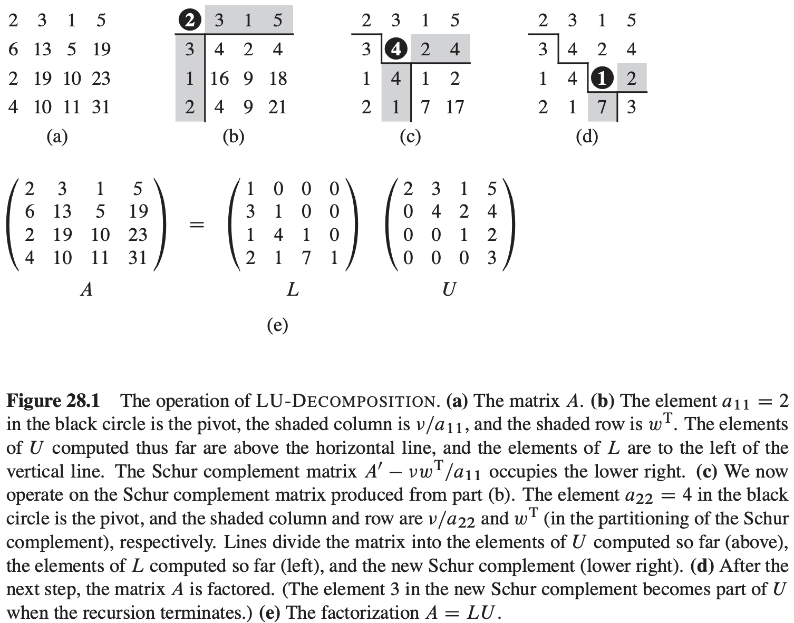
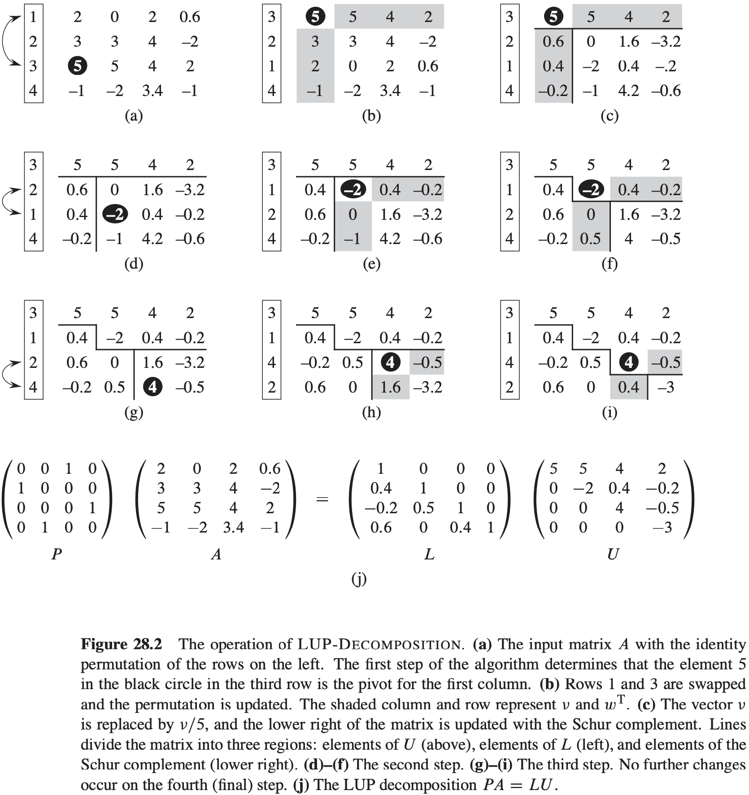
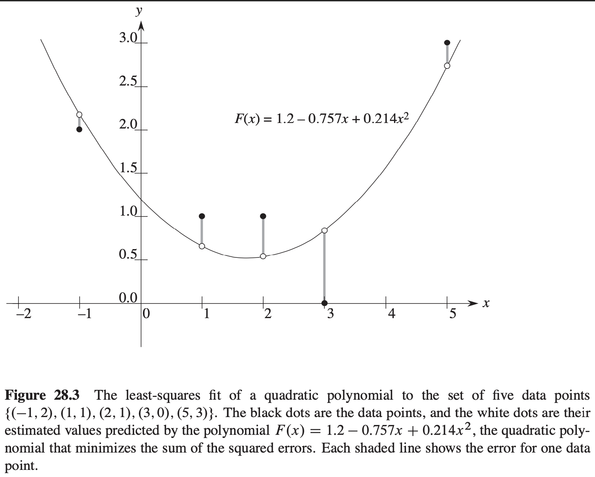

[中文版](chapter28_zh.md) | English

# 28 Matrix Operations

[TOC]

## Solving systems of linear equations

$$
\begin{bmatrix}
a_{11} & a_{12} & \dots & a_{1n} \\
a_{21} & a_{22} & \dots & a_{2n} \\
\vdots & \vdots & \ddots& \vdots \\
a_{n1} & a_{n2} & \dots & a_{nn} \\
\end{bmatrix}

\begin{bmatrix}
x_1 \\
x_2 \\
\vdots \\
x_n
\end{bmatrix}

= 

\begin{bmatrix}
b_1 \\
b_2 \\
\vdots \\
b_n
\end{bmatrix}
$$

, or, equivalently, letting $A = (a_{ij}), x = (x_i)\ and\ b = (b_i)$, as:
$$
Ax = b
$$
, If $A$ is nonsingular, it possesses an inverse $A^{-1}$, and:
$$
x = A ^ {-1} b
$$
**Overview of LUP decomposition**

The idea behind LUP decomposition is to find three $n \times n$ matrices $L$, $U$, and $P$ such that:
$$
PA = LU
$$
, where:

- $L$ is a unit lower-triangular matrix,
- $U$ is an upper-triangular matrix, and
- $P$ is a permutation matrix.

, We call matrices $L$, $U$, and $P$ satisfying above equation an **LUP decomposition** of the matrix $A$.
$$
\begin{align}
& LUP-SOLVE(L, U, \pi, b) \\
& n = L.rows \\
& let\ x\ and\ y\ be\ a\ new\ vector\ of\ length\ n \\
& for\ i = 1\ to\ n \\
& \qquad y_i = b_{\pi[i]} - \sum_{j = 1}^{i - 1}l_{ij}y_i \\
& for\ i = n\ downto\ 1 \\
& \qquad x_i = (y_i - \sum_{j = i + 1}^{n}u_{ij}x_j) / u_{ij} \\
& return\ x
\end{align}
$$
**Computing an LU decomposition**
$$
\begin{align}
& LU-DECOMPOSITION(A) \\
& n = A.rows \\
& let\ L\ and\ U\ be\ new\ n \times n\ matrices \\
& initialize\ U\ with\ 0s\ below\ the\ diagonal \\
& initialize\ L\ with\ 1s\ on\ the\ diagonal\ and\ 0s\ above\ the\ diagonal \\
& for\ k = 1\ to\ n \\
& \qquad u_{kk} = a_{kk} \\
& \qquad for\ i = k + 1\ to\ n \\
& \qquad \qquad l_{ik} = a_{ik} / u_{kk} \\
& \qquad \qquad u_{ki} = a_{ki} \\
& \qquad for\ i = k + 1\ to\ n \\
& \qquad \qquad for\ j = k + 1\ to\ n \\
& \qquad \qquad \qquad a_{ij} = a_{ij} - l_{ij}u_{kj} \\
& return\ L\ and\ U
\end{align}
$$

$$
\begin{align}
& LUP-DECOMPOSITION(A) \\
& n = A.rows \\
& let\ \pi[1..n]\ be\ a\ new\ array \\
& for\ i = 1\ to\ n \\
& \qquad \pi[i] = i \\
& for\ k = 1\ to\ n \\
& \qquad p = 0 \\
& \qquad \qquad for\ i = k\ to\ n \\
& \qquad \qquad \qquad if\ |a_{ik}| > p \\
& \qquad \qquad \qquad \qquad p = |a_{ik}| \\
& \qquad \qquad \qquad \qquad k' = i \\
& \qquad if\ p == 0 \\
& \qquad \qquad error\ "singular\ matrix" \\
& \qquad exchange\ \pi[k]\ with\ \pi[k'] \\
& \qquad for\ i = 1\ to\ n \\
& \qquad \qquad exchange\ a_{ki}\ with\ a_{k'i} \\
& \qquad for\ i = k + 1\ to\ n \\
& \qquad \qquad a_{ik} = a_{ik} / a_{kk} \\
& \qquad \qquad for\ j = k + 1\ to\ n \\
& \qquad \qquad \qquad a_{ij} = a_{ij} - a_{ik}a_{kj}
\end{align}
$$

## Inverting matrices

**Theorem 28.1 (Multiplication is no harder than inversion)** If we can invert an $n \times n$ matrix in time $I(n)$, where $I(n) = \Omega(n^2)$ and $I(n)$ satisfies the regularity condition $I(3n) = O(I(n))$, then we can multiply two $n \times n$ matrices in time $O(I(n))$.

**Theorem 28.2 (Inversion is no harder than multiplication)** Suppose we can multiply two $n \times n$ real matrices in time $M(n)$, where $M(n) = \Omega(n^2)$ and $M(n)$ satisfies the two regularity conditions $M(n + k) = \Omega(M(n))$ for any $k$ in the range $0 \leq k \leq n$ and $M(n / 2) \leq cM(n)$ for some constant $c < 1 / 2$. Then we can compute the inverse of any real nonsingular $n \times n$ matrix in time $O(M(n))$.

## Symmetric positive-definite matrices and least-squares approximation

**Lemma 28.3** Any positive-definite matrix is nonsingular.

**Lemma 28.4** If $A$ is a symmetric positive-definite matrix, then every leading submatrix of $A$ is symmetric and positive-definite.

**Lemma 28.5 (Schur complement lemma)** If $A$ is a symmetric positive-definite matrix and $A_k$ is a leading $k \times k$ submatrix of $A$, then the Schur complement $S$ of $A$ with respect to $A_k$ is symmetric and positive-definite.

**Corollary 28.6** LU decomposition of a symmetric positive-definite matrix never causes a division by 0.

