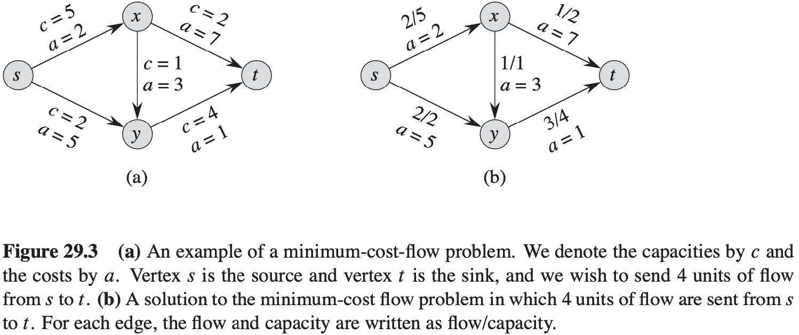

[中文版](chapter29_zh.md) | English

# 29 Linear Programming

[TOC]

## Standard and slack forms

**Standard form**

In **standard form**, we are given $n$ real numbers $c_1, c_2, ..., c_n$; $m$ real numbers $b_1, b_2, ..., b_m$; and $mn$ real numbers $a_{ij}$ for $i = 1, 2, ..., m$ and $j = 1, 2, ..., n$. We wish to find $n$ real numbers $x_1, x_2, ..., x_n$ that maximze $\sum_{j = 1}^{n} c_j x_j$ subject to:
$$
\begin{equation}\begin{split} 
\sum_{j = 1}^{n}a_{ij}x_{j} &\leq b_i,\ for\ i = 1, 2, ..., m \\
x_j &\geq 0,\ for\ j = 1, 2, ..., n
\end{split}\end{equation}
$$

## Formulating problems as linear programs

## The simplex algorithm

**Lemma 29.1** Consider a call to $PIVOT(N, B, A, b, c, v, l, e)$ in which $a_{1e} \neq 0$. Let the values returned from the call be $(\hat{N}, \hat{B}, \hat{A}, \hat{b}, \hat{c}, \hat{v})$, and let $\overline{x}$ denote the basic solution after the call. Then:

1. $\overline{x}_j = 0 \text{ for each } j \in \hat{N}$.
2. $\overline{x}_e = b_1 / a_{le}$.
3. $\overline{x}_i = b_i - a_{ie} \hat{b}_e \text{ for each } i \in \hat{B} - \{e\}$.

Example:
$$
\begin{align}
& SIMPLEX(A, b, c) \\
& (N, B, A, b, c) = INITIALIZE-SIMPLEX(A, b, c) \\
& let\ \Delta\ be\ a\ new\ vector\ of\ length\ m \\
& while\ some\ index\ j \in N\ has\ c_j > 0 \\
& \qquad choose\ an\ index\ e \in N\ for\ which\ c_e > 0 \\
& \qquad for\ each\ index\ i \in B \\
& \qquad \qquad if\ a_{ie} > 0 \\
& \qquad \qquad \qquad \Delta_{i} = b_i / a_{ie} \\
& \qquad \qquad else\ \Delta_{i} = \infty \\
& \qquad choose\ an\ index\ l \in B\ that\ minimizes\ \Delta_{l} \\
& \qquad if\ \Delta_{l} == \infty \\
& \qquad \qquad return\ "unbounded" \\
& \qquad else(N, B, A, b, c, v) = PIVOT(N, B, A, b, c, v, l, e) \\
& for\ i = 1\ to\ n \\
& \qquad if\ i \in B \\
& \qquad \qquad \overline{x_i} = b_i \\
& \qquad else\ \overline{x_i} = 0 \\
& return\ (\overline{x_1}, \overline{x_2}, ..., \overline{x_n})
\end{align}
$$

**Lemma 29.2** Given a linear program $(A, b, c)$, suppose that the call to $INITIALIZE-SIMPLEX$ in line 1 of $SIMPLEX$ returns a slack form for which the basic solution is feasible. Then if $SIMPLEX$ returns a solution in line 17, that solution is a feasible solution to the linear program. If $SIMPLEX$ returns "unbounded" in line 11, the linear program is unbounded.

**Lemma 29.3** Let $I$ be a set of indices. For each $j \in I$, let $\alpha_{j}$ and $\beta_{j}$ be real numbers, and let $x_j$ be a real-valued variable. Let $\gamma$ be any real number. Suppose that for any settings of the $x_j$, we have:
$$
\sum_{j \in I}\alpha_{j}x_{j} = \gamma + \sum_{j \in I}\beta_{j}x_{j}
$$
, Then $\alpha_{j} = \beta_{j}$ for each $j \in I$, and $\gamma = 0$.

**Lemma 29.4** Let $(A, b, c)$ be a linear program in standard form. Given a set $B$ of basic variables, the associated slack form is uniquely determined.

**Lemma 29.5** If $SIMPLEX$ fails to terminate in at most ${n+m \choose m}$ iterations, then it cycles.

**Lemma 29.6** If lines 4 and 9 of $SIMPLEX$ always break ties by choosing the variable with the smallest index, then $SIMPLEX$ must terminate.

**Lemma 29.7** Assuming that $INITIALIZE-SIMPLEX$ returns a slack form for which the basic solution is feasible, $SIMPLEX$ either reports that a linear program is unbounded, or it terminates with a feasible solution in at most ${n + m \choose m}$ iterations.

## Duality

**Lemma 29.8 (Weak linear-programming duality)** Let $\overline{x}$ be any feasible solution to the primal linear program in (29.16)-(29.18) and let $\overline{y}$ be any feasible solution to the dual linear program in (29.83)-(29.85). Then, we have:
$$
\sum_{j = 1}^{n} c_j \overline{x_j} \leqslant \sum_{i = 1}^{m} b_i \overline{y_i}
$$
**Corollary 29.9** Let $\overline{x}$ be a feasible solution to a primal linear program $(A, b, c)$, and let $\overline{y}$ be a feasible solution to the corresponding dual linear program. If:
$$
\sum_{j = 1}^{n} c_j \overline{x_j} = \sum_{i = 1}^{m} b_i \overline{y_i}
$$
, then $\overline{x}$ and $\overline{y}$ are optimal solutions to the primal and dual linear programs, respectively.

**Theorem 29.10 (Linear-programming duality)** Suppose that $SIMPLEX$ returns values $\overline{x} = (\overline{x_1}, \overline{x_2}, ..., \overline{x_n})$ for the primal linear program $(A, b, c)$. Let $N$ and $B$ denote the nonbasic and basic variables for the final slack form, let $c'$ denote the coefficients in the final slack form, and let $\overline{y} = (\overline{y_1}, \overline{y_2}, ..., \overline{y_m})$ be defined by equation (29.91). Then $\overline{x}$ is an optimal solution to the primal linear program, $\overline{y}$ is an optimal solution to the dual linear program, and:
$$
\sum_{j = 1}^{n} c_j \overline{x_j} = \sum_{i = 1}^{m}b_j \overline{y_i}
$$

## The initial basic feasible solution

$$
\begin{align}
& INITIALIZE-SIMPLEX(A, b, c) \\
& let\ k\ be\ the\ index\ of\ the\ minimum\ b_i \\
& if\ b_k \geqslant 0 \\
& \qquad return\ (\{1, 2, ..., n\}, \{n + 1, n + 2, ..., n + m\}, A, b, c, 0) \\
& form\ L_{aux}\ by\ adding\ - x_0\ to\ the\ left-hand\ side\ of\ each\ constraint\ and\ setting\ the\ objective\ function\ to - x_0 \\
& let\ (N, B, A, b, c, v)\ be\ the\ resulting\ slack\ form\ for\ L_{aux} \\
& l = n + k \\
& //\ L_{aux}\ has\ n + 1\ nonbasic\ variables\ and\ m\ basic\ variables \\
& (N, B, A, b, c, v) = PIVOT(N, B, A, b, c, v, l, 0) \\
& //\ The\ basic\ solution\ is\ now\ feasible\ for\ L_{aux} \\
& iterate\ the\ while\ loop\ of\ lines\ 3-12\ of\ SIMPLEX\ until\ an\ optimal\ solution\ to\ L_{aux}\ is\ found
& if\ the\ optimal\ solution\ to\ L_{aux}\ sets\ \overline{x_0}\ to\ 0 \\
& \qquad if\ \overline{x_0}\ is\ basic \\
& \qquad \qquad perform\ one\ (degenerate)\ pivot\ to\ make\ it\ nonbasic \\
& \qquad from\ the\ final\ slack\ form\ of\ L_{aux}, remove\ x_0\ from\ the\ constraints\ and\ restore\ the\ original\ objective\ fuction\ of\ L, but\ replace\ each\ basic\ variable\ in\ this\ objective\ function\ by\ the\ right-hand\ side\ of\ its\ associated\ constraint
& \qquad return\ the\ modified\ final\ slack\ form \\
& else\ return\ "infeasible"
\end{align}
$$

**Lemma 29.11** Let $L$ be a linear program in standard form, given as in (29.16)-(29.18). Let $x_0$ be a new variable, and let $L_{aux}$ be the following linear program with $n + 1$ variables:

maximize: 
$$
-x_0
$$
subject to: 
$$
\sum_{j = 1}^{n}a_{ij}x_j - x_0 \leq b_i &for\ i = 1, 2, ..., m, \\
x_j \geq 0 &for\ j = 0, 1, ..., n
$$
, Then $L$ is feasible if and only if the optimal objective value of $L_{aux}$ is 0.

**Lemma 29.12** If a linear program $L$ has no feasible solution, then $INITIALIZE-SIMPLEX$ returns "infeasible". Otherwise, it returns a valid slack form for which the basic solution is feasible.

**Theorem 29.13 (Fundamental theorem of linear programming)** Any linear program $L$, given in standard form, either:

1. has an optimal solution with a finite objective value.
2. is infeasible, or
3. is unbounded.

If $L$ is infeasible, $SIMPLEX$ returns "infeasible". If $L$ is unbounded, $SIMPLEX$ returns "unbounded". Otherwise, $SIMPLEX$ returns an optimal solution with a finite objective value.

