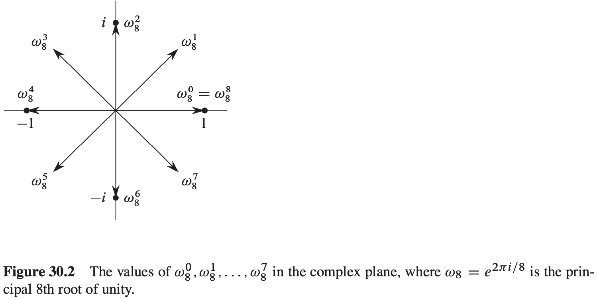
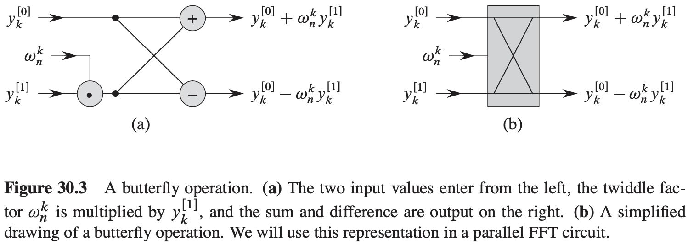

# 第30章 多项式与快速傅里叶变换

**多项式**

一个以$x$为变量的多项式定义在一个代数域$F$上，将函数$A(x)$表示为形式和：
$$
A(x) = \sum_{j = 0}^{n - 1} a_j x^j
$$
我们称$a_0, a_1, ..., a_{n - 1}$为如上多项式的系数，所有系数都属于域$F$。

## 30.1 多项式的表示

对于一个次数界为$n$的多项式$A(x) = \sum_{j = 0}^{n - 1}a_j x^j$而言，其**系数表达**是一个由系数组成的向量$a = (a_0, a_1, ..., a_{n - 1})$。

**定理 30.1**（插值多项式的唯一性）对于任意$n$个点值对组成的集合$\{(x_0, y_0), (x_1, y_1), ..., (x_{n - 1}, y_{n - 1})\}$，其中所有的$x_k$都不同；那么存在唯一的次数界为$n$的多项式$A(x)$，满足$y_k = A(x_k), k = 0, 1, ..., n - 1$。

拉格朗日公式：$A(x) = \sum_{k = 0}^{n - 1} y_k \frac{\prod_{j \neq k}(x - x_j)}{\prod_{j \neq k} (x_k - x_j)}$。

**定理 30.2** 当输入与输出多项式均采用系数表达时，我们就能在$\theta(n lgn)$时间复杂度内，计算出两个次数界为$n$的多项式乘积。

## 30.2 DFT与FFT

**单位复数根**

$n$次单位复数根是满足$w^n = 1$的复数$w$。$n$次单位复数根恰好有$n$个：对于$k = 0, 1, ..., n - 1$，这些根是$e^{2\pi i k / n}$。为了解释这个表达式，我们利用复数的指数形式的定义：

$e^{iu} = cos(u) + i sin(u)$

**引理 30.3**（消去引理）对于任何整数$n \geqslant 0, k \geqslant 0, 以及 d> 0$，$w_{dn}^{dk} = w_{n}^{k}$。

**推论 30.4** 对任意偶数$n > 0$，有$w_{n}^{n/2} = w_2 = -1$。

**引理 30.5**（折半引理）如果$n > 0$为偶数，那么$n$个$n$次单位复数根的平方的集合就是$n / 2$个$n / 2$次单位复数根的集合。

**引理 30.6**（求和引理）对任意整数$n \geqslant 1$和不能被$n$整除的非负整数$k$，有$\sum_{j = 0}^{n - 1}(w_{n}^{k})^j = 0$。

**离散傅里叶变换（DFT）**

**快速傅里叶变换（FFT）**
$$
\begin{align}
& RECURSIVE-FFT(a) \\
& n = a.length \\
& if\ n == 1 \\
& \qquad return\ a \\
& w_n = e^{2 \pi i / n} \\
& w = 1 \\
& a^{[0]} = (a_0, a_2, ..., a_{n - 2}) \\
& a^{[1]} = (a_1, a_3, ..., a_{n - 1}) \\
& y^{[0]} = RECURSIVE-FFT(a^{[0]}) \\
& y^{[1]} = RECURSIVE-FFT(a^{[1]}) \\
& for\ k = 0\ to\ n / 2 - 1 \\
& \qquad y_k = y_k^{[0]} + wy_k^{[1]} \\
& \qquad y_{k + (n / 2)} = y_k^{[0]} - wy_k^{[1]} \\
& \qquad w = ww_n \\
& return\ y
\end{align}
$$
**定理 30.7** 对$j, k = 0, 1, ..., n - 1, V_n^{-1}$的$(j, k)$处元素为$w_n^{-kj} / n$。

**定理 30.8**（卷积定理）对任意两个长度为$n$的向量$a$和$b$，其中$n$是2的幂，$a \otimes b = DFT_{2n}^{-1}(DFT_{2n}(a) \cdot DFT_{2n}(b))$，其中向量$a$和$b$用0填充，使其长度达到$2n$，并用"."表示2个$2n$个元素组成向量的点乘。

## 30.3 高效FFT实现

$$
\begin{align}
& ITERATIVE-FFT(a) \\
& BIT-REVERSE-COPY(a, A) \\
& n = a.length \\
& for\ s = 1\ to\ lgn \\
& \qquad m = 2^s \\
& \qquad w_m = e^{\pi i / m} \\
& \qquad for\ k = 0\ to\ n - 1\ by\ m \\
& \qquad \qquad w = 1 \\
& \qquad \qquad for\ j = 0\ to\ m / 2 - 1 \\
& \qquad \qquad \qquad t = wA[k + j + m/2] \\
& \qquad \qquad \qquad u = A[k + j] \\
& \qquad \qquad \qquad A[k + j] = u + t \\
& \qquad \qquad \qquad A[k + j + m/2] = u - t \\
& \qquad \qquad \qquad w = ww_m \\
& return\ A
\end{align}
$$
