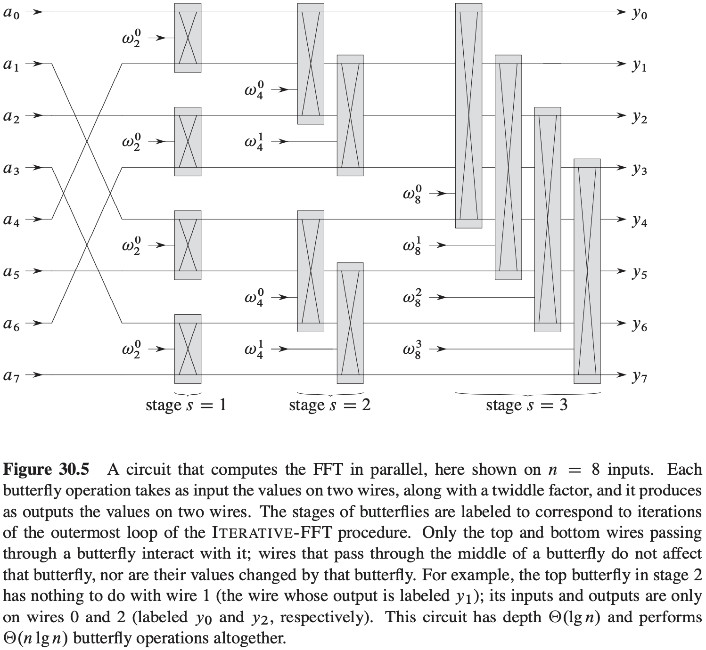

[中文版](chapter30_zh.md) | English

# 30 Polynomials and the FFT

[TOC]

**Polynomials**

A **polynomial** in the variable $x$ over an algebraic field $F$ represents a function $A(x)$ as a formal sum:
$$
A(x) = \sum_{j = 0}^{n - 1} a_j x^j
$$
, We call the values $a_0, a_1, ..., a_{n - 1}$ the **coefficients** of the polynomial.

## Representing polynomials

**Coefficient representation**

A **coefficient representation** of a polynomial $A(x) = \sum_{j = 0}^{n - 1}a_j x^j$ of degree bound $n$ is a vector of coefficients $a = (a_0, a_1, ..., a_{n - 1})$.

**Point-value representation**

A **point-value representation** of a polynomial $A(x)$ of degree-bound $n$ is a set of $n$ **point-value pairs**:
$$
\{(x_0, y_0), (x_1, y_1), ..., (x_{n - 1}, y_{n - 1})\}
$$
, such that all of the $x_k$ are distinct and:
$$
y_k = A(x_k)
$$
, for $k = 0, 1, ..., n - 1$. A polynomial has many different point-value representations, since we can use any set of $n$ distinct points $x_0, x_1, ..., x_{n - 1}$ as a basis for the respresentation.

**Theorem 30.1 (Uniquenes of an interpolating polynomial)** For any set $\{(x_0, y_0), (x_1, y_1), ..., (x_{n - 1}, y_{n - 1})\}$ of $n$ point-value pairs such that all the $x_k$ values are distinct, there is a unique polynomial $A(x)$ of degree-bound $n$ such that $y_k = A(x_k)$ for $k = 0, 1, ..., n - 1$.

**Lagrange's formula**: $A(x) = \sum_{k = 0}^{n - 1} y_k \frac{\prod_{j \neq k}(x - x_j)}{\prod_{j \neq k} (x_k - x_j)}$.

**Fast multiplication of polynomials in coefficient form**

**Theorem 30.2** We can multiply two polynomials of degree-bound $n$ in time $\theta(n lg\ n)$, with both the input and output representations in coefficient form.

## The DFT and FFT

**Complex roots of unity**

A **complex nth root of unity** is a somplex number $w$ such that:
$$
w^n = 1
$$
, There are exactly $n$ complex $n$th roots of unity: $e^{2 \pi i k / n}$ for $k = 0, 1, ..., n - 1$. To interpret this formula, we use the definition of the exponential of a complex number:
$$
e^{iu} = cos(u) + i\ sin(u)
$$

**Lemma 30.3 (Cancellation lemma)** For any integers $n \geq 0, k \geq 0$, and $d > 0$, $w_{dn}^{dk} = w_{n}^{k}$.

**Corollary 30.4** For any even integer $n > 0$, $w_{n}^{n/2} = w_2 = -1$.

**Lemma 30.5 (Halving lemma)** If $n > 0$ is even, then the squares of the $n$ complex $n$th roots of unity are the $n / 2$ complex $(n / 2)$th roots of unity.

**Lemma 30.6 (Summation lemma)** For any integer $n \geq 1$ and nonzero integer $k$ not divisible by $n$, $\sum_{j = 0}^{n - 1}(w_{n}^{k})^j = 0$.

**The FFT**
$$
\begin{align}
& RECURSIVE-FFT(a) \\
& n = a.length \\
& if\ n == 1 \\
& \qquad return\ a \\
& w_n = e^{2 \pi i / n} \\
& w = 1 \\
& a^{[0]} = (a_0, a_2, ..., a_{n - 2}) \\
& a^{[1]} = (a_1, a_3, ..., a_{n - 1}) \\
& y^{[0]} = RECURSIVE-FFT(a^{[0]}) \\
& y^{[1]} = RECURSIVE-FFT(a^{[1]}) \\
& for\ k = 0\ to\ n / 2 - 1 \\
& \qquad y_k = y_k^{[0]} + wy_k^{[1]} \\
& \qquad y_{k + (n / 2)} = y_k^{[0]} - wy_k^{[1]} \\
& \qquad w = ww_n \\
& return\ y
\end{align}
$$
**Theorem 30.7** For $j, k = 0, 1, ..., n - 1, V_n^{-1}$, the $(j, k)$ entry of $V_n^{-1}$ is $w_n^{-kj} / n$.

**Theorem 30.8 (Convolution theorem)** For any two vectors $a$ and $b$ of length $n$, where $n$ is a power of 2, $a \otimes b = DFT_{2n}^{-1}(DFT_{2n}(a) \cdot DFT_{2n}(b))$, where the vectors $a$ and $b$ are padded with 0s to length $2n$ and $\cdot$ denotes the componentwise product of two $2n$-element vectors.

## Efficient FFT implementations

$$
\begin{align}
& ITERATIVE-FFT(a) \\
& BIT-REVERSE-COPY(a, A) \\
& n = a.length \\
& for\ s = 1\ to\ lgn \\
& \qquad m = 2^s \\
& \qquad w_m = e^{\pi i / m} \\
& \qquad for\ k = 0\ to\ n - 1\ by\ m \\
& \qquad \qquad w = 1 \\
& \qquad \qquad for\ j = 0\ to\ m / 2 - 1 \\
& \qquad \qquad \qquad t = wA[k + j + m/2] \\
& \qquad \qquad \qquad u = A[k + j] \\
& \qquad \qquad \qquad A[k + j] = u + t \\
& \qquad \qquad \qquad A[k + j + m/2] = u - t \\
& \qquad \qquad \qquad w = ww_m \\
& return\ A
\end{align}
$$

