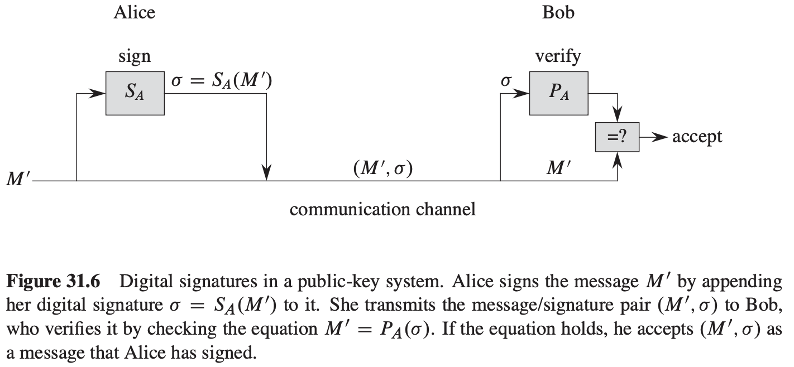
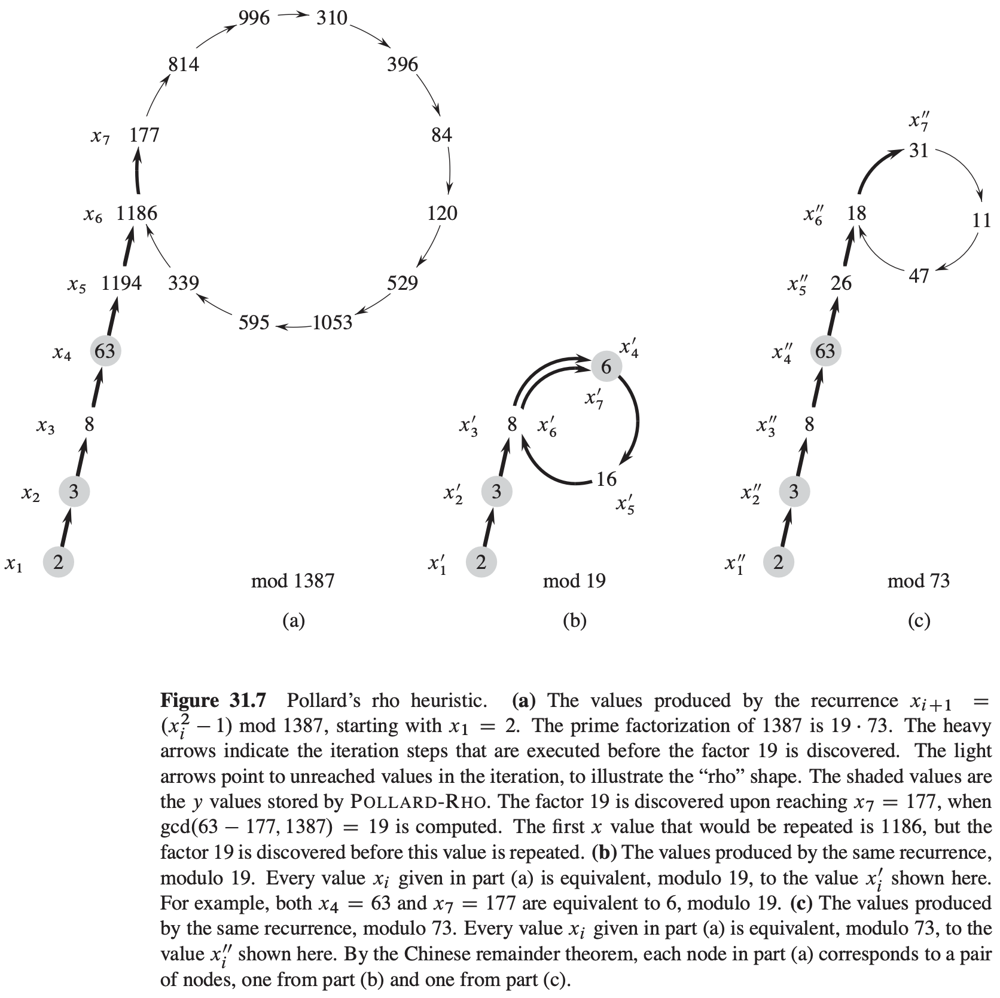

[中文版](chapter31_zh.md) | English

# 第31章 数论算法

[TOC]

## Elementary number-theoretic notions

**整除性与约数**

整除（$d \mid a$）：存在某个整数$k$，使得$a = kd$。

非整除（$d \nmid a$）：$d$不能整除$a$。

约数：如果$d \mid a$且$d \geqslant 0$，则称$d$是$a$的约数。

**素数与合数**

如果一个整数$a > 1$且只能被平凡约数1和它自身所整除，则这个数是**素数**。

如果一个整数$a > 1$且不是素数，则称之为**合数**。

**除法定理，余数和等模**

**定理 31.1**（除法定理）对于任何整数$a$和任何正整数$n$，存在唯一整数$q$和$r$，满足$0 \leqslant r < n且a = qn + r$。

**公约数与最大公约数**

公约数的一条重要性质是：$d \mid a 且 d \mid b 蕴涵着 d \mid (a + b) 且 d \mid (a - b)$。

更一般的，对任意整数$x$和$y$，有：$d \mid a 且 d \mid b 蕴含着 d \mid (ax + by)$。

两个不同时为0的整数$a$与$b$的公约数中最大的称为其**最大公约数**，记作$gcd(a, b)$，下列性质是gcd函数的基本性质：
$$
\begin{equation}\begin{split} 
gcd(a, b) &= gcd(b, a) \\ 
gcd(a, b) &= gcd(-a, b) \\ 
gcd(a, b) &= gcd(|a|, |b|) \\ 
gcd(a, 0) &= |a| \\ 
gcd(a, ka) &= |a| 对任意k \in Z \\ 
\end{split}\end{equation}
$$
**定理 31.2** 如果任意整数$a$和$b$不都为0，则$gcd(a, b)$是$a$与$b$的线性组合集$\{ax + by: x, y \in Z\}$中的最小正元素。

**推论 31.3** 对任意整数$a$与$b$，如果$d \mid a$且$d \mid b$，则$d \mid gcd(a, b)$。

**推论 31.4** 对所有整数$a$和$b$以及任意非负整数$n$，有$gcd(an, bn) = n\ gcd(a, b)$。

**推论 31.5** 对于任意正整数$n, a和b$，如果$n \mid ab$且$gcd(a, n) = 1$，则$n \mid b$。

如果两个整数$a$与$b$只有公约数1，即$gcd(a, b) = 1$，则$a$与$b$称为**互质数**。

**定理 31.6** 对任意整数$a, b和p$，如果$gcd(a, p) = 1$且$gcd(b, p) = 1$，则$gcd(ab, p) = 1$。

**定理 31.7** 对所有素数$p$和所有整数$a, b$，如果$p \mid ab$，则$p \mid a$或$p \mid b$（或两者都成立）。

**定理 31.8**（唯一因子分解定理）合数$a$仅能以一种方式写成如下乘积形式：
$$
a = p_1^{e_1} p_2^{e_2} ... p_r^{e_r}
$$
其中$p_i$为素数，$p_1 < p_2 < ... < p_r$，且$e_i$为正整数。

## 31.2 最大公约数

**定理 31.9**（GCD递归定理）对任意非负整数$a$和任意正整数$b$，$gcd(a, b) = gcd(b, a\ mod\ b)$。

**欧几里得算法**
$$
\begin{align}
& EUCLID(a, b) \\
& if\ b == 0 \\
& \qquad return\ a \\
& else\ return\ EUCLID(b, a\ mod\ b)
\end{align}
$$
**引理 31.10** 如果$a > b \geqslant 1$并且$EUCLID(a, b)$执行了$k \geqslant 1$次递归调用，则$a \geqslant F_{k + 1}, b \geqslant F_{k + 1}$。

**定理 31.11**（Lame定理）对任意整数$k \geqslant 1$，如果$a > b \geqslant 1$，且$b < F_{k + 1}$，则$EUCLID(a, b)$的递归调用次数少于$k$次。
$$
\begin{align}
& EXTENDED-EUCLID(a, b) \\
& if\ b == 0 \\
& \qquad return(a, 1, 0) \\
& else\ (d', x', y') = EXTENDED-EUCLID(b, a\ mod\ b) \\
& \qquad (d, x, y) = (d' y', x' - \lfloor a/b \rfloor y') \\
& \qquad return\ (d, x, y)
\end{align}
$$

## 31.3 模运算

**有限群**

群$(S, \oplus)$是一个集合$S$和定义在$S$上的二进制运算$\oplus$，该运算满足下列性质：

1. 封闭性：对所有$a, b \in S$，有$a \oplus b \in S$。
2. 单位元：存在一个元素$e \in S$，称为群的单位元，满足对所有$a \in S, e \oplus a = a \oplus e = a$。
3. 结合律：对所有$a, b, c \in S$，有$(a \oplus b) \oplus c = a \oplus (b \oplus c)$。
4. 逆元：对每个$a \in S$，存在唯一的元素$b \in S$，称为$a$的逆元，满足$a \oplus b = b \oplus a = e$。

**定理 31.12** 系统$(Z_n, +_{n})$是一个有限交换群。

**定理 31.13** 系统$(Z_n^*, \cdot_{n})$是一个有限交换群。

**定理 31.14**（一个有限群的非空封闭子集是一个子群）如果$(S, \oplus)$是一个有限群，$S'$是$S$的任意一个非空子集并满足对所有$a, b \in S'$，有$a \oplus b \in S'$，则$(S', \oplus)$是$(S, \oplus)$的一个子群。

**定理 31.15**（拉格朗日定理）如果$(S, \oplus)$是一个有限群，$(S', \oplus)$是$(S, \oplus)$的一个子群，则$|S'|$是$|S|$的一个约数。

**推论 31.16** 如果$S'$是有限群$S$的真子群，则$|S'| \leqslant |S| / 2$。

**定理 31.17** 对任意有限群$(S, \oplus)$和任意$a \in S$，一个元素的阶等于它所生成子群的规模，即$ord(a) = |<a>|$。

**推论 31.18** 序列$a^{(1)}, a^{(2)}, ...$是周期序列，其周期为$t = ord(a)$，即$a^{(i)} = a^{(j)}$当且仅当$i \equiv j(mod\ t)$。

**推论 31.19** 如果$(S, \oplus)$是具有单位元$e$的有限群，则对所有$a \in S$，$a^{(|S|)} = e$。

## 31.4 求解模线性方程

**定理 31.20** 对任意正整数$a$和$n$，如果$d = gcd(a, n)$，则在$Z_n$中，$<a> = <d> = \{0, d, 2d, ..., ((n / d) - 1)d\}$；因此，$|<a>| = n / d$。

**推论 31.21** 当且仅当$d \mid b$时，方程$ax \equiv b(mod\ n)$对于未知量$x$有解，这里$d = gcd(a, n)$。

**推论 31.22** 方程$ax \equiv b(mod\ n)$或者对模$n$有$d$个不同的解，或者无解，这里$d \equiv gcd(a, n)$。

**定理 31.23** 令$d = gcd(a, n)$，假设对某些整数$x'$和$y'$，有$d = ax' + ny'$（例如EXTENDED-EUCLID所计算出的结果）。如果$d \mid b$，则方程$ax \equiv b(mod\ n)$有一个解的值为$x_0$，这里：
$$
x_0 = x'(b/d)\ mod\ n
$$
**定理 31.24** 假设方程$ax \equiv b(mod\ n)$有解（即$d \mid b$，这里$d = gcd(a, n)$），且$x_0$是该方程的任意一个解。因此，该方程对模$n$恰有$d$个不同的解，分别为$x_i = x_0 + i(n / d)$，这里$i = 0, 1, ..., d - 1$。
$$
\begin{align}
& MODULAR-LINEAR-EQUATION-SOLVER(a, b, n) \\
& (d, x', y') = EXTENDED-EUCLID(a, n) \\
& if\ d \mid b \\
& \qquad x_0 = x'(b/d)\ mod\ n \\
& \qquad for\ i = 0\ to\ d - 1 \\
& \qquad \qquad print(x_0 + i(n/d))\ mod\ n \\
& else\ print\ "no\ solutions"
\end{align}
$$
**推论 31.25** 对任意$n > 1$，如果$gcd(a, n) = 1$，则方程$ax \equiv b(mod\ n)$对模$n$有唯一解。

**推论 31.26** 对任意$n > 1$，如果$gcd(a, n) = 1$，那么方程$ax \equiv 1(mod\ n)$对模$n$有唯一解；否则方程无解。

## 31.5 中国余数定理

**定理 31.27**（中国余数定理）令$n = n_1 n_2 ... n_k$，其中因子$n_i$两两互质。考虑以下对应关系：
$$
a \leftrightarrow (a_1, a_2, ..., a_k)
$$
这里$a \in Z_n, a_i \in Z_{n_i}$，而且对$i = 1, 2, ..., k$，$a_i = a\ mod\ n_i$。

**推论 31.28** 如果$n_1, n_2, ..., n_k$两两互质，且$n = n_1 n_2 ... n_k$，则对任意整数$a_1, a_2, ..., a_k$，关于未知量$x$的联立方程组：
$$
x \equiv a_i (mod\ n_i), i = 1, 2, ..., k
$$
对模$n$有唯一解。

**推论 31.29** 如果$n_1, n_2, ..., n_k$两两互质，$n = n_1 n_2 ... n_k$，则对所有整数$x$和$a$：
$$
x \equiv a(mod\ n_i)
$$
（其中$i = 1, 2, ..., k$）当且仅当：
$$
x \equiv a(mod\ n)
$$

## 31.6 元素的幂

**定理 31.30**（欧拉定理）对于任意整数$n > 1, a^{\phi(n)} \equiv 1(mod\ n)$对所有$a \in Z_n^{*}$都成立。

**定理 31.31**（费马定理）如果$p$是素数，则$a^{p - 1} \equiv 1(mod\ p)$对所有$a \in Z_p^{*}$都成立。

**定理 31.32** 对所有的素数$p > 2$和所有正整数$e$，使得$Z_n^{*}$是循环群的$n > 1$的值为$2, 4, p^e和2p^e$。

**定理 31.33**（离散对数定理）如果$g$是$Z_n^{*}$的一个原根，则当且仅当等式$x \equiv y(mod\ \phi(n))$成立时，有等式$g^x \equiv g^y(mod\ n)$成立。

**定理 31.34** 如果$p$是一个奇素数且$e \geqslant 1$，则方程$x^2 \equiv 1(mod\ p^e)$仅有两个解，即$x = 1$和$x = -1$。

**推论 31.35** 如果对模$n$存在$1$的非平凡平方根，则$n$是合数。
$$
\begin{align}
& MODULAR-EXPONENTIATION(a, b, n) \\
& c = 0 \\
& d = 1 \\
& let\ <b_k, b_{k - 1}, ..., b_0>\ be\ the\ binary\ representation\ of\ b \\
& for\ i = k\ downto\ 0 \\
& \qquad c = 2c \\
& \qquad d = (d \cdot d)\ mod\ n \\
& \qquad if\ b_i == 1 \\
& \qquad \qquad c = c + 1 \\
& \qquad \qquad d = (d \cdot a)\ mod\ n \\
& return\ d
\end{align}
$$

## 31.7 RSA公钥加密系统

**RSA加密系统**

**定理 31.36**（RSA的正确性）RSA等式$P(M) = M^e\ mode\ n$和$S(C) = C^d\ mod\ n$定义了满足等$M = S_A(P_A(M))$和$M = P_A(S_A(M))$的$Z_n$的逆变换。

## 31.8 素数的测试

**定理 31.37**（素数定理）$\lim_{n \rightarrow \infty} \frac{\pi(n)}{n / ln\ n} = 1$。
$$
\begin{align}
& WITNESS(a, n) \\
& let\ t\ and\ u\ be\ such\ that\ t \geqslant 1, u\ is\ odd, and\ n - 1 = 2^t u \\
& x_0 = MODULAR-EXPONENTIATION(a, u, n) \\
& for\ i = 1\ to\ t \\
& \qquad x_i = x_{i - 1}^2\ mod\ n \\
& \qquad if\ x_i == 1\ and\ x_{i - 1} \neq 1\ and\ x_{i - 1} \neq n - 1 \\
& \qquad \qquad return\ TRUE \\
& if\ x_t \neq 1 \\
& \qquad return\ TRUE \\
& if\ x_t \neq 1 \\
& \qquad return\ TRUE \\
& return\ FALSE
\end{align}
$$

$$
\begin{align}
& MILLER-RABIN(n, s) \\
& for\ j = 1\ to\ s \\
& \qquad a = RANDOM(1, n - 1) \\
& \qquad if\ WITNESS(a, n) \\
& \qquad \qquad return\ COMPOSITE \\
& return\ PRIME
\end{align}
$$

**定理 31.38** 如果$n$是一个奇合数，则$n$为合数的证据的数目至少为$(n - 1)/ 2$。

**定理 31.39** 对于任意奇数$n > 2$和正整数$s$，$MILLER-RABIN(n, s)$出错的概率至多为$2^{-s}$。

## 31.9 整数的因子分解

$$
\begin{align}
& POLLARD-RHO(n) \\
& i = 1 \\
& x_1 = RANDOM(0, n - 1) \\
& y = x_1 \\
& k = 2 \\
& while\ TRUE \\
& \qquad i = i + 1 \\
& \qquad x_i = (x_{i - 1}^2 - 1)\ mod\ n \\
& \qquad d = gcd(y - x_i, n) \\
& \qquad if\ d \neq 1\ and\ d \neq n \\
& \qquad \qquad print\ d \\
& \qquad if\ i == k \\
& \qquad \qquad y = x_i \\
& \qquad \qquad k = 2k
\end{align}
$$

