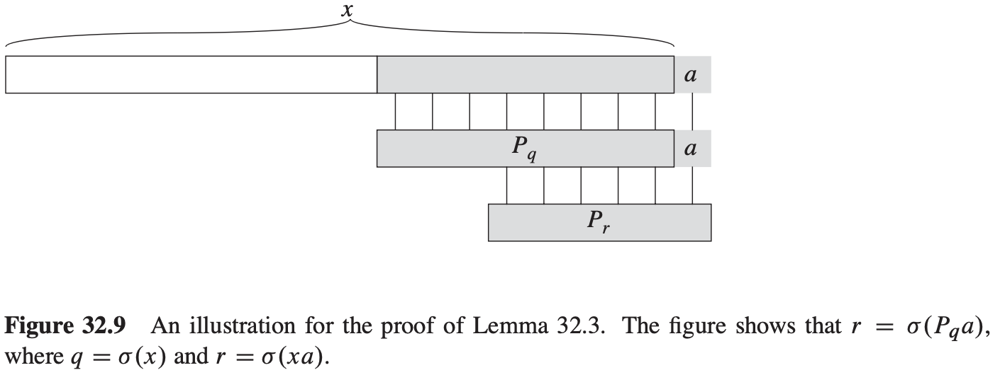

# String Matching

[TOC]

We formalize the string-matching problem as follows. We assume that the text is an array $T[1..n]$ of length $n$ and that the pattern is an array $P[1..m]$ of length $m \leq n$. We further assume that the elements of $P$ and $T$ are characters drawn from a finite alphabet $\sum$.

**Lemma 32.1 (Overlapping-suffix lemma)** Suppose that $x, y$ and $z$ are strings such that $z \subset x$ and $z \subset y$. if $|x| \leq |y|$, then $y \subset x$. If $|x| \geq |y|$, then $x \subset y$. If $|x| = |y|$, then $x = y$.

## The naive string-matching algorithm

$$
\begin{align}
& NAIVE-STRING-MATCHER(T, P) \\
& n = T.length \\
& m = P.length \\
& for\ s = 0\ to\ n - m \\
& \qquad if\ P[1..m] == T[s+1 .. s+m] \\
& \qquad \qquad print\ "Pattern\ occurs\ with\ shift"s
\end{align}
$$

## The Rabin-Karp algorithm

$$
\begin{align}
& RABIN-KARP-MATCHER(T, P, d, q) \\
& n = T.length \\
& m = P.length \\
& h = d^{m - 1}\ mod\ q \\
& p = 0 \\
& t_0 = 0 \\
& for\ i = 1\ to\ m \\
& \qquad p = (dp + P[i])\ mod\ q \\
& \qquad t_0 = (dt_0 + T[i])\ mod\ q \\
& for\ s = 0\ to\ n - m \\
& \qquad if\ p == t \\
& \qquad \qquad if\ P[1..m] == T[s + 1 .. s + m] \\
& \qquad \qquad \qquad print\ "Pattern occurs\ with\ shift"
& \qquad if\ s < n - m \\
& \qquad \qquad t_{s+1} = (d(t_s - T[s + 1]h) + T[s + m + 1])\ mod\ q
\end{align}
$$
The expected matching time taken by the Rabin-Karp algorithm is $O(n) + O(m(v + n/q))$ where $v$ is the number of valid shifts.

## String matching with finite automata

A **finite automton M**, illustrated in Figure 32.6, is a 5-tuple $(Q, q_0, A, \sum, \delta)$, where:

- $Q$ is a finite set of **states**,
- $q_0 \in Q$ is the **start state**,
- $A \subseteq Q$ is a distinguished sete of **accepting states**,
- $\Sigma$ is a finite **input alphabet**,
- $\delta$ is a function from $Q \times \Sigma$ into $Q$, called the **transition function** of $M$.

We define the string-matching automaton that corresponds to a given pattern $P[1..m]$ as follows:

- The state set $Q$ is $\{0, 1, ..., m\}$. The start state $q_0$ is state 0, and state $m$ is the only accepting state.
- The transition function $\delta$ is defined by the following equation, for any state $q$ and character $a$: $\delta(q, a) = \sigma(P_q a)$.

$$
\begin{align}
& FINITE-AUTOMATON-MATCHER(T, \delta, m) \\
& n = T.length \\
& q = 0 \\
& for\ i = 1\ to\ n \\
& \qquad q = \delta(q, T[i]) \\
& \qquad if\ q == m \\
& \qquad \qquad print\ "Pattern\ occurs\ with\ shift"\ i - m
\end{align}
$$
**Lemma 32.2 (Suffix-function inequality)** For any string $x$ and character $a$, we have $\sigma(xa) \leq \sigma(x) + 1$.

**Lemma 32.3 (Suffix-function recursion lemma)** For any string $x$ and character $a$, if $q = \sigma(x)$, then $\sigma(xa) = \sigma(P_q a)$.

**Theorem 32.4** If $\phi$ is the final-state function of a string-matching automaton for a given pattern $P$ and $T[1..n]$ is an input text for the automaton, then:
$$
\phi(T_i) = \sigma(T_i) \\
for\ i = 0, 1, ..., n.
$$

$$
\begin{align}
& COMPUTE-TRANSITION-FUNCTION(P, \Sigma) \\
& m = P.length \\
& for\ q = 0\ to\ m \\
& \qquad for\ each\ charater\ a \in \Sigma \\
& \qquad \qquad k = min(m + 1, q + 2) \\
& \qquad \qquad repeat \\
& \qquad \qquad \qquad k = k - 1 \\
& \qquad \qquad until\ P_q a \subset P_k \\
& \qquad \qquad \delta(q, a) = k \\
& return\ \delta
\end{align}
$$

## The Knuth-Morris-Pratt algorithm

$$
\begin{align}
& KMP-MATCHER(T, P) \\
& n = T.length \\
& m = P.length \\
& \pi = COMPUTE-PREFIX-FUNCTION(P) \\
& q = 0 \\
& for\ i = 1\ to\ n \\
& \qquad while\ q > 0\ and\ P[q + 1] \neq T[i] \\
& \qquad \qquad q = \pi [q] \\
& \qquad if\ P[q + 1] == T[i] \\
& \qquad \qquad q = q + 1 \\
& \qquad \qquad if\ q == m \\
& \qquad \qquad \qquad print\ "Pattern\ occurs\ with\ shift"\ i - m \\
& \qquad \qquad q = \pi[q]
\end{align}
$$

$$
\begin{align}
& COMPUTE-PREFIX-FUNCTION(P) \\
& \let\ \pi [1..m]\ be\ a\ new\ arrau \\
& \pi[1] = 0 \\
& k = 0 \\
& for\ q = 2\ to\ m \\
& \qquad while\ k > 0\ and\ P[k + 1] \neq P[q] \\
& \qquad \qquad k = \pi[k] \\
& \qquad if\ P[k + 1] == P[q] \\
& \qquad \qquad k = k + 1 \\
& \qquad \pi [q] = k \\
& return\ \pi
\end{align}
$$

**Lemma 32.5 (Prefix-function iteration lemma)** Let $P$ be a pattern of length $m$ with prefix function $\pi$. Then, for $q = 1, 2, ..., m$, we have $\pi ^ {*} [q] = \{k: k < q\ and\ P_q \subset P_k\}$

**Lemma 32.6** Let $P$ be a pattern of length $m$, and let $\pi$ be the prefix function for $P$. For $q = 1, 2, ..., m$, if $\pi [q] > 0$, then $\pi [q] - 1 \in \pi^{*}[q - 1]$.

**Corollary 32.7** Let $P$ be a pattern of length $m$, and let $\pi$ be the prefix function for $P$. For $q = 1, 2, ..., m$,
$$
\pi [q] = 
\begin{cases}
0, &\text{if } E_{q - 1} = \emptyset \\
1 + max\{k \in E_{q - 1}\}, &\text{if } E_{q - 1} \neq \emptyset
\end{cases}
$$
