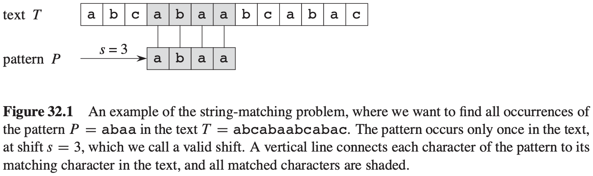
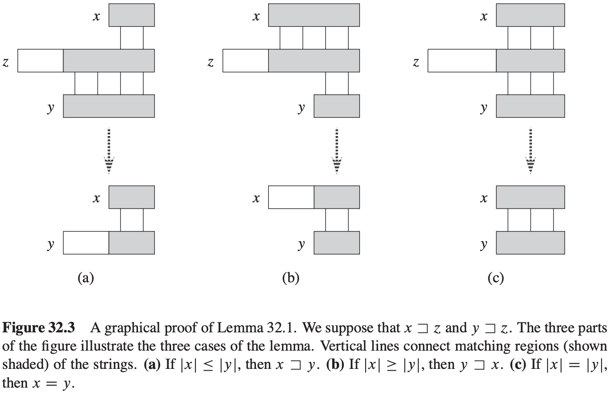
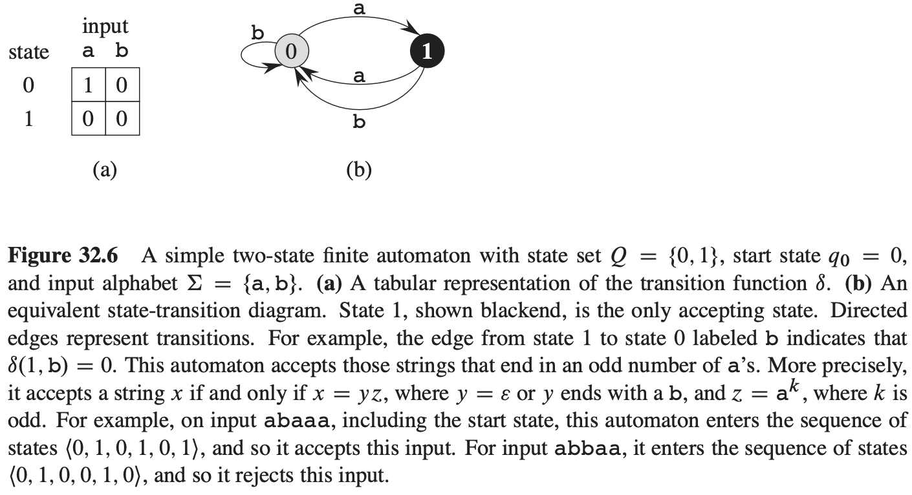
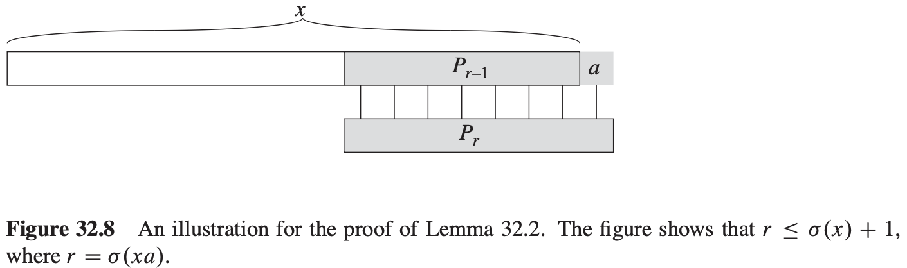

# 第32章 字符串匹配

字符串匹配问题的形式化定义：假设文本是一个长度为$n$的数组$T[1..n]$，而模式是一个长度为$m$的数组$P[1..m]$，其中$m \leqslant n$，进一步假设$P$和$T$的元素都是来自一个有限字母集$\sum$的字符。

**引理 32.1**（后缀重叠引理）假设$x, y$和$z$是满足$z \subset x$和$z \subset y$的字符串。如果$|x| \leqslant |y|$，那么$y \subset x$；如果$|x| \geqslant |y|$，那么$x \subset y$；如果$|x| = |y|$，那么$x = y$。

**证明** 

## 32.1 朴素字符串匹配算法

$$
\begin{align}
& NAIVE-STRING-MATCHER(T, P) \\
& n = T.length \\
& m = P.length \\
& for\ s = 0\ to\ n - m \\
& \qquad if\ P[1..m] == T[s+1 .. s+m] \\
& \qquad \qquad print\ "Pattern\ occurs\ with\ shift"s
\end{align}
$$

## 32.2 Rabin-Karp算法

$$
\begin{align}
& RABIN-KARP-MATCHER(T, P, d, q) \\
& n = T.length \\
& m = P.length \\
& h = d^{m - 1}\ mod\ q \\
& p = 0 \\
& t_0 = 0 \\
& for\ i = 1\ to\ m \\
& \qquad p = (dp + P[i])\ mod\ q \\
& \qquad t_0 = (dt_0 + T[i])\ mod\ q \\
& for\ s = 0\ to\ n - m \\
& \qquad if\ p == t \\
& \qquad \qquad if\ P[1..m] == T[s + 1 .. s + m] \\
& \qquad \qquad \qquad print\ "Pattern occurs\ with\ shift"
& \qquad if\ s < n - m \\
& \qquad \qquad t_{s+1} = (d(t_s - T[s + 1]h) + T[s + m + 1])\ mod\ q
\end{align}
$$
Rabin-Karp算法的期望运行时间为：$O(n) + O(m(v + n/q))$。

## 32.3 利用有限自动机进行字符串匹配

一个有限自动机$M$是一个5元组$(Q, q_0, A, \sum, \delta)$，其中：

- $Q$是状态的有限集合。
- $q_0 \in Q$是初始状态。
- $A \subseteq Q$是一个特殊的接受状态集合。
- $\Sigma$是有限输入字母表。
- $\delta$是一个从$Q \times \Sigma$到$Q$的函数，称为$M$的转移函数。

给定模式$P[1..m]$，其相应的字符串匹配自动机定义如下：

- 状态集合$Q$为$\{0, 1, ..., m\}$。开始状态$q_0$是$0$状态，并且只有状态$m$是唯一被接受的状态。
- 对任意的状态$q$和字符$a$，转移函数$\delta$定义如下：$\delta(q, a) = \sigma(P_q a)$。

$$
\begin{align}
& FINITE-AUTOMATON-MATCHER(T, \delta, m) \\
& n = T.length \\
& q = 0 \\
& for\ i = 1\ to\ n \\
& \qquad q = \delta(q, T[i]) \\
& \qquad if\ q == m \\
& \qquad \qquad print\ "Pattern\ occurs\ with\ shift"\ i - m
\end{align}
$$
**引理 32.2**（后缀函数不等式）对任意字符串$x$和字符$a, \sigma(xa) \leqslant \sigma(x) + 1$。

**证明** 

**引理 32.3**（后缀函数递归引理）对任意$x$和字符$a$，若$q = \sigma(x)$，则$\sigma(xa) = \sigma(P_q a)$。

**证明** 

**定理 32.4** 如果$\phi$是字符串匹配自动机关于给定模式$P$的终态函数，$T[1..n]$是自动机的输入文本，则对$i = 0, 1, ..., n \phi(T_i) = \sigma(T_i)$。
$$
\begin{align}
& COMPUTE-TRANSITION-FUNCTION(P, \Sigma) \\
& m = P.length \\
& for\ q = 0\ to\ m \\
& \qquad for\ each\ charater\ a \in \Sigma \\
& \qquad \qquad k = min(m + 1, q + 2) \\
& \qquad \qquad repeat \\
& \qquad \qquad \qquad k = k - 1 \\
& \qquad \qquad until\ P_q a \subset P_k \\
& \qquad \qquad \delta(q, a) = k \\
& return\ \delta
\end{align}
$$

## 32.4 Knuth-Morris-Pratt算法

$$
\begin{align}
& KMP-MATCHER(T, P) \\
& n = T.length \\
& m = P.length \\
& \pi = COMPUTE-PREFIX-FUNCTION(P) \\
& q = 0 \\
& for\ i = 1\ to\ n \\
& \qquad while\ q > 0\ and\ P[q + 1] \neq T[i] \\
& \qquad \qquad q = \pi [q] \\
& \qquad if\ P[q + 1] == T[i] \\
& \qquad \qquad q = q + 1 \\
& \qquad \qquad if\ q == m \\
& \qquad \qquad \qquad print\ "Pattern\ occurs\ with\ shift"\ i - m \\
& \qquad \qquad q = \pi[q]
\end{align}
$$

$$
\begin{align}
& COMPUTE-PREFIX-FUNCTION(P) \\
& \let\ \pi [1..m]\ be\ a\ new\ arrau \\
& \pi[1] = 0 \\
& k = 0 \\
& for\ q = 2\ to\ m \\
& \qquad while\ k > 0\ and\ P[k + 1] \neq P[q] \\
& \qquad \qquad k = \pi[k] \\
& \qquad if\ P[k + 1] == P[q] \\
& \qquad \qquad k = k + 1 \\
& \qquad \pi [q] = k \\
& return\ \pi
\end{align}
$$

**引理 32.5**（前缀函数迭代引理）设$P$是长度为$m$的模式，其前缀函数为$\pi$，对$q = 1, 2, ..., m$，有$\pi ^ {*} [q] = \{k: k < q 且 P_q \subset P_k\}$。

**引理 32.6** 设$P$是长度为$m$的模式，$\pi$是$P$的前缀函数。对$q = 1, 2, ..., m$，如果$\pi [q] > 0$，则$\pi [q] - 1 \in \pi^{*}[q - 1]$。

**推论 32.7** 设$P$是长度为$m$的模式，$\pi$是$P$的前缀函数，对$q = 2, 3, ..., m$
$$
\pi [q] = 
\begin{cases}
0, &如果E_{q - 1} = \emptyset \\
1 + max\{k \in E_{q - 1}\}, &如果E_{q - 1} \neq \emptyset
\end{cases}
$$
