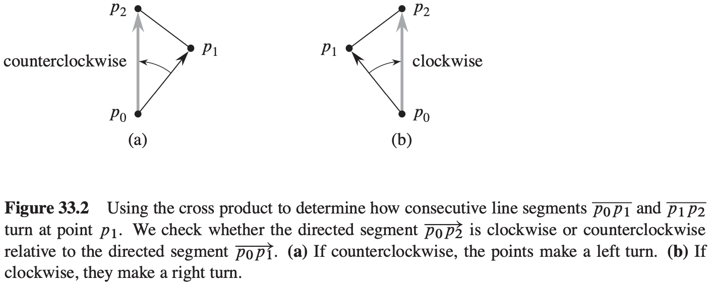
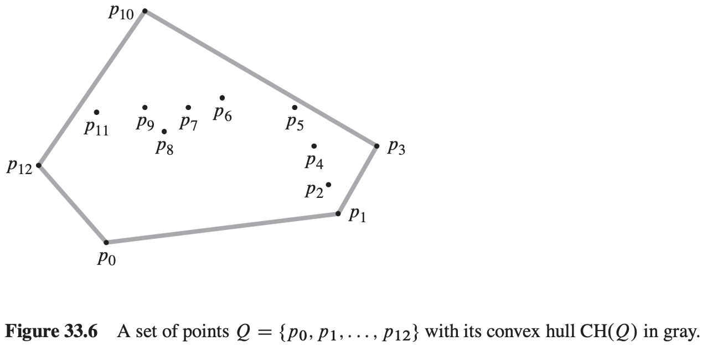
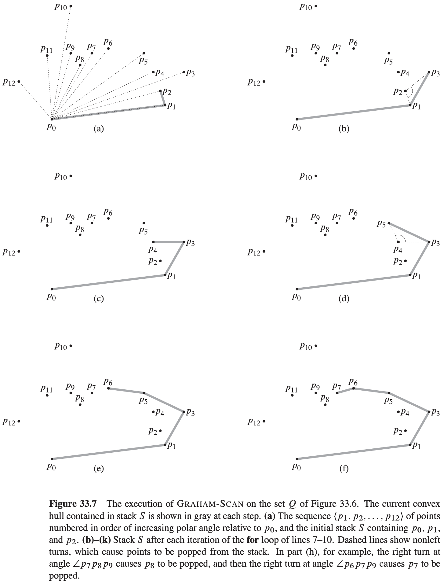

# 33 Computational Geometry

[TOC]

## Line-segment properties

**Cross products**

**Determining whether two line segments intersect**

$$
\begin{align}
& SEGMENTS-INTERSECT(p_1, p_2, p_3, p_4) \\
& d_1 = DIRECTION(p_3, p_4, p_1) \\
& d_2 = DIRECTION(p_3, p_4, p_2) \\
& d_3 = DIRECTION(p_1, p_2, p_3) \\
& d_4 = DIRECTION(p_1, p_2, p_4) \\
& if\ ((d_1 > 0\ and\ d_2 < 0)\ or\ (d_1 < 0\ and\ d_2 > 0))\ and\ ((d_3 > 0\ and\ d_4 < 0)\ or\ (d_3 < 0\ and\ d_4 > 0))
& \qquad return\ TRUE
& elseif\ d_1 == 0\ and\ ON-SEGMENT(p_3, p_4, p_1) \\
& \qquad return\ TRUE \\
& elseif\ d_2 == 0\ and\ ON-SEGMENT(p_3, p_4, p_2) \\
& \qquad return\ TRUE \\
& elseif\ d_3 == 0\ and\ ON-SEGMENT(p_1, p_2, p_3) \\
& \qquad return\ TRUE \\
& elseif\ d_4 == 0\ and\ ON-SEGMENT(p_1, p_2, p_4) \\
& \qquad return\ TRUE \\
& else\ return\ FALSE
\end{align}
$$

$$
\begin{align}
& DIRECTION(p_i, p_j, p_k) \\
& return(p_k - p_i) \times (p_j - p_i) \\
\end{align}
$$

$$
\begin{align}
& ON-SEGMENT(p_i, p_j, p_k) \\
& if\ min(x_i, x_j) \leqslant x_k \leqslant max(x_i, x_j)\ and\ min(y_i, y_j) \leqslant y_k \leqslant max(y_i, y_j) \\
& \qquad return\ TRUE \\
& else\ return\ FALSE
\end{align}
$$

## Determining whether any pair of segments intersects

**Segment-intersection pseudocode**
$$
\begin{align}
& ANY-SEGMENTS-INTERSECT(S) \\
& T = \phi \\
& sort\ the\ endpoints\ of\ the\ segments\ in\ S\ from\ left\ to\ right,\ breaking\ ties\ by\ putting\ left\ endpoints\ before\ right\ endpoints\ and\ breaking\ further\ ties\ by\ putting\ points\ with\ lower\ y-coordinates\ first \\
& for\ each\ point\ p\ in\ the\ sorted\ list\ of\ endpoints \\
& \qquad if\ p\ is\ the\ left\ endpoint\ of\ a\ segment\ s \\
& \qquad \qquad INSERT(T, s) \\
& \qquad \qquad if(ABOVE(T, s)\ exists\ and\ intersects\ s)\ or\ (BELOW(T, s)\ exists\ and\ intersects\ s) \\
& \qquad \qquad \qquad return\ TRUE \\
& \qquad if\ p\ is\ the\ right\ endpoint\ of\ a\ segment\ s \\
& \qquad \qquad if\ both\ ABOVE(T, s)\ and\ BELOW(T, s)\ exist\ and\ ABOVE(T, s)\ intersects\ BELOW(T, s) \\
& \qquad \qquad \qquad return\ TRUE \\
& \qquad \qquad DELETE(T, s) \\
& return\ FALSE
\end{align}
$$

If set $S$ contains $n$ segments, then $ANY-SEGMENTS-INTERSECT$ runs in time $O(n\ lg\ n)$.

## Finding the convex hull

$$
\begin{align}
& GRAHAM-SCAN(Q) \\
& let\ p_0\ be\ the\ point\ in\ Q\ with\ the\ minimum\ y-coordinate, or\ the\ leftmost\ such\ point\ in\ case\ of\ a\ tie \\
& let<p_1, p_2, ..., p_m>\ be\ the\ remaining\ points\ in\ Q, sorted\ by\ polar\ angle\ in\ counterclockwise\ order\ around\ p_0\ (if\ more\ than\ one\ point\ has\ the\ same\ angle,\ remove\ all\ but\ the\ one\ that\ is\ farthest\ from\ p_0) \\
& if\ m < 2 \\
& \qquad return\ "convex\ hull\ is\ empty" \\
& else\ let\ S\ be\ an\ empty\ stack \\
& \qquad PUSH(p_0, S) \\
& \qquad PUSH(p_1, S) \\
& \qquad PUSH(p_2, S) \\
& \qquad for\ i = 3\ to\ m \\
& \qquad \qquad while\ the\ angle\ formed\ by\ points\ NEXT-TO-TOP(S), TOP(S), and\ p_i\ makes\ a\ nonleft\ turn \\
& \qquad \qquad \qquad POP(S) \\
& \qquad \qquad PUSH(p_i, S) \\
& \qquad return\ S
\end{align}
$$
**Theorem 33.1 (Correctness of Graham's scan)** If $GRAHAM-SCAN$ executes on a set $Q$ of points, where $|Q| \geq 3$, then at termination, the stack $S$ consists of, from bottom to top, exactly the vertices of $CH(Q)$ in counterclockwise order.

## Finding the closest pair of points

$$
\begin{align}
& let\ Y_L[1 ..\ Y.length]\ and\ Y_R[1 ..\ Y.length]\ be\ new\ arrays \\
& Y_L \cdot length = Y_R \cdot length = 0 \\
& for\ i = 1\ to\ Y.length \\
& \qquad if\ Y[i] \in P_L \\
& \qquad \qquad Y_L \cdot length = Y_L \cdot length + 1 \\
& \qquad \qquad Y_L [Y_L \cdot length] = Y[i] \\
& \qquad else\ Y_R \cdot length = Y_R \cdot length + 1 \\
& \qquad \qquad Y_R[Y_R \cdot length] = Y[i]
\end{align}
$$
