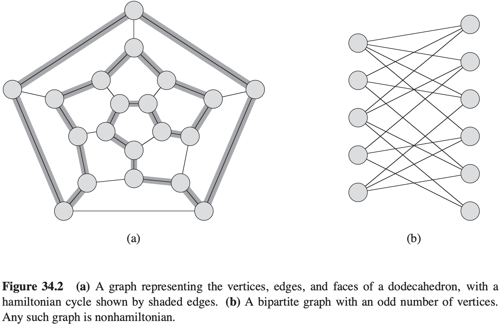
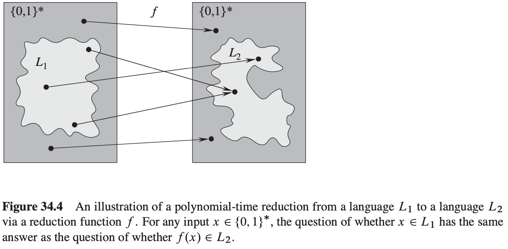
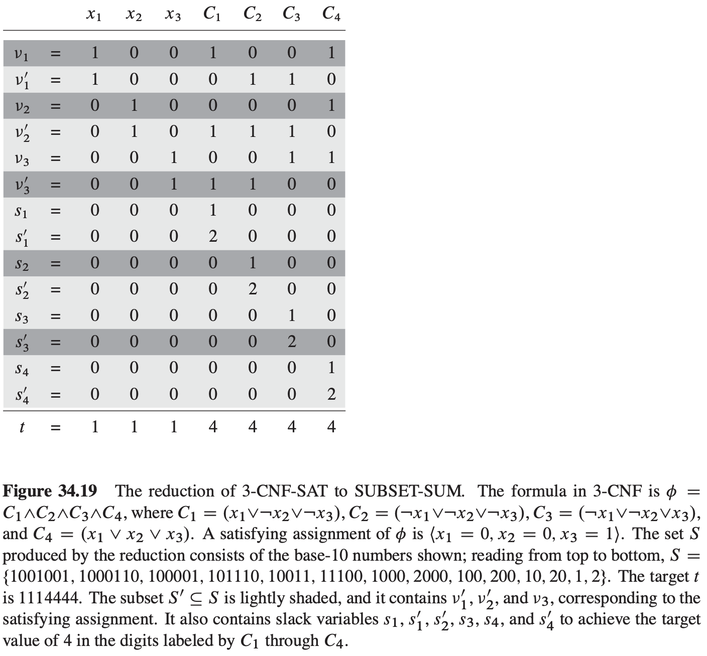

# 34 NP-Completeness

[TOC]

## Polynomial time

**Lemma 34.1** Let $Q$ be an abstract decision problem on an instance set $I$, and let $e_1$ and $e_2$ be polynomially related encodings on $I$. Then, $e_1(Q) \in P$ if and only if $e_2(Q) \in P$.

**Theorem 34.2** $P = \{L : L \text{ is accepted by a polynomial-time algorithm}\}.$

## Polynomial-time verification

**Hamiltonian cycles**

The **hamiltonian-cycle problem**: "Does a graph G have a hamiltonian cycle?" as a formal language:
$$
HAM-CYCLE = \{<G>: \text{G is a hamiltonian graph}\}
$$

## NP-completeness and reducibility

We say that a language $L_1$ is **polynomial-time reducible** to a language $L_2$, written $L_1 \leq_{p} L_2$, if there exists a polynomial-time computable function $f: \{0, 1\}^{*} \rightarrow \{0, 1\}^{*}$ such that for all $x \in \{0, 1\}^{*}$,
$$
x \in L_1 \text{ if and only if } f(x) \in L_2
$$
, We call the function $f$ the **reduction function**, and a polynomial-time algorithm $F$ that computes $f$ is a **reduction algorithm**.

**Lemma 34.3** If $L_1, L_2 \subseteq \{0, 1\}^{*}$ are languages such that $L_1 \leq_{p} L_2$, then $L_2 \in P$ implies $L_1 \in P$.

**Theorem 34.4** If any NP-complete problem is polynomial-time solvable, then $P = NP$. Equivalently, if any problem in $NP$ is not polynomial-time solvable, then no $NP$-complete problem is polynomial-time solvable.

**Lemma 34.5** The circuit-satisfiability problem belongs to the class $NP$.

**Lemma 34.6** The circuit-satisfiability problem is $NP$-hard.

**Theorem 34.7** The circuit-satisfiability problem is $NP$-complete.

## NP-completeness proofs

**Lemma 34.8** If $L$ is a language such that $L' \leq_{P} L$ for some $L' \in NPC$, then $L$ is $NP$-hard. If, in addition, $L \in NP$, then $L \in NPC$.

**Theorem 34.9** Satisfiability of boolean formulas in $NP$-complete.

**Theorem 34.10** Satisfiability of boolean formulas in 3-conjunctive normal form is $NP$-complete.

## NP-complete problems

**Theorem 34.11** The clique problem is $NP$-complete.

### The vertex-cover problem

**Theorem 34.12** The vertex-cover problem is $NP$-complete.

### The hamiltonian-cycle problem

**Theorem 34.13** The hamiltonian cycle problem is NP-complete.

### The traveling-salesman problem

The formal language for the corresponding decision problem is:
$$
\begin{equation}\begin{split}
TSP = \{<G, c, k>: &G = (V, E) \text{ is a complete graph}, \\
&c \text{ is a function from } V \times V \rightarrow Z, \\
&k \in Z, and \\
&G \text{ has a traveling-salesman tour with cost at most k} \}.
\end{split}\end{equation}
$$
**Theorem 34.14** The traveling-salesman problem is $NP$-complete.

### The subset-sum problem

**Theorem 34.15** The subset-sum problem is $NP$-complete.

