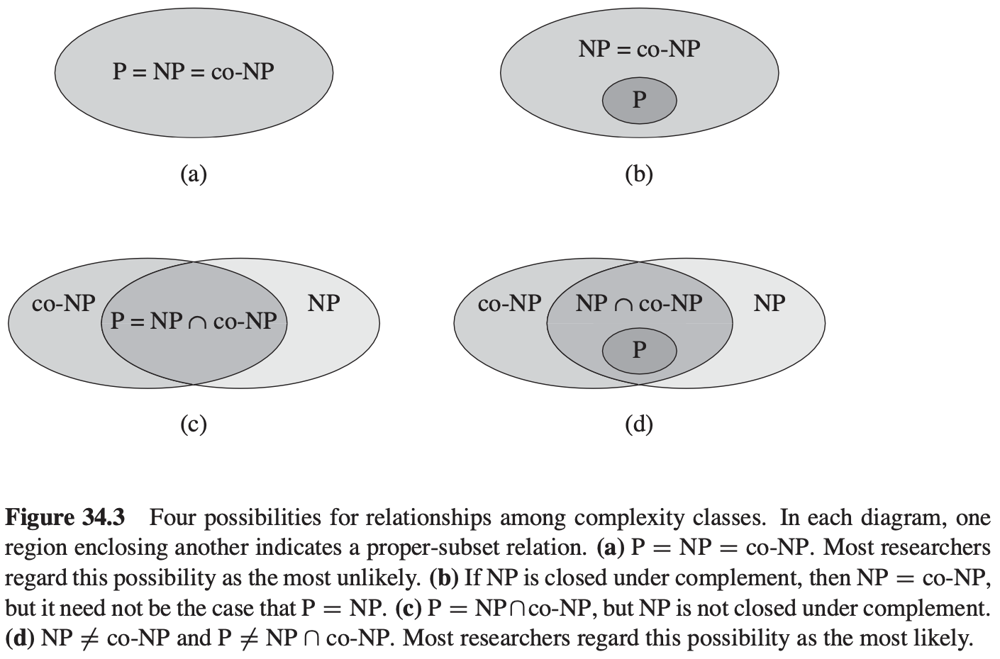
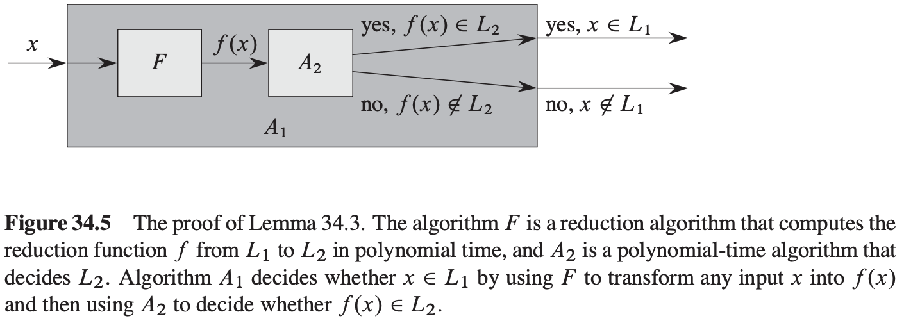
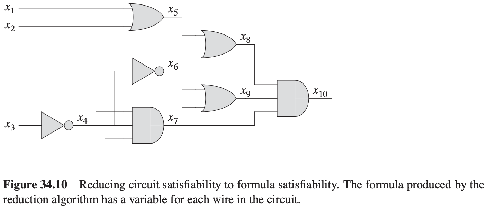

# 第34章 NP完全性

## 34.1 多项式时间

**引理 34.1** 设$Q$是定义在一个实例集$I$上的一个抽象判定问题，$e_1$和$e_2$是$I$上多项式相关的编码，则$e_1(Q) \in P$当且仅当$e_2(Q) \in P$。

**定理 34.2** $P = \{L：L能被一个多项式时间算法所接受\}$。

## 34.2 多项式时间的验证

**哈密顿回路**

哈密顿回路问题：$HAM-CYCLE = \{<G>: G是哈密顿图\}$。

## 34.3 NP完全性与可归约性

如果存在一个多项式时间可计算的函数$f: \{0, 1\}^{*} \rightarrow \{0, 1\}^{*}$，满足对所有的$x \in \{0, 1\}^{*}$，$x \in L_1$当且仅当$f(x) = L_2$，则称函数$f$为**归约函数**，计算$f$的多项式时间算法$F称为**归约算法**。

**引理 34.3** 如果$L_1, L_2 \subseteq \{0, 1\}^{*}$是满足$L_1 \leqslant pL_2$的语言，则$L_2 \in P$蕴含着$L_1 \in P$。

**定理 34.4** 如果任何NP完全问题是多项式时间可求解的，则$P = NP$。等价地，如果存在某一NP中的问题不是多项式时间可求解的，则所有NP完全问题都不是多项式时间可求解的。

**引理 34.5** 电路可满足性问题属于NP类。

**引理 34.6** 电路可满足性问题是NP难度的。

**定理 34.7** 电路可满足性问题是NP完全的。

## 34.4 NP完全性的证明

**引理 34.8** 如果语言$L$是一种满足对任意$L' \in NPC$都有$L' \leqslant pL$的语言，则$L$是NP难度的。此外，如果$L \in NP$，则$L \in NPC$。

**定理 34.9** 布尔公式的可满足性问题是NP完全的。

**定理 34.10** 3合取范式形式的布尔公式的可满足性问题是NP完全的。

## 34.5 NP完全问题

### 34.4.1 团问题

**定理 34.11** 团问题是NP完全的。

### 34.5.2 顶点覆盖问题

**定理 34.12** 顶点覆盖问题是NP完全的。

## 34.5.3 哈密顿回路问题

**定理 34.13** 哈密顿回路问题是NP完全问题。

### 34.5.4 旅行商问题

旅行商问题的形式语言：$TSP = \{<G, c, k>: G = (V, E)是一个完全图，c是V \times V \rightarrow Z上的一个函数，k \in Z, G中包含一个最大花费为k的旅行回路\}$。

**定理 34.14** 旅行商问题是NP完全的。

### 34.5.5 子集和问题

**定理 34.15** 子集和问题是NP完全的。

