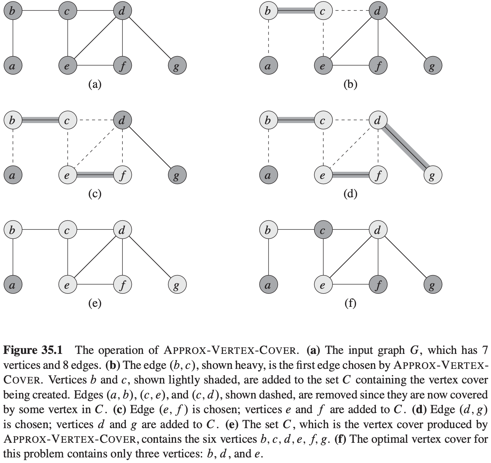
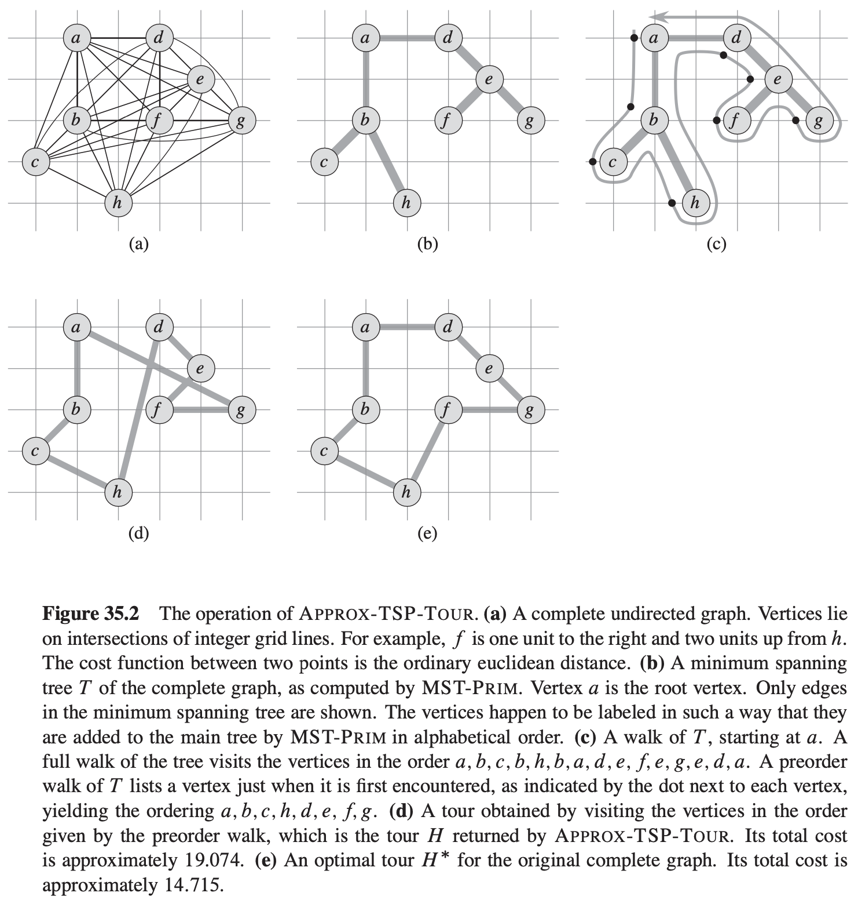
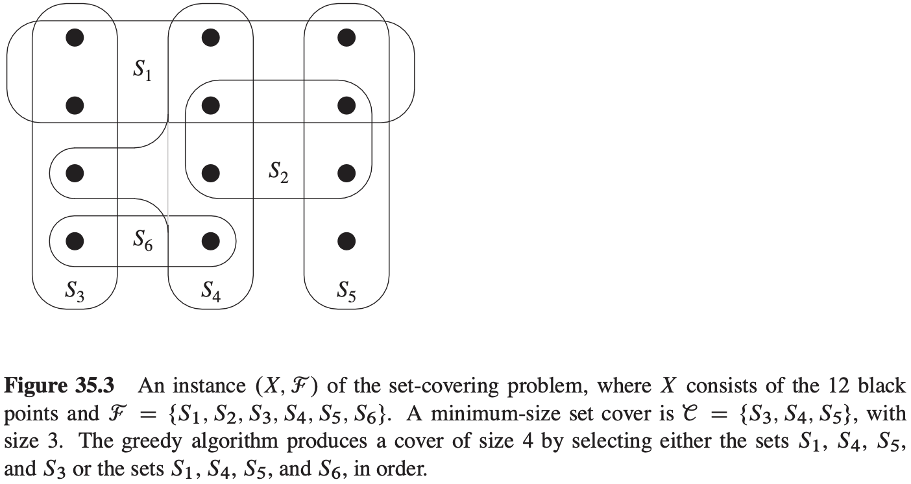

# 35 Approximation Algorithms

[TOC]

We say that an algorithm for a problem has an **approximation ratio** of $\rho (n)$ if, for any input of size $n$, the cost $C$ of the solution produced by the algorithm is within a factor of $\rho(n)$ of the cost $C^{*}$ of an optimal solution:
$$
max(\frac{C}{C^{*}}, \frac{C^{*}}{C}) \leq \rho(n)
$$

If an algorithm achieves an approximation ratio of $\rho(n)$, we call it a $\rho(n)-approx-imation\ algorithm$.

## The vertex-cover problem

$$
\begin{align}
& APPROX-VERTEX-COVER(G) \\
& C = \phi \\
& E' = G.E \\
& while\ E' \neq \phi \\
& \qquad let\ (u, v)\ be\ an\ arbitrary\ edge\ of\ E' \\
& \qquad C = C \cup \{u, v\} \\
& \qquad remove\ from\ E'\ Every\ edge\ incident\ on\ either\ u\ or\ v \\
& return\ C
\end{align}
$$

**Theorem 35.1** $APPROX-VERTEX-COVER$ is a polynomial-time 2-approximation algorithm.

## The traveling-salesman problem

### The traveling-salesman problem with the triangle inequality

$$
\begin{align}
& APPROX-TSP-TOUR(G, c) \\
& select\ a\ verte\ r \in G.V\ to\ be\ a\ "root"\ vertex \\
& compute\ a\ minimum\ spanning\ tree\ T\ for\ G\ from\ root\ r\ using\ MST-PRIM(G, c, r) \\
& let\ H\ be\ a\ list\ of\ vertices,\ ordered\ according\ to\ when\ they\ are\ first\ visited\ in\ a\ preorder\ tree\ walk\ of\ T \\
& return\ the\ hamiltonian\ cycle\ H
\end{align}
$$

**Theorem 35.2** $APPROX-TSP-TOUR$ is a polynomial-time 2-approximation algorithm for the traveling-salesman problem with the triangle inequality.

### The general traveling-salesman problem

**Theorem 35.3** If $P \neq NP$, then for any constant $\rho \geq 1$, there is no polynomial-time approximation algorithm with approximation ratio $\rho$ for the general traveling-salesman problem.

## The set-covering problem

**A greedy approximation algorithm**
$$
\begin{align}
& GREEDY-SET-COVER(x, F) \\
& U = X \\
& e = \phi \\
& while\ U \neq \phi \\
& \qquad select\ an\ S \in F\ that\ maximizes\ |S \cap U| \\
& \qquad U = U - S \\
& \qquad e = e \cup \{S\} \\
& return\ e
\end{align}
$$
**Theorem 35.4** $GREEDY-SET-COVER$ is a polynomial-time $\rho(n)$-approximation algorithm, where $\rho(n) = H(max\{|S|:S \in F\})$.

**Corollary 35.5** $GREEDY-SET-COVER$ is a polynomial-time $(ln|X| + 1)$-approximation algorithm.

## Randomization and linear programming

**Theorem 35.6** Given an instance of $max-3-CNF$ satisfiability with $n$ variables $x_1, x_2, ..., x_n$ and $m$ clauses, the randomized algorithm that independently sets each variable to 1 with probability 1/2 and to 0 with probability 1/2 is a randomized 8/7-approximation algorithm.
$$
\begin{align}
& APPROX-MIN-WEIGHT-VC(G, w) \\
& C = \phi \\
& compute\ \overline{x}, an\ optimal\ solution\ to\ the\ linear\ program\ in\ lines(35.17) - (35.20) \\
& for\ each\ v \in V \\
& \qquad if\ \overline{x}(v) \geqslant 1/2 \\
& \qquad \qquad C = C \cup \{v\} \\
& return\ C
\end{align}
$$
**Theorem 35.7** Algorithm $APPROX-MIN-WEIGHT-VC$ is a polynomial-time 2-approximation algorithm for the minimum-weight vertex-cover problem.

## The subset-sum problem

**An exponential-time exact algorithm**
$$
\begin{align}
& EXACT-SUBSET-SUM(S, t) \\
& n = |S| \\
& L_0 = <0> \\
& for\ i = 1\ to\ n \\
& \qquad L_i = MERGE-LISTS(L_{i - 1}, L_{i - 1} + x_i) \\
& \qquad remove\ from\ L_i\ every\ element\ that\ is\ greater\ than\ t \\
& return\ the\ largest\ element\ in\ L_n
\end{align}
$$
**A fully polynomial-time approximation scheme**
$$
\begin{align}
& TRIM(L, \delta) \\
& let\ m\ be\ the\ length\ of\ L \\
& L' = <y_1> \\
& last = y_1 \\
& for\ i = 2\ to\ m \\
& \qquad if\ y_i > last.(1 + \delta) \\
& \qquad \qquad append\ y_i\ onto\ the\ end\ of\ L' \\
& \qquad \qquad last = y_i \\
& return\ L'
\end{align}
$$

$$
\begin{align}
& APPROX-SUBSET-SUM(S, t, \epsilon) \\
& n = |S| \\
& L_0 = <0> \\
& for\ i = 1\ to\ n \\
& \qquad L_i = MERGE-LISTS(L_{i - 1}, L_{i - 1} + x_i) \\
& \qquad L_i = TRIM(L_i, \epsilon / 2n) \\
& \qquad remove\ from\ L_i\ every\ element\ that\ is\ greater\ than\ t \\
& let\ z^{*}\ be\ the\ largest\ value\ in\ L_n \\
& return\ z^{*}
\end{align}
$$

**Theorem 35.8** $approx-subset-sum$ is a fully polynomial-time approximation scheme for the subset-sum problem.

