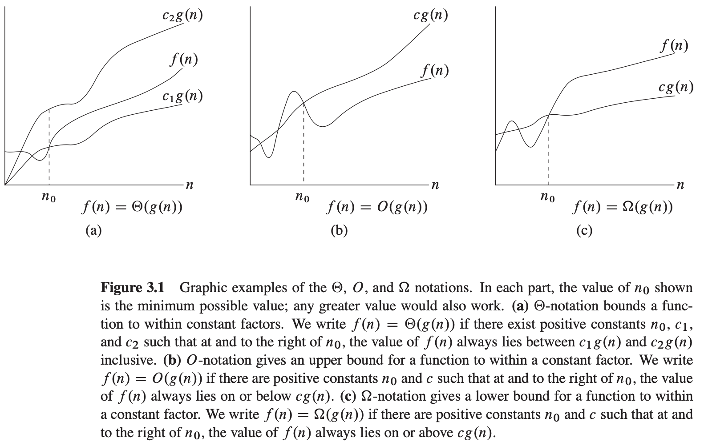

# 第三章 函数的增长

## 3.1 渐近记号

**$\theta$记号**

对于一个给定的函数$g(n)$，用$\theta(g(n))$来表示以下函数的集合：

$\theta(g(n)) = {f(n):存在正常量c_1, c_2和n_0，使得对所有n \geqslant n_0，有0 \leqslant c_1g(n) \leqslant f(n) \leqslant c_2g(n)}^\ominus$

对所有$n \geqslant n_0$，函数$f(n)$在一个常量因子内等于$g(n)$，我们称$g(n)$是$f(n)$的一个**渐近紧确界（asymptotically tight bound）**。

例：

**$O$记号**

$\theta$记号渐近地给出一个函数的上界和下界。当只有一个**渐近上界**时，使用$O$记号。对于给定的函数$g(n)$，用$O(g(n))$来表示以下函数的集合：$O(g(n)) = {f(n)：存在正常量c和n_0，使得对所有n \geqslant n_0，有n \leqslant f(n) \leqslant cg(n)}$

我们使用O记号来给出函数的一个在常量因子内的上界。

**$\Omega$记号**

$\Omega$记号提供了**渐近下界**，对于给定的函数$g(n)$，用$\Omega(g(n))$来表示以下函数的集合：$\Omega(g(n)) = {f(n): 存在正常量c和n_0，使得对所有n \geqslant n_0，有0 \leqslant cg(n) \leqslant f(n)}$

**定理 3.1** 对任意两个函数$f(n)$和$g(n)$，我们有$f(n) = \Theta(g(n))$，当且仅当$f(n) = O(g(n))$且$f(n) = \Omega(g(n))$。

**$o记号$**

我们使用$o$记号来表示一个非渐近紧确的上界。形式化定义$o(g(n))$为以下集合：

$o(g(n)) = {f(n): 对任意正常量 c > 0，存在常量n_0 > 0，使得对所有n \geqslant n_0，有0 \leqslant f(n) < cg(n)}$

在$o记号$中，当$n$趋近于无穷时，函数$f(n)$相对于$g(n)$来说变得微不足道，即：$\lim_{n \to \infty} \frac{f(n)}{g(n)} = 0$。

**$\omega$记号**

$\omega$记号与$\Omega$记号的关系类似于$o$记号与$O$记号的关系。我们使用$\omega$记号来表示一个非渐近紧确的下界。定义它的一种方式是：$f(n) \in \omega(g(n))$当且仅当$g(n) \in o(f(n))$。形式化定义$\omega(g(n))$为以下集合：

$\omega(g(n)) = {f(n):对任意正常量c > 0，存在常量n_0 > 0，使得对所有n \geqslant n_0，有0 \leqslant cg(n) < f(n)}$。

关系$f(n) = \omega(g(n))$蕴涵着：$\lim_{n \to \infty} \frac{f(n)}{g(n)} = \infty$

**传递性**
$$
f(n) = \theta(g(n))且g(n) = \theta(h(n)) &蕴含f(n) = \theta(h(n)) \\
f(n) = O(g(n))且g(n) = O(h(n)) &蕴含f(n)=O(h(n)) \\
f(n) = \Omega(g(n))且g(n) = \Omega(h(n)) &蕴含f(n)=\Omega(h(n)) \\
f(n) = o(g(n))且g(n) = o(h(n)) &蕴含f(n)=o(h(n)) \\
f(n) = \omega(g(n))且g(n) = \omega(h(n)) &蕴含f(n)=\omega(h(n))
$$
**自反性**
$$
f(n) = \theta(f(n)) \\
f(n) = O(f(n)) \\
f(n) = \Omega(f(n))
$$
**对称性**
$$
f(n) = \theta(g(n)) \text{ 当且仅当 } g(n)=\theta(f(n))
$$
**转置对称性**
$$
f(n) = O(g(n)) \text{ 当且仅当 } g(n)=\Omega(f(n)) \\
f(n) = o(g(n)) \text{ 当且仅当 } g(n)=\omega(f(n))
$$
**三分性**

对任意两个实数$a$和$b$，下列三种情况恰有一种必须成立：$a < b$, $a = b$, 或$a > b$。 

## 3.2 标准记号与常用函数

**单调性**

若$m \leqslant n$蕴涵$f(m) \leqslant f(n)$，则函数$f(n)$是**单调递增**的。类似的，若$m \leqslant n$蕴含$f(m) \geqslant f(n)$，则函数$f(n)$是**单调递减**的。若$m < n$蕴涵$f(m) < f(n)$，则函数$f(n)$是**严格递增**的。若$m < n$蕴含$f(m) > f(n)$，则函数$f(n)$是**严格递减**的。

**向下取整与向上取整**

对任意实数$x$，我们用$\lfloor x \rfloor$表示小于或等于$x$的最大整数，并用$\lceil x \rceil$表示大于或等于$x$的最小整数。对所有实数$x$，

$x - 1 < \lfloor x \rfloor \leqslant x \leqslant \lceil x \rceil < x + 1$

对任意整数$n$，

$\lceil n/2 \rceil + \lfloor n/2 \rfloor = n$

对任意实数$x \geqslant 0$和整数$a, b > 0$，

$\lceil \frac{\lceil x/a \rceil}{b} \rceil = \lceil \frac{x}{ab} \rceil$

$\lfloor \frac{\lfloor x/a \rfloor}{b} \rfloor = \lfloor \frac{x}{ab} \rfloor$

$\lceil \frac{a}{b} \rceil \leqslant \frac{a + (b - 1)}{b}$

$\lfloor \frac{a}{b} \rfloor \geqslant \frac{a - (b - 1)}{b}$

向下取整函数$f(x) = \lfloor x \rfloor$是单调递增的，向上取整函数$f(x) = \lceil x \rceil$也是单调递增的。

**模运算**

对任意整数$a$和任意正整数$n$，$a\ mod\ n$的值就是商$a/n$的余数：

$a\ mod\ n = a - n \lfloor a/n \rfloor$

结果有

$0 \leqslant a\ mod\ n < n$

**多项式**

给定一个非负整数$d$, $n$的$d$次多项式为具有以下形式的一个函数$p(n)$：

$p(n) = \sum_{i=0}^{d} a_in^i$

其中常量$a_0, a_1, ..., a_d$是多项式的系数且$a_d \neq 0$。一个多项式为渐近正的当且仅当$a_d > 0$。对于一个$d$次渐近正的多项式$p(n)$，有$p(n) = \theta(n^d)$。对任意常量$a \geqslant 0$，函数$n^a$单调递增，对任意实常量$a \leqslant 0$，函数$n^a$单调递减。若对某个常量$k$，有$f(n) = O(n^k)$，则称函数$f(n)$是**多项式有界**的。

**指数**

对所有使得$a > 1$的实常量$a$和$b$，有：

$\lim_{n \to \infty} \frac{n^b}{a^n} = 0$

据此可得：

$n^b = o(a^n)$

因此，任意底大于1的指数函数比任意多项式函数增长的快。使用$e$来表示自然对数函数的底。

对所有实数$x$，我们有：$e^x = 1 + x + \frac{x^2}{2!} + \frac{x^3}{3!} + ... = \sum_{i=0}^{\infty}\frac{x^i}{i!}$ （*!表示阶乘函数*）

对所有实数$x$，我们有不等式：$e^x \geqslant 1 + x$

当$|x| \leqslant 1$是，我们有近似估计：$1 + x \leqslant e^x \leqslant 1 + x + x^2$

当$x \to 0$时，用$1 + x$作为$e^x$的近似是相当好的：$e^x = 1 + x + \theta(x^2)$

对所有$x$，我们有：$\lim_{n \to \infty}(1 + \frac{x}{n}) ^ n = e^x$

**对数**
$$
lgn = log_2n &(以2为底的对数) \\
lnn = log_en &(自然对数) \\
lg^kn = (lgn)^k &(取幂) \\
lglgn = lg(lgn) &(复合)
$$
对于所有实数$a > 0, b > 0, c > 0$和$n$，有：
$$
\begin{equation}\begin{split} 
a &= b^{log_ba} \\
log_c (ab) &= log_c a + log_c b \\
log_b a^n &= n log_b a \\
log_b a &= \frac{log_c a}{log_c b} \\
log_b (1/a) &= -log_b a \\
log_b a &= \frac{1}{log_a b} \\
a^{log_b c} &= c^{log_b a}
\end{split}\end{equation}
$$
当$|x| < 1$时，$ln(1 + x)$存在一种简单的级数展开：

$ln(1 + x) = x - \frac{x^2}{2} + \frac{x^3}{3} - \frac{x^4}{4} + \frac{x^5}{5} - ...$

对$x > -1$，还有下面的不等式：

$\frac{x}{1+x} \leqslant ln(1+x) \leqslant x$

其中仅对$x = 0$等号成立。

**阶乘**

记号$n!$定义为对整数$n \geqslant 0$，有：
$$
f(n)
\begin{cases}
1, &若n=0\\
n(n-1)! &若n>0
\end{cases}
$$
因此，$n!=1 \times 2 \times 3 \times...\times n$。

阶乘函数的一个弱上界是$n! \leqslant n^n$，因为在阶乘中，$n$项的每项最多为$n$，**斯特林（Stirling）近似公式**：

$n! = \sqrt{2 \pi n}(\frac{n}{e})^n(1 + \theta(\frac{1}{n}))$

给出了一个更紧确的上界和下界，其中$e$是自然对数的底：
$$
\begin{equation}\begin{split} 
n! &= o(n^n) \\
n! &= \omega(2^n) \\
lg(n!) &= \theta(n\ lgn)
\end{split}\end{equation}
$$
对所有$n \geqslant 1$，下面的等式也成立：

$n! = \sqrt{2 \pi n}(\frac{n}{e})^n e^{a_n}$

其中：

$\frac{1}{12n + 1} < a_n < \frac{1}{12n}$

**多重函数**

我们使用记号$f^{(i)}(n)$来表示函数$f(n)$重复$i$次作用于一个初值$n$上。形式化地，假设$f(n)$为实数集上的一个函数。对非负整数$i$，我们递归定义：
$$
f^{(i)}(n) = 
\begin{cases}
n, &若i=0\\
f(f^{(i-1)}(n)) &若i>0
\end{cases}
$$
**多重对数函数**

$lg^*n = min{i \geqslant 0: lg^{(i)} n \leqslant 1}$

**斐波那契数**

使用下面的递归式来定义**斐波那契数**：
$$
\begin{equation}\begin{split} 
F_0 &= 0 \\
F_1 &= 1 \\
F_i &= F_{i-1} + F_{i-2}, \quad i \geqslant 2
\end{split}\end{equation}
$$

