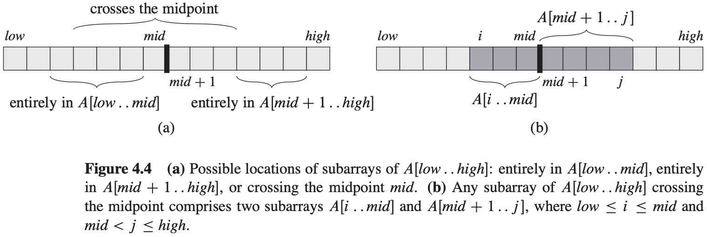

# 第四章 分治策略


**递归式**

三种求解递归式的方式（即得出算法的$\theta$或$O$渐近界的方法）：

- 代入法：我们猜测一个界，然后用数学归纳法证明这个界是正确的。
- 递归树法：将递归式转换为一棵树，其节点表示不同层次的递归调用产生的代价。然后采用边界和技术来求解递归式。
- 主方法：可求解形如下面公式的递归式的界：$T(n) = aT(n/b) + f(n)$，其中$a \geqslant 1, b > 1, f(n)是一个给定的函数$。

**递归式技术细节**

技术上，描述MERGE-SORT最坏情况运行时间的准确的递归式为：
$$
T(n) = 
\begin{cases}
\theta(1), &若n=1\\
T(\lceil n/2 \rceil) + T(\lfloor n/2 \rfloor) + \theta(n), &若n>1
\end{cases}
$$


## 4.1 最大子数组问题

**最大子数组（maximum subarray）** 最大的非空连续子数组。


考虑求解两个子数组$A[low..mid]$和$A[mid+1..high]$，如图所示：



$A[low..high]$的任何连续子数组$A[i..j]$所处的位置必然是以下三种情况之一：

- 完全位于子数组$A[low..mid]$中，因此$low \leqslant i \leqslant j \leqslant mid$。
- 完全位于子数组$A[mid+1..high]$中，因此$mid < i \leqslant j \leqslant high$。
- 跨越了中点，因此$low \leqslant i \leqslant mid < j \leqslant high$。

```c++
FIND-MAX-CROSSING-SUBARRAY(A, low, mid, high)
left - sum = -∞
sum = 0
for i = mid downto low
    sum = sum + A[i]
    if sum > left - sum
        left - sum = sum
        max - left = i
right - sum = -∞
sum = 0
for j = mid + 1 to hight
    sum = sum + A[j]
    if sum > right - sum
        right - sum = sum
        max - right = j
return (max-left, max-right, left-sum + right-sum)
```

```c++
FIND-MAXIMUM-SUBARRAY(A, low, hight)
if high == low
    return(low, high, A[low])
else mid = \lfloor (low+high)/2 \rfloor
    (left - low, left - high, left - sum) = FIND-MAXIMUM-SUBARRAY(A, low, mid)
    (right - low, right - high, right - sum) = FIND-MAXIMUM-SUBARRAY(A, mid+1, high)
    (cross-low, cross-high, cross-sum) = FIND-MAX-CROSSING-SUBARRAY(A, low, mid, high)
    if left - sum >= right - sum and left - sum >= cross - sum
        return (left - low, left - high, left - sum)
    else if right-sum >= left - sum and right - sum >= cross - sum
        return (right - low, right - high, right - sum)
    else return (cross - low, cross - high, cross - sum)
```

**分治算法分析**

FIND-MAXIMUM-SUBARRAY运行时间$T(n)$的递归式：
$$
T(n) = 
\begin{cases}
\theta(1), &若n=1\\
2T(n/2) + \theta(n), &若n>1
\end{cases}
$$


## 4.2 矩阵乘法的Strassen算法

若$A = (a_{ij})$和$B = (b_{})$
