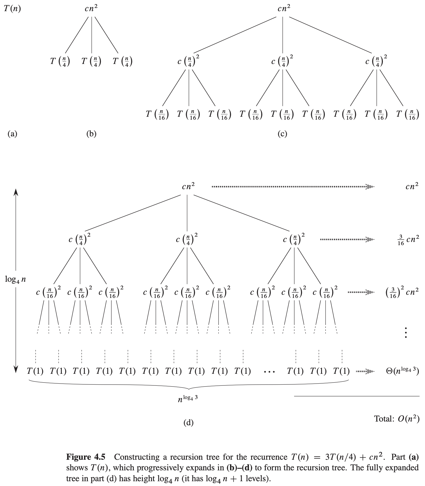

# 4 Divide-and-Conquer


**Recurrence**

There are three methods for solving recurrences-that is, for obtaining asymptotic "$\theta$" or "$O$" bounds on the solution:

- In the `substitution method`, we guess a bound and then use mathematical induction to prove our guess correct.

- The `recursion-tree method` converts the recurrence into a tree whose nodes represent the costs incurred at various levels of the recursion. We use techniques for bounding summations to solve the recurrence.

- The `master method` provides bounds for recurrences of the form
  $$
  T(n) = aT(n/b) + f(n)
  $$
  , where $a \geq 1, b > 1, and\ f(n)$ is a given function.

**Technicalities in recurrences**

Technically, the recurrence describing the worst-case running time of MERGE-SORT is really:
$$
T(n) = 
\begin{cases}
\theta(1), &if\ n=1\\
T(\lceil n/2 \rceil) + T(\lfloor n/2 \rfloor) + \theta(n) &if\ n>1
\end{cases}
$$

## 4.1 The maximum-subarray problem


We find the midpoint, say mid, of the subarray, and consider the subarrays $A[low..mid]$ and $A[mid+1..high]$, As below figure shows:


any contiguous subarray $A[i..j]$ of $A[low..high]$ must lie in exactly one of the following places:

- entirely in the subarray $A[low..mid]$, so that $low \leq i \leq j \leq mid$,
- entirely in the subarray $A[mid+1..high]$, so that $mid < i \leq j \leq high$, or
- crossing the midpoint, so that $low \leq i \leq mid < j \leq high$.

```c++
FIND-MAX-CROSSING-SUBARRAY(A, low, mid, high)
left - sum = -∞
sum = 0
for i = mid downto low
    sum = sum + A[i]
    if sum > left - sum
        left - sum = sum
        max - left = i
right - sum = -∞
sum = 0
for j = mid + 1 to hight
    sum = sum + A[j]
    if sum > right - sum
        right - sum = sum
        max - right = j
return (max-left, max-right, left-sum + right-sum)
```

```c++
FIND-MAXIMUM-SUBARRAY(A, low, hight)
if high == low
    return(low, high, A[low])
else mid = \lfloor (low+high)/2 \rfloor
    (left - low, left - high, left - sum) = FIND-MAXIMUM-SUBARRAY(A, low, mid)
    (right - low, right - high, right - sum) = FIND-MAXIMUM-SUBARRAY(A, mid+1, high)
    (cross-low, cross-high, cross-sum) = FIND-MAX-CROSSING-SUBARRAY(A, low, mid, high)
    if left - sum >= right - sum and left - sum >= cross - sum
        return (left - low, left - high, left - sum)
    else if right-sum >= left - sum and right - sum >= cross - sum
        return (right - low, right - high, right - sum)
    else return (cross - low, cross - high, cross - sum)
```

**Analyzing the divide-and-conquer algorithm**

The running time $T(n)$ of FIND-MAXIMUM-SUBARRAY:
$$
T(n) = 
\begin{cases}
\theta(1) &if\ n=1\\
2T(n/2) + \theta(n) &if\ n>1
\end{cases}
$$


## 4.2 Strassen's algorithm for matrix multiplication

If $A = (a_{ij})$ and $B = (b_{ij})$ are square $n \times n$ matrices, then in the product $C = A \cdot B$, we define the entry $C_{ij}$, for $i, j = 1, 2, ..., n$, by:
$$
c_{ij} = \sum_{k=1}^{n} a_{ik} \cdot b_{kj}
$$
The running time of SQUARE-MATRIX-MULTIPLY-RECURSIVE:
$$
T(n) = 
\begin{cases}
\theta(1) &if\ n=1\\
8T(n/2) + \theta(n^2) &if\ n>1
\end{cases}
$$
The running time $T(n)$ of Strassen's algorithm:
$$
T(n) = 
\begin{cases}
\theta(1) &if\ n=1\\
7T(n/2) + \theta(n^2) &if\ n>1
\end{cases}
$$


## 4.3 The substitution method for solving recurrences

The `substitution method` for solving recurrences comprises two steps:

1. Guess the form of the solution.
2. Use mathematical induction to find the constants and show that the solution works.


## 4.4 The recursion-tree method for solving recurrences



The costs over all levels to determine the cost for the entire tree:
$$
\begin{equation}\begin{split} 
T(n) &= cn^2 + \frac{3}{16}cn^2 + (\frac{3}{16})^2 cn^{2} + ... + (\frac{3}{16})^{log_4 n-1} cn^2 + \theta(n^{log_4 3}) \\
&= \sum_{i=0}^{log_4 n-1}(\frac{3}{16})^i cn^2 + \theta(n^{log_4 3}) \\
&= \frac{(3/16)^{log_4n - 1}}{(3/16) - 1} cn^2 + \theta(n^{log_4 3})
\end{split}\end{equation}
$$


## 4.5 The master method for solving recurrences

**Theorem 4.1 (Master theorem)** Let $a \geq 1$ and $b > 1$ be constants, let $f(n)$ be a function, and let $T(n)$ be defined on the nonnegative integers by the recurrence:
$$
T(n) = aT(n/b) + f(n)
$$
, where we interpret $n/b$ to mean either $\lfloor n/b \rfloor$ or $\lceil n/b \rceil$. Then $T(n)$ has the following asymptotic bounds:

1. If $f(n) = O(n^{log_b a - \epsilon})$ for some constant $\epsilon > 0$, then $T(n) = \theta(n^{log_b a})$.
2. If $f(n) = \theta(n^{log_b a})$, then $T(n) = \theta(n^{log_b a} lg\ n)$.
3. If $f(n) = \Omega(n^{log_b a+\epsilon})$ for some constant $\epsilon > 0$, and if $af(n/b) \leq cf(n)$ for some constant $c < 1$ and all sufficiently large $n$, then $T(n) = \theta(f(n))$.


## 4.6 Proof of the master theorem

### 4.6.1 The proof for exact powers

**Lemma 4.2** Let $a \geq 1$ and $b > 1$ be constants, and let $f(n)$ be a nonnegative function defined on exact powers of $b$. Define $T(n)$ on exact powers of $b$ by the recurrence:
$$
T(n) = 
\begin{cases}
\theta(1) &if\ n=1 \\
aT(n/b) + f(n) &if\ n=b^i \\
\end{cases}
$$
, where $i$ is a positive integer. Then:
$$
T(n) = \theta(n^{log_b a}) + \sum_{j=0}^{log_b n-1} a^j f(n/b^j)
$$

**Proof**


We use the recursion tree in Figure 4.7. The root of the tree has cost $f(n)$, and it has $a$ children, each with cost $f(n/b)$. (It is convenient to think of $a$ as being an integer, especially when visualizing the recursion tree, but the mathematics does not require it.) Each of these children has $a$ children has cost $f(n/b^2)$. In general, there are $a^j$ nodes at depth $j$, and each has cost $f(n/b^j)$. The cost of each leaf is $T(1) = \theta(1)$, and each leaf is at depth $log_b n$, since $n/b^{log_b n} = 1$. There are $a^{log_b n} = n^{log_b a}$ leaves in the tree.

**Lemma 4.3** Let $a \geq 1$ and $b > 1$ be constants, and let $f(n)$ be a nonnegative function defined on exact powers of $b$. A function $g(n)$ defined over exact powers of $b$ by:
$$
g(n) = \sum_{j=0}^{log_b n-1} a^j f(n/b^j)
$$
, has the following asymptotic bounds for exact powers of $b$:

1. If $f(n) = O(n^{log_b a - \epsilon})$ for some constant $\epsilon > 0$, then $g(n) = O(n^{log_b a})$.
2. If $f(n) = \theta(n^{log_b a})$, then $g(n) = \theta(n^{log_b a} lg\ n)$.
3. If $af(n/b) \leq cf(n)$ for some constant $c < 1$ and for all sufficiently large $n$, then $g(n) = \theta(f(n))$.

**Proof** For case 1, we have $f(n) = O(n^{log_b a - \epsilon})$, which implies that $f(n/b^j) = O((n / b^j)^{log_b a - \epsilon})$. Substituting into equation $g(n) = \sum_{j=0}^{log_b n-1} a^j f(n/b^j)$ yields:
$$
g(n) = O\left(\sum_{j=0}^{log_b n - 1} a^j \left(\frac{n}{b^j}\right)^{log_b a - \epsilon}\right)
$$
, we bound the summation within the $O$-notation by factoring out terms and simplifying, which leaves an increasing geometric series:
$$
\begin{equation}\begin{split} 
\sum_{j=0}^{log_b n-1} a^j \left(\frac{n}{b^j}\right)^{log_b a - \epsilon} &= n^{log_b a - \epsilon} \sum_{j=0}^{log_b n-1}\left(\frac{ab^\epsilon}{b^{log_b a}}\right)^j \\
&= n^{log_b a - \epsilon} \sum_{j=0}^{log_b n-1}(b^{\epsilon})^j \\
&= n^{log_b a - \epsilon} \left(\frac{b \epsilon log_b n - 1}{b^e - 1}\right) \\
&= n^{log_b a - \epsilon} \left(\frac{n^\epsilon - 1}{b^\epsilon - 1}\right)
\end{split}\end{equation}
$$
, Since $b$ and $\epsilon$ are constants, we can rewrite the last expression as $n^{log_b{a} - \epsilon} O(n^{\epsilon}) = O(n^{log_b{a}})$. Substituting this expression for the summation in the equation $g(n) = O\left(\sum_{j=0}^{log_b n - 1} a^j \left(\frac{n}{b^j}\right)^{log_b a - \epsilon}\right)$ yields $g(n) = O(n^{log_b{a}})$, thereby proving case 1.

, Because case 2 assumes that $f(n) = \theta(n^{log_b a})$, we have that $f(n/b^j) = \theta((n/b^j)^{log_b a})$. Substituting into equation $g(n) = \sum_{j=0}^{log_b n-1} a^j f(n/b^j)$ yields:
$$
g(n) = \theta\left(\sum_{j=0}^{log_b n - 1} a^j \left(\frac{n}{b^j}\right) ^ {log_b a}\right)
$$
, We bound the summation within the $\theta$-notation as in case 1, but this time we do not obtain a geometric series. Instead, we discover that every term of the summation is the same:
$$
\begin{equation}\begin{split} 
\sum_{j=0}^{log_b{n-1}} a^j \left(\frac{n}{b^j}\right)^{log_b {a}} &= n^{log_b{a}} \sum_{j=0}^{log_b{n-1}} \left(\frac{a}{b^{log_b{a}}}\right)^j \\
&= n^{log_b{a}} \sum_{j=0}^{log_b{n-1}} 1 \\
&= n^{log_b{a}} log_b{n}
\end{split}\end{equation}
$$
, Substituting this expression for the summation in equation $g(n) = \theta\left(\sum_{j=0}^{log_b n - 1} a^j \left(\frac{n}{b^j}\right) ^ {log_b a}\right)$ yields:
$$
\begin{equation}\begin{split} 
g(n) &= \theta(n^{log_b{a}} log_b{n}) \\
&= \theta(n^{log_b{a}} lg{n})
\end{split}\end{equation}
$$
, proving case 2. We prove case 3 similarly. Since $f(n)$ appears in the definition $g(n) = \sum_{j=0}^{log_b n-1} a^j f(n/b^j)$ of $g(n)$ and all terms of $g(n)$ are nonnegative, we can conclude that $g(n) = \Omega(f(n))$ for exact powers of $b$. We assume in the statement of the lemma that $af(n/b) \leq cf(n)$ for some constant $c < 1$ and all sufficiently large $n$. We rewrite this assumption as $f(n/b) \leq (c/a)f(n)$ and iterate $j$ times, yielding $f(n/b^j) \leq (c/a)^j f(n)$ or, equivalently, $a^j f(n/b^j) \leq c^j f(n)$, where are assume that the values we iterate on are sufficiently large. Since the last, and smallest, such value is $n/b^{j - 1}$, it is enough to assume that $n/b^{j - 1}$ is sufficiently large.

**Lemma 4.4** Let $a \geq 1$ and $b > 1$ be constants, and let $f(n)$ be a nonnegative function defined on exact powers of $b$. Define $T(n)$ on exact powers of $b$ by the recurrence:
$$
T(n) = 
\begin{cases}
\theta(1) &if\ n=1 \\
aT(n/b) + f(n) &if\ n=b^i \\
\end{cases}
$$
, where $i$ is a positive integer. Then $T(n)$ has the following asymptotic bounds for exact powers of $b$:

1. If $f(n) = O(n^{log_b a - \epsilon})$ for some constant $\epsilon > 0$, then $T(n) = \theta(n^{log_b a})$.
2. If $f(n) = \theta(n^{log_b a})$, then $T(n) = \theta(n^{log_b{a}} lg\ {n})$.
3. If $f(n) = \Omega(n^{log_b a + \epsilon})$ for some constant $\epsilon > 0$, and if $af(n/b) \leq cf(n)$ for some constant $c < 1$ and all sufficiently large $n$, then $T(n) = \theta(f(n))$.

**Proof** We use the bounds in Lemma 4.3 to evaluate the summation from Lemma 4.2 For case 1, we have:
$$
\begin{equation}\begin{split} 
T(n) &= \theta(n^{log_b a}) + O(n^{log_b a}) \\
&= \theta(n^{log_b a})
\end{split}\end{equation}
$$
, and for case 2,
$$
\begin{equation}\begin{split} 
T(n) &= \theta(n^{log_b{a}}) + \theta(n^{log_b{a}} lg\ {n}) \\
&= \theta(n^{log_b{a}} lg\ n)
\end{split}\end{equation}
$$
, For case 3,
$$
\begin{equation}\begin{split} 
T(n) &= \theta(n^{log_b{a}}) + \theta(f(n)) \\
&= \theta(f(n))
\end{split}\end{equation}
$$
, because $f(n) = \Omega(n^{log_b a + \epsilon})$.


### 4.6.2 Floors and ceilings


TODO


