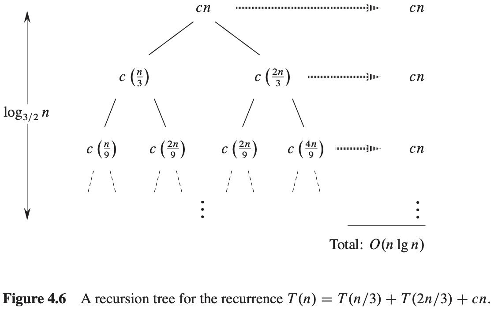
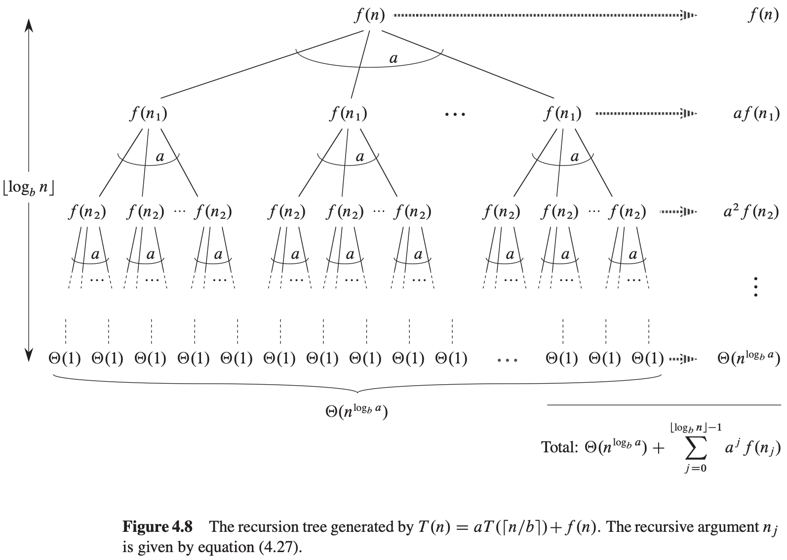

# 第四章 分治策略


**递归式**

三种求解递归式的方式（即得出算法的$\theta$或$O$渐近界的方法）：

- 代入法：我们猜测一个界，然后用数学归纳法证明这个界是正确的。
- 递归树法：将递归式转换为一棵树，其节点表示不同层次的递归调用产生的代价。然后采用边界和技术来求解递归式。
- 主方法：可求解形如下面公式的递归式的界：$T(n) = aT(n/b) + f(n)$，其中$a \geqslant 1, b > 1, f(n)是一个给定的函数$。

**递归式技术细节**

技术上，描述MERGE-SORT最坏情况运行时间的准确的递归式为：
$$
T(n) = 
\begin{cases}
\theta(1), &若n=1\\
T(\lceil n/2 \rceil) + T(\lfloor n/2 \rfloor) + \theta(n), &若n>1
\end{cases}
$$


## 4.1 最大子数组问题

**最大子数组（maximum subarray）** 最大的非空连续子数组。


考虑求解两个子数组$A[low..mid]$和$A[mid+1..high]$，如图所示：


$A[low..high]$的任何连续子数组$A[i..j]$所处的位置必然是以下三种情况之一：

- 完全位于子数组$A[low..mid]$中，因此$low \leqslant i \leqslant j \leqslant mid$。
- 完全位于子数组$A[mid+1..high]$中，因此$mid < i \leqslant j \leqslant high$。
- 跨越了中点，因此$low \leqslant i \leqslant mid < j \leqslant high$。

```c++
FIND-MAX-CROSSING-SUBARRAY(A, low, mid, high)
left - sum = -∞
sum = 0
for i = mid downto low
    sum = sum + A[i]
    if sum > left - sum
        left - sum = sum
        max - left = i
right - sum = -∞
sum = 0
for j = mid + 1 to hight
    sum = sum + A[j]
    if sum > right - sum
        right - sum = sum
        max - right = j
return (max-left, max-right, left-sum + right-sum)
```

```c++
FIND-MAXIMUM-SUBARRAY(A, low, hight)
if high == low
    return(low, high, A[low])
else mid = \lfloor (low+high)/2 \rfloor
    (left - low, left - high, left - sum) = FIND-MAXIMUM-SUBARRAY(A, low, mid)
    (right - low, right - high, right - sum) = FIND-MAXIMUM-SUBARRAY(A, mid+1, high)
    (cross-low, cross-high, cross-sum) = FIND-MAX-CROSSING-SUBARRAY(A, low, mid, high)
    if left - sum >= right - sum and left - sum >= cross - sum
        return (left - low, left - high, left - sum)
    else if right-sum >= left - sum and right - sum >= cross - sum
        return (right - low, right - high, right - sum)
    else return (cross - low, cross - high, cross - sum)
```

**分治算法分析**

FIND-MAXIMUM-SUBARRAY运行时间$T(n)$的递归式：
$$
T(n) = 
\begin{cases}
\theta(1), &若n=1\\
2T(n/2) + \theta(n), &若n>1
\end{cases}
$$


## 4.2 矩阵乘法的Strassen算法

若$A = (a_{ij})$和$B = (b_{ij})$是$n \times n$的方阵，则对$i, j = 1, 2, ..., n$，定义乘积$C = A \cdot B$中的元素$C_{ij}$为：$c_{ij} = \sum_{k=1}^{n} a_{ik} \cdot b_{kj}$。

SQUARE-MATRIX-MULTIPLY-RECURSIVE运行时间的递归式：
$$
T(n) = 
\begin{cases}
\theta(1) &若n=1\\
8T(n/2) + \theta(n^2) &若n>1
\end{cases}
$$
Strassen算法运行时间$T(n)$的递归式：
$$
T(n) = 
\begin{cases}
\theta(1) &若n=1\\
7T(n/2) + \theta(n^2) &若n>1
\end{cases}
$$


## 4.3 用代入法求解递归式

代入法求解递归式分为2步：

1. 猜测解的形式。
2. 用数学归纳法求出解中的常数，并证明解是正确的。


## 4.4 用递归树方式求解递归式


确定整棵树的代价：
$$
\begin{equation}\begin{split} 
T(n) &= cn^2 + \frac{3}{16}cn^2 + (\frac{3}{16})^2 cn^{2} + ... + (\frac{3}{16})^{log_4 n-1} cn^2 + \theta(n^{log_4 3}) \\
&= \sum_{i=0}^{log_4 n-1}(\frac{3}{16})^i cn^2 + \theta(n^{log_4 3}) \\
&= \frac{(3/16)^{log_4n - 1}}{(3/16) - 1} cn^2 + \theta(n^{log_4 3})
\end{split}\end{equation}
$$



## 4.5 用主方法求解递归式

### 主定理

**定理4.1** 令$a \geqslant 1$和$b > 1$是常数，$f(n)$是一个函数，$T(n)$是定义在非负整数上的递归式：$T(n) = aT(n/b) + f(n)$。其中我们将$n/b$解释为$\lfloor n/b \rfloor$或$\lceil n/b \rceil$。那么$T(n)$有如下渐近界：

1. 若对某个常数$\epsilon > 0$有$f(n) = O(n^{log_b a - \epsilon})$，则$T(n) = \theta(n^{log_b a})$。
2. 若$f(n) = \theta(n^{log_b a})$，则$T(n) = \theta(n^{log_b a} lg\ n)$。
3. 若对某个常数$\epsilon > 0$有$f(n) = \Omega(n^{log_b a+\epsilon})$，且对某个常数$c < 1$和所有足够大的$n$有$af(n/b) \leqslant cf(n)$，则$T(n) = \theta(f(n))$。


## 4.6 证明主定理

### 4.6.1 对b的幂证明主定理

**引理4.2** 令$a \geqslant 1$和$b > 1$是常数，$f(n)$是一个定义在$b$的幂上的非负函数。$T(n)$是定义在$b$的幂上的递归式：
$$
T(n) = 
\begin{cases}
\theta(1) &若n=1 \\
aT(n/b) + f(n) &若n=b^i \\
\end{cases}
$$
其中$i$是正整数。那么$T(n) = \theta(n^{log_b a}) + \sum_{j=0}^{log_b n-1} a^j f(n/b^j)$。

**证明** 


树的根节点的代价为$f(n)$，它有$a$个孩子节点，每个的代价为$f(n/b)$。每个孩子节点又有$a$个孩子，使得在深度为$2$的层次上有$a^2$个节点，每个的代价为$f(n/b^2)$。一般地，深度为$j$的层次上有$a^j$个节点，每个的代价为$f(n/b^j)$。每个叶节点的代价为$T(1) = \theta(1)$，深度为$log_b n$，因为$n/b ^ {log_b n} = 1$。树中共有$a^{log_b n} = n^{log_b a}$个叶节点。

**引理4.3** 令$a \geqslant 1$和$b > 1$是常数，$f(n)$是一个定义在$b$的幂上的非负函数。$g(n)$是定义在$b$的幂上的函数：$g(n) = \sum_{j=0}^{log_b n-1} a^j f(n/b^j)$，对$b$的幂，$g(n)$有如下渐近界：

1. 若对某个常数$\epsilon > 0$有$f(n) = O(n^{log_b a - \epsilon})$，则$g(n) = O(n^{log_b a})$。
1. 若$f(n) = \theta(n^{log_b a})$，则$g(n) = \theta(n^{log_b a} lg\ n)$。
1. 若对某个常数$c < 1$和所有足够大的$n$有$af(n/b) \leqslant cf(n)$，则$g(n) = \theta(f(n))$。

**证明** 对情况1，我们有$f(n) = O(n^{log_b a - \epsilon})$，这意味着$f(n/b^j) = O((n / b^j)^{log_b a - \epsilon})$。代入公式$g(n) = \sum_{j=0}^{log_b n - 1} a^j f(n/b^j)$得$g(n) = O(\sum_{j=0}^{log_b n - 1} a^j (\frac{n}{b^j})^{log_b a - \epsilon})$，对于$O$符号内的和式，通过提取因子并化简来求它的界，得到一个递增的几何级数：
$$
\begin{equation}\begin{split} 
\sum_{j=0}^{log_b n-1} a^j (\frac{n}{b^j})^{log_b a - \epsilon} &= n^{log_b a - \epsilon} \sum_{j=0}^{log_b n-1}(\frac{ab^\epsilon}{b^{log_b a}})^j = n^{log_b a - \epsilon} \sum_{j=0}^{log_b n-1}(b^{\epsilon})^j \\
&= n^{log_b a - \epsilon} (\frac{b \epsilon log_b n - 1}{b^e - 1}) = n^{log_b a - \epsilon}(\frac{n^\epsilon - 1}{b^\epsilon - 1})
\end{split}\end{equation}
$$
  由于情况2假定$f(n) = \theta(n^{log_b a})$，因此有$f(n/b^j) = \theta((n/b^j)^{log_b a})$，代入公式得$g(n) = \theta(\sum_{j=0}^{log_b n - 1} a^j (\frac{n}{b^j}) ^ {log_b a})$

采用与情况1相同的方式，求出$\theta$符号内和式的界，但这次并未得到一个几何级数，而是发现和式的每一项都是相同的：$\sum_{j=0}^{log_b n - 1} a^j (\frac{n}{b^j}) ^ log_b a = n^{log_b a} \sum_{j=0}^{log_b n - 1}(\frac{a}{b^{log_b a}})^j = n^{log_b a} \sum_{j=0}^{log_b n - 1} 1 = n^{log_b a} log_b n$

用这个表达式替换公式$g(n) = \theta(\sum_{j=0}^{log_b n - 1} a^j (\frac{n}{b^j}) ^ {log_b a})$中的和式，得到：$g(n) = \theta(n^{log_b a log_b n}) = \theta(n^{log_b a} lg\ n)$。情况2得证。

  情况3的证明类似。由于$f(n)$出现在定义$g(n) = \sum_{j=0}^{log_b n - 1} a^j f(n/b^j)$中，且$g(n)$的所有项都是非负的，因此可以得出结论：对$b$的幂，$g(n) = \Omega(f(n))$。假定在这个引理中，对某个常数$c < 1$和所有足够大的$n$有$af(n/b) \leqslant cf(n)$。将这个假设改写为$f(n/b) \leqslant (c/a)f(n)$并迭代$j$次，得到$f(n/b^j) \leqslant (c/a)^j f(n)$，或等价地，$a^j f(n/b^j) \leqslant c^j f(n)$，其中假设进行迭代的值足够大。由于最后一个，也就是最小的值为$n/b^{j-1}$，因此假定$n/b^{j-1}$足够大就够了。

**引理4.4** 令$a \geqslant 1$和$b > 1$是常数，$f(n)$是一个定义在$b$的幂上的非负函数。$T(n)$是定义在$b$的幂上的递归式：
$$
T(n) = 
\begin{cases}
\theta(1) &若n=1 \\
aT(n/b) + f(n) &若n=b^i \\
\end{cases}
$$
其中$i$是正整数。那么对$b$的幂，$T(n)$有如下渐近界：

1. 若对某个常数$\epsilon > 0$有$f(n) = O(n^{log_b a - \epsilon})$，则$T(n) = \theta(n^{log_b a})$。
2. 若$f(n) = \theta(n^{log_b a})$，则$T(n) = \theta(n^{log_b a log\ n})$。
3. 若对某个常数$\epsilon > 0$，有$f(n) = \Omega(n^{log_b a + \epsilon})$，并且对某个常数$c < 1$和所有足够大的$n$，有$af(n/b) \leqslant cf(n)$，则$T(n) = \theta(f(n))$。

**证明**  我们有：$T(n) = \theta(n^{log_b a}) + O(n^{log_b a}) = \theta(n^{log_b a})$，

对于情况2：$T(n) = \theta(n^{log_b a}) + \theta(n^{log_b\ a lg\ n}) = \theta(n^{log_b a lg\ n})$，

对于情况3：$T(n) = \theta(n^{log_b a}) + \theta(f(n)) = \theta(f(n))$，

因为$f(n) = \Omega(n^{log_b a + \epsilon})$。

### 4.6.2 向下取整和向上取整



$T(n) = \theta(n^{log_b a}) + \sum_{j=0}^{\lfloor log_b n \rfloor - 1} a^j f(n_j)$

$g(n) = \sum_{j=0}^{\lfloor log_b n \rfloor - 1} a^j f(n_j)$
$$
\begin{equation}\begin{split} 
f(n_j) 
&\leqslant c(\frac{n}{b^j} + \frac{b}{b-1})^{log_b a} = c(\frac{n}{b^j}(1 + \frac{b^j}{n} \cdot \frac{b}{b-1}))^{log_b a} \\
&= c(\frac{n log_b a}{a^j})(1 + (\frac{b^j}{n} \cdot \frac{b}{b-1})) ^ log_b a \\
&\leqslant c(\frac{n log_b a}{a^j})(1 + \frac{b}{b - 1})^{log_b a} = O(\frac{n^{log_b a}}{a^j})
\end{split}\end{equation}
$$
因为$c(1+b/(b-1))^{log_b a}$是常量。


