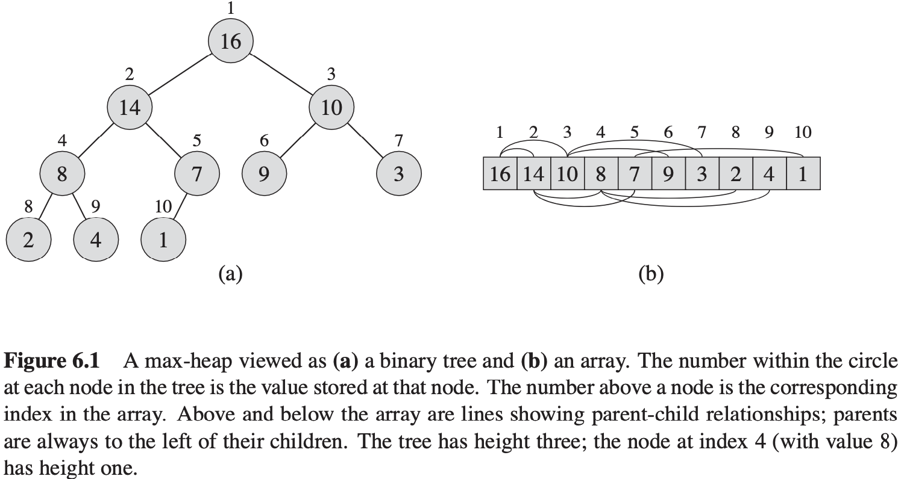
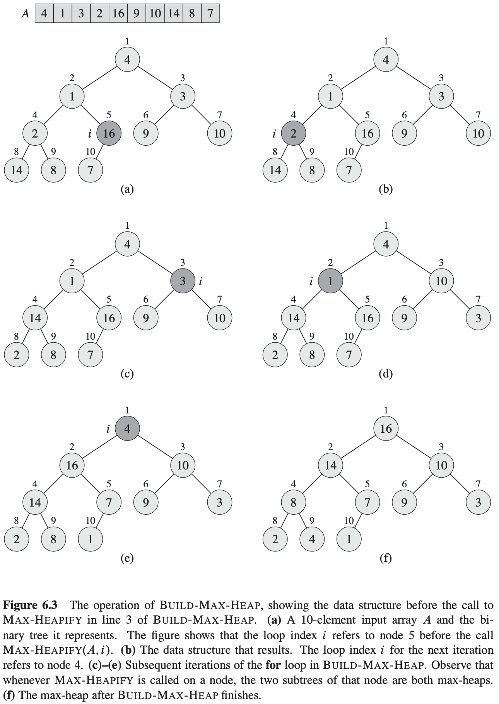
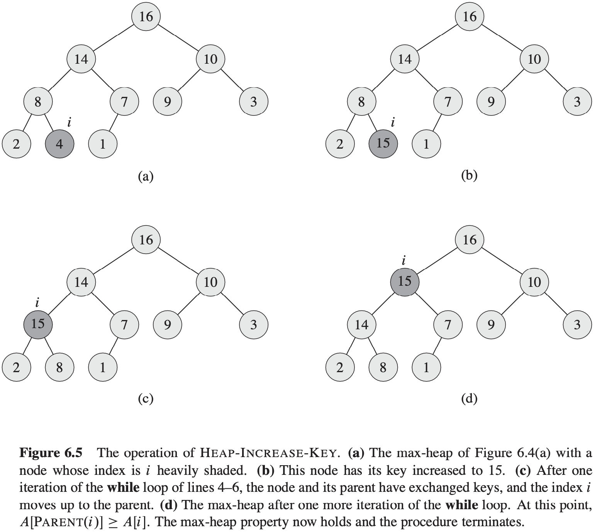

# 第6章 堆排序

## 6.1 堆

二叉堆可以分为两种形式：

- 最大堆：除根以外的所有结点$i$都有$A[PARENT(i)] \geqslant A[i]$。
- 最小堆：除根以外的所有结点$i$都有$A[PARENT(i)] \leqslant A[i]$。

堆结构上的一些基本操作的运行时间至多与树的高度成正比，即时间复杂度为$O(lgn)$。

## 6.2 维护堆的性质

$$
MAX-HEAPIFY(A, i) \\
\begin{align}
& l = LEFT(i) \\
& r = RIGHT(i) \\
& if\ l \leqslant A.heap - size\ and\ A[l] > A[i] \\
& \qquad largest = l \\
& else\ largest = i \\
& if\ r \leqslant A.heap - size\ and\ A[r] > A[largest] \\
& \qquad largest = r \\
& if\ larget \neq i \\
& \qquad exchange\ A[i]\ with\ A[largest] \\
& \qquad MAX-HEAPIFY(A, largest)
\end{align}
$$
MAX-HEAPIFY的运行时间：$T(n) \leqslant T(2n / 3) + \theta(1)$的解为：$T(n) = O(lgn)$。

对于一个树高为$h$的节点来说，MAX-HEAPIFY的时间复杂度为$o(h)$。

## 6.3 建堆

$$
BUILD-MAX-HEAP(A) \\
\begin{align}
& A.heap - size = A.length \\
& for i = \lfloor A.length / 2 \rfloor downto 1 \\
& \qquad MAX-HEAPIFY(A, i)
\end{align}
$$
BUILD-MAX-HEAP的总代价为：$\sum_{\lfloor lg n \rfloor}^{h = 0} \lceil \frac{n}{2^{h + 1}} \rceil O(h) = O(n \sum_{h = 0}^{\lfloor lgn \rfloor} \frac{h}{2^h}) = O(n \sum_{h = 0}^{\infty} \frac{h}{2^h}) = O(n)$。

## 6.4 堆排序算法

$$
HEAPSORT(A) \\
\begin{align}
& BUILD-MAX-HEAP(A) \\
& for\ i = A.length\ downto\ 2 \\
& \qquad exchange\ A[1]\ with\ A[i] \\
& \qquad A.heap - size = A.heap - size - 1 \\
& \qquad MAX-HEAPIFY(A, 1) \\
\end{align}
$$

## 6.5 优先队列

**优先队列（priority queue）** 是一种用来维护由一组元素构成的集合$S$的数据结构，其中的每一个元素都有一个相关的值，称为**关键字（key）**。一个**最大优先队列**支持以下操作：

- $INSERT(S, x)$：把元素$x$插入集合$S$中。这一操作等价于$S = S \cup \{x\}$。
- $MAXIMUM(S)$：返回$S$中具有最大键字的元素。
- $EXTRACT-MAX(S)$：去掉并返回$S$中的具有最大键字的元素。
- $INCREASE-KEY(S, x, k)$：将元素$x$的关键字值增加到$k$，这里假设$k$的值不小于$x$的原关键字值。

$$
HEAP-INCREASE-KEY(A, i, key) \\
\begin{align}
& if\ key < A[i] \\
& \qquad error "new key is smaller than current key" \\
& A[i] = key \\
& while\ i > 1\ and\ A[PARENT(i)] < A[i] \\
& \qquad exchange A[i] with A[PARENT(i)] \\
& \qquad i = PARENT(i)
\end{align}
$$
