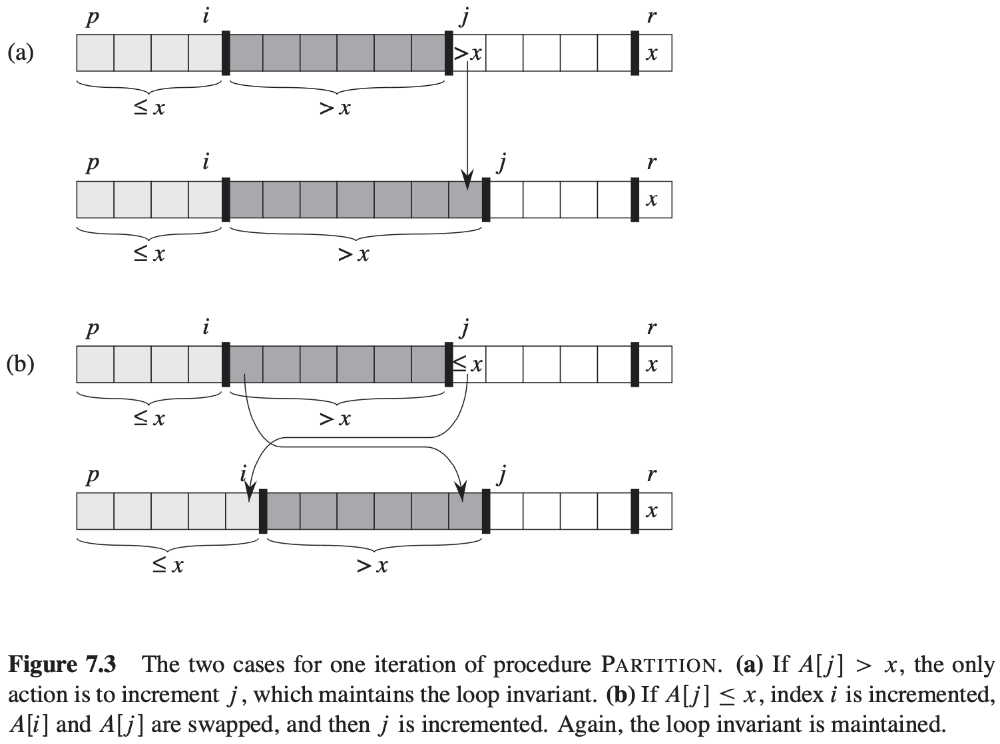

[中文版](chapter7_zh.md) | English

# 7 Quicksort

[TOC]

## Description of quicksort

Here is the three-step divide-and-conquer process for sorting a typical subarray $A[p..r]$:

1. **Divide:** Partition (rearrange) the array $A[p..r]$ into two (possibly empty) subarrays $A[p..q - 1]$ and $A[q + 1 .. r]$ such that each element of $A[p .. q - 1]$ is less than or equal to $A[q]$, which is, in turn, less than or equal to each element of $A[1 + 1 .. r]$. Compute the index $q$ as part of this partitioning procedure.
2. **Conquer:** Sort the two subarrays $A[p .. q - 1]$ and $A[q + 1 .. r]$ by recursive calls to quicksort.
3. **Combine:** Because the subarrays are already sorted, no work is needed to combine them: the entire array $A[p..r]$ is now sorted.

$$
\begin{align}
& QUICKSORT(A, p, r) \\
& if\ p < r \\
& \qquad q = PARTITION(A, p, r) \\
& \qquad QUICKSORT(A, p, q - 1) \\
& \qquad QUICKSORT(A, q + 1, r)
\end{align}
$$

$$
\begin{align}
& PARTITION(A, p, r) \\
& x = A[r] \\
& i = p - 1 \\
& for j = p to r - 1 \\
& \qquad if\ A[j] \leqslant x \\
& \qquad \qquad i = i + 1 \\
& \qquad \qquad exchange\ A[i]\ with\ A[j] \\
& exchange\ A[i + 1]\ with\ A[r] \\
& return\ i + 1
\end{align}
$$

## Performance of quicksort

**Worst-case partitioning**
$$
\begin{equation}\begin{split}
T(n) &= T(n - 1) + T(0) + \theta(n) \\
&= T(n - 1) + \theta(n)
\end{split}\end{equation}
$$
**Best-case partitioning**

$T(n) = 2T(n / 2) + \theta(n)$

**Balanced partitioning**

$T(n) = T(9n/10) + T(n / 10) + cn$

**Intuition for the average case**

## A randomized version of quicksort

$$
\begin{align}
& RANDOMIZED-PARTITION(A, p, r) \\
& i = RANDOM(p, r) \\
& exchange\ A[r]\ with\ A[i] \\
& return\ PARTITION(A, p, r)
\end{align}
$$

$$
\begin{align}
& RANDOMIZED-QUICKSORT(A, p, r) \\
& if\ p < r \\
& \qquad q = RANDOMIZED-PARTITION(A, p, r) \\
& \qquad RANDOMIZED-QUICKSORT(A, p, q - 1) \\
& \qquad RANDOMIZED-QUICKSORT(A, q + 1 r)
\end{align}
$$

## Analysis of quicksort

### Worst-case analysis

Let $T(n)$ be teh worst-case time for the procedure QUICKSORT on an input of size $n$. We have the recurrence:
$$
T(n) = max_{0 \leqslant q \leqslant n - 1}(T(q) + T(n - q - 1)) + \theta(n)
$$
, where the parameter $q$ ranges from $0$ to $n - 1$ because the procedure PARTITION produces two subproblems with total size $n - 1$. We guess that $T(n) \leq cn^2$ for some constant $c$. Substituting this guess into above recurrence, we obtain:
$$
\begin{equation}\begin{split} 
T(n) & \leqslant max_{0 \leqslant q \leqslant n - 1}(cq^2 + c(n - q - 1)^2) + \theta(n) \\ 
& = c \cdot max_{0 \leqslant q \leqslant n - 1}(q^2 + (n - q - 1)^2) + \theta(n)
\end{split}\end{equation}
$$
, The expression $q^2 + (n - q - 1)^2$ achieves a maximum over the parameter's range $0 \leq q \leq n - 1$ at either endpoint. To verify this claim, note that the second derivative of the expression with respect to $q$ is positive. This observation gives us the bound $max_{0 \leqslant q \leqslant n - 1}(q^2 + (n - q - 1)^2) \leq (n - 1)^2 = n^2 - 2n + 1$. Continuing with our bounding of $T(n)$, we obtain:
$$
\begin{equation}\begin{split} 
T(n) &\leq cn^2 - c(2n - 1) + \theta(n) \\ 
&\leq cn^2
\end{split}\end{equation}
$$

### Expected running time

**Lemma 7.1** Let $X$ be the number of comparisons performed in line 4 of PARTITION over the entire execution of QUICKSORT on an $n$-element array. Then the running time of QUICKSORT is $O(n + X)$.

**Proof** By the discussion above, the algorithm makes at most $n$ calls to PARTITION, each of which does a constant amount of work and then executes the `for` loop some number of times. Each iteration of the `for` loop executes line 4.
