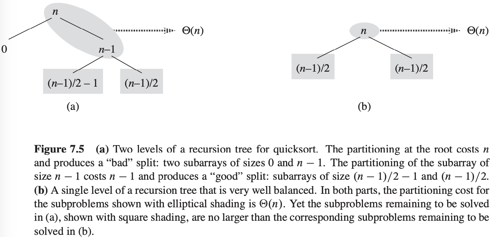

# 第7章 快速排序

## 7.1 快速排序的描述

对一个数组$A[p .. r]$进行快速排序的三步分治过程：

1. 分解：数组$A[p .. r]$被划分为两个（可能为空）子数组$A[p .. q - 1]$和$A[q + 1 .. r]$，使得$A[p .. q - 1]$中的每一个元素都小于等于$A[q]$，而$A[q]$也小于等于$A[q + 1 .. r]$中的每个元素。
2. 解决：通过递归调用快速排序，对子数组$A[p .. q - 1]$和$A[q + 1 .. r]$进行排序。
3. 合并：因为子数组都是原址排序的，所以不需要合并操作：数组$A[p .. r]$已经有序。

$$
\begin{align}
& QUICKSORT(A, p, r) \\
& if\ p < r \\
& \qquad q = PARTITION(A, p, r) \\
& \qquad QUICKSORT(A, p, q - 1) \\
& \qquad QUICKSORT(A, q + 1, r)
\end{align}
$$

$$
\begin{align}
& PARTITION(A, p, r) \\
& x = A[r] \\
& i = p - 1 \\
& for j = p to r - 1 \\
& \qquad if\ A[j] \leqslant x \\
& \qquad \qquad i = i + 1 \\
& \qquad \qquad exchange\ A[i]\ with\ A[j] \\
& exchange\ A[i + 1]\ with\ A[r] \\
& return\ i + 1
\end{align}
$$

## 7.2 快速排序的性能

**最坏情况划分**

$T(n) = T(n - 1) + T(0) + \theta(n) = T(n - 1) + \theta(n)$

**最好情况划分**

$T(n) = 2T(n / 2) + \theta(n)$

**平衡的划分**

$T(n) = T(9n/10) + T(n / 10) + cn$

**对于平均情况的直观观察**

## 7.3 快速排序的随机化版本

$$
\begin{align}
& RANDOMIZED-PARTITION(A, p, r) \\
& i = RANDOM(p, r) \\
& exchange\ A[r]\ with\ A[i] \\
& return\ PARTITION(A, p, r)
\end{align}
$$

$$
\begin{align}
& RANDOMIZED-QUICKSORT(A, p, r) \\
& if\ p < r \\
& \qquad q = RANDOMIZED-PARTITION(A, p, r) \\
& \qquad RANDOMIZED-QUICKSORT(A, p, q - 1) \\
& \qquad RANDOMIZED-QUICKSORT(A, q + 1 r)
\end{align}
$$

## 7.4 快速排序分析

### 7.4.1 最坏情况分析

假设$T(n)$是最坏情况下QUICKSORT在输入规模为$n$的数据集合上所花费的时间，则有递归式：
$$
T(n) = max_{0 \leqslant q \leqslant n - 1}(T(q) + T(n - q - 1)) + \theta(n)
$$
因为PARTITION函数生成的两个子问题的规模加总为$n - 1$，所以参数$q$的变化范围是$0$到$n - 1$。我们不妨猜测$T(n) \leqslant cn^2$成立，其中$c$为常数。代入上式中，得：
$$
\begin{equation}\begin{split} 
T(n) & \leqslant max_{0 \leqslant q \leqslant n - 1}(cq^2 + c(n - q - 1)^2) + \theta(n) \\ 
& = c \cdot max_{0 \leqslant q \leqslant n - 1}(q^2 + (n - q - 1)^2) + \theta(n)
\end{split}\end{equation}
$$
表达式$q^2 + (n - q - 1)^2$在参数取值区间$0 \leqslant q \leqslant n - 1$的端点上取得最大值。由于该表达式对于$q$的二阶导数是正的，我们可以得到表达式的上界$max_{0 \leqslant q \leqslant n - 1}(q^2 + (n - q - 1)^2) \leqslant (n - 1)^2 = n^2 - 2n + 1$，代入上式中，得：
$$
T(n) \leqslant cn^2 - c(2n - 1) + \theta(n) \leqslant cn^2
$$

### 7.4.2 期望运行时间

**引理 7.1** 当在一个包含$n$个元素得数组上运行QUICKSORT时，假设在PARTITION的第4行中所做比较的次数为$X$，那么QUICKSORT的运行时间为$O(n + X)$。

使用RANDOMIZED-PARTITION，在输入元素互异的情况下，快速排序算法的期望运行时间为$O(nlg\ n)$。
