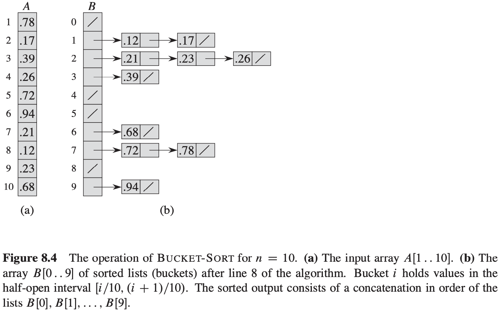

# 第8章 线性时间排序

## 8.1 排序算法的下界

**决策树模型**

决策树是一棵完全二叉树，它可以表示在给定输入规模情况下，某一特定排序算法对所有元素的比较操作。

**最坏情况的下界**

当决策树中每种排列都是以可达的叶结点的形式出现时，该决策树高度的下界也就是比较排序算法运行时间的下界。

**定理 8.1** 在最坏情况下，任何比较排序算法都需要做$\Omega (nlg\ n)$次比较。

**推论 8.2** 堆排序和归并排序都是渐近最优的比较排序算法。

## 8.2 计数排序

**计数排序** 假设$n$个输入元素中的每一个都是在$0$到$k$区间内的一个整数，其中$k$为某个整数。当$k = O(n)$时，排序的运行时间为$\theta(n)$。

$$
\begin{align}
& COUNTING-SORT(A, B, k) \\
& let\ C[0..k]\ be\ a\ new\ array \\
& for\ i = 0\ to\ k \\
& \qquad C[i] = 0 \\
& for\ j = 1\ to\ A.length \\
& \qquad C[A[j]] = C[A[j]] + 1 \\
& //\ C[i]\ now\ contains\ the\ number\ of\ elements\ equal\ to\ i. \\
& for\ i = 1\ to\ k \\
& \qquad C[i] = C[i] + C[i - 1] \\
& //\ C[i]\ now\ contains\ the\ number\ of\ elements\ less\ than\ or\ equal\ to\ i. \\
& for\ j = A.length\ downto\ 1 \\
& \qquad B[C[A[j]]] = A[j] \\
& \qquad C[A[j]] = C[A[j]] - 1
\end{align}
$$
计数排序的一个重要性质就是它是**稳定的**，原因如下：

1. 具有相同值得元素在输出数组中的相对次序与它们在输入数组中的相对次序相同。
2. 计数排序经常会被用作基数排序算法得一个子过程。

## 8.3 基数排序

$$
\begin{align}
& RADIX-SORT(A, d) \\
& for\ i\ =\ 1\ to\ d \\
& \qquad use\ a\ stable\ sort\ to\ sort\ array\ A\ on\ digit\ i
\end{align}
$$
**引理 8.3** 给定$n$个$d$位数，其中每一个数位有$k$个可能的取值。如果RADIX-SORT使用得稳定排序方法耗时$\theta(n + k)$，那么它就可以在$\theta(d(n + k))$时间内将这些数排好序。

**引理 8.4** 给定一个$b$位数和任何正整数$r \leqslant b$，如果RADIX-SORT使用的稳定排序算法对数据取值区间是$0$到$k$得输入进行排序耗时$\theta(n + k)$，那么它就可以在$\theta((b/r)(n + 2^r))$时间内将这些数排好序。

### 8.4 桶排序

桶排序将$[0, 1)$区间划分为$n$个相同大小的子区间，或称为**桶**。然后，将$n$个输入数分别放到各个桶中。

$$
\begin{align}
& BUCKET-SORT(A) \\
& n = A.length \\
& let\ B[0..n-1]\ be\ a\ new\ array \\
& for\ i = 0\ to\ n - 1 \\
& \qquad make\ B[i]\ an\ empty\ list \\
& for\ i = 1\ to\ n \\
& \qquad insert\ A[i]\ into\ list\ B[\lfloor nA[i] \rfloor] \\
& for\ i = 0\ to\ n - 1 \\
& \qquad sort\ list\ B[i]\ with\ insertion\ sort \\
& concatenate\ the\ lists\ B[0], B[1], ..., B[n - 1]\ together\ in\ order
\end{align}
$$
假设$n_i$是表示桶$B[i]$中元素个数得随机变量，因为插入排序得时间代价是平方阶得，所以桶排序的时间代价为：
$$
T(n) = \theta(n) + \sum_{i = 0}^{n - 1}O(n_i ^ 2)
$$
对上式两边取期望，并利用期望的线性性质，有：
$$
\begin{equation}\begin{split} 
E[T(n)] &= E[\theta(n) + \sum_{i = 0}^{n - 1}O(n_i ^ 2)] \\
&= \theta(n) + \sum_{i = 0}^{n - 1}E[O(n_i ^ 2)] \\
&= \theta(n) + \sum_{i = 0}^{n - 1}O(E[n_i ^ 2])
\end{split}\end{equation}
$$
为了计算$E[n_i ^ 2]$，我们展开平方项，并重新组合各项，得到：
$$
\begin{equation}\begin{split} 
E[n_i ^ 2] &= E[(\sum_{j = 1}^{n} X_{ij})^2] = E[\sum_{j = 1}^{n} \sum_{k = 1}^{n} X_{ij} X_{ik}] = E[\sum_{j = 1}^{n} X_{ij}^2 + \sum_{1 \leqslant j \leqslant n} \sum_{1 \leqslant k \leqslant n, k \neq j}X_{ij} X_{ik}] \\
&= \sum_{j = 1}^{n}E[X_{ij}^2] + \sum_{1 \leqslant j \leqslant n} \sum_{1 \leqslant k \leqslant n, k \neq j} E[X_{ij} X_{ik}]
\end{split}\end{equation}
$$
综上所得：桶排序的期望运行时间为$\theta(n) + n \cdot O(2 - 1/n) = \theta(n)$。

