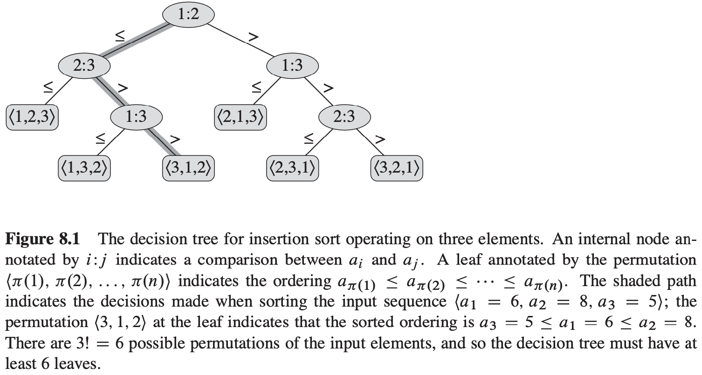

[中文版](chapter8_zh.md) | English

# 8 Sorting in linear Time

[TOC]

## Lower bounds for sorting

**The decision-tree model**

A **decision tree** is a full binary tree that represents the comparisons between elements that are performed by a particular sorting algorithm operating on an input of a given size.

**A lower bound for the worst-case**

A lower bound on the heights of all decision trees in which each permutation appears as a reachable leaf is therefore a lower bound on the running time of any comparison sort algorithm.

**Theorem 8.1** Any comparison sort algorithm requires $\Omega(n lg\ n)$ comparisons in the worst case.

**Corollary 8.2** Heapsort and merge sort are asymptotically optimal comparison sorts.

## Counting sort

**Counting sort** assumes that each of the $n$ input elements is an integer in the range $0$ to $k$, for some integer $k$. When $k = O(n)$, the sort runs in $\theta(n)$ time.

$$
\begin{align}
& COUNTING-SORT(A, B, k) \\
& let\ C[0..k]\ be\ a\ new\ array \\
& for\ i = 0\ to\ k \\
& \qquad C[i] = 0 \\
& for\ j = 1\ to\ A.length \\
& \qquad C[A[j]] = C[A[j]] + 1 \\
& //\ C[i]\ now\ contains\ the\ number\ of\ elements\ equal\ to\ i. \\
& for\ i = 1\ to\ k \\
& \qquad C[i] = C[i] + C[i - 1] \\
& //\ C[i]\ now\ contains\ the\ number\ of\ elements\ less\ than\ or\ equal\ to\ i. \\
& for\ j = A.length\ downto\ 1 \\
& \qquad B[C[A[j]]] = A[j] \\
& \qquad C[A[j]] = C[A[j]] - 1
\end{align}
$$
An important property of counting sort is that it is **stable**: 

1. Numbers with the same value appear in the output array in the same order as they do in the input array.
2. Counting sort is often used as a subroutine in radix sort.

## Radix sort

$$
\begin{align}
& RADIX-SORT(A, d) \\
& for\ i\ =\ 1\ to\ d \\
& \qquad use\ a\ stable\ sort\ to\ sort\ array\ A\ on\ digit\ i
\end{align}
$$
**Lemma 8.3** Given $n$ d-digit numbers in which each digit can take on up to $k$ possible values, $RADIX-SORT$ correctly sorts these numbers in $\theta(d(n + k))$ time if the stable sort it uses takes $\theta(n + k)$ time.

**Lemma 8.4** Given $n$ $b$-bit numbers and any positive integer $r \leq b$, $RADIX-SORT$ correctly sorts these numbers in $\theta((b/r)(n + 2^r))$ time if the stable sort it uses takes $\theta(n + k)$ time for inputs in the range $0$ to $k$.

## Bucket sort

Bucket sort divides the interval $[0, 1)$ into $n$ equal-sized subintervals, or **buckets**, and then distribute the $n$ input numbers into the buckets.

$$
\begin{align}
& BUCKET-SORT(A) \\
& n = A.length \\
& let\ B[0..n-1]\ be\ a\ new\ array \\
& for\ i = 0\ to\ n - 1 \\
& \qquad make\ B[i]\ an\ empty\ list \\
& for\ i = 1\ to\ n \\
& \qquad insert\ A[i]\ into\ list\ B[\lfloor nA[i] \rfloor] \\
& for\ i = 0\ to\ n - 1 \\
& \qquad sort\ list\ B[i]\ with\ insertion\ sort \\
& concatenate\ the\ lists\ B[0], B[1], ..., B[n - 1]\ together\ in\ order
\end{align}
$$
Let $n_i$ be the random variable denoting the number of elements placed in bucket $B[i]$. Since insertion sort runs in quadratic time, the running time of bucket sort is:
$$
T(n) = \theta(n) + \sum_{i = 0}^{n - 1}O(n_i ^ 2)
$$
, Taking expectations of both sides and using linearity of expectation, we have:
$$
\begin{equation}\begin{split} 
E[T(n)] &= E\left[\theta(n) + \sum_{i = 0}^{n - 1}O(n_i ^ 2)\right] \\
&= \theta(n) + \sum_{i = 0}^{n - 1}E[O(n_i ^ 2)] \\
&= \theta(n) + \sum_{i = 0}^{n - 1}O(E[n_i ^ 2])
\end{split}\end{equation}
$$
, To compute $E[n_i ^ 2]$, we expand the square and regroup terms:
$$
\begin{equation}\begin{split} 
E[n_i ^ 2] &= E[(\sum_{j = 1}^{n} X_{ij})^2] \\
&= E[\sum_{j = 1}^{n} \sum_{k = 1}^{n} X_{ij} X_{ik}] \\
&= E[\sum_{j = 1}^{n} X_{ij}^2 + \sum_{1 \leqslant j \leqslant n} \sum_{1 \leqslant k \leqslant n, k \neq j}X_{ij} X_{ik}] \\
&= \sum_{j = 1}^{n}E[X_{ij}^2] + \sum_{1 \leqslant j \leqslant n} \sum_{1 \leqslant k \leqslant n, k \neq j} E[X_{ij} X_{ik}]
\end{split}\end{equation}
$$
, We conclude that the average-case running time for bucket sort is $\theta(n) + n \cdot O(2 - 1/n) = \theta(n)$.

