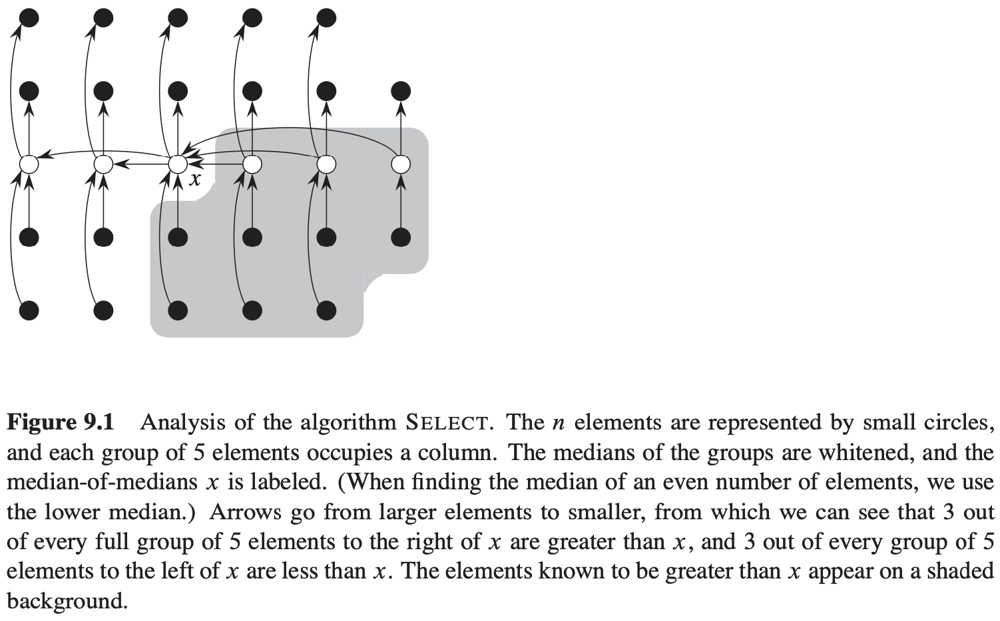

# 第9章 中位数和顺序统计量

选择问题：

- 输入：一个包含$n$个（互异的）数的集合$A$和一个整数$i, 1 \leqslant i \leqslant n$。
- 输出：元素$x \in A$，且$A$中恰好有$i - 1$个其它元素小于它。

## 9.1 最小值和最大值

$$
\begin{align}
& MINIMUM(A) \\
& for\ i\ =\ 2\ to\ A.length \\
& \qquad if\ min > A[i] \\
& \qquad \qquad min = A[i] \\
& return\ min
\end{align}
$$

## 9.2 期望为线性时间的选择算法

$$
\begin{align}
& RANDOMIZED-SELECT(A, p, r, i) \\
& if\ p == r \\
& \qquad return\ A[p] \\
& q = RANDOMIZED-PARTITION(A, p, r) \\
& k = q - p + 1 \\
& if\ i == k \\
& \qquad return\ A[q] \\
& else\ if\ i < k \\
& \qquad return\ RANDOMIZED-SELECT(A, p, q - 1, i) \\
& else\ return\ RANDOMIZED-SELECT(A, q + 1, r, i - k)
\end{align}
$$

## 9.3 最坏情况为线性时间的选择算法

与比较排序一样，SELECT和RANDOMIZED-SELECT也是通过元素间的比较来确定他们之间的相对次序的。但是它们不需要任何关于输入的假设，它们不受限于$\Omega(n ln\ n)$的下界约束，因为他们没有使用排序就解决了选择问题。

