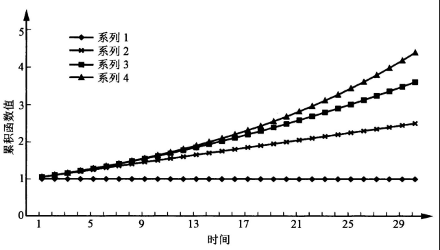

# 第一章 利息基本计算

## 1.1 利息基本函数

**定义 1.1** 设用$A(t)$表示原始投资$A(0)$经过时间$t(t > 0)$后的价值，则当$t$变动时称$A(t)$为总量函数。

**定义 1.2** 总量函数$A(t)$在时间$[t_1, t_2]$内的变化量（增量）称为期初货币量$A(t_1)$在时间$[t_1, t_2]$内的利息，记为$I_{t_1, t2}$，即
$$
T_{t_1, t_2} = A(t_2) - A(t_1) \qquad (1.1.1)
$$
特别地，当$t_1 = n - 1, t_2 = n (n \in N)$时，记
$$
I_n = A(n) - A(n - 1) (n \in N) \qquad (1.1.2)
$$
并称$I_n$为第$n$个时间段内的利息。

### 1.1.1 累积函数

**定义1.3** 设1个货币单位的本金在$t(t > 0)$时刻的价值为$a(t)$，则当$t$变动时，称$a(t)$为累积函数。

常见的累积函数$a(t)$有如下几类：

1. 常数函数（系列1）。
2. 一般线性函数（系列2）。
3. 二次函数（系列3）。
4. 指数函数（系列4）。

**定义1.4** 给定时间区间$[t_1, t_2]$内总量函数$A(t)$的变化量（增量）与期初货币量的比值称为时间区间$[t_1, t_2]$内的利率，记为$i_{t_1, t_2}$，即
$$
i_{t_1, t_2} = \frac{A(t_2) - A(t_1)}{A(t_1)} = \frac{I_{t_1, t_2}}{A(t_1)} \qquad (1.1.3)
$$
特别地，当$t_1 = n - 1, t_2 = n (n \in N)$时，记
$$
i_n = \frac{A(n) - A(n - 1)}{A(n - 1)} = \frac{I_n}{A(n - 1)}\qquad (n \in N) \qquad (1.1.4)
$$
且此时有
$$
A(n) = A(n - 1)(1 + i_n)
$$
通常称$i_n$为第$n$个时段的利率。

**注意**

1. 利率表示在一定的时间内的实际利息收入的相对量。
2. 利率通常用百分数表示。
3. 利率的定义要求在计息期内没有其它资本的投入也没有原始本金的撤出，即计息期内本金保持不变。
4. 利息是在计息期期满时支付的。

**结论 1.1** 某个计息期$[t_1, t_2]$内的利率为单位本金在该计息期内产生的利息与期初资本量的比值，即
$$
i_{t_1, t_2} = \frac{a(t_2) - a(t_1)}{a(t_1)} \qquad (1.1.5)
$$

### 1.1.2 单利和复利

**定义 1.5** 一个货币单位的投资经过任何一个单位的计息期产生的**利息**为常数，则称对应的利息计算方式为简单利息计算方式，简称为**单利方式**；对应的利息称为**单利**。

**定义 1.6** 一个货币单位的投资经过任何一个单位的计息期产生的**利率**为常数，则称对应的利息计算方式为复合利息计算方式，简称**复利方式**；对应的利息称为**复利**。

**结论 1.2** 在单利方式下有
$$
a(t) = 1 + it, \ t \in Z \qquad (1.1.6)
$$
其中$i$为1个货币单位本金经过一个单位计息期产生的利息，一般称之为**单利率**。

**结论 1.3** 在复利方式下有
$$
a(t) = (1 + i)^t, \ t \in Z \qquad (1.1.9)
$$
其中$i$为一个单位计息期内的利率，一般称之为复利率。

**注意**

1. 短期内单利和复利两种方式计算的利息差异不大。
2. 因单利方式考虑绝对增量的变化，而复利方式考虑相对增量的变化，当货币量的数额增大时，两种方式计算的利息差异也会增大。
3. 复利方式几乎用于所有的金融业务，单利方式只是用于短期计算或不足期近似计算。

### 1.1.3 贴现函数

**定义 1.7** 若$t(t \geqslant 0)$时刻的1个货币单位在0时刻的价值记为$a^{-1}(t)$，则当$t$变动时，称$a^{-1}(t)$为贴现函数（贴现函数即累计函数的倒数函数）。

单利的贴现函数：
$$
a^{-1}(t) = (1 + it)^{-1} \qquad (t \geqslant 0,\ i为单利率)
$$
复利的贴现函数：
$$
a^{-1}(t) = (1 + i)^{-t} \qquad (t \geqslant 0,\ i为复利率)
$$
**定义 1.8** 计息期$[t_1, t_2]$内的利息收入与期末货币量的比值称为在时间区间$[t_1, t_2]$内的贴现率，记为$d_{t_1, t_2}$，即
$$
d_{t_1, t_2} = \frac{A(t_2) - A(t_1)}{A(t_2)} = \frac{I_{t_1, t_2}}{A(t_2)}
$$
若每个计息周期内的贴现率相同，则称该相同的贴现率为**复贴现率**，对应的贴现模式为**复贴现模式**，一般用$d$表示复贴现率。

**定义 1.9** 定义贴现因子为
$$
v = (1 + i)^{-1}
$$
其中$i$为实利率。

**定义 1.10** 称$(1 + i)^t$为1个货币单位的本金在第$t$个计息期末的终值（简称AV）；称$v^t$为第$t$个计息期末1个货币单位在0时刻的现值（简称PV）。

**定义 1.11** 利率和贴现率被称为等价的，若它们满足：相同的原始本金经过相同的计息期，将产生相同的终值。

**结论 1.4** 在任一个计息期内，利率$i$和贴现率$d$有如下关系：
$$
\begin{align}
i &= \frac{d}{1 - d} \\
d &= \frac{i}{1 + i} < i
\end{align}
$$
**结论 1.5** 在任一个计息期内，利率$i$，贴现率$d$与贴现因子$v$有如下关系：

- 贴现率是同期期末的利率用贴现因子贴现到期初的值，即
  $$
  d = iv
  $$

- 贴现率与贴现因子互补，即
  $$
  d = 1 - v
  $$

- 利率与贴现率的差等于利率与贴现率的积，即
  $$
  i - d = id
  $$

### 1.1.4 名利率和名贴现率

**定义 1.12** 若在单位计息期内利息依利率$\frac{i^{(m)}}{m} (m \in N)$换算$m$次，则称$i^{(m)}$为$m$换算名利率或挂牌利率。

**结论 1.6** 相同单位计息期内的利率$i$与$m$换算名利率$i^{(m)}$有如下关系：
$$
1 + i = \left(1 + \frac{i^{(m)}}{m} \right)^m
$$
即
$$
i = \left(1 + \frac{i^{(m)}}{m} \right) ^ m - 1 \\
或 \\
i^{(m)} = m \left[(1 + i)^{\frac{1}{m}} - 1 \right]
$$
**结论 1.7** 相同单位计息期内的贴现率$d$与$p$换算名贴现率$d^{(p)}$有如下关系
$$
1 - d = \left(1 - \frac{d^{(p)}}{p}\right)^p
$$
即
$$
d = 1 - \left(1 - \frac{d^{(p)}}{p}\right)^p \\
或 \\ 
d^{(p)} = p\left[1 - (1 - d)^{\frac{1}{p}}\right]
$$
**结论 1.8** 相同单位计息期内的$m$换算利率$i^{(m)}$与$p$换算名贴现率$d^{(p)}$有如下关系：
$$
\left(1 + \frac{i^{(m)}}{m}\right)^m = \left(1 - \frac{d^{(p)}}{p}\right)^{-p}
$$

### 1.1.5 连续利息计算

**定义 1.13** 设累积函数$a(t)$为$t(t \geqslant 0)$的连续可微函数，则称函数
$$
\delta_t = \frac{a'(t)}{a(t)} \qquad (t \geqslant 0) \qquad (1.1.18)
$$
为累积函数$a(t)$对应的**利息力函数**，并称利息力函数在各个时刻的值为**利息力**。

**结论 1.9** 如果利息力函数为常数，即$\delta_t \equiv \delta$（$\delta$与$t$无关），则：

1. $a(t) = e^{\delta t}, a^{-1}(t) = e^{- \delta t}$；

2. 常数利息力$\delta$与利率$i$的关系式为
   $$
   e^{\delta} = 1 + i \\
   或 \\
   \delta = ln(1 + i) = -lnv = -ln(1 - d)
   $$

3. 在相同单位计息期内，常数利息力$\delta$，利率$i$及贴现率$d$三者的大小关系为：
   $$
   d < \delta < i
   $$

**结论 1.10** 在相同单位计息期内，名利率$i^{(m)}$，名贴现率$d^{(p)}$与常数利息力$\delta$有如下关系：
$$
i^{(m)} = m(e^{\delta/m} - ) \\
d^{(p)} = p(1 - e^{- \delta / p}) \\
lim_{m \rightarrow \infty} i^{(m)} = lim_{p \rightarrow \infty} d^{(p)} = \delta \\
d \leqslant d^{(p)} < \delta < i^{(m)} \leqslant i
$$
**结论 1.11** 各种利率函数的导数有如下结论：
$$
\frac{dd}{di} = \left(\frac{1}{1 + i}\right)^2 > 0, \frac{dd}{d\delta} = e^{-\delta} > 0 \\
\frac{d \delta}{di} = \frac{1}{1 + i} > 0, \frac{d\delta}{dv} = -\frac{1}{v} < 0 \\
\frac{di^{(m)}}{di} = (1 + i)^{\frac{1}{m} - 1} > 0
$$

## 1.2 利息基本计算

与利息计算有关的量主要有以下四个：

- 原始投入的资本（即本金）。
- 投资经过的时间。
- 利率。
- 投资结束时的终值。

其中的任何三个量的值都可以唯一地决定第四个量的值。

### 1.2.1 时间单位的确定

度量投资时间的计算方法：

- 按实际的投资天数计算，1年为365天。若依此方法度量投资时间，则称对应的计算方法为精确利息算法，一般用“实际投资天数/年实际天数”表示。

- 假设每月有30天，1年为360天。若依此方法度量投资时间，则称对应的利息计算方法为普通利息算法，一般用"30/360"表示。这时，计算两个给定日期之间的天数的公式为：
  $$
  360(Y_2 - Y_1) + 30(M_2 - M_1) + (D_2 - D_1), \qquad (1.2.1)
  $$
  其中$Y_i(i = 1, 2)$表示第$i$个日期所在的年，$M_i (i = 1, 2)$表示第$i$个日期所在的月，$D_i(i = 1, 2)$表示第$i$个日期所在的日。

- 按实际的投资天数计算，但1年设为360天，若依此方法度量投资时间，则称对应的利息计算方法为银行家利息法则算法，一般用“实际投资天数/360”表示。

### 1.2.2 价值方程

不同时刻的货币量是无法直接比较大小的，必须将这些量调整（累积计算或贴现计算）到某一共同日期，这个共同日期被称为**比较日**。

将调整到比较日的计算结果按照收入支出相等的原则列出的等式称为**价值方程**。

### 1.2.3 等时间法

### 1.2.4 利率的计算

求解未知利率的方法：

1. 直接对价值方程进行指数或对数计算法。
2. 代数方法。
3. 线性插值的递推或迭代法。

## 1.3 实例分析

### 1.3.1 现实生活中与利率有关的金融现象

例1.9，2004年10月29日中国人民银行公布的金融机构人民币存款利率如下表所示，计算除活期外各种期限的年实利率。

| 期限      | 活期 | 3个月 | 6个月 | 1年  | 2年  | 3年  | 5年  |
| --------- | ---- | ----- | ----- | ---- | ---- | ---- | ---- |
| 年利率i/% | 0.72 | 1.71  | 2.07  | 2.25 | 2.70 | 3.24 | 3.60 |

解

折合为年实利率，具体如下：

3个月：已知$i^{(4)} = 1.71\%$，导出$i = 1.721\%$；

6个月：已知$i^{(2)} = 2.07\%$，导出$i = 2.081\%$；

1年：$i = 2.25\%$；

2年：已知单利率为$2.70\%$，导出$(1 + i)^2 = 1 + 2 \times 2.70\% \Rightarrow i = 2.66\%$；

3年：已知单利率为$3.24\%$，导出$(1 + i)^3 = 1 + 3 \times 3.24\% \Rightarrow i = 3.14\%$；

5年：已知单利率为$3.60%$，导出$(1 + i)^5 = 1 + 5 \times 3.60\% \Rightarrow i = 3.37\%$。

---

例1.10，若面值为100元的债券在到期前3个月时的买价为96元，计算买方的季换算名贴现率$d^{(4)}$和年实利率$i$。

解

已知$\frac{d^{(4)}}{4} = \frac{100 - 96}{100} = 4\%$，所以$d^{(4)} = 16\%$。

已知$\frac{i^{(4)}}{4} = \frac{100 - 96}{96} = \frac{1}{24}$，所以$i = \left(1 + \frac{i^{(4)}}{4}\right)^4 - 1 = \left(\frac{25}{24}\right)^4 - 1 = 17.74\%$。

---

### 1.3.2 提前支取的处罚

例1.11，2年定期存款10%，在提前支取时储户可以有以下两种选择：方式A，利率降为8%；方式B，原利率不变，扣除3个月的利息。对于下面两种情况，请给出对储户较为有利的选择：

1. 存入6个月时提前支取；
2. 存入一年半时提前支取。

解

设原始本金为1个货币单位，并分别用$I_A$和$I_B$表示两种选择的利息收入：

1. 若存入6个月时提前支取，则：
   $$
   I_A = (1 + 0.08)^{1/2} - 1 = 0.0392 \\
   I_B = (1 + 0.10)^{1/4} - 1 = 0.0241
   $$
   显然有$I_A > I_B$，所以此情况下选择方式$A$对储户较为有利。

2. 若存入一年半时提前支取，则：
   $$
   I_A = (1 + 0.08)^{1.5} - 1 = 0.1224 \\
   I_B = (1 + 0.10)^{1.25} - 1 = 0.1265
   $$
   显然有$I_A < I_B$，所以此情况下选择方式B对储户较为有利。

---

例1.12，已知储蓄方式：年利率7%，在每3年底（如果存款未提前支取）将奖励余额的2%，试对以下三个取款时刻计算实际的年利率：第2，3，4年底。

解

若第2年底取款，年实利率仍然为7%。

若第3年底取款，则单位存款的余额及奖励为$(1 + i)^3 = (1 + 7\%)^3(1 + 2\%)$，反解得3年得年实利率为$i = 7.71\%$。

若第4年底取款，则单位存款得余额及奖励为$(1 + i)^4 = (1 + 7\%)^4(1 + 2\%)$，反解得4年得年实利率为$i = 7.53\%$。

---

例1.13，现有不允许提前支取得银行定期存款，其利率（保持6年不变）如下表所示。某投资者准备存入1000元，存期为6年。计算最大收益得定期储蓄组合的平均年利率。

| 存期/年        | 1    | 2    | 3    | 4    |
| -------------- | ---- | ---- | ---- | ---- |
| 季结算名利率/% | 5    | 6    | 7    | 8    |

解

若选择一个4年期存款和一个2年期存款，则1个货币单位的存款在第6年底得总额为：
$$
\left(1 + \frac{0.08}{4}\right)^{16} \cdot \left(1 + \frac{0.06}{4}\right)^8 = 1.5464
$$
于是平均年利率为：
$$
\left(1 + 0.5464\right)^{\frac{1}{6}} - 1 = 7.54\%
$$
因为这个结果大于两个3年期得平均年利率7%，所以，这种组合是最大收益组合。

---

### 1.3.3 其它实例

例1.14 某人需要50000元的1年期贷款，市场中现有两种可能的融资机会：方式A：1年期贷款年利率为5%；方式B：1年期贷款利率小于5%，但是最低贷款额度为100000元。如果现有1年期可能的投资利率为3%，问：要使两种方式等价，方式B的最大可接受年利率是多少？

解

设$i$为方式B的最大可接受年利率，则价值方程：
$$
50000(1 + 5\%) = 100000(1 + i) - 50000(1 + 3\%)
$$
解之得$i = 4\%$。

---

例1.15 现有如下的投资经历：原始投资100000元，资金在前两年全部投资于13周得短期国债（T-bill），假定均以贴现方式报价：从第3年开始进行组合投资，该投资得利息力函数为$\delta_{t} = \frac{1}{1 + t}$。如果希望5年后新增加得金额为原投资得1.6倍，试分析13周短期国债得可接受折价价格。

解

设国债以名贴现率$d^{(4)}$折价出售，则该资金在第2年底得累积价值为：
$$
100000a(2)元 = 100000 \left(1 - \frac{d^{(4)}}{4}\right)^{-8} 元
$$
利用后3年得投资收益已知条件，得第5年底得累计价值为：
$$
\begin{align}
100000a(5)元 &= 100000a(2)exp \left(\int_2^5 \delta_{s}ds\right)元 \\
&= 100000a(2) \left(\frac{1 + 5}{1 + 2}\right)元 = 200000a(2)元 \\
&= 200000 \left(1 - \frac{d^{(4)}}{4}\right)^{-8} 元
\end{align}
$$
又由题设知：
$$
100000a(5) = 100000a(0)(1 + 1.6) = 260000
$$
即：
$$
2.6 = 2 \left(1 - \frac{d^{(4)}}{4}\right)^{-8}
$$
求解得：
$$
d^{(4)} = 12.90\% \\
\frac{d^{(4)}}{4} = 3.23\%
$$
即面额为100元得债券得可接受折价价格为96.77元。
