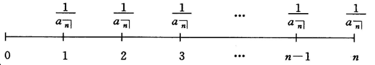
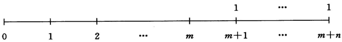

# 第二章 年金

## 2.1 基本年金

### 2.1.1 期末年金

**定义2.1** 若年金的现金流在第一个付款期末首次发生，随后一次分期进行，则称这种年金为期末年金。

**定义2.2** 若每次的年金金额为1个货币单位，现金流在第一个付款期末首次发生，共计$n$次，则称这种年金为$n$期标准期末年金。

用记号 $a_{\left.{\overline{\,n\,}}\!\right|i}$表示利率为$i$比较日选为$0$时刻的$n$期标准期末年金的所有年金金额的现值之和（简称$n$期标准期末年金的现值，在不至于产生歧义的情况下，可以将$a_{\left.{\overline{\,n\,}}\!\right|i}$简写为$a_{\left.{\overline{\,n\,}}\!\right|}$），其计算公式为：
$$
a_{\left.{\overline{\,n\,}}\!\right|i} = v + v^2 + \cdots + v^n = \frac{1 - v^n}{i} \qquad (2.1.1)
$$
其中$a$是年金的英文单词的第一个字母，$n$表示年金现金流的次数，$i$表示年金的利率，$v$为$i$对应的贴现因子。

例，用$\frac{1}{a_{\left.{\overline{\,n\,}}\!\right|}}$代表0时刻1个货币单位对应的$n$期期末年金的现金流，如图所示：

用记号$s_{\left.{\overline{\,n\,}}\!\right|i}$表示利率为$i$的$n$期标准期末年金的所有年金金额在年金结束时刻的终值之和（简称$n$期标准期末年金的终值，简写为$s_{\left.{\overline{\,n\,}}\!\right|}$），其计算公式为：
$$
\begin{align}
s_{\left.{\overline{\,n\,}}\!\right|i} &= (1 + i)^{n - 1} + (1 + i)^{n - 2} + \cdots + (1 + i) + 1 \\
&= \frac{(1 + i)^n - 1}{i} \qquad (2.1.3)\\
\end{align}
$$
经过简单的数学推导，得出：
$$
s_{\left.{\overline{\,n\,}}\!\right|i} = \sum_{k = 1}^{n} {n \choose k} i^{k - 1}
$$
**结论2.1** $s_{\left.{\overline{\,n\,}}\!\right|i}$与$a_{\left.{\overline{\,n\,}}\!\right|i}$有如下关系：
$$
s_{\left.{\overline{\,n\,}}\!\right|i} = a_{\left.{\overline{\,n\,}}\!\right|i} (1 + i)^n \\
\frac{1}{a_{\left.{\overline{\,n\,}}\!\right|i}} = \frac{1}{s_{\left.{\overline{\,n\,}}\!\right|i}} + i
$$

### 2.1.2 期初年金

**定义2.3** 若年金的首次现金流在合同生效时立即发生，随后一次分期进行，则称这种年金为期年金。

**定义2.4** 若每次的年金金额为1个货币单位，在合同生效时立即发生首次的现金流，共计$n$次，则称这种年金为$n$期标准期初年金。

用记号$\ddot a_{\left.{\overline{\,n\,}}\!\right|i}$表示利率为$i$的$n$期标准期初年金的现值（简写为$\ddot a_{\left.{\overline{\,n\,}}\!\right|}$），得到计算公式：
$$
\ddot a_{\left.{\overline{\,n\,}}\!\right|i} = 1 + v + v^2 + \cdots + v^{n - 1} = \frac{1 - v^n}{d} \qquad (2.1.4)
$$
用记号$\ddot s_{\left.{\overline{\,n\,}}\!\right|i}$表示$n$期标准期初年金的终值（简写为$\ddot s_{\left.{\overline{\,n\,}}\!\right|}$），得到计算公式：
$$
\begin{align}
\ddot s_{\left.{\overline{\,n\,}}\!\right|i} &= (1 + i) + (1 + i)^2 + \cdots + (1 + i)^n \\
&= \frac{(1 + i)^n - 1}{d}
\end{align}
$$
**结论2.2** $\ddot a_{\left.{\overline{\,n\,}}\!\right|i}$与$\ddot s_{\left.{\overline{\,n\,}}\!\right|i}$之间有如下关系：
$$
\ddot s_{\left.{\overline{\,n\,}}\!\right|i} = \ddot a_{\left.{\overline{\,n\,}}\!\right|i} (1 + i)^n \\
\frac{1}{\ddot a_{\left.{\overline{\,n\,}}\!\right|i}} = \frac{1}{\ddot s_{\left.{\overline{\,n\,}}\!\right|i}} + d
$$
**结论2.3** 下面关系式成立：
$$
\ddot a_{\left.{\overline{\,n\,}}\!\right|i} = (1 + i) a_{\left.{\overline{\,n\,}}\!\right|i} \\

\ddot a_{\left.{\overline{\,n\,}}\!\right|i} = 1 + a_{\left.{\overline{\,n - 1\,}}\!\right|i} \\

\ddot s_{\left.{\overline{\,n\,}}\!\right|} = (1 + i) s_{\left.{\overline{\,n\,}}\!\right|i} \\

\ddot s_{\left.{\overline{\,n\,}}\!\right|} = s_{\left.{\overline{\,n + 1\,}}\!\right|i} - 1
$$

### 2.1.3 递延年金

**定义2.5** 若年金现金流的首次发生是递延了一段时间后进行的，则称这种年金为递延年金。

递延$m$期的$n$期标准期末年金的时间流程如图：

递延$m$期的$n$期标准期末年金相当于一个$m + n$期标准期末年金扣除一个$m$期标准期末年金，所以，该递延年金的现值可以表示为：
$$
a_{\left.{\overline{\,m + n\,}}\!\right|i} - a_{\left.{\overline{\,m\,}}\!\right|i}
$$
即递延年金的现值为两个定期年金的现值之差，可以表示为：
$$
v^m a_{\left.{\overline{\,n\,}}\!\right|i}
$$

### 2.1.4 永久年金

**定义2.6** 若年金的支付（现金流）永远进行下去，没有结束日期，则称这种年金为永久年金。

一般用$a_{\left.{\overline{\,\infty\,}}\!\right|i}$（或$\ddot a_{\left.{\overline{\,\infty\,}}\!\right|i}$）表示标准永久期末（或初）年金的现值，计算公式如下：
$$
a_{\left.{\overline{\,\infty\,}}\!\right|i} = v + v^2 + \cdots = lim_{n \rightarrow \infty} a_{\left.{\overline{\,n\,}}\!\right|i} = \frac{1}{i} \qquad &(2.1.7) \\

\ddot a_{\left.{\overline{\,\infty\,}}\!\right|i} = 1 + v + v^2 + \cdots = lim_{n \rightarrow \infty} \ddot a_{\left.{\overline{\,n\,}}\!\right|i} = \frac{1}{d} \qquad &(2.1.8)
$$
所以，$n$期标准期末年金可用一个标准永久期末年金扣除一个递延$n$期的标准永久期末年金表示，于是有现值公式：
$$
a_{\left.{\overline{\,n\,}}\!\right|i} = a_{\left.{\overline{\,\infty\,}}\!\right|i} - v^n a_{\left.{\overline{\,\infty\,}}\!\right|i}
$$

### 2.1.5 剩余付款期不是标准时间单位的计算

对于任意的$t(0 \leqslant t \leqslant 1)$，形式上可以定义下面的计算公式：
$$
a_{\left.{\overline{\,n+t\,}}\!\right|i} = a_{\left.{\overline{\,n\,}}\!\right|i} + v^{n + t} \left[\frac{(1 + i)^t - 1}{i}\right] \qquad (2.1.10)
$$
公式$(2.1.10)$右边的第二项表示时刻$n + t$的不足1个货币单位的年金金额$\left(\frac{(1 + i)^t - 1}{i} \right)$在0时刻的现值。

## 2.2 广义年金

付款周期与利息换算周期不同的年金，我们称之为广义年金。一般使用如下步骤来计算广义年金的现值和终值：

1. 将最初的名利率调整到付款周期内的实际利率。

   设名利率为$i^{(m)}$（每个计息期内换算$m$次），且每个计息期内付款$p$次，则每个付款周期内与$i^{(m)}$等价的实际利率为$\frac{i^{(p)}}{p}$。由于在每个计息期内有：
   $$
   \left(1 + \frac{i^{(m)}}{m} \right)^m = \left(1 + \frac{i^{(p)}}{p} \right)^p
   $$
   所以：
   $$
   \frac{i^{(p)}}{p} = \left(1 + \frac{i^{(m)}}{m}\right)^{m/p} - 1 \qquad (2.2.1)
   $$

2. 用公式$(2.2.1)$表示的利率按照年金的现金流计算现值。

### 2.2.1 付款周期为利息换算周期整数倍的年金

假定付款周期是利息换算周期的整数倍，并定义记号：

- $k$ 每个付款周期内的利息换算次数；
- $n$ $年金的付款总次数 \times k$；
- $i$ 每个利息换算期内的实利率（名利率除以换算次数）。

下面根据付款总次数分两种情况讨论这类广义年金的现值和终值得计算：

1. 付款总次数为有限的情形

   - 期末年金

     每个付款期末付款1个货币单位，共付款$\frac{n}{k}$次。根据前面的假设，易知上述年金的现值和终值为：
     $$
     v^k + v^{2k} + \cdots + v^n = \frac{1}{s_{\left.{\overline{\,k\,}}\!\right|i}} a_{\left.{\overline{\,n\,}}\!\right|i} \qquad &(2.2.2) \\
     
     (1 + i)^n \frac{a_{\left.{\overline{\,n\,}}\!\right|}}{s_{\left.{\overline{\,k\,}}\!\right|}} = \frac{s_{\left.{\overline{\,n\,}}\!\right|}}{s_{\left.{\overline{\,k\,}}\!\right|}} \qquad &(2.2.3)
     $$

   - 期初年金

     每个付款期初付款1个货币单位，共付款$\frac{n}{k}$次。易求得上述年金的现值和终值为：
     $$
     \frac{a_{\left.{\overline{\,n\,}}\!\right|i}}{s_{\left.{\overline{\,k\,}}\!\right|i}} \qquad (2.2.4) \\
     
     \frac{s_{\left.{\overline{\,n\,}}\!\right|i}}{a_{\left.{\overline{\,k\,}}\!\right|i}} \qquad (2.2.5)
     $$

2. 付款总次数为无限的情形

   - 永久期末年金

     每个付款期末付款1个货币单位，直至永远。易求得上述年金的现值为：
     $$
     v^k + v^{2k} + \cdots = \frac{1}{is_{\left.{\overline{\,k\,}}\!\right|i}} \qquad (2.2.6)
     $$

   - 永久期初年金

     每个付款期初付款1个货币单位，直至永远。易求得上述年金的现值为：
     $$
     1 + v^k + v^{2k} + \cdots = \frac{1}{ia_{\left.{\overline{\,k\,}}\!\right|i}} \qquad (2.2.7)
     $$

### 2.2.2 利息换算周期为付款周期整数倍的年金

假定利息换算周期是付款周期的整数倍，并定义记号：

- $m$ 每个利息换算期内的付款次数；
- $n$ 年金的付款总次数/m（即付款总次数为$mn$）；
- $i$ 每个利息换算期内的实利率。

按付款总次数分为两种情况进行讨论：

1. 付款总次数为有限的情形。

   - 期末年金

     在每个付款期末付款$\frac{1}{m}$个货币单位，共付款$mn$次。若将该年金的现值和终值分别记为$a^{(m)}_{\left.{\overline{\,n\,}}\!\right|i}$和$s^{(m)}_{\left.{\overline{\,n\,}}\!\right|i}$，则有计算公式：
     $$
     \begin{align}
     a^{(m)}_{\left.{\overline{\,n\,}}\!\right|i} &= \frac{1}{m}[v^{\frac{1}{m}} + v^{\frac{2}{m}} + \cdots + v^{n - \frac{1}{m}} + v^{n}] \\
     &= \frac{1 - v^n}{i^{(m)}} \qquad(2.2.8)
     \end{align}
     $$

     $$
     s^{(m)}_{\left.{\overline{\,n\,}}\!\right|i} = a^{(m)}_{\left.{\overline{\,n\,}}\!\right|i} (1 + i)^n = \frac{(1 + i)^n - 1}{i^{(m)}} \qquad (2.2.9)
     $$

   - 期初年金

     在每个付款期初付款期的期初付款$\frac{1}{m}$个货币单位，共付款$mn$次。若将该年金的现值和终值分别记为$\ddot a^{(m)}_{\left.{\overline{\,n\,}}\!\right|i}$和$\ddot s^{(m)}_{\left.{\overline{\,n\,}}\!\right|i}$，则有计算公式：
     $$
     \begin{align}
     \ddot a^{(m)}_{\left.{\overline{\,n\,}}\!\right|i} &= \frac{1}{m}(1 + v^{\frac{1}{m}} + v^{\frac{2}{m}} + \cdots + v^{n - \frac{1}{m}}) \\
     &= \frac{1 - v^n}{d^{(m)}} \qquad (2.2.10)
     \end{align}
     $$

     $$
     \ddot s^{(m)}_{\left.{\overline{\,n\,}}\!\right|i} = \ddot a^{(m)}_{\left.{\overline{\,n\,}}\!\right|i} (1 + i)^n = \frac{(1 + i)^n - 1}{d^{(m)}} \qquad (2.2.11)
     $$

2. 付款总次数为无限的情形

   - 永久期末年金

     在每个付款期的期末付款$\frac{1}{m}$个货币单位，直至永远。若将该年金的现值记为$a^{(m)}_{\left.{\overline{\,\infty\,}}\!\right|}$，则有计算公式：
     $$
     a^{(m)}_{\left.{\overline{\,\infty\,}}\!\right|} = \frac{1}{m}(v^{\frac{1}{m}} + v^{\frac{2}{m}} + \cdots) = \frac{1}{i^{(m)}} \qquad (2.2.12)
     $$
     
   - 永久期初年金
   
     在每个付款期初付款$\frac{1}{m}$个货币单位，直至永远。若该年金的现值记为$\ddot a^{(m)}_{\left.{\overline{\,\infty\,}}\!\right|}$，则有计算公式：
     $$
     \ddot a^{(m)}_{\left.{\overline{\,\infty\,}}\!\right|} = \frac{1}{m}(v^{\frac{1}{m}} + v^{\frac{2}{m}} + \cdots) = \frac{1}{d^{(m)}} \qquad (2.2.13)
     $$
   

**结论2.4** 如下关系式成立：
$$
a^{(m)}_{\left.{\overline{\,n\,}}\!\right|i} = \frac{i}{i^{(m)}} a_{\left.{\overline{\,n\,}}\!\right|i} \\

s^{(m)}_{\left.{\overline{\,n\,}}\!\right|i} = \frac{i}{i^{(m)}} s_{\left.{\overline{\,n\,}}\!\right|i} \\

s^{(m)}_{\left.{\overline{\,1\,}}\!\right|i} = \frac{i}{i^{(m)}}
$$
**结论2.5** 如下关系式成立：
$$
\ddot a^{(m)}_{\left.{\overline{\,n\,}}\!\right|i} = \frac{d}{d^{(m)}} \ddot a_{\left.{\overline{\,n\,}}\!\right|i} \\

\ddot s^{(m)}_{\left.{\overline{\,n\,}}\!\right|i} = \frac{d}{d^{(m)}} \ddot s_{\left.{\overline{\,n\,}}\!\right|i} \\

\ddot s^{(m)}_{\left.{\overline{\,1\,}}\!\right|i} = \frac{i}{d^{(m)}}
$$
**结论2.6** 如下关系成立：
$$
\ddot a^{(m)}_{\left.{\overline{\,n\,}}\!\right|i} = \left(\frac{i}{i^{(m)}} + \frac{i}{m} \right) a_{\left.{\overline{\,n\,}}\!\right|i} \\

\ddot s^{(m)}_{\left.{\overline{\,n\,}}\!\right|i} = \left(\frac{i}{i^{(m)}} + \frac{i}{m} \right) s_{\left.{\overline{\,n\,}}\!\right|i}
$$

### 2.2.3 连续年金

每个瞬间的年金现金流为1个货币单位，期限为$n$。如果用$\overline a_{\left.{\overline{\,n\,}}\!\right|}$和$\overline s_{\left.{\overline{\,n\,}}\!\right|}$分别表示该年金的现值和终值，则有计算公式：
$$
\begin{align}
\overline a_{\left.{\overline{\,n\,}}\!\right|} &= \int^{n}_{0}{v^tdt} = \frac{1 - v^n}{\delta} \\
&= \frac{1 - e^{\delta n}}{\delta} \qquad &(2.2.14) \\
&= \frac{i}{\delta} a_{\left.{\overline{\,n\,}}\!\right|i} \qquad &(2.2.15) 
\end{align}
$$

$$
\begin{align}
\overline s_{\left.{\overline{\,n\,}}\!\right|} &= \int^{n}_{0}{(1 + i)^t dt} = \frac{(1 + i)^n - 1}{\delta} \\
&= \frac{e^{\delta n} - 1}{\delta} \qquad &(2.2.16) \\
&= \frac{i}{\delta} s_{\left.{\overline{\,n\,}}\!\right|i} \qquad &(2.2.17) 
\end{align}
$$

其中$\delta = ln(1 + i)$为常数利息力。

另一方面，有下面的极限关系：
$$
\overline a_{\left.{\overline{\,n\,}}\!\right|} = lim_{m \to \infty} a^{(m)}_{\left.{\overline{\,n\,}}\!\right|} = lim_{m \to \infty} \ddot a^{(m)}_{\left.{\overline{\,n\,}}\!\right|} \qquad (2.2.18)
$$

## 2.3 变化年金

### 2.3.1 一般变化年金

一般变化年金：

1. 等量变化年金

   首次付款金额为$P(P > 0)$，然后每次变化$Q$，总计$n$次，期末方式。如果用$A$表示这种期末年金的现值，则有：
   $$
   \begin{align}
   A &= Pv + (P + Q)v^2 + (P + 2Q)v^3 + \cdots + [P + (n - 1)Q]v^n \\
   &= P(v + v^2 + \cdots + v^n) + Q[v^2 + 2v^3 + \cdots + (n - 1)v^n] \\
   &= P a_{\left.{\overline{\,n\,}}\!\right|} + Q\{[v + 2v^2 + 3v^3 + \cdots + nv^n] - [v + v^2 + v^3 + \cdots + v^n]\} \\
   &= (P - Q) a_{\left.{\overline{\,n\,}}\!\right|} + Qv\frac{da_{\left.{\overline{\,n\,}}\!\right|i}}{dv} \\
   &= (P - Q) a_{\left.{\overline{\,n\,}}\!\right|} + Q\frac{\ddot a_{\left.{\overline{\,n\,}}\!\right|} - nv^n}{i} \qquad (2.3.1)
   \end{align}
   $$

2. 比例变化年金

   比例变化年金的金额是按比例变化的。一般的比例变化期末年金为首次付款1个货币单位，随后每次增加$k$倍，总共$n$次，其现值为：
   $$
   v + (1 + k)v^2 + \cdots + (1 + k)^{n - 1}v^n = \frac{1 - \left(\frac{1 + k}{1 + i}\right)^n}{i - k}
   $$
   这个公式要求$i \neq k$。

3. 付款金额任意变化的年金

   时刻$t$的付款金额为$r_t (t = 1, 2, ..., n)$。若记这种年金的现值为$a$，则：
   $$
   a = \sum_{t = 1}^{n} r_t v^t
   $$

**结论2.7** 公式（2.3.1）所代表的一般等量变化年金可以表示为一组固定年金的和，即
$$
A = P a_{\left.{\overline{\,n\,}}\!\right|} + Q \sum_{t = 1}^{n - 1} v^t a_{\left.{\overline{\,n - t\,}}\!\right|}
$$
**定义2.7** 若在上述一般等量变换年金中$P = Q = 1$，则称这样的等量变化年金为$n$期标准递增期末年金。

通常分别用符号$(Ia)_{\left.{\overline{\,n\,}}\!\right|}$和$(Is)_{\left.{\overline{\,n\,}}\!\right|}$表示$n$期标准递增期末年金的现值和终值，由公式$(2.3.1)$有如下计算公式：
$$
(Ia)_{\left.{\overline{\,n\,}}\!\right|} = \frac{\ddot a_{\left.{\overline{\,n\,}}\!\right|} - n v^n}{i} \qquad (2.3.2)
$$

$$
\begin{align}
(Is)_{\left.{\overline{\,n\,}}\!\right|} &= (Ia)_{\left.{\overline{\,n\,}}\!\right|} (1 + i)^n = \frac{\ddot s_{\left.{\overline{\,n\,}}\!\right|} - n}{i} \qquad &(2.3.3) \\
&= \frac{[s_{\left.{\overline{\,n+1\,}}\!\right|} - (n + 1)]}{i} \qquad &(2.3.4)\\
\end{align}
$$

**结论2.8** $n$期标准递增期末年金可分解为一组固定年金的组合：
$$
(Ia)_{\left.{\overline{\,n\,}}\!\right|} = \sum_{t = 0}^{n - 1}v^t a_{\left.{\overline{\,n - t\,}}\!\right|} \qquad (2.3.7)
$$
**定义2.8** 若在一般等量变化年金中$P = n, Q = -1$，则称次等量变化年金为$n$期标准递减期末年金。$n$期标准递减期末年金的现值和终值分别用符号$(Da)_{\left.{\overline{\,n\,}}\!\right|}$和$(Ds)_{\left.{\overline{\,n\,}}\!\right|}$表示且有如下计算公式：
$$
(Da)_{\left.{\overline{\,n\,}}\!\right|} = \frac{n - a_{\left.{\overline{\,n\,}}\!\right|}}{i} \qquad (2.3.8) \\

(Ds)_{\left.{\overline{\,n\,}}\!\right|} = \frac{n(1 + i)^n - s_{\left.{\overline{\,n\,}}\!\right|}}{i} \qquad (2.3.9)
$$
**结论2.9** $n$期标准递减期末年金可分解为一组固定年金的组合：
$$
(Da)_{\left.{\overline{\,n\,}}\!\right|} = \sum_{t = 1}^{n} a_{\left.{\overline{\,t\,}}\!\right|}
$$

### 2.3.2 广义变化年金

考虑年金金额付款周期与利率周期不同的情况：

1. 付款周期为利息周期整数倍的广义年金。

   首次付款1个货币单位，随后每次递增1个货币单位的$n$期期末年金方式。若纪该年金的现值为$A$，则有：
   $$
   A = v^k + 2v^{2k} + \cdots + \frac{n}{k}v^n
   $$
   进而有：
   $$
   (1 + i)^k A = 1 + 2v^k + \cdots + \frac{n}{k}v^{n - k}
   $$
   再将上述两式相减得：
   $$
   A[(1 + i)^k - 1] = 1 + v^k + v^{2k} + \cdots + v^{n - k} - \frac{n}{k}v^n
   $$
   最终由：
   $$
   A = \left( \frac{\frac{s_{\left.{\overline{\,n\,}}\!\right|}}{s_{\left.{\overline{\,k\,}}\!\right|}} - \frac{n}{k}v^n}{i s_{\left.{\overline{\,k\,}}\!\right|}}  \right)
   $$

2. 利息换算周期为付款周期整数倍的广义年金。

### 2.3.3 连续变化年金

考虑非一般化的$n$期年金方式：在时间$[0, n]$内的任何时刻$t$都有年金的支付发生。通常用函数$f(t)(0 \leqslant t \leqslant n)$表示这种连续发生的年金金额，有时称$f(t)$为年金函数。那么，可以用年实利率$i$和常数利息力$\delta$表示这种$n$年期连续年金的现值：
$$
\int_{0}^{n} f(t)v^t dt = \int_{0}^{n} f(t) e^{-\delta t} dt, \ v = (1 + i)^{-1} \qquad (2.3.16)
$$
若年金函数$f(t) = t$，其对应的年金现值用$(\overline I \overline a)_{\left.{\overline{\,n\,}}\!\right|}$表示，则有：
$$
(\overline I \overline a)_{\left.{\overline{\,n\,}}\!\right|} = \int_{0}^{n}tv^t dt = \frac{\overline a_{\left.{\overline{\,n\,}}\!\right|} - nv^n}{\delta} \qquad (2.3.17) \\

lim_{m \to \infty}(I^{(m)} a)^{(m)}_{\left.{\overline{\,n\,}}\!\right|} = (\overline I \overline a)_{\left.{\overline{\,n\,}}\!\right|}
$$
更一般地，可考虑用一般的利息力函数$\delta(s)$表示一般连续年金的现值：
$$
\int_{0}^{n} f(t)e^{-\int_{0}^{t} \delta(s)ds} dt \qquad (2.3.18)
$$

## 2.4 实例分析

### 2.4.1 固定养老金计划分析

### 2.4.2 购房分期付款分析

### 2.4.3 年金利率的近似计算

### 2.4.4 其他实例

