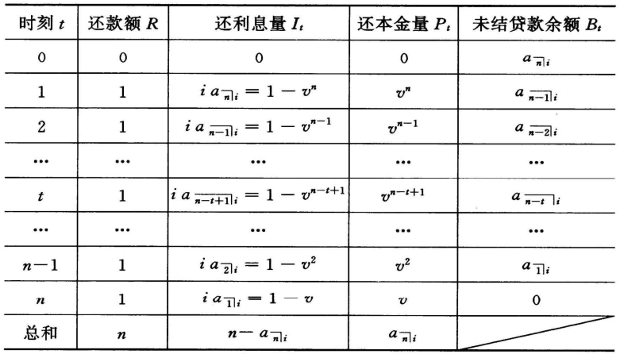
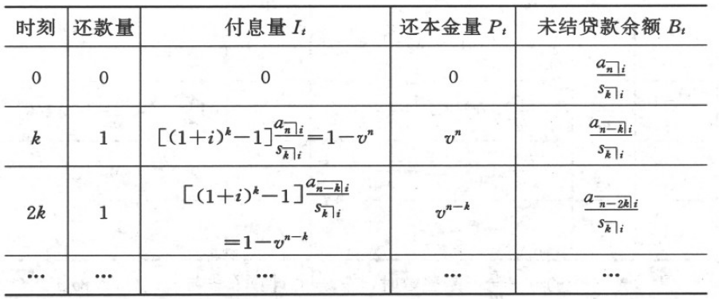
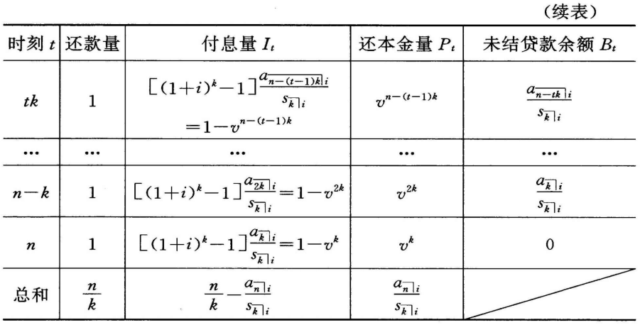
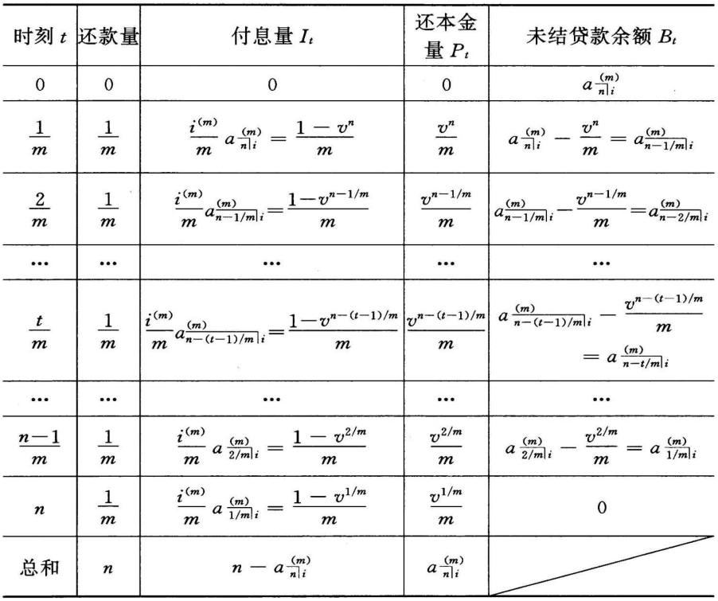

# 第四章 本金利息分离技术

## 4.1 摊还法

### 4.1.1 未结贷款余额的计算

未结贷款余额指在贷款业务中，每次分期还款后，借款人未偿还的债务在当时的价值。计算这个量的常用方法：

- 预期法：用所有未支付的分期付款现值之和表示每个时刻的贷款余额；
- 追溯法：用原始贷款额的累积值扣除所有已付款项的累积值表示每个时刻的贷款余额。

考虑一些特殊还款情况下的未结贷款余额的计算：

1. 每次还贷金额已知的情形

   设贷款利率为$i$，分$n$次还清，每次还款1个货币单位，则对任意的时刻$t(t = 0, 1, 2, ..., n)$，有：
   $$
   B_t^p = a_{\left.{\overline{\,n - t\,}}\!\right|i} \qquad (4.1.1)
   $$
   又因为这时的原始贷款额$L = a_{\left.{\overline{\,n\,}}\!\right|i}$，所以有：
   $$
   B_t^r = a_{\left.{\overline{\,n\,}}\!\right|i}(1 + i)^t - s_{\left.{\overline{\,t\,}}\!\right|i} \qquad (4.1.2)
   $$

2. 贷款金额已知的情形

   设原始贷款金额为$L$，贷款利率为$i$，分$n$次还清。若每次的还款额为$R$，则有：
   $$
   R a_{\left.{\overline{\,n\,}}\!\right|i} = L, 即 R = \frac{L}{a_{\left.{\overline{\,n\,}}\!\right|i}}
   $$
   于是，对任意时刻$t(t = 0, 1, 2, ..., n)$，有：
   $$
   B_t^p = R a_{\left.{\overline{\,n - t\,}}\!\right|i} = \left(\frac{L}{a_{\left.{\overline{\,n\,}}\!\right|i}}\right) = L \frac{a_{\left.{\overline{\,n - t\,}}\!\right|i}}{a_{\left.{\overline{\,n\,}}\!\right|i}} \qquad (4.1.3) \\
   
   B_t^r = L \left[(1 + i)^t - \frac{s_{\left.{\overline{\,t\,}}\!\right|i}}{a_{\left.{\overline{\,n\,}}\!\right|i}} \right] \qquad (4.1.4)
   $$

**结论4.1** 若贷款分$n$次偿还，每次还款1个货币单位，且利率为$i$，则：

- 采用预期法和追溯法计算得到的未结贷款余额是相同的，即：
  $$
  B_t^p = B_t^r,\ t = 0, 1, 2, ..., n
  $$

- 未结贷款余额有如下递推关系：
  $$
  B_t = (1 + i)B_{t - 1} - 1,\ t = 1, 2, ..., n 
  $$

### 4.1.2 摊还表

摊还法的基本原理是：贷款的分期还款中利息偿还优先，即首先偿还应计利息，余下的部分作为本金偿还。具体表示为：若在时刻$t$的还款额为$R$，其中所还利息量为$I_t$，本金量为$P_t$，则有：
$$
I_t = iB_{t - 1}, \qquad P_t = R - I_t
$$
这样将保证以下两种计算贷款余额的方法等价，即：
$$
B_t = (1 + i)B_{t - 1} - R \Leftrightarrow B_t = B_{t - 1} - P_t
$$
这表明，贷款余额（本金）的减少只与$P_t$有关，而与利息无关。

摊还表：将还贷期间的每次还款分解为还本金和还利息所构成的表，如下图所示：

从上图的摊还表可以看出：

1. 在第一个还款的1个货币单位中，利息部分为$ia_{\left.{\overline{\,n\,}}\!\right|i} = 1 - v^n$，本金部分为$v^n$。对任意$t$时刻也有类似的结论，即$t(t=1, 2, ..., n)$时刻的1个货币单位还款可以分解为利息量$I_t$和本金量$P_t$，且两者的计算公式分别为：
   $$
   \begin{align}
   I_t = 1 - v^{n - t + 1},\qquad &t = 1, 2, \cdots, n &(4.1.5) \\
   P_t = v^{n - t + 1},\qquad &t = 1, 2, \cdots, n &(4.1.6)
   \end{align}
   $$
   因此，未结贷款余额为：
   $$
   B_t = B_{t - 1} - P_t,\ t = 1, 2, ..., n \qquad (4.1.7)
   $$
   显然，这与前面的定义一致。

2. 所有本金量之和等于原始贷款，即：
   $$
   \sum_{t = 1}^{n} P_t = \sum_{t = 1}^{n}v^{n - t + 1} = \sum_{t = 1}^{n} v^t = a_{\left.{\overline{\,n\,}}\!\right|}
   $$

3. 所有利息量之和等于还款额总和与原始贷款额之差，即：
   $$
   \sum_{t = 1}^{n}I_t = n - \sum_{t = 1}^{n}P_t
   $$

4. 本金量序列依时间顺序构成递增的等比数列，且公比为$(1 + i)$：
   $$
   P_{t + 1} = (1 + i)P_t,\qquad t = 1, \cdots, n - 1
   $$

5. 利息量序列依时间顺序构成递减数列：
   $$
   I_{t + 1} = I_t - iP_t, \qquad t = 1, \cdots, n - 1
   $$

上述的4, 5意味着：在等额还款方式下，前期的还款主要用于偿还利息，贷款余额的降低幅度不大。

## 4.2 偿债基金法

偿债基金法的基本原理：投资者投入资金$P$（或贷出金额$L$），以年金方式得到的定期回报为$R$。如果考虑以利率$i$计算定期的利息收益$iP$，那么回报流中的$R - iP$部分就是用于收回本金。

用等式表示的偿债基金分解方式为：
$$
分期付款 = 还利息 + 累计到期还本金 \\
即 \\
R = iP + (R - iP)
$$
本金的累计过程为：
$$
(R - iP) s_{\left.{\overline{\,n\,}}\!\right|j} = P
$$
于是：
$$
P = \frac{R s_{\left.{\overline{\,n\,}}\!\right|j}}{1 + is_{\left.{\overline{\,n\,}}\!\right|j}} = R\frac{s_{\left.{\overline{\,n\,}}\!\right|j}}{1 + is_{\left.{\overline{\,n\,}}\!\right|j}} \qquad (4.2.1)
$$

### 4.2.1 偿债基金法的基本计算

1. 每次还贷金额已知的情形

   标准期末年金还款方式，共计$n$次，同时以利率$j$累积偿债基金，这种情况下的现金流现值（原始贷款）记为$a_{\left.{\overline{\,n\,}}\!\right|i\&j}$。若用$S$表示每次存入偿债基金的（常数）金额，应该有：
   $$
   1 = i a_{\left.{\overline{\,n\,}}\!\right|i\&j} + S \qquad (4.2.2)
   $$
   同时有累积偿债基金的关系式：
   $$
   S \cdot s_{\left.{\overline{\,n\,}}\!\right|j} = a_{\left.{\overline{\,n\,}}\!\right|i\&j} \qquad (4.2.3)
   $$

2. 贷款金额已知的情形

   设原始贷款额为$L$，分$n$次还清。若原始贷款利率为$i$，偿债基金累积利率为$j$，则由前面$a_{\left.{\overline{\,n\,}}\!\right|i\&i}$的定义可知，每次的还款额为：
   $$
   R = \frac{L}{a_{\left.{\overline{\,n\,}}\!\right|i\&j}}
   $$
   其中的利息部分为$iL$，偿债基金的存款额为：
   $$
   S = \frac{L}{s_{\left.{\overline{\,n\,}}\!\right|j}}
   $$

**结论4.2** 下面关系式成立：
$$
\frac{1}{a_{\left.{\overline{\,n\,}}\!\right|i\&j}} = i + \frac{1}{a_{\left.{\overline{\,n\,}}\!\right|j}} = \frac{1}{a_{\left.{\overline{\,n\,}}\!\right|j}} + (i - j) \\

a_{\left.{\overline{\,n\,}}\!\right|i\&j} = \frac{1}{1 + (i - j)a_{\left.{\overline{\,n\,}}\!\right|j}} \\

a_{\left.{\overline{\,n\,}}\!\right|i\&j} = \frac{s_{\left.{\overline{\,n\,}}\!\right|j}}{1 + is_{\left.{\overline{\,n\,}}\!\right|j}}
$$
**结论4.3** 当$i > j$时，有$a_{\left.{\overline{\,n\,}}\!\right|i} > a_{\left.{\overline{\,n\,}}\!\right|i\&j}$；当$i < j$时，有$a_{\left.{\overline{\,n\,}}\!\right|i} < a_{\left.{\overline{\,n\,}}\!\right|i\&j}$。（当原贷款利率大于偿债基金累计利率时，含有偿债基金的标准期末年金的现值将会降低，也就是说，在这种情况下，偿债基金方式将会降低成本。）

**结论4.4** 在标准期末年金还款情形，若存在利率为$j$的偿债基金，则每期1个货币单位还款额的利息本金分解为：
$$
I_t = i a_{\left.{\overline{\,n\,}}\!\right|i\&j} = i \frac{s_{\left.{\overline{\,n\,}}\!\right|j}}{1 + is_{\left.{\overline{\,n\,}}\!\right|j}},\qquad t = 1, 2, \cdots, n \\

P_t = \frac{a_{\left.{\overline{\,n\,}}\!\right|i\&j}}{s_{\left.{\overline{\,n\,}}\!\right|j}} = \frac{1}{1 + is_{\left.{\overline{\,n\,}}\!\right|j}},\qquad t = 1, 2, \cdots, n
$$

### 4.2.2 偿债基金方式的收益率分析

在还款次数一定的条件下，原始贷款额，每次的还款额，贷款利率和偿债基金利率这四个量是互相决定的，只有三个自由度。如果用$r$表示这时的实际收益率（贷款方实际的收益率，借款方实际的还贷利率），则有以下的关系式成立：
$$
a_{\left.{\overline{\,n\,}}\!\right|r} = a_{\left.{\overline{\,n\,}}\!\right|i\&j} = \frac{a_{\left.{\overline{\,n\,}}\!\right|j}}{1 + (i - j)a_{\left.{\overline{\,n\,}}\!\right|j}} \qquad (4.2.4)
$$
一般采用下面的近似公式：
$$
r \approx i + \frac{1}{2}(i - j) \qquad (4.2.5)
$$
这个近似公式的原理是：考虑1个货币单位的贷款，首先借款方要为所借的本金每次支付利息$i$。同时要向偿债基金储蓄，这种行为相当于将定期回报$\frac{1}{a_{\left.{\overline{\,n\,}}\!\right|i\&j}}$中的$\frac{1}{s_{\left.{\overline{\,n\,}}\!\right|j}}$部分金额以利率$j$进行再投资，这样就产生了新的借款过程，该过程的应付利率为$i - j$（借款利率扣除储蓄利率）。如果用$1/2$近似新借款过程的总本金（小于1）则新借款过程的利息支出为$\frac{1}{2}(i - j)$。

### 4.2.3 偿债基金表

按照摊还的思路，时刻$t$偿还的本金为：
$$
P_t = B_{t - 1} - B_t = \frac{(1 + j)^{t - 1}}{s_{\left.{\overline{\,n\,}}\!\right|j}}
$$
则有：
$$
\begin{align}
I_t + P_t &= i - \frac{j s_{\left.{\overline{\,t-1\,}}\!\right|j}}{s_{\left.{\overline{\,n\,}}\!\right|j}} + \frac{(1 + j)^{t - 1}}{s_{\left.{\overline{\,n\,}}\!\right|j}} = i + \frac{1}{s_{\left.{\overline{\,n\,}}\!\right|j}} \\

&= \frac{1}{a_{\left.{\overline{\,n\,}}\!\right|i\&j}} = R
\end{align}
$$

## 4.3 偿债基金法与摊还法的比较

**结论4.5** 设1个货币单位的贷款分$n$次等额还清，年利率和偿债基金利率均为$i$，则按每次还款$\frac{1}{a_{\left.{\overline{\,n\,}}\!\right|i}}$的偿债基金法将本金利息分解为：
$$
\frac{1}{a_{\left.{\overline{\,n\,}}\!\right|i}} = i + \frac{1}{s_{\left.{\overline{\,n\,}}\!\right|i}} \qquad (4.3.1)
$$
设有$n$年的标准期末年金还款，年利率和偿债基金利率均为$i$，则按偿债基金法分解得每次还款1个货币单位的利息部分为：
$$
i a_{\left.{\overline{\,n\,}}\!\right|i} = 1 - v^n \qquad （它与时刻t无关，与摊还的利息计算不同）
$$
累积偿债基金的部分为：
$$
1 - i a_{\left.{\overline{\,n\,}}\!\right|i} = v^n \qquad (与t无关) \qquad (4.3.3)
$$

## 4.4 其它偿还方式分析

### 4.4.1 广义的摊还表和偿债基金表

如果用年金的符号表示，最基本的广义年金方式可分别用$\frac{a_{\left.{\overline{\,n\,}}\!\right|i}}{s_{\left.{\overline{\,k\,}}\!\right|i}}$和$a^{(m)}_{\left.{\overline{\,n\,}}\!\right|i}$代表，下表分别列出了两种还贷方式下的摊还表：

### 4.4.2 金额变化的摊还表和偿债基金表

设原始贷款额为$L$，$n$次还款金额分别为$R_1, R_2, \cdots, R_n$，则有：
$$
L = \sum_{t = 1}^{n}R_t v^t \qquad (4.4.1)
$$

1. 摊还表的计算

   据摊还法的原理有：
   $$
   B_0 = L
   $$

   $$
   \begin{cases}
   I_t = iB_{t - 1}, & t = 1, 2, \cdots, n  \\
   P_t = R_t - I_t, & t = 1, 2, \cdots, n  \\
   B_t = B_{t - 1} - P_t, & t = 1, 2, \cdots, n  \\
   \end{cases}
   \qquad (4.4.2)
   $$

2. 偿债基金表的计算

   设偿债基金的利率为$j$，而偿债基金每次的存款额为$R_t - iL$，故由偿债基金的定义有：
   $$
   \begin{align}
   L &= (R_1 - iL)(1 + j)^{n - 1} + (R_2 - iL)(1 + j)^{n - 2} + \cdots + (R_n - iL) \\
   &= \sum_{t = 1}^{n}R_t(1 + j)^{n - t} - iL s_{\left.{\overline{\,n\,}}\!\right|j} \\
   \end{align}
   $$
   于是：
   $$
   L = \frac{\sum_{t = 1}^{n}R_t(1 + j)^{n - t}}{1 + is_{\left.{\overline{\,n\,}}\!\right|j}} = \frac{\sum_{t=1}^{n}R_tv^t}{1 + (i - j) a_{\left.{\overline{\,n\,}}\!\right|j}},\ v = \frac{1}{1 + j}\ (4.4.3)
   $$

### 4.4.3 连续摊还计算

1. 标准的情形

   设连续还款额为$1$，连续利息力为$\delta$，则任意时刻$t$对应的未结贷款余额为：
   $$
   B_t = \overline a_{\left.{\overline{\,n-t\,}}\!\right|},\ 0 \leqslant t \leqslant n \qquad (4.4.4) \\
   或 \\
   B_t = e^{\delta t} \overline a_{\left.{\overline{\,n\,}}\!\right|} - \overline s a_{\left.{\overline{\,t\,}}\!\right|},\ 0 \leqslant t \leqslant n \qquad (4.4.5)
   $$
   如果分别用$P_t$和$I_t$表示$t(0 \leqslant t \leqslant n)$时刻的所还本金和所还利息，则有：
   $$
   I_t = \delta B_t， 0 \leqslant t \leqslant n \qquad (4.4.6) \\
   P_t = 1 - \delta B_t, 0 \leqslant t \leqslant n \qquad (4.4.7)
   $$
   由公式$(4.4.4)$和$(4.4.7)$可以证明：
   $$
   \frac{dB_t}{dt} = \delta B_t - 1 = -P_t,\ 0 \leqslant t \leqslant n \qquad (4.4.8)
   $$
   即未结贷款余额的瞬间减少量等于瞬间的本金支付量。另外，由公式$(4.4.7)$有：
   $$
   \frac{dP_t}{dt} = -\delta \frac{dB_t}{dt},\ 0 \leqslant t \leqslant n
   $$
   由公式$(4.4.8)$有：
   $$
   \frac{dP_t}{dt} = \delta P_t,\ 0 \leqslant t \leqslant n
   $$
   即：
   $$
   P_t = ce^{\delta t}, 0 \leqslant t \leqslant n \qquad (4.4.9)
   $$
   再利用$\int_{0}^{n}P_t dt = \overline a_{\left.{\overline{\,n\,}}\!\right|}$可以得到$c = e^{-\delta n}$，即：
   $$
   P_t = e^{-\delta (n - t)}, \ 0 \leqslant t \leqslant n \qquad (4.4.10)
   $$

2. 一般的情形

   若$t$时刻的还款函数用$R_t (0 \leqslant t \leqslant n)$表示，则有：
   $$
   \begin{align}
   L = B_0 = \int_{0}^{n}v^t R_t dt = \int_{0}^{n}e^{-\delta t}R_t dt \qquad &(4.4.11) \\
   
   B_t^p = \int_{t}^{n}v^{s - t}R_s ds = \int_{t}^{n}e^{-\delta(s-t)}R_s ds,\ 0 \leqslant t \leqslant n, \qquad &(4.4.12) \\
   
   B_t^r = B_0e^{\delta t} - \int_{0}^{t}e^{\delta(t - s)}R_sds, \ 0 \leqslant t \leqslant n \qquad &(4.4.13)
   \end{align}
   $$
   这时，$T_t$的计算仍然用公式$(4.4.6)$，而$P_t$的计算公式为：
   $$
   P_t = R_t - \delta B_t,\ 0 \leqslant t \leqslant n \qquad (4.4.14)
   $$
   由公式$(4.4.12)$可以证明：
   $$
   \frac{dB_t}{dt} = \delta B_t - R_t = -P_t,\ 0 \leqslant t \leqslant n \qquad (4.4.15)
   $$

## 4.5 实例分析

### 4.5.1 贷款利率依余额变化的还款额计算

### 4.5.2 确定本金偿还方式的摊还计算

对一般的贷款额$L$和还款现金流$R_1, \cdots, R_n$，如果本金的偿还方式给定为$P_1, \cdots, P_n$，那么可以证明：对任意的利率$j$，则有：
$$
L = \sum_{k = 1}^{n}(P_k + I_k)v_j^k, \ v_j = (1 + j)^{-1}
$$
若：
$$
B_0 = L,\ I_k = jB_{k - 1}, B_k = B_{k - 1} - P_k
$$
这意味着，对任意的本金偿还流，也可以进行摊还计算，构造摊还表。

### 4.5.3 其它实例

