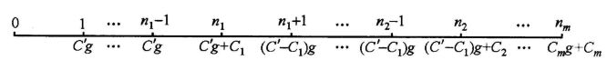

# 第5章 固定收益证券

## 5.1 固定收益证券的类型和特点

### 5.1.1 债券

债券是由借款方签发的一种正式的债券债务关系凭证，债权人（或称认购者，投资者）对债务人（或称发行者，融资者）的权力体现为获取利息和收回本金，所以，债券是一种带利息的证券，凭此券债权人可以在将来定期地收到利息，最终收回本金。

债券可以按下面几种方式进行分类：

1. 依据获取利息方式分类
   - 累积债券：将本金和累积利息再兑现时一次付清的债券，有时也称为零息债券。
   - 息票债券：定期支付利息并最终收回本金的债券，其中息票是债券认购者定向债券发行者领取利息的凭证，常附在债券上，有时也称之为附息债券。
2. 依据债券的登记方式分类
   - 记名债券：将认购者的姓名登记在债券上并记录在发行者的相关账簿上的债券。
   - 无记名债券：将息票附再债券上，可以由债券的法律上认可的持有者持息票兑换现金，常称之为空头债券。
3. 依据债券对应的背景分类
   - 抵押债券：通过抵押担保的债券。
   - 信用债券：通过发行者信用担保的债券。
4. 依据债券对应的期限分类
   - 长期债券：政府为7年以上的长期债务发行的债券。
   - 短期债券：期限最多为1年的国库券，简称为T-bills。
   - 中期债券：期限在1到7年之间的国债。
5. 依据债券的风险水平分类
   - 收入债券：利息支付额随着发行者每年的盈亏情况而定的债券。
   - 可调债券：当面临破产的公司再集资时，为替换未偿还债券而新发行的债券。
   - 垃圾债券：由企业发行的，特别是由企业联合集团，控股公司（被接管的企业）或其它的接管公司发行的，再支付息票风险方面显然高于其它债券的债券。

### 5.1.2 优先股票

优先股票是一种证券，与债券类似它以固定的比例进行回报，持有者大多数为股票发行企业的拥有者。

## 5.2 债券基本定价

短期国债计算公式：
$$
P = F \left(1 - Y_d \frac{t}{360} \right)
$$
其中$Y_d$表示贴现收益率，$t$表示未到期天数，$F$表示面值，$P$表示价格。

为了方便讨论，引入如下描述债券特征的记号：

- $P$ 债券的价格。
- $F$ 债券的名义价值或面值。
- $C$ 债券的兑现值。
- $r$ 息票额与面值的比（简称息率）。
- $F_r$ 每期固定的息票金额。
- $g$ 债券的修正息率，它表示每1个货币单位兑现值（不一定是面值）的息票金额，即$F_r = C_g$，也即$g = \frac{F_r}{C}$。
- $i$ 债券的收益率（常被称为到期收益率），即假定投资者再到期时才进行债券兑现的年实际利率。
- $n$ 从计算日到债券兑现日或到期日之间息票的兑现次数。
- $K$ 兑现值以收益率计算的现值，即$K = Cv^n$，其中$v$以$i$计算。
- $G$ 债券的基值，定义为$G_i = F_r$即$G = \frac{F_r}{i}$，它表示用收益率$i$和息票金额推算的原始本金。

在日常的商业和金融活动中，与债券有关的两种常见的收益率：

- 现收益率：每年的息票收入与债券认购价格的比值。
- 到期收益率：平均的每年实际收益或称内部收益，它表示债券投资的实际年收益率。

### 5.2.1 债券价格计算公式

债券价格的计算公式主要有以下几种：

- 基本公式
  $$
  P = F_r a_{\left.{\overline{\,n\,}}\!\right|i} + Cv^n = F_r a_{\left.{\overline{\,n\,}}\!\right|i} + K \qquad (5.2.2)
  $$

- 溢价折价公式
  $$
  P = C + (F_r - C \cdot i) a_{\left.{\overline{\,n\,}}\!\right|i} = C[1 + (g - i)a_{\left.{\overline{\,n\,}}\!\right|i}] \qquad (5.2.3)
  $$

- 基值公式
  $$
  P = G + (C - G)v^n \qquad (5.2.4)
  $$

- Makeham公式
  $$
  P = K + \frac{g}{i}(C - K) \qquad (5.2.5)
  $$

债券价格计算中的主要影响为收益率$i$和期限$n$，如果用：
$$
P(n, i) = F_r a_{\left.{\overline{\,n\,}}\!\right|i} + Cv^n \qquad (5.2.6)
$$
表示价格为收益率和期限的函数，则有：
$$
\frac{\partial P}{\partial i} = F_r(D_a)_{\left.{\overline{\,n\,}}\!\right|i} - nP(n + 1, i) < 0 \qquad (5.2.7) \\
\frac{\partial P}{\partial n} = \frac{Cln(1 + i)}{i}(g - i)v^n \qquad (5.2.8)
$$
上述公式表明：

1. 债券价格为到期收益率的递减函数。
2. 到期期限对价格的影响由$g$与$i$的大小关系决定，当修正息率大于收益率时，价格为期限的增函数；当修正息率小于收益率时，价格为期限的减函数。

### 5.2.2 债券价值评估

债券价格的变化由两部分组成：

- 内在（长期投资）价值。
- 市场供求形成的临时附加价值。

如果用$BV_k$表示$k$时刻（第$k$次支付息票后）的账面价值，那么：
$$
\begin{align}
BV_k &= F_r a_{\left.{\overline{\,n - k\,}}\!\right|i} + Cv^{n - k} \\
&= C[1 + (g - i) a_{\left.{\overline{\,n - k\,}}\!\right|i}], \ k = 0, 1, \cdots, n \qquad (5.2.9)
\end{align}
$$
通过适当的推导，可得到：
$$
BV_{k + 1} = (1 + i)BV_k - F_r, \ k = 0, 1, \cdots, n - 1 \qquad (5.2.10)
$$
一般情况下，债券在发行时和兑现时的账面价值是确定的，即：
$$
BV_0 = P, \ BV_n = C \qquad (5.2.11)
$$
账面价值的计算为债券提供了一种合理的渐变的赋值过程，它们可以为许多投资者所采用。

**结论5.1** 若$g > i$，则：$溢价差 = P - C = (F_r - C_i) a_{\left.{\overline{\,n\,}}\!\right|i} = C(g - i)a_{\left.{\overline{\,n\,}}\!\right|i}$；若$g < i$，则：$折价差 = C - P = (C_i - F_r)a_{\left.{\overline{\,n\,}}\!\right|i} = C(i - g)a_{\left.{\overline{\,n\,}}\!\right|i}$。

设债券的期限为$n$，兑现值为$C = 1$，原始认购价格为$P = 1 + p$，则有：
$$
B_0 = 1 + p = 1 + (g - i)a_{\left.{\overline{\,n\,}}\!\right|i} \qquad (5.2.12) \\
F_r = C_g = g
$$
由摊还法有如下递推公式：
$$
\begin{align}
&B_{t + 1} = (1 + i)B_t - F_r, &t = 0, 1, \cdots, n - 1, \qquad &(5.2.13) \\
&I_{t + 1} = iB_t, &t = 0, 1, \cdots, n - 1, \qquad &(5.2.14) \\
&P_{t = 1} = F_r - I_{t + 1}, &t = 0, 1, \cdots, n - 1 \qquad &(5.2.15)
\end{align}
$$
债券的偿债基金计算：

一般情况下，偿债基金只用于累积溢价差$P-C$（或折价差$C-P$）。如果设偿债基金利率位$j$，偿债基金的每期存款固定，而且期限与债券期限相同，则每次存款为：
$$
F_r - iP = C_g - iP
$$
因此有：
$$
P - C = (C_g - iP) a_{\left.{\overline{\,n\,}}\!\right|j}
$$
进而有：
$$
P = C \frac{1 + gs_{\left.{\overline{\,n\,}}\!\right|j}}{1 + is_{\left.{\overline{\,n\,}}\!\right|j}} = C[1 + (g - i)a_{\left.{\overline{\,n\,}}\!\right|i\&j}] \qquad (5.2.16)
$$
同样有各个时刻的账面价值公式：
$$
BV_k = C[1 + (g - i)a_{\left.{\overline{\,n - k\,}}\!\right|i\&j}],\ k = 0, 1, \cdots, n \qquad (5.2.17)
$$
直线法计算账面价值：
$$
\begin{align}
B_t &= P - (P - C) \frac{t}{n}, &t = 0, 1, \cdots, n \qquad &(5.2.18) \\

P_t &= \frac{P - C}{n}, &t = 0, 1, \cdots, n \qquad &(5.2.19) \\

I_t &= F_r - P_t, &t = 0, 1, \cdots, n \qquad &(5.2.20) \\
\end{align}
$$

### 5.2.3 两次息票收入之间账面价值的调整

有时，因为某些债券是在两次息票领取之间的某个时刻被专卖的，这需要将后一次的息票收入在新旧两个债券持有者之间合理分配，所以需要了解在两次息票领取之间债券价值的变化过程。为了描述这种过程，首先引入下面的概念：

- $t + k$ 债券转卖的时刻，其中$t = 0, 1, \cdots, n - 1; 0 \leqslant k \leqslant 1$。
- $B_t + k$  $t+k$时刻债券的账面价值。
- $F_{r_k}$ 应计息票，即从上一次息票支付日直到专卖日为止的时间内应得的利息。
- $B_{t + k}^f$ 债券的平价（或者称债券的全价），指债券转手时的实际交易价格。
- $B_{t + k}^m$ 债券的市场价格（也称债券的牌价或净价），指债券交易时的市场报价。

据上述记号的说明有关系式：
$$
B_{t + k}^f = B_{t + k}^m + F_{r_k},\ t = 0, 1, \cdots, n - 1;\ 0 \leqslant k \leqslant 1
$$
计算债券平价的方法：

1. 理论法：将$t(t = 0, 1, \cdots, n - 1)$时刻的账面价值按照复利方式累积，有：
   $$
   B_{t + k}^{f} = B_t(1 + i)^k,\ t = 0, 1, \cdots, n - 1;\ 0 \leqslant k \leqslant 1\qquad (5.2.22)
   $$

   采用复利方式计算的应计息票为：
   $$
   F_{r_k} = F_r \frac{(1 + i)^k - 1}{i},\ 0 \leqslant k \leqslant 1\qquad (5.2.23)
   $$
   于是债券的市场价为：
   $$
   \begin{align}
   B_{t + k}^m &= B_t(1 + i)^k - F_r\frac{(1 + i)^k - 1}{i} \qquad (5.2.24) \\
   t &= 0, 1, \cdots, n - 1; 0 \leqslant k \leqslant 1 \\
   \end{align}
   $$

2. 实用法：将$t(t = 0, 1, \cdots, n - 1)$时刻的账面价值按照单利累积，有：
   $$
   B_{t + k}^f = B_t(1 + ik),\ t = 0, 1, \cdots, n - 1; 0 \leqslant k \leqslant 1 \qquad (5.2.25)
   $$

   同样采用单利方式计算的应计息票为：
   $$
   F_{r_k} = kF_r,\ 0 \leqslant k \leqslant 1, \qquad (5.2.26)
   $$
   于是债券的市场价为：
   $$
   \begin{align}
   B_{t + k}^m &= B_t(1 + ik) - kF_r \qquad &(5.2.27) \\
   &= (1 - k)B_t + kB_{t + 1} \qquad &(5.2.28)\\
   \end{align}
   $$
   式中$t = 0, 1, \cdots, n - 1;\ 0 \leqslant k \leqslant 1$。

3. 半理论法：这种方法是前面两种方式的混合，其中债券的平价按照公式$(5.2.22)$计算，应计息票按照公式$(5.2.26)$计算，所以市场价为：
   $$
   B_{t + k}^{m} = B_t(1 + i)^k - kF_r,\ t = 0, 1, \cdots, n - 1;\ 0 \leqslant k \leqslant 1 \qquad (5.2.29)
   $$

## 5.3 广义债券定价与收益分析

### 5.3.1 广义债券价格

1. 息率周期与收益率换算周期不同的情形：

   - 息率周期为收益率换算周期的整数倍。设息率周期为收益率换算周期的$k$倍，那么债券的基本价格公式为：
     $$
     P = F_r \frac{a_{\left.{\overline{\,n\,}}\!\right|i}}{s_{\left.{\overline{\,n\,}}\!\right|i}} + Cv^n \qquad (5.3.1)
     $$

   - 收益率换算周期为息率周期的整数倍。设在每个收益率换算周期内领取息票$m$次，且每次的金额为$\frac{F_r}{m}$，那么债券的基本价格公式为：
     $$
     P = F_r a^{(m)}_{\left.{\overline{\,n\,}}\!\right|i} + Cv^n \qquad (5.3.2)
     $$

2. 息票率不固定的情形：

   在息票率不固定的情况下，不存在通用公式来计算债券的价格。

3. 收益率不固定的情形：

   在收益率不固定的情况下，对债券价格计算没有一般的公式。

### 5.3.2 早赎债券

债券发行者在到期日之前有权提前（发行一定时间之后）以某种兑现值赎回所发行的债券。这个赎回的日期被称为早赎日。

从对投资者最不利的角度分析投资者投资在早赎债券时的可接受价格。如果用$i$表示投资者的最小可接受收益率，依下面两种方法计算的价格可以保证投资者的最小收益水平：

1. 若债券在所有的七日都是以相同的金额进行兑现，则只有早赎日期一个未定因素。这时价格计算的原则可以表述为：如果收益率小于息票率，即$i < g$，则以最近的早赎日计算债券价格；如果收益率大于息票率，即$i > g$，则一定以最远的早赎日（实际为到期日）计算债券价格。这样做的理由是，当债券溢价发行时，由溢价债券的计算公式知，债券期限越长，债券的价格越高。所以，如果价格使最近的赎回日仍然满足收益率要求，则一定可以达到预定的可接受收益率。同样，对折价债券也有类似的解释。
2. 若兑现值在所有的可早赎期内是变化的，那么必须比较各种早赎日价格的计算结果，找出对投资者（债券持有人）最为不利的日期。或者说，用投资者的预期收益率计算出最小价格，即为投资者可接受的价格。

### 5.3.3 系列债券

系列债券的价格计算和收益率计算与一次性兑现债券没有本质区别，一般有两种方法：

- 分别计算息票收入的现值和兑现值的现值，然后求和；
- 分别计算每次兑现的债券的价格，然后对所得结果进行求和（这里最好用Makeham公式计算债券的价格）。

**结论 5.2** 给出系列债券的价格$P$的一种计算方法，这种债券的实际情况是：首次兑现之前，每次息票收入为$C'g$，从发行后的某个息票收取时刻$n_1$开始，每次兑现$C_k(k = 1, 2, \cdots, m)$，同时按照兑现值的余额领取息票收入。在系列债券中，投资者收入的实际现金流的时间流程图如下：

### 5.3.4 债券收益率分析

**结论 5.3** 债券存在唯一的收益率。
$$
\begin{align}
i \approx \frac{1 - \frac{k}{n}}{\frac{k(n + 1)}{2n}} = 2 \frac{n - k}{k(n + 1)}\qquad &(5.3.6) \\
i \approx \frac{g - \frac{k}{n}}{1 + \frac{k}{2}}\qquad &(5.3.7)
\end{align}
$$
上面的公式称为券商算法，下面的迭代算法更为精确：

1. 直接用公式$k = (g - i) a_{\left.{\overline{\,n\,}}\!\right|i},\ i = g - \frac{k}{a_{\left.{\overline{\,n\,}}\!\right|i}}$有：
   $$
   i_{t + 1} = g - \frac{k}{a_{\left.{\overline{\,n\,}}\!\right|i_t}},\ t = 0, 1, 2, \cdots;\qquad (5.3.8)
   $$

2. 用Newton-Raphson算法有：
   $$
   i_{t + 1} = i_t \left[ 1 + \frac{g a_{\left.{\overline{\,n\,}}\!\right|i_t} + v^n - \frac{P}{C}}{g a_{\left.{\overline{\,n\,}}\!\right|i_t} + (i_t - g)nv^{n + 1}} \right],\ t=0, 1, 2, \cdots, (5.3.9)
   $$
   其中$v = (1 + i_t)^{-1}$。

## 5.4 实例分析

### 5.4.1 优先股票和永久债券

优先股票是一类性质与债券类似的股权资产，其拥有者可以定期的得到固定的汇报，这种定期的收益一般称为红利。

从持有资产的安全性考虑，优先股票的安全性仅次于债券等债务产品且高于普通股票，因为对债权人的所有支付必须优先于股票的分红。

将未来的现金流用$F_r$表示，在利率$i$的环境下，则：
$$
P = \frac{F_r}{i} \qquad (5.4.1)
$$

### 5.4.2 普通股票

普通股票是一种收益型证券，这一点与优先股相同，但是它不像优先股那样有固定的分红比率。普通股票必须在清偿所有债券的利息和其他债务以及优先股的分红完成之后才能参与分红。

普通股票的价格一般分为如下两种：

1. 股票上市时的价格（也称理论价）

   它的值由今后可能的分红与收益率决定，有时称这种价格计算方法为分红贴现模型。如果假定首次（或当前的）分红为$D$，然后以$k$的比例逐年增加（或减少），且收益率为$i$，那么发行价格（理论价格）为：
   $$
   P = \frac{D}{i - k},\ -1 < k < i \qquad (5.4.2)
   $$

2. 股票市场价格

   随着股票进入二级市场后的买卖情况而随时波动。

### 5.4.3 其他实例

